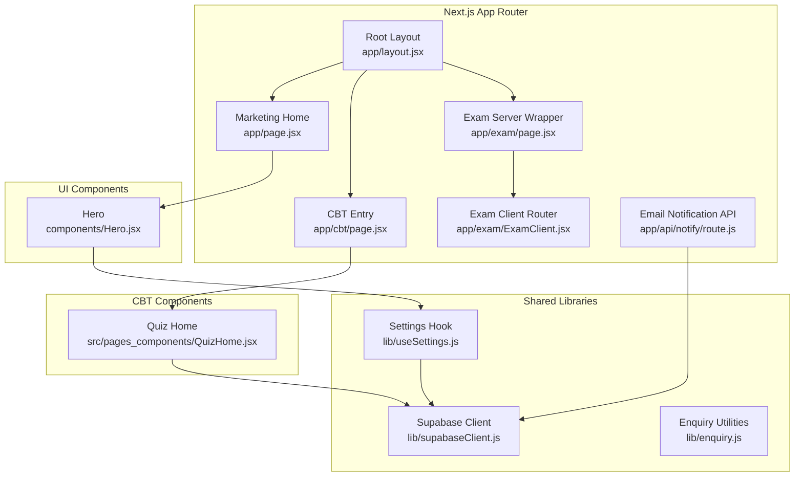
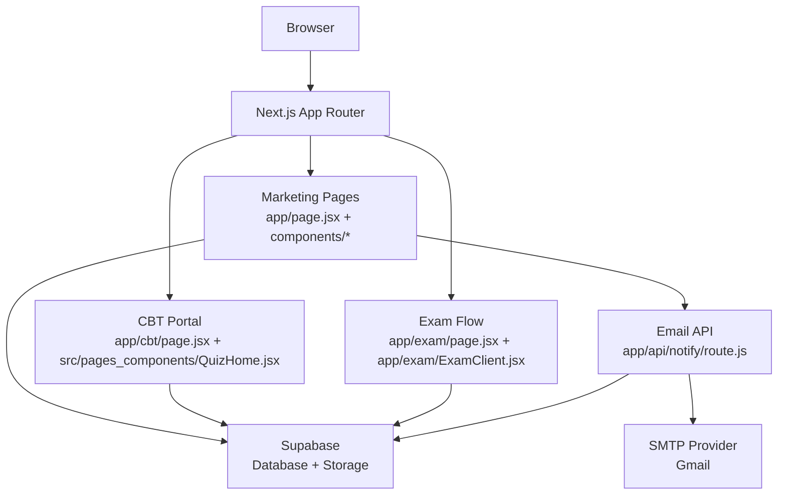
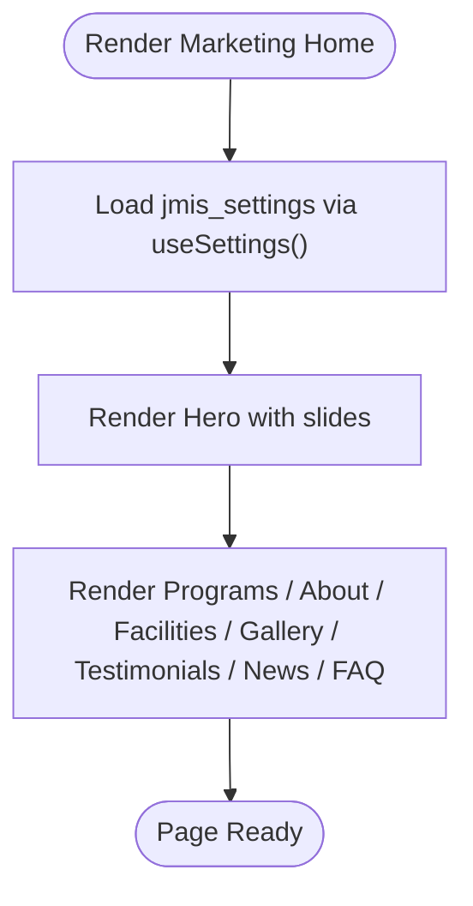
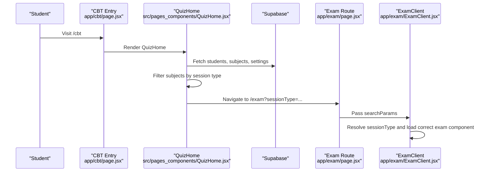
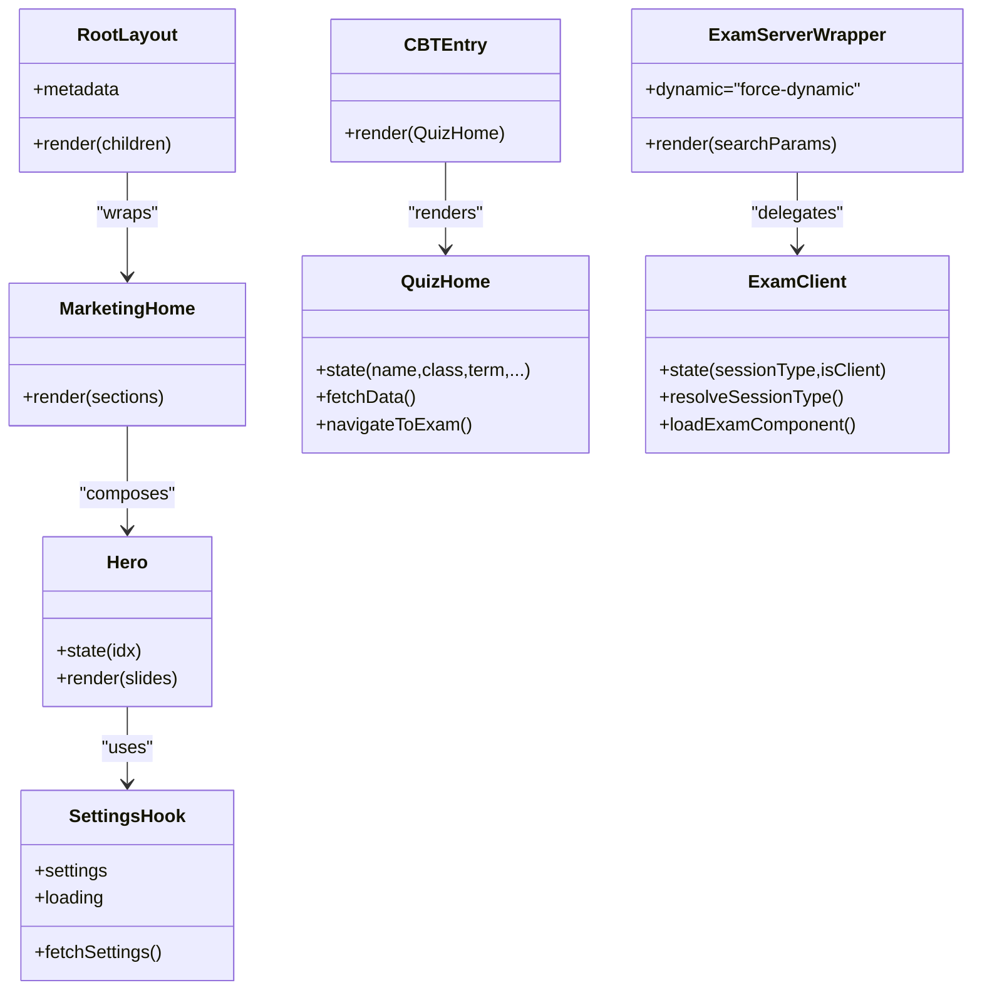
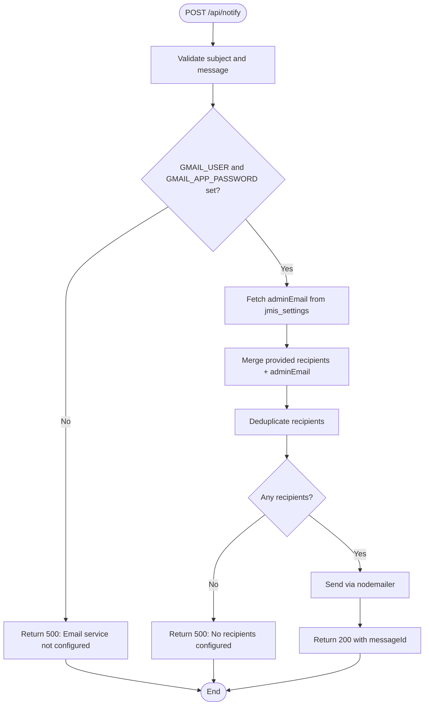
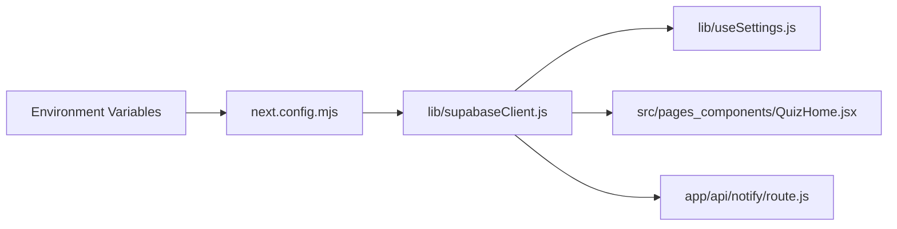
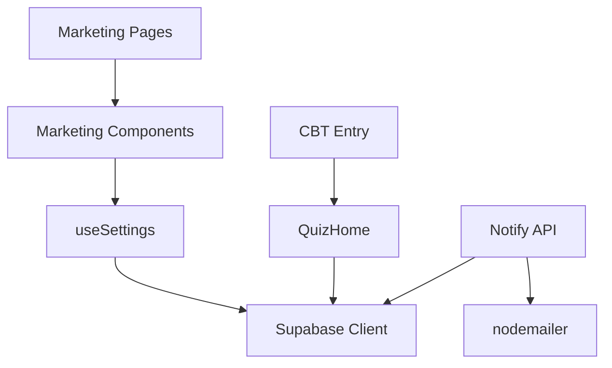

# Architecture Overview

<cite>
**Referenced Files in This Document**
- [README.md](file://README.md)
- [package.json](file://package.json)
- [next.config.mjs](file://next.config.mjs)
- [app/layout.jsx](file://app/layout.jsx)
- [app/page.jsx](file://app/page.jsx)
- [app/cbt/page.jsx](file://app/cbt/page.jsx)
- [app/exam/page.jsx](file://app/exam/page.jsx)
- [app/exam/ExamClient.jsx](file://app/exam/ExamClient.jsx)
- [app/api/notify/route.js](file://app/api/notify/route.js)
- [lib/supabaseClient.js](file://lib/supabaseClient.js)
- [lib/useSettings.js](file://lib/useSettings.js)
- [components/Hero.jsx](file://components/Hero.jsx)
- [src/pages_components/QuizHome.jsx](file://src/pages_components/QuizHome.jsx)
- [src/api/emailNotificationService.js](file://src/api/emailNotificationService.js)
</cite>

## Table of Contents
1. [Introduction](#introduction)
2. [Project Structure](#project-structure)
3. [Core Components](#core-components)
4. [Architecture Overview](#architecture-overview)
5. [Detailed Component Analysis](#detailed-component-analysis)
6. [Dependency Analysis](#dependency-analysis)
7. [Performance Considerations](#performance-considerations)
8. [Troubleshooting Guide](#troubleshooting-guide)
9. [Conclusion](#conclusion)

## Introduction
This document describes the architecture of the JMI School Website system, which combines a marketing website with an integrated Computer-Based Test (CBT) exam portal. The marketing site is built with Next.js App Router and renders public pages that display school information, programs, facilities, gallery, testimonials, news, and frequently asked questions. The CBT system provides a student-facing quiz entry point and an exam session flow that supports multiple question types.

The system separates server-rendered content from interactive client components, uses Supabase for data and storage, and exposes a server-only email notification API for admissions and contact enquiries.

**Section sources**
- [README.md:1-3](file://README.md#L1-L3)
- [package.json:1-33](file://package.json#L1-L33)

## Project Structure
The project follows the Next.js App Router layout under `app/`, shared UI components under `components/`, reusable hooks and utilities under `lib/`, and legacy CBT components under `src/`.

Key directories and responsibilities:
- `app/`: Route segments and page components for marketing pages, CBT entry, exam sessions, and API routes.
- `components/`: Reusable marketing UI components (hero, programs, about, facilities, gallery, testimonials, news, FAQ).
- `lib/`: Shared client-side logic including Supabase client initialization, settings hook, and enquiry/application submission helpers.
- `src/`: Legacy CBT codebase reused by the new router, including quiz components, styles, and utilities.

**Diagram sources**
- [app/layout.jsx:1-24](file://app/layout.jsx#L1-L24)
- [app/page.jsx:1-27](file://app/page.jsx#L1-L27)
- [app/cbt/page.jsx:1-11](file://app/cbt/page.jsx#L1-L11)
- [app/exam/page.jsx:1-12](file://app/exam/page.jsx#L1-L12)
- [app/exam/ExamClient.jsx:1-46](file://app/exam/ExamClient.jsx#L1-L46)
- [app/api/notify/route.js:1-115](file://app/api/notify/route.js#L1-L115)
- [lib/supabaseClient.js:1-13](file://lib/supabaseClient.js#L1-L13)
- [lib/useSettings.js:1-25](file://lib/useSettings.js#L1-L25)
- [components/Hero.jsx:1-101](file://components/Hero.jsx#L1-L101)
- [src/pages_components/QuizHome.jsx:1-508](file://src/pages_components/QuizHome.jsx#L1-L508)

**Section sources**
- [app/layout.jsx:1-24](file://app/layout.jsx#L1-L24)
- [app/page.jsx:1-27](file://app/page.jsx#L1-L27)
- [app/cbt/page.jsx:1-11](file://app/cbt/page.jsx#L1-L11)
- [app/exam/page.jsx:1-12](file://app/exam/page.jsx#L1-L12)
- [app/exam/ExamClient.jsx:1-46](file://app/exam/ExamClient.jsx#L1-L46)
- [app/api/notify/route.js:1-115](file://app/api/notify/route.js#L1-L115)
- [lib/supabaseClient.js:1-13](file://lib/supabaseClient.js#L1-L13)
- [lib/useSettings.js:1-25](file://lib/useSettings.js#L1-L25)
- [components/Hero.jsx:1-101](file://components/Hero.jsx#L1-L101)
- [src/pages_components/QuizHome.jsx:1-508](file://src/pages_components/QuizHome.jsx#L1-L508)

## Core Components
- Root layout: Provides global metadata, loads global CSS and toast styles, and wraps every page with Navbar and Footer.
- Marketing home: Composes marketing sections (hero, programs, about, facilities, gallery, testimonials, news, FAQ). All data comes from the admin-managed settings row.
- CBT entry: A minimal client component that renders the legacy quiz dashboard.
- Exam routing: A server wrapper disables static generation and passes search parameters to a client component that dynamically loads the appropriate exam renderer based on session type.
- Email notification API: A server-only route that sends emails via SMTP using environment variables and resolves recipients from Supabase settings.

**Section sources**
- [app/layout.jsx:1-24](file://app/layout.jsx#L1-L24)
- [app/page.jsx:1-27](file://app/page.jsx#L1-L27)
- [app/cbt/page.jsx:1-11](file://app/cbt/page.jsx#L1-L11)
- [app/exam/page.jsx:1-12](file://app/exam/page.jsx#L1-L12)
- [app/exam/ExamClient.jsx:1-46](file://app/exam/ExamClient.jsx#L1-L46)
- [app/api/notify/route.js:1-115](file://app/api/notify/route.js#L1-L115)

## Architecture Overview
The system separates marketing content from the CBT exam experience while sharing a common layout and Supabase integration.

**Diagram sources**
- [app/page.jsx:1-27](file://app/page.jsx#L1-L27)
- [components/Hero.jsx:1-101](file://components/Hero.jsx#L1-L101)
- [app/cbt/page.jsx:1-11](file://app/cbt/page.jsx#L1-L11)
- [src/pages_components/QuizHome.jsx:1-508](file://src/pages_components/QuizHome.jsx#L1-L508)
- [app/exam/page.jsx:1-12](file://app/exam/page.jsx#L1-L12)
- [app/exam/ExamClient.jsx:1-46](file://app/exam/ExamClient.jsx#L1-L46)
- [app/api/notify/route.js:1-115](file://app/api/notify/route.js#L1-L115)
- [lib/supabaseClient.js:1-13](file://lib/supabaseClient.js#L1-L13)

## Detailed Component Analysis

### Marketing Website Components
The marketing site composes reusable sections into the home page. The hero carousel reads slides from the shared settings table and renders images from Supabase storage. The settings hook centralizes fetching the single settings row used across marketing sections.

**Diagram sources**
- [app/page.jsx:1-27](file://app/page.jsx#L1-L27)
- [lib/useSettings.js:1-25](file://lib/useSettings.js#L1-L25)
- [components/Hero.jsx:1-101](file://components/Hero.jsx#L1-L101)
- [lib/supabaseClient.js:1-13](file://lib/supabaseClient.js#L1-L13)

**Section sources**
- [app/page.jsx:1-27](file://app/page.jsx#L1-L27)
- [lib/useSettings.js:1-25](file://lib/useSettings.js#L1-L25)
- [components/Hero.jsx:1-101](file://components/Hero.jsx#L1-L101)
- [lib/supabaseClient.js:1-13](file://lib/supabaseClient.js#L1-L13)

### CBT System Components
The CBT entry renders the legacy quiz dashboard, which fetches students, subjects, and configuration from Supabase. It allows filtering by subject, class, term, purpose, and session type, and navigates to the exam route with query parameters.

**Diagram sources**
- [app/cbt/page.jsx:1-11](file://app/cbt/page.jsx#L1-L11)
- [src/pages_components/QuizHome.jsx:1-508](file://src/pages_components/QuizHome.jsx#L1-L508)
- [app/exam/page.jsx:1-12](file://app/exam/page.jsx#L1-L12)
- [app/exam/ExamClient.jsx:1-46](file://app/exam/ExamClient.jsx#L1-L46)

**Section sources**
- [app/cbt/page.jsx:1-11](file://app/cbt/page.jsx#L1-L11)
- [src/pages_components/QuizHome.jsx:1-508](file://src/pages_components/QuizHome.jsx#L1-L508)
- [app/exam/page.jsx:1-12](file://app/exam/page.jsx#L1-L12)
- [app/exam/ExamClient.jsx:1-46](file://app/exam/ExamClient.jsx#L1-L46)

### Server vs Client Components
- Server components: Page wrappers like the root layout and exam server wrapper render without client state and can control caching and dynamic behavior.
- Client components: Interactive UI such as the hero carousel, settings hook, quiz dashboard, and exam client are marked with `"use client"` and manage local state and browser APIs.

**Diagram sources**
- [app/layout.jsx:1-24](file://app/layout.jsx#L1-L24)
- [app/page.jsx:1-27](file://app/page.jsx#L1-L27)
- [components/Hero.jsx:1-101](file://components/Hero.jsx#L1-L101)
- [lib/useSettings.js:1-25](file://lib/useSettings.js#L1-L25)
- [app/cbt/page.jsx:1-11](file://app/cbt/page.jsx#L1-L11)
- [src/pages_components/QuizHome.jsx:1-508](file://src/pages_components/QuizHome.jsx#L1-L508)
- [app/exam/page.jsx:1-12](file://app/exam/page.jsx#L1-L12)
- [app/exam/ExamClient.jsx:1-46](file://app/exam/ExamClient.jsx#L1-L46)

**Section sources**
- [app/layout.jsx:1-24](file://app/layout.jsx#L1-L24)
- [app/page.jsx:1-27](file://app/page.jsx#L1-L27)
- [components/Hero.jsx:1-101](file://components/Hero.jsx#L1-L101)
- [lib/useSettings.js:1-25](file://lib/useSettings.js#L1-L25)
- [app/cbt/page.jsx:1-11](file://app/cbt/page.jsx#L1-L11)
- [src/pages_components/QuizHome.jsx:1-508](file://src/pages_components/QuizHome.jsx#L1-L508)
- [app/exam/page.jsx:1-12](file://app/exam/page.jsx#L1-L12)
- [app/exam/ExamClient.jsx:1-46](file://app/exam/ExamClient.jsx#L1-L46)

### API Route Architecture
The `/api/notify` endpoint handles POST requests to send emails. It validates required fields, ensures SMTP credentials are configured, resolves recipients from the request and Supabase settings, deduplicates them, and sends mail via nodemailer.

**Diagram sources**
- [app/api/notify/route.js:1-115](file://app/api/notify/route.js#L1-L115)

**Section sources**
- [app/api/notify/route.js:1-115](file://app/api/notify/route.js#L1-L115)

### Supabase Integration Patterns
- Client initialization: The shared Supabase client is created with environment variables and exported for reuse.
- Public storage helper: A utility builds public URLs for files stored under a specific bucket path.
- Settings access: The settings hook reads the single settings row used by marketing components.
- CBT data access: The quiz dashboard queries student records, subjects, and settings to drive the exam selection and navigation.

**Diagram sources**
- [next.config.mjs:1-19](file://next.config.mjs#L1-L19)
- [lib/supabaseClient.js:1-13](file://lib/supabaseClient.js#L1-L13)
- [lib/useSettings.js:1-25](file://lib/useSettings.js#L1-L25)
- [src/pages_components/QuizHome.jsx:1-508](file://src/pages_components/QuizHome.jsx#L1-L508)
- [app/api/notify/route.js:1-115](file://app/api/notify/route.js#L1-L115)

**Section sources**
- [next.config.mjs:1-19](file://next.config.mjs#L1-L19)
- [lib/supabaseClient.js:1-13](file://lib/supabaseClient.js#L1-L13)
- [lib/useSettings.js:1-25](file://lib/useSettings.js#L1-L25)
- [src/pages_components/QuizHome.jsx:1-508](file://src/pages_components/QuizHome.jsx#L1-L508)
- [app/api/notify/route.js:1-115](file://app/api/notify/route.js#L1-L115)

## Dependency Analysis
High-level dependencies between modules:
- Marketing pages depend on shared components and the settings hook.
- The settings hook depends on the Supabase client.
- The CBT entry depends on the legacy quiz dashboard.
- The quiz dashboard depends on Supabase for students, subjects, and settings.
- The email API depends on Supabase for settings and on nodemailer for SMTP delivery.

**Diagram sources**
- [app/page.jsx:1-27](file://app/page.jsx#L1-L27)
- [components/Hero.jsx:1-101](file://components/Hero.jsx#L1-L101)
- [lib/useSettings.js:1-25](file://lib/useSettings.js#L1-L25)
- [lib/supabaseClient.js:1-13](file://lib/supabaseClient.js#L1-L13)
- [app/cbt/page.jsx:1-11](file://app/cbt/page.jsx#L1-L11)
- [src/pages_components/QuizHome.jsx:1-508](file://src/pages_components/QuizHome.jsx#L1-L508)
- [app/api/notify/route.js:1-115](file://app/api/notify/route.js#L1-L115)

**Section sources**
- [app/page.jsx:1-27](file://app/page.jsx#L1-L27)
- [components/Hero.jsx:1-101](file://components/Hero.jsx#L1-L101)
- [lib/useSettings.js:1-25](file://lib/useSettings.js#L1-L25)
- [lib/supabaseClient.js:1-13](file://lib/supabaseClient.js#L1-L13)
- [app/cbt/page.jsx:1-11](file://app/cbt/page.jsx#L1-L11)
- [src/pages_components/QuizHome.jsx:1-508](file://src/pages_components/QuizHome.jsx#L1-L508)
- [app/api/notify/route.js:1-115](file://app/api/notify/route.js#L1-L115)

## Performance Considerations
- Static vs dynamic rendering: The exam page explicitly disables static generation and forces no-store caching to ensure URL parameters are always fresh.
- Dynamic imports: The exam client dynamically imports heavy exam components to avoid SSR issues and reduce initial bundle size.
- Image optimization: Remote image patterns are configured for Supabase storage to allow optimized loading.
- Client-side state: Interactive components manage local state efficiently; consider debouncing frequent input changes in the quiz dashboard if performance becomes a concern.

**Section sources**
- [app/exam/page.jsx:1-12](file://app/exam/page.jsx#L1-L12)
- [app/exam/ExamClient.jsx:1-46](file://app/exam/ExamClient.jsx#L1-L46)
- [next.config.mjs:1-19](file://next.config.mjs#L1-L19)

## Troubleshooting Guide
Common issues and resolutions:
- Email notifications fail due to missing SMTP credentials: Ensure `GMAIL_USER` and `GMAIL_APP_PASSWORD` are set in the environment. The API returns a clear error when these are absent.
- No recipients resolved: Verify that `jmis_settings.adminEmail` exists and that any additional recipients are valid. The API deduplicates and filters empty values before sending.
- Supabase connectivity errors: Confirm `NEXT_PUBLIC_SUPABASE_URL` and `NEXT_PUBLIC_SUPABASE_ANON_KEY` are configured and accessible.
- Exam page does not load correctly: Ensure the session type parameter is present and valid; the client component routes to the appropriate exam renderer based on this value.

**Section sources**
- [app/api/notify/route.js:1-115](file://app/api/notify/route.js#L1-L115)
- [lib/supabaseClient.js:1-13](file://lib/supabaseClient.js#L1-L13)
- [app/exam/ExamClient.jsx:1-46](file://app/exam/ExamClient.jsx#L1-L46)

## Conclusion
The JMI School Website cleanly separates marketing content from the CBT exam portal while sharing a consistent layout and Supabase-backed data layer. The Next.js App Router enables server-rendered pages and controlled client interactivity. The email notification API centralizes outbound messaging and integrates with Supabase settings to keep recipient lists manageable. With careful attention to environment configuration, caching strategies, and dynamic imports, the system delivers a responsive user experience for both marketing visitors and exam participants.