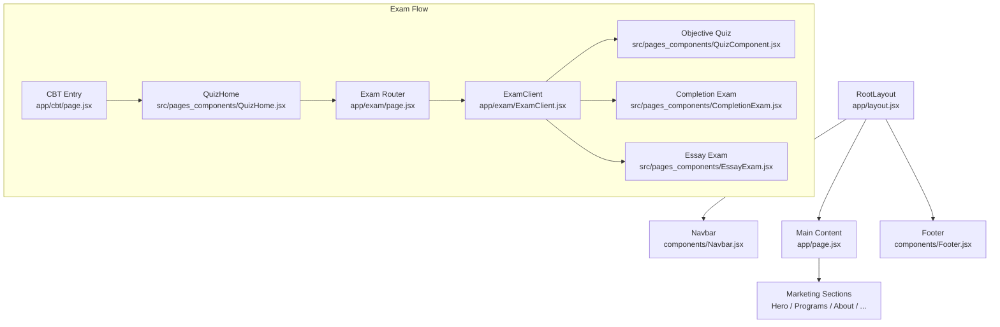
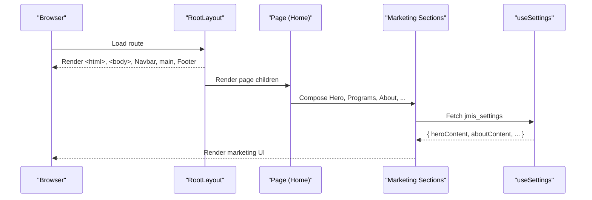
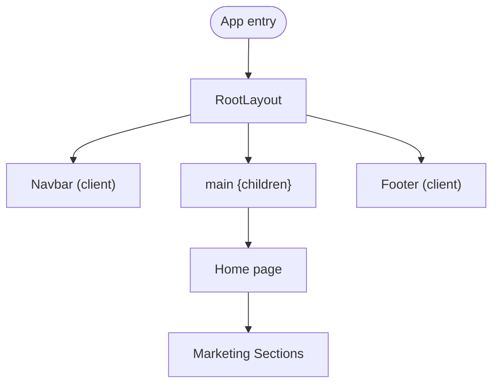
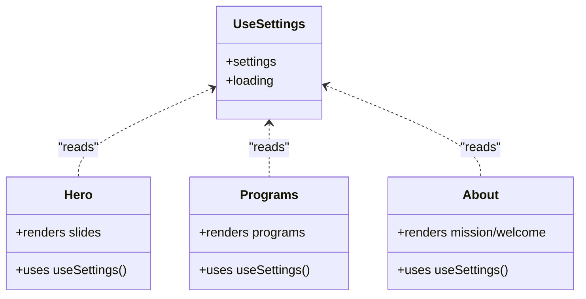
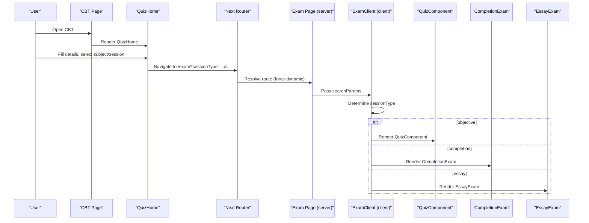
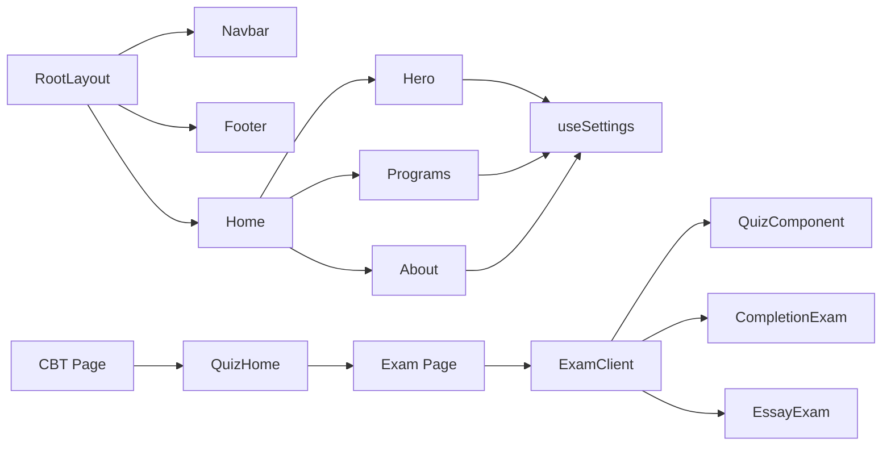

# Component Architecture

<cite>
**Referenced Files in This Document**
- [layout.jsx](file://app/layout.jsx)
- [page.jsx](file://app/page.jsx)
- [Navbar.jsx](file://components/Navbar.jsx)
- [Footer.jsx](file://components/Footer.jsx)
- [Hero.jsx](file://components/Hero.jsx)
- [Programs.jsx](file://components/Programs.jsx)
- [About.jsx](file://components/About.jsx)
- [useSettings.js](file://lib/useSettings.js)
- [exam/page.jsx](file://app/exam/page.jsx)
- [ExamClient.jsx](file://app/exam/ExamClient.jsx)
- [cbt/page.jsx](file://app/cbt/page.jsx)
- [QuizHome.jsx](file://src/pages_components/QuizHome.jsx)
- [QuizComponent.jsx](file://src/pages_components/QuizComponent.jsx)
- [CompletionExam.jsx](file://src/pages_components/CompletionExam.jsx)
- [EssayExam.jsx](file://src/pages_components/EssayExam.jsx)
</cite>

## Table of Contents
1. Introduction
2. Project Structure
3. Core Components
4. Architecture Overview
5. Detailed Component Analysis
6. Dependency Analysis
7. Performance Considerations
8. Troubleshooting Guide
9. Conclusion

## Introduction
This document explains the component architecture patterns used in the JMI School Website, focusing on the separation between server-rendered layout and pages versus client-side interactive components. It documents the hierarchy from RootLayout to Navbar/Footer, then to page-level marketing sections, and finally to specialized exam components. It also describes the reusable marketing section pattern driven by a shared settings hook, contrasts it with the specialized exam components, and outlines composition, prop passing, and state management approaches.

## Project Structure
The application follows a Next.js App Router structure:
- app/: defines routes and layouts; contains server components that compose UI and delegate interactivity to client components.
- components/: reusable marketing UI components (e.g., Hero, Programs, About, Footer, Navbar).
- lib/: shared client hooks and utilities (e.g., useSettings for reading admin-managed content).
- src/pages_components/: specialized interactive exam components (objective quiz, completion, essay), kept separate from marketing components.

**Diagram sources**
- [layout.jsx:13-23](file://app/layout.jsx#L13-L23)
- [page.jsx:13-26](file://app/page.jsx#L13-L26)
- [Navbar.jsx:18-165](file://components/Navbar.jsx#L18-L165)
- [Footer.jsx:16-132](file://components/Footer.jsx#L16-L132)
- [cbt/page.jsx:8-10](file://app/cbt/page.jsx#L8-L10)
- [QuizHome.jsx:151-176](file://src/pages_components/QuizHome.jsx#L151-L176)
- [exam/page.jsx:9-11](file://app/exam/page.jsx#L9-L11)
- [ExamClient.jsx:22-45](file://app/exam/ExamClient.jsx#L22-L45)

**Section sources**
- [layout.jsx:13-23](file://app/layout.jsx#L13-L23)
- [page.jsx:13-26](file://app/page.jsx#L13-L26)
- [cbt/page.jsx:8-10](file://app/cbt/page.jsx#L8-L10)

## Core Components
- RootLayout: Server component that composes global chrome (Navbar, main content area, Footer) and sets metadata.
- Navbar: Client component with interactive navigation, portal dropdown, and mobile menu. Uses environment variables for external portals and manages local UI state.
- Footer: Client component displaying contact info and quick links; reads dynamic contact content via useSettings.
- Marketing Sections (Hero, Programs, About): Client components that render marketing content using data from useSettings. They are composed within page-level components like Home.

Key patterns:
- Composition: RootLayout composes Navbar and Footer around page children.
- Data-driven UI: Marketing sections read from a single settings object via useSettings, enabling centralized content management.
- Prop passing: Page components pass minimal props to child sections; sections fetch their own data through the shared hook.

**Section sources**
- [layout.jsx:13-23](file://app/layout.jsx#L13-L23)
- [Navbar.jsx:18-165](file://components/Navbar.jsx#L18-L165)
- [Footer.jsx:16-132](file://components/Footer.jsx#L16-L132)
- [Hero.jsx:10-101](file://components/Hero.jsx#L10-L101)
- [Programs.jsx:42-89](file://components/Programs.jsx#L42-L89)
- [About.jsx:8-46](file://components/About.jsx#L8-L46)
- [useSettings.js:8-24](file://lib/useSettings.js#L8-L24)

## Architecture Overview
The site separates concerns across layers:
- Layout layer (server): RootLayout provides consistent chrome and metadata.
- Page layer (server): Route files compose marketing sections or delegate to client components for interactive flows.
- Marketing components (client): Reusable sections render content sourced from useSettings.
- Exam flow (client): Dedicated components handle interactive exams, dynamically loaded to avoid SSR issues.

**Diagram sources**
- [layout.jsx:13-23](file://app/layout.jsx#L13-L23)
- [page.jsx:13-26](file://app/page.jsx#L13-L26)
- [useSettings.js:8-24](file://lib/useSettings.js#L8-L24)

## Detailed Component Analysis

### RootLayout → Navbar/Footer → Page Components
- RootLayout renders Navbar and Footer around page content. It is a server component, ensuring fast initial HTML while delegating interactivity to client components.
- Page components (e.g., Home) compose marketing sections without heavy logic, keeping pages declarative.

**Diagram sources**
- [layout.jsx:13-23](file://app/layout.jsx#L13-L23)
- [page.jsx:13-26](file://app/page.jsx#L13-L26)

**Section sources**
- [layout.jsx:13-23](file://app/layout.jsx#L13-L23)
- [page.jsx:13-26](file://app/page.jsx#L13-L26)

### Marketing Section Pattern (Reusable vs Specialized)
- Reusable marketing sections: Hero, Programs, About, etc., all consume useSettings to render content from a single admin-managed row. This promotes consistency and reduces duplication.
- Specialized exam components: Objective Quiz, Completion, and Essay are purpose-built for test-taking workflows, each with distinct question types, scoring, and result handling.

**Diagram sources**
- [useSettings.js:8-24](file://lib/useSettings.js#L8-L24)
- [Hero.jsx:10-101](file://components/Hero.jsx#L10-L101)
- [Programs.jsx:42-89](file://components/Programs.jsx#L42-L89)
- [About.jsx:8-46](file://components/About.jsx#L8-L46)

**Section sources**
- [useSettings.js:8-24](file://lib/useSettings.js#L8-L24)
- [Hero.jsx:10-101](file://components/Hero.jsx#L10-L101)
- [Programs.jsx:42-89](file://components/Programs.jsx#L42-L89)
- [About.jsx:8-46](file://components/About.jsx#L8-L46)

### Exam Flow and Routing
- CBT entry page delegates to QuizHome, which collects student details and filters subjects.
- On start, QuizHome navigates to /exam with searchParams describing session type and context.
- The server-side exam/page.jsx disables static generation and passes searchParams to ExamClient.
- ExamClient dynamically imports the appropriate exam component based on sessionType and mounts it client-side.

**Diagram sources**
- [cbt/page.jsx:8-10](file://app/cbt/page.jsx#L8-L10)
- [QuizHome.jsx:151-176](file://src/pages_components/QuizHome.jsx#L151-L176)
- [exam/page.jsx:9-11](file://app/exam/page.jsx#L9-L11)
- [ExamClient.jsx:22-45](file://app/exam/ExamClient.jsx#L22-L45)

**Section sources**
- [cbt/page.jsx:8-10](file://app/cbt/page.jsx#L8-L10)
- [QuizHome.jsx:151-176](file://src/pages_components/QuizHome.jsx#L151-L176)
- [exam/page.jsx:9-11](file://app/exam/page.jsx#L9-L11)
- [ExamClient.jsx:22-45](file://app/exam/ExamClient.jsx#L22-L45)

### State Management Approaches
- Marketing sections: Local UI state (e.g., carousel index) plus remote data from useSettings. Minimal cross-component state; data source is centralized.
- Exam components: Rich local state for timers, answers, scores, submission status, and network reliability features. Each exam component maintains its own state and persists progress to localStorage for resilience.
- Shared configuration: Environment variables drive external portal URLs and other runtime behavior.

Examples:
- Carousel auto-rotation and slide selection in Hero.
- Timer countdown and answer persistence in exam components.
- Admin password retrieval and lock-screen gating in exam flows.

**Section sources**
- [Hero.jsx:16-20](file://components/Hero.jsx#L16-L20)
- [QuizComponent.jsx:32-57](file://src/pages_components/QuizComponent.jsx#L32-L57)
- [CompletionExam.jsx:28-43](file://src/pages_components/CompletionExam.jsx#L28-L43)
- [EssayExam.jsx:26-41](file://src/pages_components/EssayExam.jsx#L26-L41)

### Directory Separation Rationale
- Marketing components live under components/ because they are reusable, content-driven UI blocks consumed by multiple pages.
- Exam components live under src/pages_components/ because they implement complex, domain-specific workflows (timers, scoring, NLP evaluation, result uploads) that differ significantly from marketing UI and benefit from isolation.
- This separation improves maintainability, testing, and performance by allowing dynamic imports and targeted bundling of exam code.

**Section sources**
- [ExamClient.jsx:6-20](file://app/exam/ExamClient.jsx#L6-L20)
- [QuizHome.jsx:107-136](file://src/pages_components/QuizHome.jsx#L107-L136)

## Dependency Analysis
- RootLayout depends on Navbar and Footer for chrome.
- Marketing sections depend on useSettings for content.
- Exam flow depends on QuizHome for user input and routing, and on ExamClient for dynamic loading of specific exam components.
- Exam components depend on Supabase client and email notification services for data and results.

**Diagram sources**
- [layout.jsx:13-23](file://app/layout.jsx#L13-L23)
- [page.jsx:13-26](file://app/page.jsx#L13-L26)
- [useSettings.js:8-24](file://lib/useSettings.js#L8-L24)
- [cbt/page.jsx:8-10](file://app/cbt/page.jsx#L8-L10)
- [QuizHome.jsx:151-176](file://src/pages_components/QuizHome.jsx#L151-L176)
- [exam/page.jsx:9-11](file://app/exam/page.jsx#L9-L11)
- [ExamClient.jsx:22-45](file://app/exam/ExamClient.jsx#L22-L45)

**Section sources**
- [layout.jsx:13-23](file://app/layout.jsx#L13-L23)
- [page.jsx:13-26](file://app/page.jsx#L13-L26)
- [useSettings.js:8-24](file://lib/useSettings.js#L8-L24)
- [cbt/page.jsx:8-10](file://app/cbt/page.jsx#L8-L10)
- [QuizHome.jsx:151-176](file://src/pages_components/QuizHome.jsx#L151-L176)
- [exam/page.jsx:9-11](file://app/exam/page.jsx#L9-L11)
- [ExamClient.jsx:22-45](file://app/exam/ExamClient.jsx#L22-L45)

## Performance Considerations
- Dynamic imports: Exam components are dynamically imported with ssr:false to avoid SSR overhead and reduce initial bundle size.
- Force-dynamic routing: The exam page disables static generation to support URL parameters and real-time behavior.
- Efficient data fetching: useSettings loads a single settings row once per component lifecycle, minimizing redundant requests.
- LocalStorage persistence: Exam components persist progress locally to improve resilience against network interruptions.

[No sources needed since this section provides general guidance]

## Troubleshooting Guide
Common issues and where to look:
- No questions found: Check query parameters and database tables used by exam components; verify subject/class/purpose matching.
- Network errors: Examine network quality checks and error handling in exam components; ensure Supabase connectivity.
- Admin password issues: Confirm cbtPassword retrieval and lock-screen logic in exam components.
- Settings not rendering: Verify useSettings fetches jmis_settings successfully; check for loading states and fallbacks in marketing sections.

**Section sources**
- [QuizComponent.jsx:60-143](file://src/pages_components/QuizComponent.jsx#L60-L143)
- [CompletionExam.jsx:45-72](file://src/pages_components/CompletionExam.jsx#L45-L72)
- [EssayExam.jsx:43-65](file://src/pages_components/EssayExam.jsx#L43-L65)
- [useSettings.js:12-21](file://lib/useSettings.js#L12-L21)

## Conclusion
The JMI School Website uses a clear separation between server-rendered layout/pages and client-side interactive components. Marketing sections follow a reusable, data-driven pattern powered by a shared settings hook, while exam components encapsulate complex test-taking workflows. This architecture supports scalability, maintainability, and performance through dynamic imports, force-dynamic routing, and localized state management.