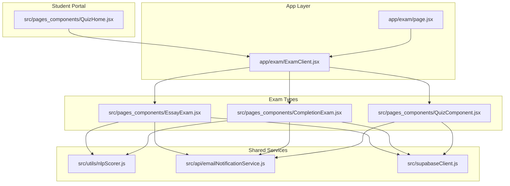
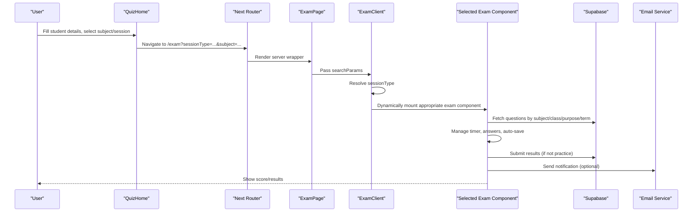
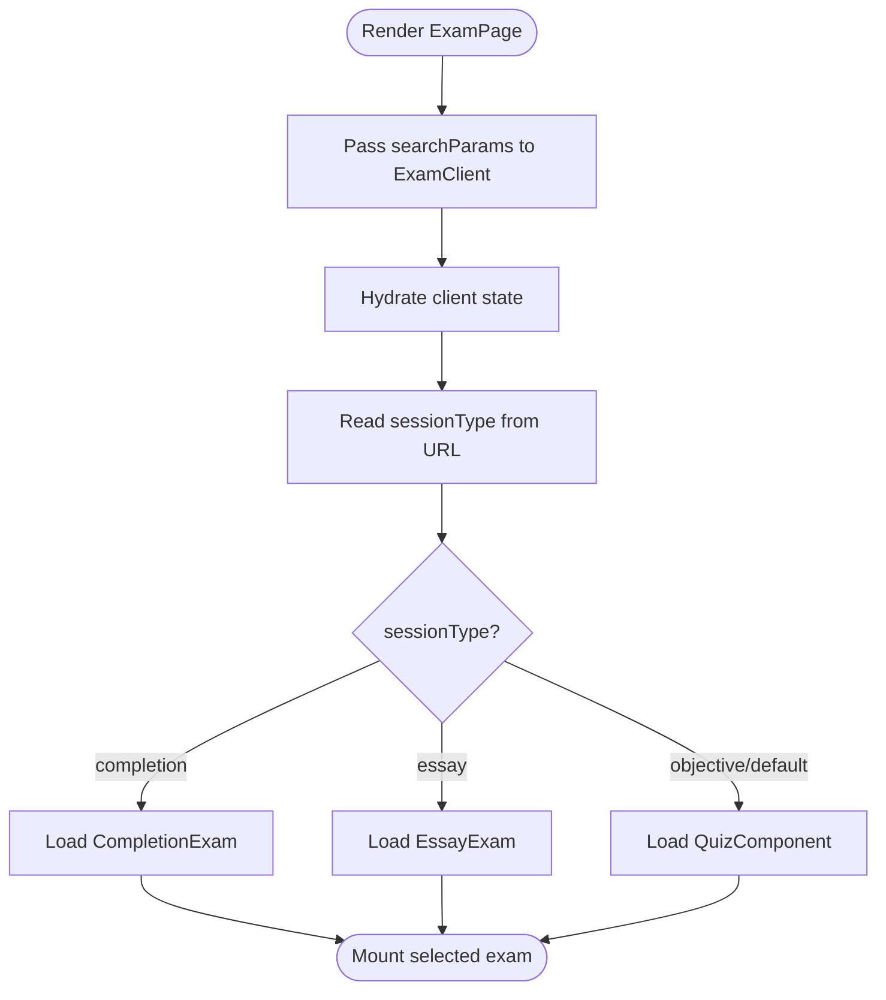
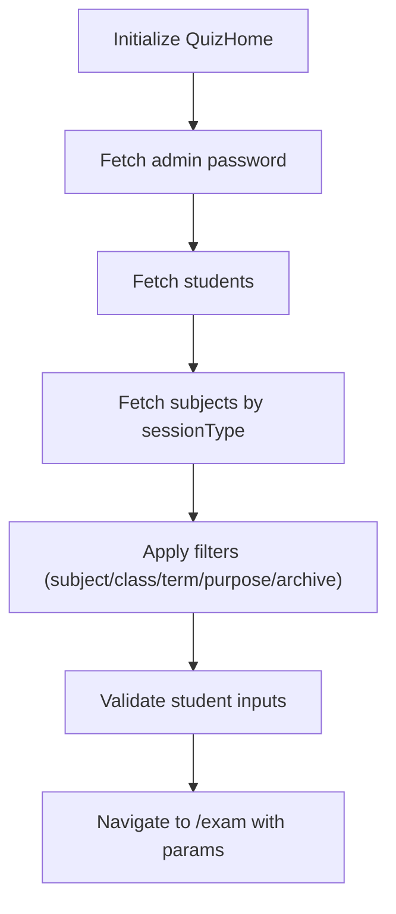
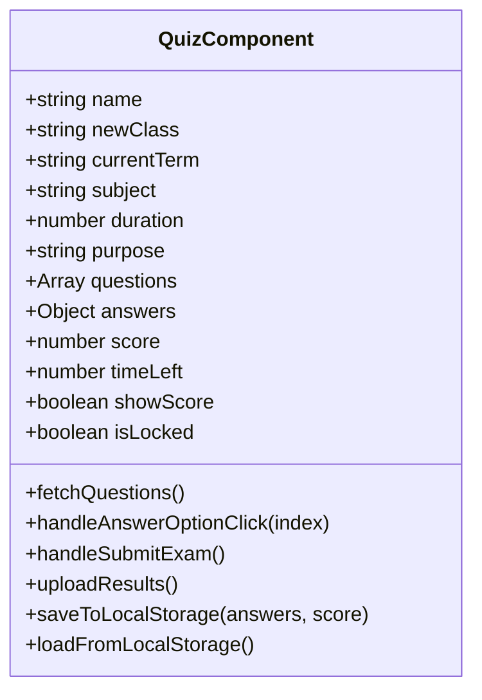
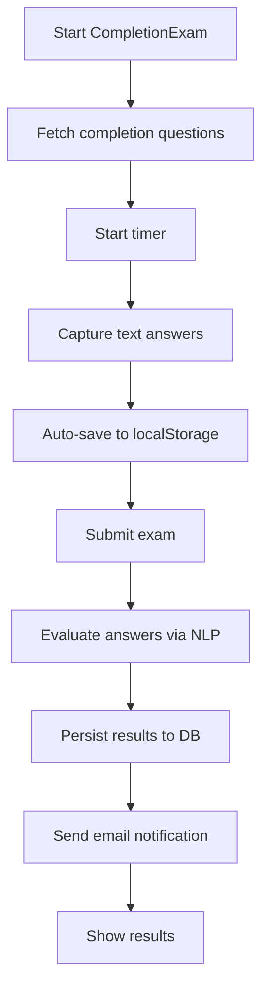
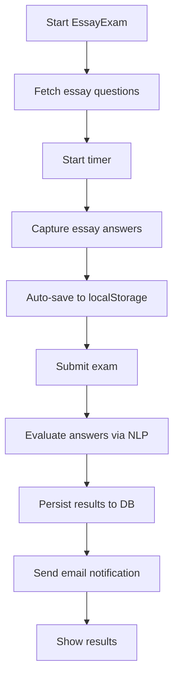
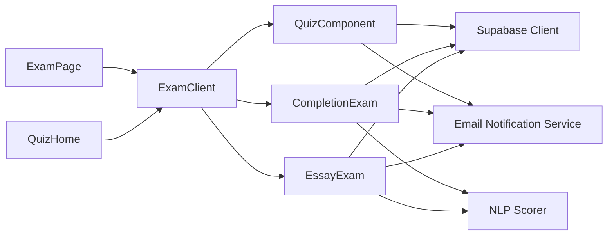

# Exam Components Architecture

<cite>
**Referenced Files in This Document**
- [page.jsx](file://app/exam/page.jsx)
- [ExamClient.jsx](file://app/exam/ExamClient.jsx)
- [QuizHome.jsx](file://src/pages_components/QuizHome.jsx)
- [QuizComponent.jsx](file://src/pages_components/QuizComponent.jsx)
- [CompletionExam.jsx](file://src/pages_components/CompletionExam.jsx)
- [EssayExam.jsx](file://src/pages_components/EssayExam.jsx)
- [nlpScorer.js](file://src/utils/nlpScorer.js)
- [supabaseClient.js](file://src/supabaseClient.js)
- [emailNotificationService.js](file://src/api/emailNotificationService.js)
</cite>

## Table of Contents
1. [Introduction](#introduction)
2. [Project Structure](#project-structure)
3. [Core Components](#core-components)
4. [Architecture Overview](#architecture-overview)
5. [Detailed Component Analysis](#detailed-component-analysis)
6. [Dependency Analysis](#dependency-analysis)
7. [Performance Considerations](#performance-considerations)
8. [Troubleshooting Guide](#troubleshooting-guide)
9. [Conclusion](#conclusion)
10. [Appendices](#appendices)

## Introduction
This document explains the exam components architecture for the CBT portal. It covers:
- Separation of concerns between QuizHome (student portal), individual exam type components, and the ExamClient router
- Component lifecycle and state management for exam progress
- Shared functionality across exam types
- Integration with Supabase for question retrieval, student authentication flow, and result processing
- Examples for adding new exam types and customizing existing ones while preserving architectural patterns

## Project Structure
The exam system is organized into:
- App-level routing and client-side router
- Student portal for selecting exams
- Individual exam type components
- Utilities for NLP scoring and email notifications
- Supabase client configuration

**Diagram sources**
- [page.jsx:1-12](file://app/exam/page.jsx#L1-L12)
- [ExamClient.jsx:1-46](file://app/exam/ExamClient.jsx#L1-L46)
- [QuizHome.jsx:1-508](file://src/pages_components/QuizHome.jsx#L1-L508)
- [QuizComponent.jsx:1-800](file://src/pages_components/QuizComponent.jsx#L1-L800)
- [CompletionExam.jsx:1-472](file://src/pages_components/CompletionExam.jsx#L1-L472)
- [EssayExam.jsx:1-418](file://src/pages_components/EssayExam.jsx#L1-L418)
- [nlpScorer.js:1-181](file://src/utils/nlpScorer.js#L1-L181)
- [emailNotificationService.js:1-127](file://src/api/emailNotificationService.js#L1-L127)
- [supabaseClient.js:1-7](file://src/supabaseClient.js#L1-L7)

**Section sources**
- [page.jsx:1-12](file://app/exam/page.jsx#L1-L12)
- [ExamClient.jsx:1-46](file://app/exam/ExamClient.jsx#L1-L46)
- [QuizHome.jsx:1-508](file://src/pages_components/QuizHome.jsx#L1-L508)

## Core Components
- ExamPage (server wrapper): Disables static generation and forwards searchParams to the client component.
- ExamClient (router): Dynamically loads exam components based on sessionType from URL parameters.
- QuizHome (student portal): Collects student info, filters subjects, selects session type, and navigates to /exam with query params.
- QuizComponent (objective): Loads multiple-choice questions, manages answers, timer, auto-save, submission, results, and detailed review.
- CompletionExam (fill-in-the-blank): Loads completion questions, evaluates answers via NLP, saves results, and sends notifications.
- EssayExam (free text): Loads essay questions, evaluates answers via NLP, saves results, and sends notifications.

Key responsibilities:
- Routing and session selection: ExamClient
- Student intake and subject discovery: QuizHome
- Objective exam execution: QuizComponent
- Text-based exam execution and evaluation: CompletionExam, EssayExam
- Scoring utilities: nlpScorer
- Email notifications: emailNotificationService
- Database connectivity: supabaseClient

**Section sources**
- [page.jsx:1-12](file://app/exam/page.jsx#L1-L12)
- [ExamClient.jsx:1-46](file://app/exam/ExamClient.jsx#L1-L46)
- [QuizHome.jsx:1-508](file://src/pages_components/QuizHome.jsx#L1-L508)
- [QuizComponent.jsx:1-800](file://src/pages_components/QuizComponent.jsx#L1-L800)
- [CompletionExam.jsx:1-472](file://src/pages_components/CompletionExam.jsx#L1-L472)
- [EssayExam.jsx:1-418](file://src/pages_components/EssayExam.jsx#L1-L418)
- [nlpScorer.js:1-181](file://src/utils/nlpScorer.js#L1-L181)
- [emailNotificationService.js:1-127](file://src/api/emailNotificationService.js#L1-L127)
- [supabaseClient.js:1-7](file://src/supabaseClient.js#L1-L7)

## Architecture Overview
The system follows a clear separation of concerns:
- Server page handles Next.js runtime settings and delegates to client component
- Client router dynamically imports exam components to avoid SSR issues
- Student portal composes user input and navigation
- Each exam type encapsulates its own data fetching, UI, state, and submission logic
- Shared services provide NLP scoring and email delivery
- Supabase client centralizes database access

**Diagram sources**
- [QuizHome.jsx:151-176](file://src/pages_components/QuizHome.jsx#L151-L176)
- [page.jsx:1-12](file://app/exam/page.jsx#L1-L12)
- [ExamClient.jsx:22-45](file://app/exam/ExamClient.jsx#L22-L45)
- [QuizComponent.jsx:59-143](file://src/pages_components/QuizComponent.jsx#L59-L143)
- [CompletionExam.jsx:45-72](file://src/pages_components/CompletionExam.jsx#L45-L72)
- [EssayExam.jsx:43-65](file://src/pages_components/EssayExam.jsx#L43-L65)
- [emailNotificationService.js:70-121](file://src/api/emailNotificationService.js#L70-L121)

## Detailed Component Analysis

### ExamPage and ExamClient (Routing and Session Selection)
- ExamPage disables caching and dynamic rendering, then renders ExamClient with searchParams.
- ExamClient:
  - Tracks client hydration state
  - Reads sessionType from URL (default objective)
  - Dynamically imports and mounts the correct exam component

**Diagram sources**
- [page.jsx:1-12](file://app/exam/page.jsx#L1-L12)
- [ExamClient.jsx:1-46](file://app/exam/ExamClient.jsx#L1-L46)

**Section sources**
- [page.jsx:1-12](file://app/exam/page.jsx#L1-L12)
- [ExamClient.jsx:1-46](file://app/exam/ExamClient.jsx#L1-L46)

### QuizHome (Student Portal)
Responsibilities:
- Fetch admin password and student list from Supabase
- Fetch subjects based on sessionType and filter by class, term, purpose
- Normalize student name/class matching and display profile picture
- Provide filters and archived exam toggle
- Compose query parameters and navigate to /exam

State management:
- Student inputs, filters, sessionType, subjects, options
- Derived validation for starting an exam

Integration points:
- Supabase queries for settings, students, and subjects
- Router navigation with structured query string

**Diagram sources**
- [QuizHome.jsx:35-49](file://src/pages_components/QuizHome.jsx#L35-L49)
- [QuizHome.jsx:51-65](file://src/pages_components/QuizHome.jsx#L51-L65)
- [QuizHome.jsx:107-136](file://src/pages_components/QuizHome.jsx#L107-L136)
- [QuizHome.jsx:151-176](file://src/pages_components/QuizHome.jsx#L151-L176)

**Section sources**
- [QuizHome.jsx:1-508](file://src/pages_components/QuizHome.jsx#L1-L508)

### QuizComponent (Objective Exam)
Responsibilities:
- Parse URL params (name, class, term, sex, subject, duration, purpose)
- Fetch objective questions from jmis_cbtQuestions with filters
- Manage current question index, answers, score, timer, lock screen, and submission
- Auto-save progress to localStorage and restore on reload
- Upload results to jmis_cbt_results and send email notifications
- Provide detailed results view and printable report

Data model highlights:
- Questions array with answerOptions and correctness flags
- Answers map keyed by question index
- Score computed incrementally and recalculated on change
- Network quality monitoring and pending result handling

**Diagram sources**
- [QuizComponent.jsx:20-58](file://src/pages_components/QuizComponent.jsx#L20-L58)
- [QuizComponent.jsx:59-143](file://src/pages_components/QuizComponent.jsx#L59-L143)
- [QuizComponent.jsx:261-339](file://src/pages_components/QuizComponent.jsx#L261-L339)
- [QuizComponent.jsx:353-366](file://src/pages_components/QuizComponent.jsx#L353-L366)

**Section sources**
- [QuizComponent.jsx:1-800](file://src/pages_components/QuizComponent.jsx#L1-L800)

### CompletionExam (Fill-in-the-Blank)
Responsibilities:
- Fetch completion questions from jmis_cbt_completion
- Evaluate answers using NLP scorer
- Save results to jmis_cbt_results and send email notifications
- Auto-save progress to localStorage and restore on reload

Evaluation flow:
- Uses evaluateCompletion to determine correctness and feedback
- Aggregates per-question results and total score

**Diagram sources**
- [CompletionExam.jsx:45-72](file://src/pages_components/CompletionExam.jsx#L45-L72)
- [CompletionExam.jsx:149-181](file://src/pages_components/CompletionExam.jsx#L149-L181)
- [CompletionExam.jsx:183-204](file://src/pages_components/CompletionExam.jsx#L183-L204)
- [nlpScorer.js:9-58](file://src/utils/nlpScorer.js#L9-L58)

**Section sources**
- [CompletionExam.jsx:1-472](file://src/pages_components/CompletionExam.jsx#L1-L472)
- [nlpScorer.js:1-181](file://src/utils/nlpScorer.js#L1-L181)

### EssayExam (Free Text)
Responsibilities:
- Fetch essay questions from jmis_cbt_essay
- Evaluate answers using NLP scorer with keyword and semantic analysis
- Save results to jmis_cbt_results and send email notifications
- Auto-save progress to localStorage and restore on reload

Evaluation flow:
- Uses evaluateEssay to compute score, percentage, feedback, and keyword matches
- Enforces minimum word count and points per question

**Diagram sources**
- [EssayExam.jsx:43-65](file://src/pages_components/EssayExam.jsx#L43-L65)
- [EssayExam.jsx:134-168](file://src/pages_components/EssayExam.jsx#L134-L168)
- [EssayExam.jsx:170-190](file://src/pages_components/EssayExam.jsx#L170-L190)
- [nlpScorer.js:66-153](file://src/utils/nlpScorer.js#L66-L153)

**Section sources**
- [EssayExam.jsx:1-418](file://src/pages_components/EssayExam.jsx#L1-L418)
- [nlpScorer.js:1-181](file://src/utils/nlpScorer.js#L1-L181)

### Shared Functionality Across Exam Types
Common patterns:
- URL parameter parsing for student context and exam metadata
- Supabase queries to fetch questions filtered by subject/class/purpose/term
- LocalStorage-based auto-save and restore for resilience
- Timer-driven submission when time expires
- Result persistence to jmis_cbt_results and optional email notifications
- Admin password gating for locked sessions

Shared utilities:
- NLP scoring for text-based evaluations (CompletionExam, EssayExam)
- Email notification service for result dispatch

**Section sources**
- [QuizComponent.jsx:59-143](file://src/pages_components/QuizComponent.jsx#L59-L143)
- [CompletionExam.jsx:45-72](file://src/pages_components/CompletionExam.jsx#L45-L72)
- [EssayExam.jsx:43-65](file://src/pages_components/EssayExam.jsx#L43-L65)
- [nlpScorer.js:1-181](file://src/utils/nlpScorer.js#L1-L181)
- [emailNotificationService.js:1-127](file://src/api/emailNotificationService.js#L1-L127)

## Dependency Analysis
High-level dependencies:
- ExamPage depends on ExamClient
- ExamClient depends on dynamic imports of exam components
- QuizHome depends on Supabase and Next router
- Exam components depend on Supabase, NLP scorer, and email service

**Diagram sources**
- [page.jsx:1-12](file://app/exam/page.jsx#L1-L12)
- [ExamClient.jsx:1-46](file://app/exam/ExamClient.jsx#L1-L46)
- [QuizHome.jsx:1-508](file://src/pages_components/QuizHome.jsx#L1-L508)
- [QuizComponent.jsx:1-800](file://src/pages_components/QuizComponent.jsx#L1-L800)
- [CompletionExam.jsx:1-472](file://src/pages_components/CompletionExam.jsx#L1-L472)
- [EssayExam.jsx:1-418](file://src/pages_components/EssayExam.jsx#L1-L418)
- [nlpScorer.js:1-181](file://src/utils/nlpScorer.js#L1-L181)
- [emailNotificationService.js:1-127](file://src/api/emailNotificationService.js#L1-L127)
- [supabaseClient.js:1-7](file://src/supabaseClient.js#L1-L7)

**Section sources**
- [page.jsx:1-12](file://app/exam/page.jsx#L1-L12)
- [ExamClient.jsx:1-46](file://app/exam/ExamClient.jsx#L1-L46)
- [QuizHome.jsx:1-508](file://src/pages_components/QuizHome.jsx#L1-L508)
- [QuizComponent.jsx:1-800](file://src/pages_components/QuizComponent.jsx#L1-L800)
- [CompletionExam.jsx:1-472](file://src/pages_components/CompletionExam.jsx#L1-L472)
- [EssayExam.jsx:1-418](file://src/pages_components/EssayExam.jsx#L1-L418)
- [nlpScorer.js:1-181](file://src/utils/nlpScorer.js#L1-L181)
- [emailNotificationService.js:1-127](file://src/api/emailNotificationService.js#L1-L127)
- [supabaseClient.js:1-7](file://src/supabaseClient.js#L1-L7)

## Performance Considerations
- Dynamic imports in ExamClient reduce initial bundle size and avoid SSR issues.
- LocalStorage auto-save minimizes network calls during long exams and improves resilience.
- Network quality monitoring in QuizComponent helps detect poor connectivity.
- Filtering at the database level reduces payload sizes for question retrieval.
- NLP scoring runs locally; ensure large essays are handled efficiently.

[No sources needed since this section provides general guidance]

## Troubleshooting Guide
Common issues and resolutions:
- No questions found: Verify subject/class/purpose/term filters match database entries. Check console logs for query parameters and available records.
- Auto-save not restoring: Ensure localStorage keys include student name and subject; verify examId uniqueness.
- Submission fails: Confirm student ID lookup succeeds and that jmis_cbt_results insert permissions are configured.
- Email not sent: Check email recipients configuration in jmis_settings and API endpoint availability.

Operational checks:
- Inspect Supabase queries and errors in browser console
- Validate environment variables for Supabase URL and anon key
- Review email service logs and response status

**Section sources**
- [QuizComponent.jsx:59-143](file://src/pages_components/QuizComponent.jsx#L59-L143)
- [CompletionExam.jsx:45-72](file://src/pages_components/CompletionExam.jsx#L45-L72)
- [EssayExam.jsx:43-65](file://src/pages_components/EssayExam.jsx#L43-L65)
- [emailNotificationService.js:70-121](file://src/api/emailNotificationService.js#L70-L121)
- [supabaseClient.js:1-7](file://src/supabaseClient.js#L1-L7)

## Conclusion
The exam components architecture cleanly separates routing, student portal, and exam-type implementations while sharing common patterns for data fetching, state management, and result processing. The design supports extensibility through dynamic imports and consistent integration points with Supabase and email services. Adding new exam types follows established conventions, ensuring maintainability and scalability.

[No sources needed since this section summarizes without analyzing specific files]

## Appendices

### How to Add a New Exam Type
Steps:
1. Create a new component under src/pages_components (e.g., MatchingExam.jsx).
2. Implement:
   - URL param parsing for student context and exam metadata
   - Question fetching from a dedicated Supabase table
   - State for answers, timer, and submission
   - Auto-save to localStorage and restore on reload
   - Evaluation logic (reuse nlpScorer if applicable or add new functions)
   - Result persistence to jmis_cbt_results and optional email notifications
3. Register the component in ExamClient:
   - Add dynamic import
   - Extend sessionType routing condition
4. Update QuizHome:
   - Add the new sessionType option in the selector
   - Ensure subject fetching uses the correct table mapping

Patterns to follow:
- Use consistent naming for examId prefixes (e.g., cbt_matching_)
- Mirror the structure of CompletionExam/EssayExam for text-based evaluation
- Keep shared logic (timer, auto-save, upload, email) aligned with existing components

**Section sources**
- [ExamClient.jsx:1-46](file://app/exam/ExamClient.jsx#L1-L46)
- [QuizHome.jsx:410-424](file://src/pages_components/QuizHome.jsx#L410-L424)
- [CompletionExam.jsx:1-472](file://src/pages_components/CompletionExam.jsx#L1-L472)
- [EssayExam.jsx:1-418](file://src/pages_components/EssayExam.jsx#L1-L418)
- [nlpScorer.js:1-181](file://src/utils/nlpScorer.js#L1-L181)

### Customizing Existing Components
Guidelines:
- Modify filtering logic in each exam component to support additional metadata (e.g., term, purpose)
- Extend evaluation rules in nlpScorer for nuanced grading
- Customize email templates in emailNotificationService for richer notifications
- Adjust UI states and messages to reflect new behaviors

**Section sources**
- [QuizComponent.jsx:59-143](file://src/pages_components/QuizComponent.jsx#L59-L143)
- [CompletionExam.jsx:149-181](file://src/pages_components/CompletionExam.jsx#L149-L181)
- [EssayExam.jsx:134-168](file://src/pages_components/EssayExam.jsx#L134-L168)
- [nlpScorer.js:1-181](file://src/utils/nlpScorer.js#L1-L181)
- [emailNotificationService.js:1-127](file://src/api/emailNotificationService.js#L1-L127)