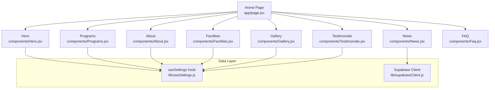
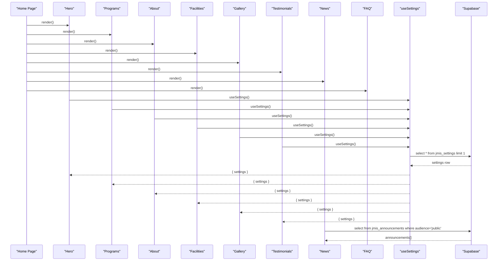
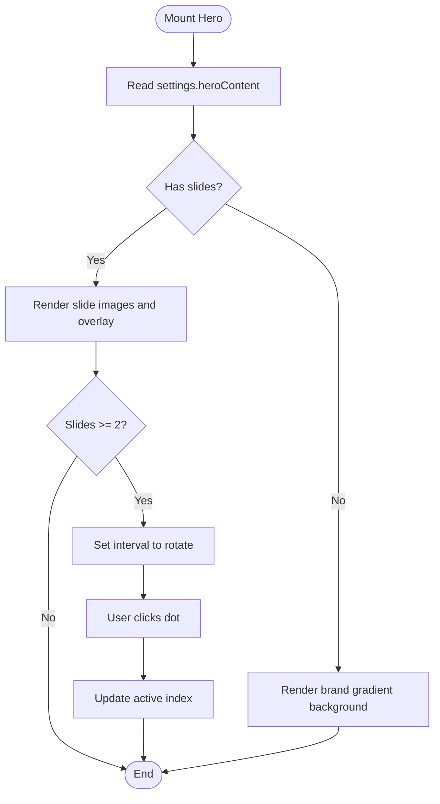
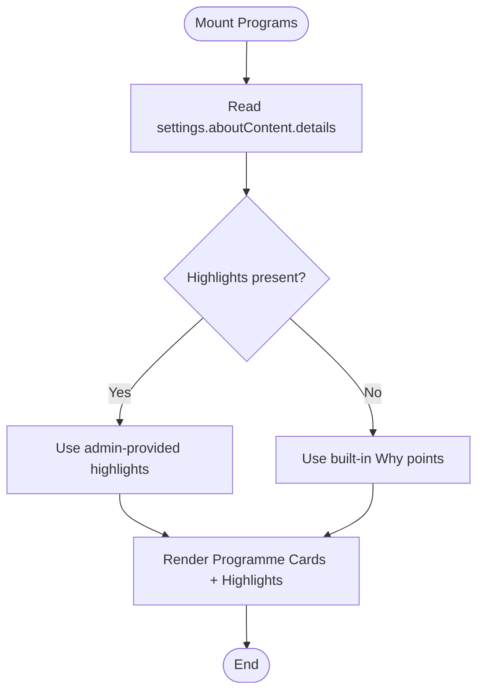
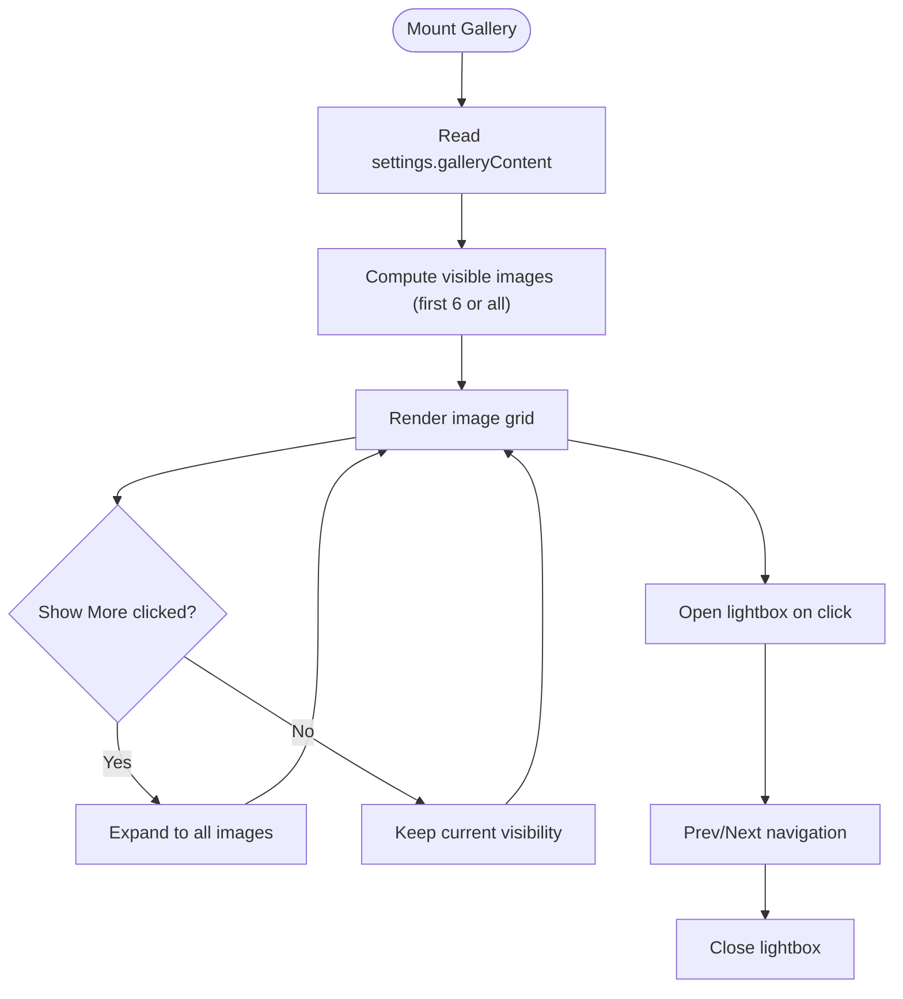
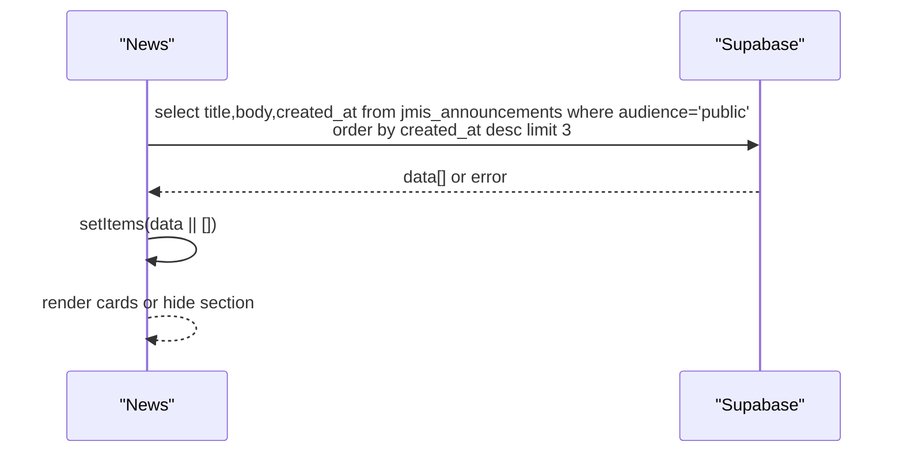
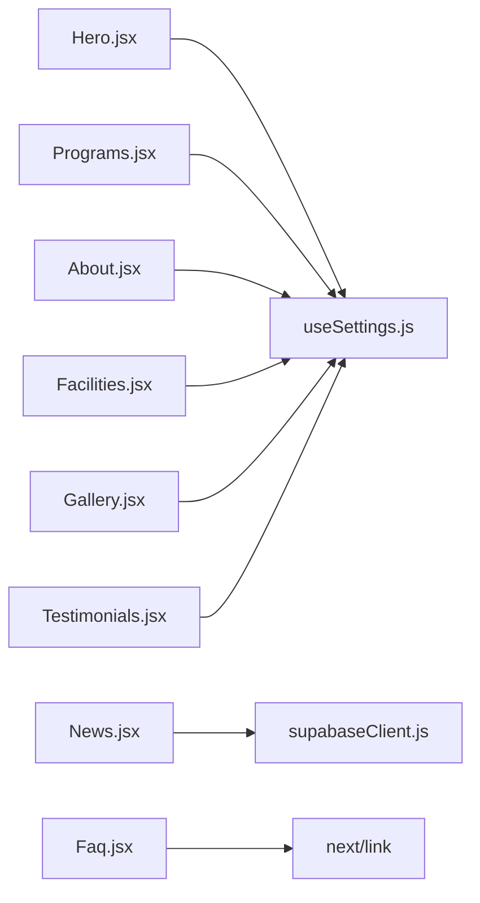

# Marketing Components Architecture

<cite>
**Referenced Files in This Document**
- [page.jsx](file://app/page.jsx)
- [Hero.jsx](file://components/Hero.jsx)
- [Programs.jsx](file://components/Programs.jsx)
- [About.jsx](file://components/About.jsx)
- [Facilities.jsx](file://components/Facilities.jsx)
- [Gallery.jsx](file://components/Gallery.jsx)
- [Testimonials.jsx](file://components/Testimonials.jsx)
- [News.jsx](file://components/News.jsx)
- [Faq.jsx](file://components/Faq.jsx)
- [useSettings.js](file://lib/useSettings.js)
</cite>

## Table of Contents
1. [Introduction](#introduction)
2. [Project Structure](#project-structure)
3. [Core Components](#core-components)
4. [Architecture Overview](#architecture-overview)
5. [Detailed Component Analysis](#detailed-component-analysis)
6. [Dependency Analysis](#dependency-analysis)
7. [Performance Considerations](#performance-considerations)
8. [Troubleshooting Guide](#troubleshooting-guide)
9. [Conclusion](#conclusion)
10. [Appendices](#appendices)

## Introduction
This document explains the marketing components architecture used across the school website’s home page. The site composes a set of reusable, client-side React sections: Hero, Programs, About, Facilities, Gallery, Testimonials, News, and FAQ. Most sections read content from a single settings record through the shared useSettings hook, while News fetches announcements directly from Supabase. Styling is primarily Tailwind CSS with custom brand tokens; Bootstrap is not used in these components.

The goal is to help you understand how these components compose together, how they consume dynamic data, how they handle responsive design and accessibility, and how to extend or create new marketing sections following the established patterns.

## Project Structure
The marketing UI lives under `components`, and the public home page composes them in order. Data comes from:
- A single settings row fetched by useSettings (used by most marketing sections).
- A separate announcements table queried by the News component.

**Diagram sources**
- [page.jsx:1-27](file://app/page.jsx#L1-L27)
- [Hero.jsx:1-101](file://components/Hero.jsx#L1-L101)
- [Programs.jsx:1-89](file://components/Programs.jsx#L1-L89)
- [About.jsx:1-46](file://components/About.jsx#L1-L46)
- [Facilities.jsx:1-56](file://components/Facilities.jsx#L1-L56)
- [Gallery.jsx:1-119](file://components/Gallery.jsx#L1-L119)
- [Testimonials.jsx:1-57](file://components/Testimonials.jsx#L1-L57)
- [News.jsx:1-60](file://components/News.jsx#L1-L60)
- [Faq.jsx:1-73](file://components/Faq.jsx#L1-L73)
- [useSettings.js:1-25](file://lib/useSettings.js#L1-L25)

**Section sources**
- [page.jsx:1-27](file://app/page.jsx#L1-L27)

## Core Components
All marketing sections are client components that render a `<section>` with consistent spacing, typography, and layout utilities. They follow a common pattern:
- Read settings via useSettings.
- Render fallback content when data is missing.
- Use Tailwind for layout and styling.
- Provide accessible interactive controls where needed.

Common props interface
- These components do not accept external props. They are self-contained and pull data from useSettings or direct Supabase calls.
- When extending, prefer passing props only if the section needs configuration beyond settings (for example, a title override or variant flag).

Styling approach
- Tailwind CSS classes are used throughout for layout, spacing, typography, colors, and responsive breakpoints.
- Custom brand tokens such as brand-gradient, brand, brand-light, and brand-soft are referenced but defined outside these files.
- No Bootstrap is used in these marketing components.

Dynamic content integration
- useSettings reads a single jmis_settings row and exposes { settings, loading }.
- Sections access fields like heroContent, aboutContent, facilitiesContent, galleryContent, testimonialContent, and aboutContent.details.
- Images are resolved using settingFileUrl from the Supabase client helper.

Responsive design patterns
- Grid layouts switch from one column on small screens to two or three columns on medium and large screens (for example, md:grid-cols-2 lg:grid-cols-3).
- Typography scales with text-sm/md/lg and heading sizes scale at md breakpoint.
- Full-bleed hero uses viewport-relative height and min-height constraints.

Accessibility considerations
- Interactive elements include aria-label attributes for carousel dots and lightbox navigation.
- Lightbox dialog sets role="dialog" and aria-modal="true".
- Accordion buttons expose aria-expanded to indicate open state.
- Images have descriptive alt text or sensible defaults.

Composition on the home page
- The home page imports and renders each marketing section in sequence, producing a vertical flow of sections.

**Section sources**
- [Hero.jsx:1-101](file://components/Hero.jsx#L1-L101)
- [Programs.jsx:1-89](file://components/Programs.jsx#L1-L89)
- [About.jsx:1-46](file://components/About.jsx#L1-L46)
- [Facilities.jsx:1-56](file://components/Facilities.jsx#L1-L56)
- [Gallery.jsx:1-119](file://components/Gallery.jsx#L1-L119)
- [Testimonials.jsx:1-57](file://components/Testimonials.jsx#L1-L57)
- [News.jsx:1-60](file://components/News.jsx#L1-L60)
- [Faq.jsx:1-73](file://components/Faq.jsx#L1-L73)
- [useSettings.js:1-25](file://lib/useSettings.js#L1-L25)

## Architecture Overview
The marketing architecture centers on a single source of truth for most content: the jmis_settings row. Each marketing section consumes this data through useSettings and renders its own presentation layer. News is an exception and queries jmis_announcements directly.

**Diagram sources**
- [page.jsx:1-27](file://app/page.jsx#L1-L27)
- [useSettings.js:1-25](file://lib/useSettings.js#L1-L25)
- [Hero.jsx:1-101](file://components/Hero.jsx#L1-L101)
- [Programs.jsx:1-89](file://components/Programs.jsx#L1-L89)
- [About.jsx:1-46](file://components/About.jsx#L1-L46)
- [Facilities.jsx:1-56](file://components/Facilities.jsx#L1-L56)
- [Gallery.jsx:1-119](file://components/Gallery.jsx#L1-L119)
- [Testimonials.jsx:1-57](file://components/Testimonials.jsx#L1-L57)
- [News.jsx:1-60](file://components/News.jsx#L1-L60)

## Detailed Component Analysis

### Hero
Purpose
- Renders a full-bleed image carousel driven by settings.heroContent.
- Provides two parent-facing CTAs: enrollment and result checking or CBT quiz.

Key behaviors
- Auto-rotates slides every five seconds when there are at least two slides.
- Uses plain img tags with remote Supabase URLs to avoid next/image sizing complexity.
- Includes slide dot navigation with aria-labels.

Data contract
- settings.heroContent: array of objects with image, heading, content.

Styling
- Tailwind utility classes for layout, gradients, and responsive typography.
- Uses brand tokens for background and text accents.

Accessibility
- Slide navigation buttons include aria-label.
- Images include alt text derived from slide.heading or a default.

**Diagram sources**
- [Hero.jsx:1-101](file://components/Hero.jsx#L1-L101)

**Section sources**
- [Hero.jsx:1-101](file://components/Hero.jsx#L1-L101)

### Programs
Purpose
- Displays age-programme cards and a “Why Choose Us” strip.

Key behaviors
- Reads highlights from settings.aboutContent.details and falls back to built-in points.
- Uses static program definitions for Creche & Nursery, Primary, and Secondary.

Data contract
- settings.aboutContent.details: array of objects with heading and content.

Styling
- Card grid with hover elevation and brand-colored icon containers.
- Responsive grid switches to three columns on medium screens.

Accessibility
- Semantic headings and list structure for programme points.

**Diagram sources**
- [Programs.jsx:1-89](file://components/Programs.jsx#L1-L89)

**Section sources**
- [Programs.jsx:1-89](file://components/Programs.jsx#L1-L89)

### About
Purpose
- Presents mission text and principal’s welcome message.

Key behaviors
- Reads settings.aboutContent.text and text2.
- Falls back to a generic statement when both fields are absent.

Data contract
- settings.aboutContent.text: mission paragraph.
- settings.aboutContent.text2: principal quote.

Styling
- Section with soft brand background and white content blocks.
- Left border accent for mission block.

Accessibility
- Proper heading hierarchy and semantic paragraphs.

**Section sources**
- [About.jsx:1-46](file://components/About.jsx#L1-L46)

### Facilities
Purpose
- Shows a grid of facility cards with optional images.

Key behaviors
- Reads settings.facilitiesContent array.
- Uses settingFileUrl to resolve image paths.
- Shows placeholder icon when image is missing.

Data contract
- settings.facilitiesContent: array of objects with image, heading, content.

Styling
- Responsive grid with hover zoom effect on images.
- Line-clamp for descriptions.

Accessibility
- Images include alt text from heading.

**Section sources**
- [Facilities.jsx:1-56](file://components/Facilities.jsx#L1-L56)

### Gallery
Purpose
- Displays a photo grid with a show-more toggle and a custom lightbox.

Key behaviors
- Reads settings.galleryContent array.
- Limits initial display to six images and provides a toggle to reveal more.
- Implements prev/next navigation inside the lightbox.

Data contract
- settings.galleryContent: array of objects with image and content/description.

Styling
- Aspect-ratio grid tiles with hover scaling.
- Gradient caption overlays.

Accessibility
- Lightbox has role="dialog" and aria-modal="true".
- Navigation buttons include aria-labels.
- Images include alt text.

**Diagram sources**
- [Gallery.jsx:1-119](file://components/Gallery.jsx#L1-L119)

**Section sources**
- [Gallery.jsx:1-119](file://components/Gallery.jsx#L1-L119)

### Testimonials
Purpose
- Rotates testimonials with auto-play and manual dot navigation.

Key behaviors
- Reads settings.testimonialContent array.
- Auto-rotates every seven seconds when there are at least two items.
- Returns null when no testimonials exist.

Data contract
- settings.testimonialContent: array of objects with text and image.

Styling
- Brand gradient background with centered quote layout.
- Author avatar image with rounded borders.

Accessibility
- Dot buttons include aria-labels.
- Images include alt text.

**Section sources**
- [Testimonials.jsx:1-57](file://components/Testimonials.jsx#L1-L57)

### News
Purpose
- Displays recent public announcements from Supabase.

Key behaviors
- Queries jmis_announcements where audience equals public.
- Orders by created_at descending and limits to three items.
- Degrades gracefully if the table does not exist or returns no rows.

Data contract
- Rows with title, body, created_at.

Styling
- Card grid with brand-colored icon container and date badge.

Accessibility
- Semantic article elements for each announcement.

**Diagram sources**
- [News.jsx:1-60](file://components/News.jsx#L1-L60)

**Section sources**
- [News.jsx:1-60](file://components/News.jsx#L1-L60)

### FAQ
Purpose
- Static accordion of frequently asked questions.

Key behaviors
- Maintains open state for a single expanded item.
- Links to the contact page for further enquiries.

Data contract
- Static FAQ array defined within the component.

Styling
- Bordered accordion with hover highlight.
- Icon toggles for expand/collapse.

Accessibility
- Buttons expose aria-expanded to reflect state.

**Section sources**
- [Faq.jsx:1-73](file://components/Faq.jsx#L1-L73)

### useSettings Hook
Purpose
- Centralizes fetching of the jmis_settings row so marketing sections can share a single data source.

Behavior
- Fetches one row from jmis_settings on mount.
- Exposes settings and loading state.
- Cleans up async operations on unmount.

Usage
- Import and destructure { settings } from useSettings in any marketing section.

**Section sources**
- [useSettings.js:1-25](file://lib/useSettings.js#L1-L25)

## Dependency Analysis
Marketing components depend on:
- useSettings for settings-driven content.
- Supabase client for settings and announcements.
- Next.js Link for navigation.
- react-icons for decorative icons.

**Diagram sources**
- [Hero.jsx:1-101](file://components/Hero.jsx#L1-L101)
- [Programs.jsx:1-89](file://components/Programs.jsx#L1-L89)
- [About.jsx:1-46](file://components/About.jsx#L1-L46)
- [Facilities.jsx:1-56](file://components/Facilities.jsx#L1-L56)
- [Gallery.jsx:1-119](file://components/Gallery.jsx#L1-L119)
- [Testimonials.jsx:1-57](file://components/Testimonials.jsx#L1-L57)
- [News.jsx:1-60](file://components/News.jsx#L1-L60)
- [Faq.jsx:1-73](file://components/Faq.jsx#L1-L73)
- [useSettings.js:1-25](file://lib/useSettings.js#L1-L25)

**Section sources**
- [page.jsx:1-27](file://app/page.jsx#L1-L27)

## Performance Considerations
- Avoid heavy dependencies: components use lightweight state and built-in browser APIs for carousels and lightboxes.
- Lazy-load images: Gallery and Facilities use loading="lazy" for offscreen images.
- Minimal re-renders: Carousel indices and lightbox states are isolated per component.
- Graceful degradation: News handles missing tables or empty results without crashing.
- Image handling: Hero uses plain img with remote URLs to sidestep next/image optimization overhead.

[No sources needed since this section provides general guidance]

## Troubleshooting Guide
Common issues and resolutions
- Empty hero or testimonials: Ensure settings.heroContent or settings.testimonialContent arrays are populated in the admin settings.
- Missing images: Verify settingFileUrl resolves correctly and that uploaded assets exist in Supabase storage.
- No news items: Confirm the jmis_announcements table exists and contains rows with audience='public'.
- Carousel not rotating: Check that the relevant content array has at least two items.
- Accessibility warnings: Ensure interactive elements have appropriate aria-labels and that dialogs have role and modal attributes.

**Section sources**
- [Hero.jsx:1-101](file://components/Hero.jsx#L1-L101)
- [Gallery.jsx:1-119](file://components/Gallery.jsx#L1-L119)
- [Testimonials.jsx:1-57](file://components/Testimonials.jsx#L1-L57)
- [News.jsx:1-60](file://components/News.jsx#L1-L60)

## Conclusion
The marketing architecture is intentionally simple and consistent:
- A single settings record drives most sections via useSettings.
- Tailwind CSS provides a uniform visual language.
- Components are self-contained, accessible, and responsive.
- New sections should follow the same pattern: read from settings, render gracefully without data, and keep interactivity minimal and accessible.

[No sources needed since this section summarizes without analyzing specific files]

## Appendices

### Extending Existing Components
Guidelines
- Prefer reading additional fields from settings rather than adding props.
- If customization is necessary, add optional props with sensible defaults.
- Maintain consistent section wrappers, headings, and spacing.

Examples
- Add a new field to settings (for example, settings.programsExtra) and render it in Programs alongside existing highlights.
- Extend Gallery to support categories by reading a category field from settings.galleryContent and filtering the displayed grid.

[No sources needed since this section provides general guidance]

### Creating a New Marketing Section
Step-by-step
1. Create a new file under components (for example, Community.jsx).
2. Mark it as a client component.
3. Import useSettings and render a <section> with consistent spacing and headings.
4. Read data from settings (for example, settings.communityContent).
5. Provide fallback content when data is missing.
6. Add the new component to app/page.jsx in the desired position.

Reference patterns
- See About.jsx for simple text rendering from settings.
- See Facilities.jsx for image grids with settingFileUrl.
- See Gallery.jsx for interactive features like lightbox and toggles.

**Section sources**
- [About.jsx:1-46](file://components/About.jsx#L1-L46)
- [Facilities.jsx:1-56](file://components/Facilities.jsx#L1-L56)
- [Gallery.jsx:1-119](file://components/Gallery.jsx#L1-L119)
- [page.jsx:1-27](file://app/page.jsx#L1-L27)