# Server vs Client Components

<cite>
**Referenced Files in This Document**
- [app/layout.jsx](file://app/layout.jsx)
- [app/page.jsx](file://app/page.jsx)
- [components/Navbar.jsx](file://components/Navbar.jsx)
- [components/Hero.jsx](file://components/Hero.jsx)
- [components/Footer.jsx](file://components/Footer.jsx)
- [lib/useSettings.js](file://lib/useSettings.js)
- [app/exam/page.jsx](file://app/exam/page.jsx)
- [app/exam/ExamClient.jsx](file://app/exam/ExamClient.jsx)
- [app/api/notify/route.js](file://app/api/notify/route.js)
</cite>

## Table of Contents
1. [Introduction](#introduction)
2. [Project Structure](#project-structure)
3. [Core Components](#core-components)
4. [Architecture Overview](#architecture-overview)
5. [Detailed Component Analysis](#detailed-component-analysis)
6. [Dependency Analysis](#dependency-analysis)
7. [Performance Considerations](#performance-considerations)
8. [Troubleshooting Guide](#troubleshooting-guide)
9. [Conclusion](#conclusion)
10. [Appendices](#appendices)

## Introduction
This document explains the server and client component architecture in this Next.js project using the App Router. It clarifies how default server components render content on the server, while interactive client components (marked with "use client") manage browser-only state and events. It also covers data fetching patterns, performance implications, composition strategies, and a migration approach from the Pages Router to the App Router.

## Project Structure
The application uses the App Router under app/. The root layout provides global structure and includes both server-rendered sections and interactive client components. Marketing pages are composed of reusable components that fetch settings via a shared client hook. An exam route demonstrates a server wrapper delegating to a client component for interactivity.

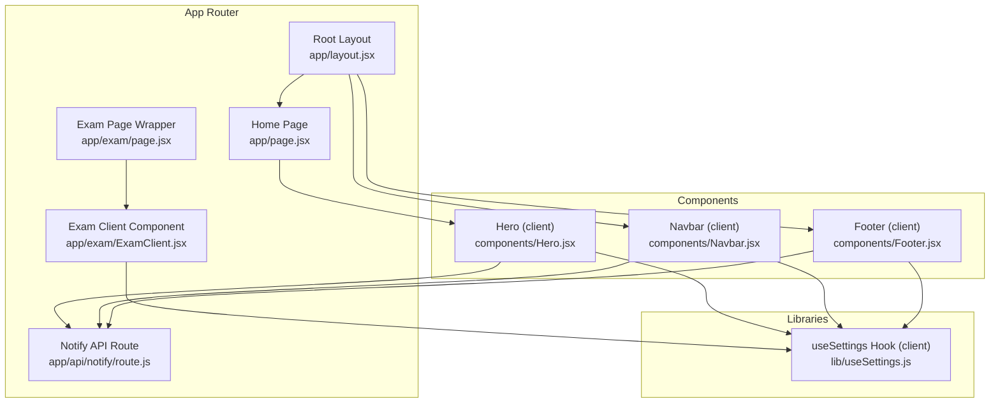

**Diagram sources**
- [app/layout.jsx:1-24](file://app/layout.jsx#L1-L24)
- [app/page.jsx:1-27](file://app/page.jsx#L1-L27)
- [components/Navbar.jsx:1-165](file://components/Navbar.jsx#L1-L165)
- [components/Hero.jsx:1-101](file://components/Hero.jsx#L1-L101)
- [components/Footer.jsx:1-132](file://components/Footer.jsx#L1-L132)
- [lib/useSettings.js:1-25](file://lib/useSettings.js#L1-L25)
- [app/exam/page.jsx:1-12](file://app/exam/page.jsx#L1-L12)
- [app/exam/ExamClient.jsx:1-46](file://app/exam/ExamClient.jsx#L1-L46)
- [app/api/notify/route.js:1-115](file://app/api/notify/route.js#L1-L115)

**Section sources**
- [app/layout.jsx:1-24](file://app/layout.jsx#L1-L24)
- [app/page.jsx:1-27](file://app/page.jsx#L1-L27)

## Core Components
- Root layout (server component): Provides global HTML shell, metadata, and composes Navbar, main content, and Footer.
- Home page (server component): Composes marketing sections without client-side logic.
- Navbar (client component): Manages mobile menu toggles, portal dropdowns, and environment-based links.
- Hero (client component): Renders an auto-rotating carousel driven by settings fetched via useSettings.
- Footer (client component): Displays contact details and quick links, also reading settings via useSettings.
- useSettings (client hook): Fetches site-wide settings from Supabase once per component mount.
- Exam route: A server wrapper that passes searchParams to a client component which dynamically loads exam modules.
- Notify API: A server-only endpoint for sending emails using SMTP credentials kept off the client bundle.

Key takeaways:
- Default components in app/ are server components unless marked "use client".
- Interactive UI (state, effects, event handlers) belongs in client components.
- Data fetching for UI can be done on the server or in the client; here, marketing sections use a client hook for simplicity.

**Section sources**
- [app/layout.jsx:1-24](file://app/layout.jsx#L1-L24)
- [app/page.jsx:1-27](file://app/page.jsx#L1-L27)
- [components/Navbar.jsx:1-165](file://components/Navbar.jsx#L1-L165)
- [components/Hero.jsx:1-101](file://components/Hero.jsx#L1-L101)
- [components/Footer.jsx:1-132](file://components/Footer.jsx#L1-L132)
- [lib/useSettings.js:1-25](file://lib/useSettings.js#L1-L25)
- [app/exam/page.jsx:1-12](file://app/exam/page.jsx#L1-L12)
- [app/exam/ExamClient.jsx:1-46](file://app/exam/ExamClient.jsx#L1-L46)
- [app/api/notify/route.js:1-115](file://app/api/notify/route.js#L1-L115)

## Architecture Overview
The App Router renders the root layout as a server component. It includes Navbar and Footer, both of which are client components due to their interactive behavior. The home page is a server component composing static marketing sections. Some sections (Hero, Footer, Navbar) read settings via a client hook, which performs a Supabase query in useEffect. The exam route separates routing/searchParams handling (server) from interactive exam logic (client).

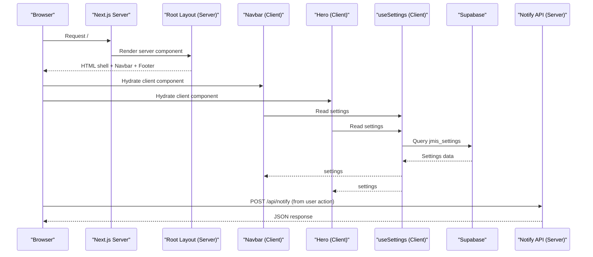

**Diagram sources**
- [app/layout.jsx:1-24](file://app/layout.jsx#L1-L24)
- [components/Navbar.jsx:1-165](file://components/Navbar.jsx#L1-L165)
- [components/Hero.jsx:1-101](file://components/Hero.jsx#L1-L101)
- [lib/useSettings.js:1-25](file://lib/useSettings.js#L1-L25)
- [app/api/notify/route.js:1-115](file://app/api/notify/route.js#L1-L115)

## Detailed Component Analysis

### Root Layout (Server Component)
Responsibilities:
- Defines global metadata and HTML structure.
- Composes Navbar, main content area, and Footer.
- Remains a server component, reducing client bundle size.

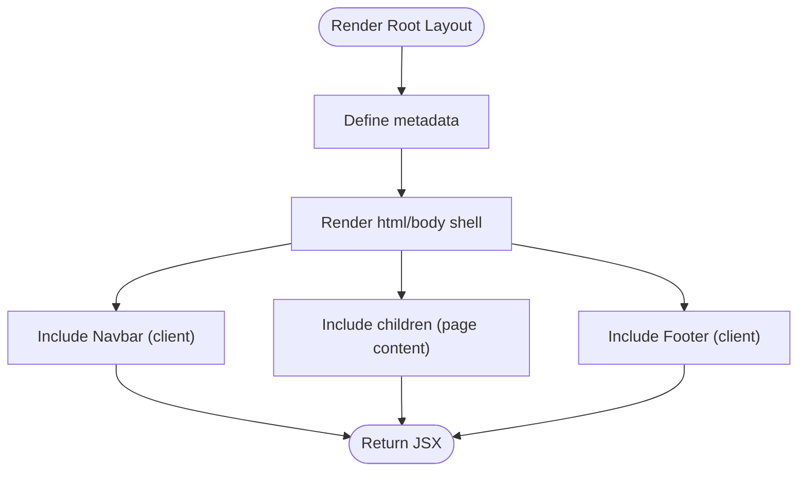

**Diagram sources**
- [app/layout.jsx:1-24](file://app/layout.jsx#L1-L24)

**Section sources**
- [app/layout.jsx:1-24](file://app/layout.jsx#L1-L24)

### Home Page (Server Component)
Responsibilities:
- Composes marketing sections (Hero, Programs, About, Facilities, Gallery, Testimonials, News, Faq).
- No client-side state; all rendering happens on the server.

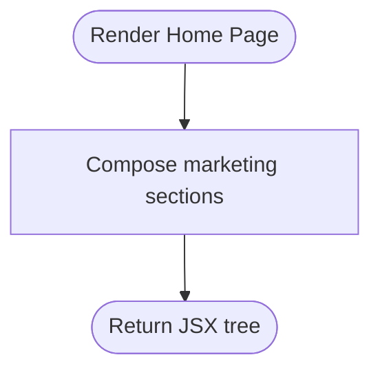

**Diagram sources**
- [app/page.jsx:1-27](file://app/page.jsx#L1-L27)

**Section sources**
- [app/page.jsx:1-27](file://app/page.jsx#L1-L27)

### Navbar (Client Component)
Responsibilities:
- Manages open/close states for mobile menu and portal dropdowns.
- Uses environment variables for external portals.
- Adds keyboard and click-outside listeners to close dropdowns.

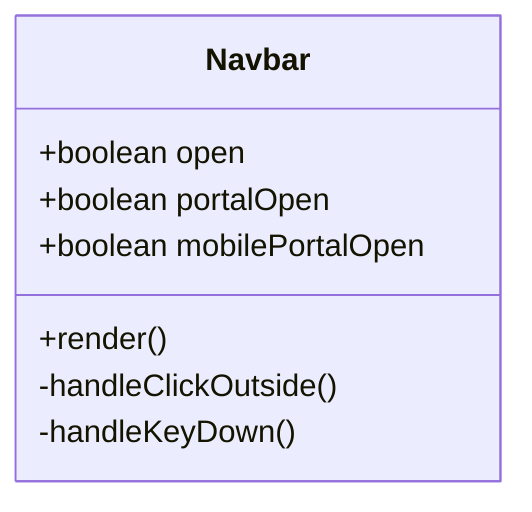

**Diagram sources**
- [components/Navbar.jsx:1-165](file://components/Navbar.jsx#L1-L165)

**Section sources**
- [components/Navbar.jsx:1-165](file://components/Navbar.jsx#L1-L165)

### Hero (Client Component)
Responsibilities:
- Reads settings via useSettings to render slides.
- Auto-rotates slides with setInterval and supports manual navigation.
- Renders CTAs based on environment configuration.

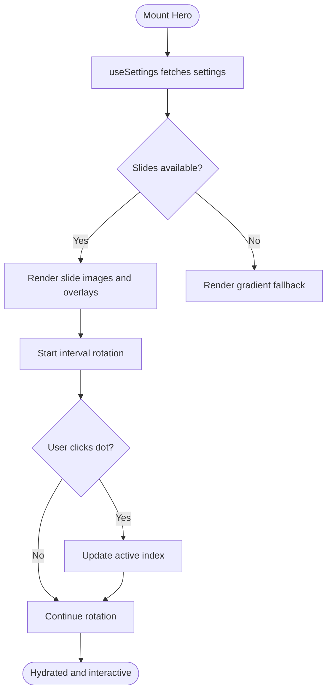

**Diagram sources**
- [components/Hero.jsx:1-101](file://components/Hero.jsx#L1-L101)
- [lib/useSettings.js:1-25](file://lib/useSettings.js#L1-L25)

**Section sources**
- [components/Hero.jsx:1-101](file://components/Hero.jsx#L1-L101)
- [lib/useSettings.js:1-25](file://lib/useSettings.js#L1-L25)

### Footer (Client Component)
Responsibilities:
- Displays contact information and quick links.
- Reads settings via useSettings to populate address, phone, email.

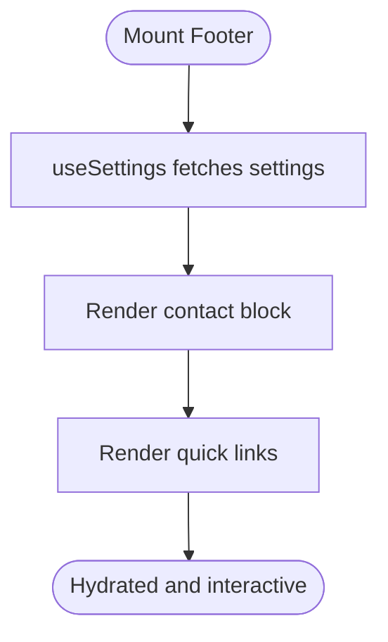

**Diagram sources**
- [components/Footer.jsx:1-132](file://components/Footer.jsx#L1-L132)
- [lib/useSettings.js:1-25](file://lib/useSettings.js#L1-L25)

**Section sources**
- [components/Footer.jsx:1-132](file://components/Footer.jsx#L1-L132)
- [lib/useSettings.js:1-25](file://lib/useSettings.js#L1-L25)

### useSettings Hook (Client Hook)
Responsibilities:
- Performs a single Supabase query to fetch jmis_settings.
- Returns settings and loading state to consumers.

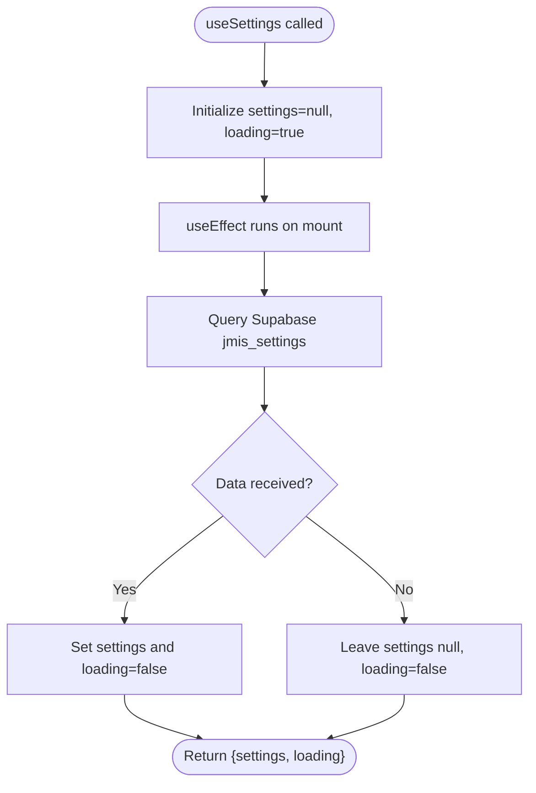

**Diagram sources**
- [lib/useSettings.js:1-25](file://lib/useSettings.js#L1-L25)

**Section sources**
- [lib/useSettings.js:1-25](file://lib/useSettings.js#L1-L25)

### Exam Route (Server Wrapper + Client Component)
Responsibilities:
- Server wrapper handles dynamic generation and passes searchParams to the client component.
- Client component dynamically imports exam modules and routes to the appropriate one based on sessionType.

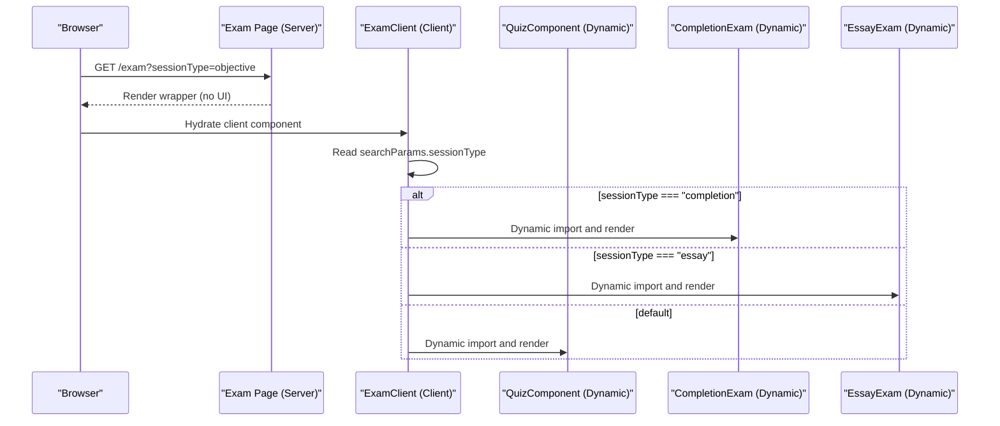

**Diagram sources**
- [app/exam/page.jsx:1-12](file://app/exam/page.jsx#L1-L12)
- [app/exam/ExamClient.jsx:1-46](file://app/exam/ExamClient.jsx#L1-L46)

**Section sources**
- [app/exam/page.jsx:1-12](file://app/exam/page.jsx#L1-L12)
- [app/exam/ExamClient.jsx:1-46](file://app/exam/ExamClient.jsx#L1-L46)

### Notify API (Server Endpoint)
Responsibilities:
- Validates request payload.
- Resolves admin email from settings.
- Sends email via SMTP using nodemailer with environment credentials.

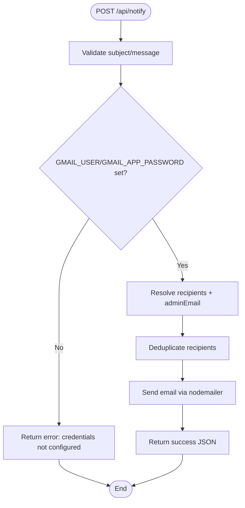

**Diagram sources**
- [app/api/notify/route.js:1-115](file://app/api/notify/route.js#L1-L115)

**Section sources**
- [app/api/notify/route.js:1-115](file://app/api/notify/route.js#L1-L115)

## Dependency Analysis
- Root layout depends on Navbar and Footer (both client components).
- Home page composes multiple marketing components; some are client components that depend on useSettings.
- useSettings depends on Supabase client library.
- Exam route depends on dynamic imports of exam components.
- Notify API depends on nodemailer and Supabase client for resolving admin email.

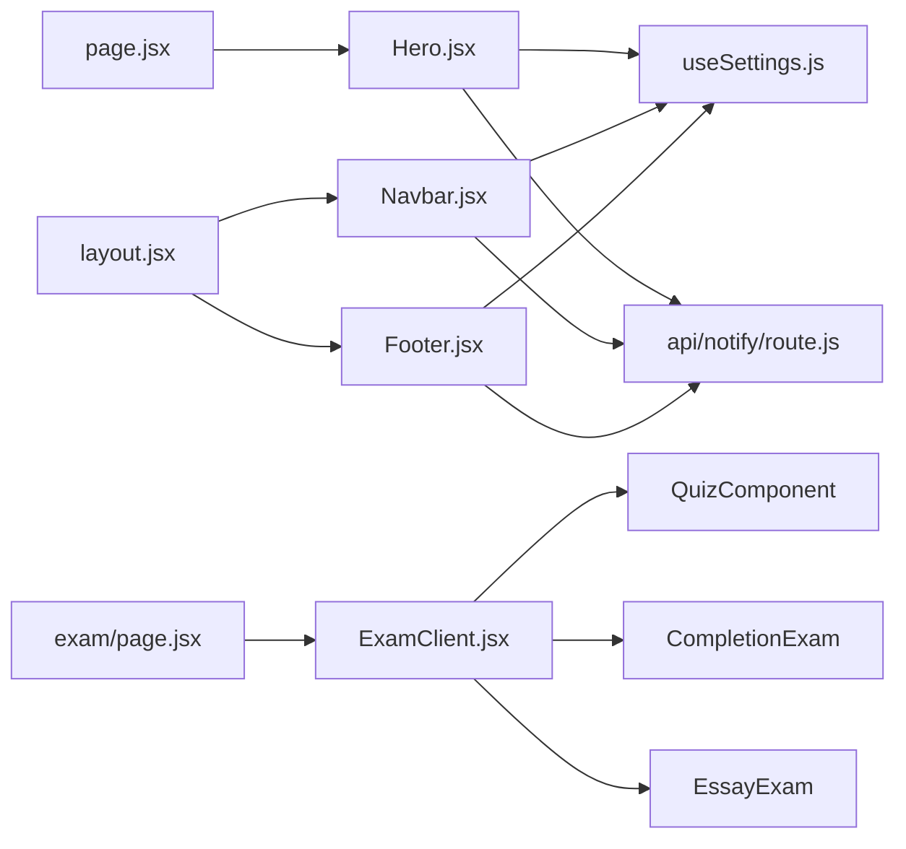

**Diagram sources**
- [app/layout.jsx:1-24](file://app/layout.jsx#L1-L24)
- [app/page.jsx:1-27](file://app/page.jsx#L1-L27)
- [components/Navbar.jsx:1-165](file://components/Navbar.jsx#L1-L165)
- [components/Hero.jsx:1-101](file://components/Hero.jsx#L1-L101)
- [components/Footer.jsx:1-132](file://components/Footer.jsx#L1-L132)
- [lib/useSettings.js:1-25](file://lib/useSettings.js#L1-L25)
- [app/exam/page.jsx:1-12](file://app/exam/page.jsx#L1-L12)
- [app/exam/ExamClient.jsx:1-46](file://app/exam/ExamClient.jsx#L1-L46)
- [app/api/notify/route.js:1-115](file://app/api/notify/route.js#L1-L115)

**Section sources**
- [app/layout.jsx:1-24](file://app/layout.jsx#L1-L24)
- [app/page.jsx:1-27](file://app/page.jsx#L1-L27)
- [components/Navbar.jsx:1-165](file://components/Navbar.jsx#L1-L165)
- [components/Hero.jsx:1-101](file://components/Hero.jsx#L1-L101)
- [components/Footer.jsx:1-132](file://components/Footer.jsx#L1-L132)
- [lib/useSettings.js:1-25](file://lib/useSettings.js#L1-L25)
- [app/exam/page.jsx:1-12](file://app/exam/page.jsx#L1-L12)
- [app/exam/ExamClient.jsx:1-46](file://app/exam/ExamClient.jsx#L1-L46)
- [app/api/notify/route.js:1-115](file://app/api/notify/route.js#L1-L115)

## Performance Considerations
- Prefer server components for static content and layout to reduce client bundle size and improve initial load time.
- Mark only interactive components as "use client" to minimize JavaScript execution on the client.
- Use dynamic imports for heavy or non-critical components (as seen in the exam route) to avoid blocking initial render.
- Avoid unnecessary client-side data fetching when server-side data fetching or pre-rendering is possible.
- Cache and revalidate where appropriate; the exam route disables caching to ensure fresh URL-driven behavior.

[No sources needed since this section provides general guidance]

## Troubleshooting Guide
- If interactive UI does not hydrate correctly, ensure the component is marked "use client" and does not rely on server-only APIs.
- For missing settings, verify Supabase environment variables and network requests from the client hook.
- For email failures, check that GMAIL_USER and GMAIL_APP_PASSWORD are set and that adminEmail exists in settings.
- For dynamic routes not updating, confirm searchParams are passed from the server wrapper to the client component.

**Section sources**
- [lib/useSettings.js:1-25](file://lib/useSettings.js#L1-L25)
- [app/api/notify/route.js:1-115](file://app/api/notify/route.js#L1-L115)
- [app/exam/page.jsx:1-12](file://app/exam/page.jsx#L1-L12)
- [app/exam/ExamClient.jsx:1-46](file://app/exam/ExamClient.jsx#L1-L46)

## Conclusion
This project demonstrates a clear separation between server and client components in the App Router:
- Default server components handle layout and static composition.
- Client components manage interactivity and browser-specific features.
- Data fetching is implemented via a client hook for marketing sections and a server API for secure operations.
- The exam route illustrates a hybrid pattern: server-side routing and parameters combined with client-side dynamic imports.

Adopting these patterns improves performance, maintainability, and security by keeping sensitive logic server-side and minimizing client-side code.

[No sources needed since this section summarizes without analyzing specific files]

## Appendices

### Migration Strategy: Pages Router to App Router
- Move page-level components into app/[route]/page.jsx and wrap them with app/layout.jsx for global structure.
- Convert interactive components to "use client" and move browser-only logic there.
- Replace getStaticProps/getServerSideProps with server components and server-side data fetching where possible.
- Keep client hooks like useSettings for scenarios requiring client-side queries and interactions.
- Use dynamic imports for heavy components to optimize initial load.

[No sources needed since this section provides general guidance]