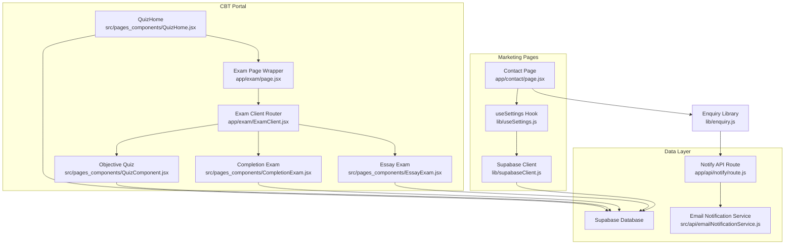
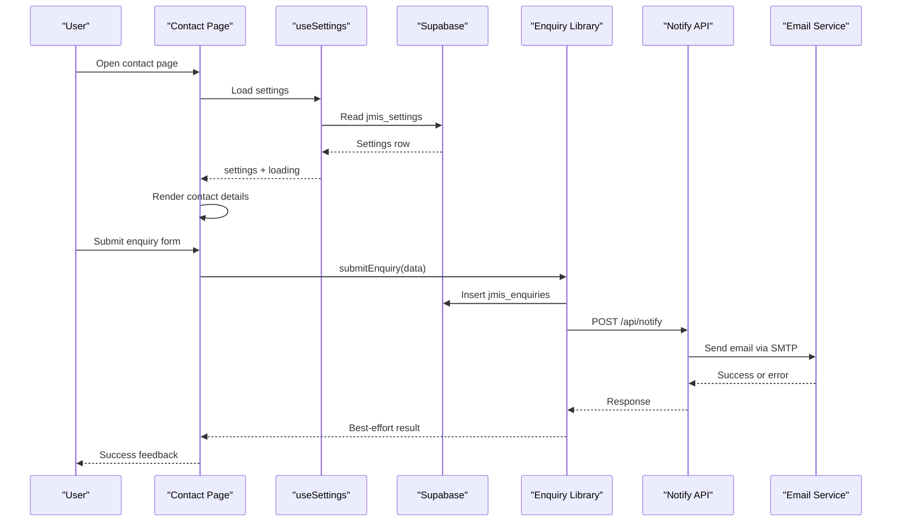
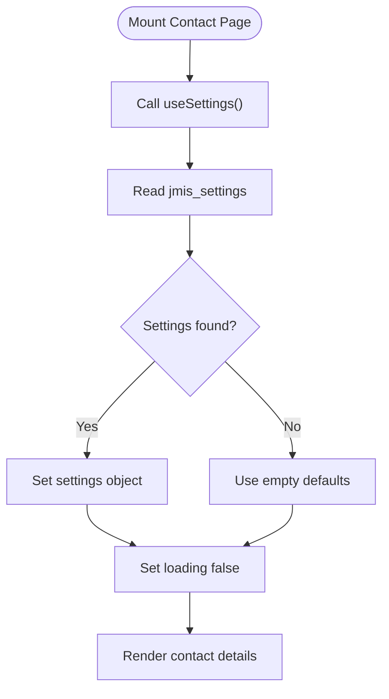
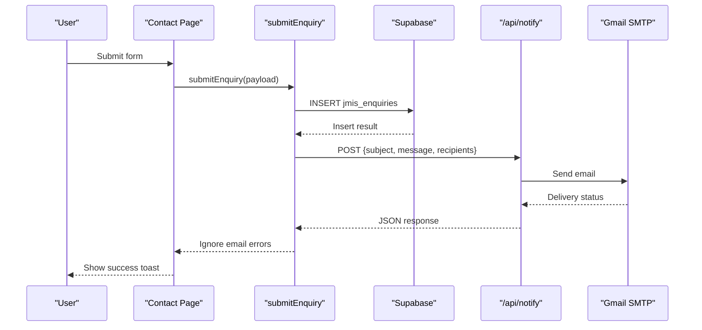
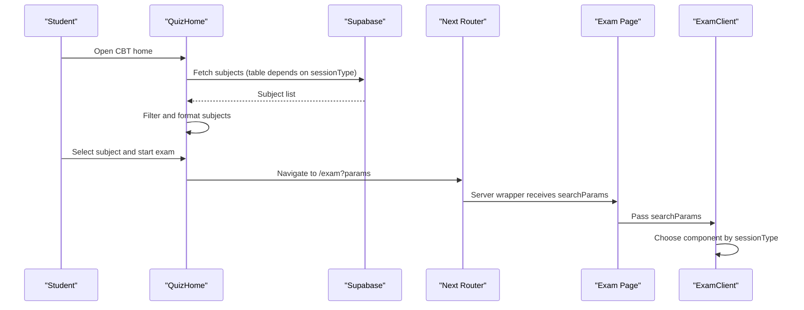
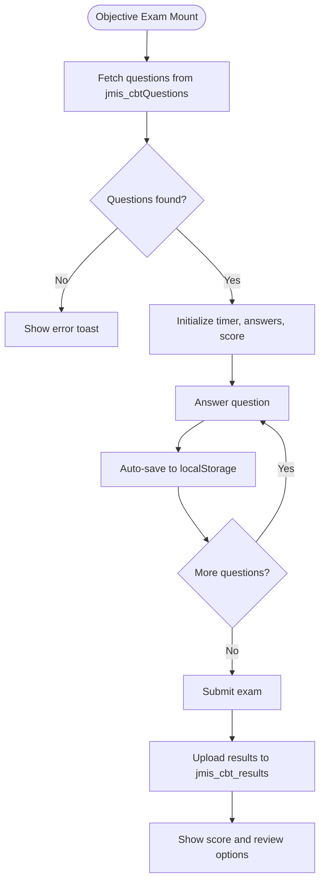
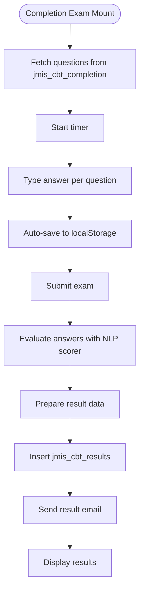
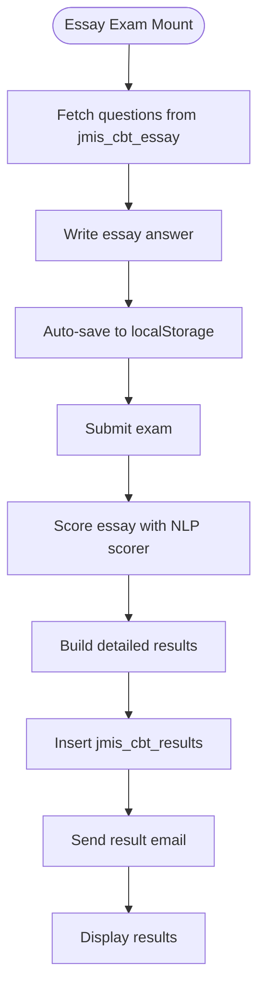
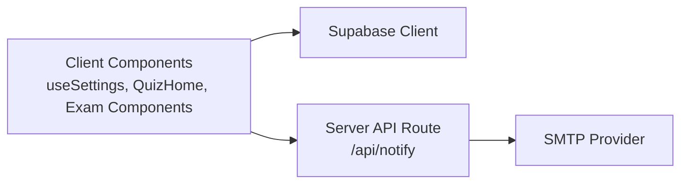
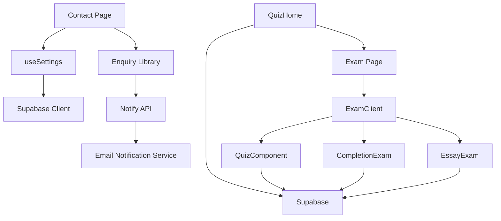

# Data Flow Patterns

<cite>
**Referenced Files in This Document**   
- [useSettings.js](file://lib/useSettings.js)
- [supabaseClient.js](file://lib/supabaseClient.js)
- [page.jsx](file://app/contact/page.jsx)
- [enquiry.js](file://lib/enquiry.js)
- [route.js](file://app/api/notify/route.js)
- [QuizHome.jsx](file://src/pages_components/QuizHome.jsx)
- [page.jsx](file://app/exam/page.jsx)
- [ExamClient.jsx](file://app/exam/ExamClient.jsx)
- [QuizComponent.jsx](file://src/pages_components/QuizComponent.jsx)
- [CompletionExam.jsx](file://src/pages_components/CompletionExam.jsx)
- [EssayExam.jsx](file://src/pages_components/EssayExam.jsx)
- [emailNotificationService.js](file://src/api/emailNotificationService.js)
</cite>

## Table of Contents
1. [Introduction](#introduction)
2. [Project Structure](#project-structure)
3. [Core Components](#core-components)
4. [Architecture Overview](#architecture-overview)
5. [Detailed Component Analysis](#detailed-component-analysis)
6. [Dependency Analysis](#dependency-analysis)
7. [Performance Considerations](#performance-considerations)
8. [Troubleshooting Guide](#troubleshooting-guide)
9. [Conclusion](#conclusion)

## Introduction
This document explains how data flows through the JMI School Website, focusing on two main areas:

- Marketing and contact content: how settings from Supabase are loaded by a shared hook and consumed by marketing pages such as the contact page.
- Exam data flow: how exam subjects are listed from the database, how students start an exam, and how results are processed for objective, completion, and essay sessions.

It also clarifies server-side API behavior versus client-side data loading, and documents error handling, loading states, and caching strategies used across these flows.

## Project Structure
The website uses Next.js App Router with client components for interactive features and server routes for secure operations like email delivery.

**Diagram sources**
- [page.jsx:1-162](file://app/contact/page.jsx#L1-L162)
- [useSettings.js:1-25](file://lib/useSettings.js#L1-L25)
- [supabaseClient.js:1-13](file://lib/supabaseClient.js#L1-L13)
- [QuizHome.jsx:1-508](file://src/pages_components/QuizHome.jsx#L1-L508)
- [page.jsx:1-12](file://app/exam/page.jsx#L1-L12)
- [ExamClient.jsx:1-46](file://app/exam/ExamClient.jsx#L1-L46)
- [QuizComponent.jsx:1-800](file://src/pages_components/QuizComponent.jsx#L1-L800)
- [CompletionExam.jsx:1-472](file://src/pages_components/CompletionExam.jsx#L1-L472)
- [EssayExam.jsx:1-418](file://src/pages_components/EssayExam.jsx#L1-L418)
- [route.js:1-115](file://app/api/notify/route.js#L1-L115)
- [emailNotificationService.js:1-127](file://src/api/emailNotificationService.js#L1-L127)

**Section sources**
- [page.jsx:1-162](file://app/contact/page.jsx#L1-L162)
- [useSettings.js:1-25](file://lib/useSettings.js#L1-L25)
- [supabaseClient.js:1-13](file://lib/supabaseClient.js#L1-L13)
- [QuizHome.jsx:1-508](file://src/pages_components/QuizHome.jsx#L1-L508)
- [page.jsx:1-12](file://app/exam/page.jsx#L1-L12)
- [ExamClient.jsx:1-46](file://app/exam/ExamClient.jsx#L1-L46)
- [QuizComponent.jsx:1-800](file://src/pages_components/QuizComponent.jsx#L1-L800)
- [CompletionExam.jsx:1-472](file://src/pages_components/CompletionExam.jsx#L1-L472)
- [EssayExam.jsx:1-418](file://src/pages_components/EssayExam.jsx#L1-L418)
- [route.js:1-115](file://app/api/notify/route.js#L1-L115)
- [emailNotificationService.js:1-127](file://src/api/emailNotificationService.js#L1-L127)

## Core Components
- Shared settings hook: loads a single settings row from Supabase and exposes `settings` and `loading`.
- Contact page: renders dynamic contact details from settings and submits enquiries to the database and notification API.
- CBT portal entry: lists available exams, validates student selection, and navigates to an exam session.
- Exam router: selects the correct exam component based on session type.
- Exam components: load questions, manage timer and answers, persist progress locally, submit results, and send notifications.

**Section sources**
- [useSettings.js:1-25](file://lib/useSettings.js#L1-L25)
- [page.jsx:1-162](file://app/contact/page.jsx#L1-L162)
- [QuizHome.jsx:1-508](file://src/pages_components/QuizHome.jsx#L1-L508)
- [page.jsx:1-12](file://app/exam/page.jsx#L1-L12)
- [ExamClient.jsx:1-46](file://app/exam/ExamClient.jsx#L1-L46)
- [QuizComponent.jsx:1-800](file://src/pages_components/QuizComponent.jsx#L1-L800)
- [CompletionExam.jsx:1-472](file://src/pages_components/CompletionExam.jsx#L1-L472)
- [EssayExam.jsx:1-418](file://src/pages_components/EssayExam.jsx#L1-L418)

## Architecture Overview
The application separates concerns between marketing content and exam functionality:

- Marketing content is driven by a single settings table. The contact page consumes this data via a reusable hook.
- The CBT portal reads exam metadata from multiple tables depending on session type, then routes users into the appropriate exam component.
- Results are persisted to a results table and optionally emailed using a server-only API route.

**Diagram sources**
- [page.jsx:1-162](file://app/contact/page.jsx#L1-L162)
- [useSettings.js:1-25](file://lib/useSettings.js#L1-L25)
- [enquiry.js:1-129](file://lib/enquiry.js#L1-L129)
- [route.js:1-115](file://app/api/notify/route.js#L1-L115)

## Detailed Component Analysis

### Marketing Settings Flow: useSettings to Contact Page
The marketing section reads configuration from a single settings row. The hook performs a one-time read on mount, sets loading state, and returns normalized settings. The contact page uses these values to render contact details and forms.

**Diagram sources**
- [useSettings.js:1-25](file://lib/useSettings.js#L1-L25)
- [page.jsx:1-162](file://app/contact/page.jsx#L1-L162)

**Section sources**
- [useSettings.js:1-25](file://lib/useSettings.js#L1-L25)
- [page.jsx:1-162](file://app/contact/page.jsx#L1-L162)

### Contact Form Submission Flow
The contact form persists the enquiry to the database first, then sends a best-effort email notification. If the email fails, the user still sees success because the database record is the source of truth.

**Diagram sources**
- [page.jsx:1-162](file://app/contact/page.jsx#L1-L162)
- [enquiry.js:1-129](file://lib/enquiry.js#L1-L129)
- [route.js:1-115](file://app/api/notify/route.js#L1-L115)

**Section sources**
- [page.jsx:1-162](file://app/contact/page.jsx#L1-L162)
- [enquiry.js:1-129](file://lib/enquiry.js#L1-L129)
- [route.js:1-115](file://app/api/notify/route.js#L1-L115)

### Exam Listing Flow: QuizHome to Exam Router
QuizHome fetches exam metadata from Supabase, formats it, and allows filtering by subject, class, term, purpose, and archive status. When a student starts an exam, the component builds URL parameters and navigates to the exam page.

**Diagram sources**
- [QuizHome.jsx:1-508](file://src/pages_components/QuizHome.jsx#L1-L508)
- [page.jsx:1-12](file://app/exam/page.jsx#L1-L12)
- [ExamClient.jsx:1-46](file://app/exam/ExamClient.jsx#L1-L46)

**Section sources**
- [QuizHome.jsx:1-508](file://src/pages_components/QuizHome.jsx#L1-L508)
- [page.jsx:1-12](file://app/exam/page.jsx#L1-L12)
- [ExamClient.jsx:1-46](file://app/exam/ExamClient.jsx#L1-L46)

### Objective Exam Flow: QuizComponent
The objective exam loads questions from the objective questions table, manages a timer, tracks answers, auto-saves progress to localStorage, and uploads results after submission.

**Diagram sources**
- [QuizComponent.jsx:1-800](file://src/pages_components/QuizComponent.jsx#L1-L800)

**Section sources**
- [QuizComponent.jsx:1-800](file://src/pages_components/QuizComponent.jsx#L1-L800)

### Completion Exam Flow: CompletionExam
The completion exam loads fill-in-the-blank questions, evaluates answers using NLP scoring, persists progress locally, and saves results when not in practice mode.

**Diagram sources**
- [CompletionExam.jsx:1-472](file://src/pages_components/CompletionExam.jsx#L1-L472)

**Section sources**
- [CompletionExam.jsx:1-472](file://src/pages_components/CompletionExam.jsx#L1-L472)

### Essay Exam Flow: EssayExam
The essay exam loads essay prompts, evaluates free-text responses with keyword and word-count logic, and records detailed feedback.

**Diagram sources**
- [EssayExam.jsx:1-418](file://src/pages_components/EssayExam.jsx#L1-L418)

**Section sources**
- [EssayExam.jsx:1-418](file://src/pages_components/EssayExam.jsx#L1-L418)

### Server-Side API vs Client-Side Data Loading
- Client-side data loading:
  - Marketing settings are loaded in the browser via the shared hook.
  - Exam metadata and questions are fetched directly from Supabase in client components.
- Server-side API:
  - The notify route runs only on the server, protecting SMTP credentials and performing email delivery.
  - It reads admin email from settings and deduplicates recipients before sending.

**Diagram sources**
- [useSettings.js:1-25](file://lib/useSettings.js#L1-L25)
- [QuizHome.jsx:1-508](file://src/pages_components/QuizHome.jsx#L1-L508)
- [QuizComponent.jsx:1-800](file://src/pages_components/QuizComponent.jsx#L1-L800)
- [CompletionExam.jsx:1-472](file://src/pages_components/CompletionExam.jsx#L1-L472)
- [EssayExam.jsx:1-418](file://src/pages_components/EssayExam.jsx#L1-L418)
- [route.js:1-115](file://app/api/notify/route.js#L1-L115)

**Section sources**
- [route.js:1-115](file://app/api/notify/route.js#L1-L115)

## Dependency Analysis
The following diagram shows key dependencies among components and services.

**Diagram sources**
- [page.jsx:1-162](file://app/contact/page.jsx#L1-L162)
- [useSettings.js:1-25](file://lib/useSettings.js#L1-L25)
- [supabaseClient.js:1-13](file://lib/supabaseClient.js#L1-L13)
- [enquiry.js:1-129](file://lib/enquiry.js#L1-L129)
- [route.js:1-115](file://app/api/notify/route.js#L1-L115)
- [emailNotificationService.js:1-127](file://src/api/emailNotificationService.js#L1-L127)
- [QuizHome.jsx:1-508](file://src/pages_components/QuizHome.jsx#L1-L508)
- [page.jsx:1-12](file://app/exam/page.jsx#L1-L12)
- [ExamClient.jsx:1-46](file://app/exam/ExamClient.jsx#L1-L46)
- [QuizComponent.jsx:1-800](file://src/pages_components/QuizComponent.jsx#L1-L800)
- [CompletionExam.jsx:1-472](file://src/pages_components/CompletionExam.jsx#L1-L472)
- [EssayExam.jsx:1-418](file://src/pages_components/EssayExam.jsx#L1-L418)

**Section sources**
- [page.jsx:1-162](file://app/contact/page.jsx#L1-L162)
- [useSettings.js:1-25](file://lib/useSettings.js#L1-L25)
- [enquiry.js:1-129](file://lib/enquiry.js#L1-L129)
- [route.js:1-115](file://app/api/notify/route.js#L1-L115)
- [emailNotificationService.js:1-127](file://src/api/emailNotificationService.js#L1-L127)
- [QuizHome.jsx:1-508](file://src/pages_components/QuizHome.jsx#L1-L508)
- [page.jsx:1-12](file://app/exam/page.jsx#L1-L12)
- [ExamClient.jsx:1-46](file://app/exam/ExamClient.jsx#L1-L46)
- [QuizComponent.jsx:1-800](file://src/pages_components/QuizComponent.jsx#L1-L800)
- [CompletionExam.jsx:1-472](file://src/pages_components/CompletionExam.jsx#L1-L472)
- [EssayExam.jsx:1-418](file://src/pages_components/EssayExam.jsx#L1-L418)

## Performance Considerations
- Settings hook:
  - Single query on mount; no automatic refresh. Suitable for static marketing content.
  - No cache layer beyond React state; consider adding a small in-memory cache if settings are frequently accessed.
- Contact form:
  - Database insert is synchronous from the user’s perspective; email is fire-and-forget to avoid blocking.
- CBT listing:
  - Subjects are fetched once per session type change; filters are applied client-side.
  - Consider pagination or server-side filtering if the subject list grows significantly.
- Exam components:
  - LocalStorage auto-save improves resilience during network interruptions.
  - Timer-based submission ensures time limits are enforced even without network connectivity.
  - Network quality monitoring helps detect poor connectivity but does not retry failed requests automatically.
- Email service:
  - Server-only route protects credentials and centralizes SMTP configuration.
  - Recipient deduplication reduces duplicate emails.

[No sources needed since this section provides general guidance]

## Troubleshooting Guide
Common issues and their likely causes:

- Settings not loading:
  - Check environment variables for Supabase URL and anon key.
  - Verify that the settings row exists in the database.
- Contact form appears sent but no email received:
  - Confirm SMTP credentials are configured in the notify route.
  - Check server logs for email delivery errors.
- No questions found for an exam:
  - Validate subject, class, term, and purpose filters.
  - Ensure the correct table contains the expected questions.
- Results not saved:
  - Confirm student lookup succeeds and the results table insert completes.
  - Check for database constraints or permission issues.
- Email notifications fail:
  - For contact enquiries, failures are ignored; verify the enquiry row exists.
  - For exam results, check the email service configuration and recipient resolution.

**Section sources**
- [useSettings.js:1-25](file://lib/useSettings.js#L1-L25)
- [route.js:1-115](file://app/api/notify/route.js#L1-L115)
- [QuizComponent.jsx:1-800](file://src/pages_components/QuizComponent.jsx#L1-L800)
- [CompletionExam.jsx:1-472](file://src/pages_components/CompletionExam.jsx#L1-L472)
- [EssayExam.jsx:1-418](file://src/pages_components/EssayExam.jsx#L1-L418)

## Conclusion
The JMI School Website separates marketing content and exam functionality while sharing a common data layer. Marketing pages consume settings through a simple hook, and the contact form prioritizes reliable data capture over email delivery. The CBT portal dynamically loads exam metadata, routes users to the correct exam component, and persists results with local auto-save as a safety net. Server-side APIs protect sensitive operations like email delivery, while client-side components handle interactive flows and user feedback.

[No sources needed since this section summarizes without analyzing specific files]