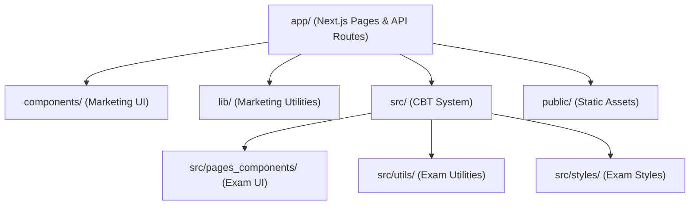
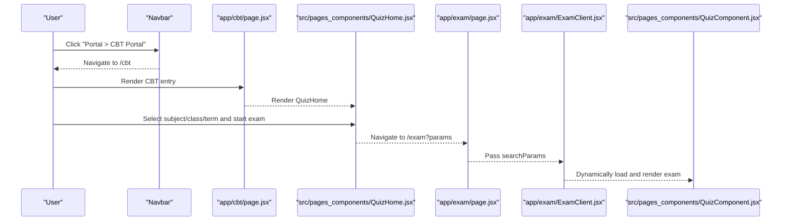
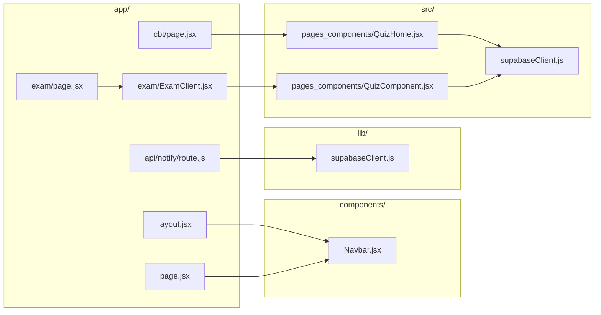

# Directory Structure

<cite>
**Referenced Files in This Document**
- [next.config.mjs](file://next.config.mjs)
- [package.json](file://package.json)
- [app/layout.jsx](file://app/layout.jsx)
- [app/page.jsx](file://app/page.jsx)
- [app/cbt/page.jsx](file://app/cbt/page.jsx)
- [app/exam/page.jsx](file://app/exam/page.jsx)
- [app/exam/ExamClient.jsx](file://app/exam/ExamClient.jsx)
- [app/api/notify/route.js](file://app/api/notify/route.js)
- [components/Navbar.jsx](file://components/Navbar.jsx)
- [lib/supabaseClient.js](file://lib/supabaseClient.js)
- [src/pages_components/QuizHome.jsx](file://src/pages_components/QuizHome.jsx)
- [src/pages_components/QuizComponent.jsx](file://src/pages_components/QuizComponent.jsx)
- [src/supabaseClient.js](file://src/supabaseClient.js)
</cite>

## Table of Contents
1. Introduction
2. Project Structure
3. Core Components
4. Architecture Overview
5. Detailed Component Analysis
6. Dependency Analysis
7. Performance Considerations
8. Troubleshooting Guide
9. Conclusion

## Introduction
This document explains the directory structure organization of the JMI School Website and how it supports two distinct purposes:
- Marketing website: public pages, navigation, hero sections, programs, facilities, gallery, testimonials, news, FAQ, and contact/admissions flows.
- Computer-Based Test (CBT) system: student exam entry, question rendering, timer, submission, results review, and email notifications.

The project uses Next.js App Router for marketing pages and API routes, while the CBT system components live under src/ to keep exam logic separate from marketing UI. Shared utilities for the marketing site are in lib/, and static assets go into public/.

## Project Structure
High-level layout:
- app/: Next.js App Router pages and server-side API routes for the marketing site and CBT entry points.
- components/: Reusable marketing UI components (navbar, footer, hero, programs, etc.).
- lib/: Shared utilities for the marketing site (Supabase client, settings helpers).
- src/: Exam system components, styles, and utilities used by the CBT flow.
- public/: Static assets served directly by Next.js (e.g., logo images referenced by components).

**Diagram sources**
- [app/layout.jsx:1-24](file://app/layout.jsx#L1-L24)
- [app/page.jsx:1-27](file://app/page.jsx#L1-L27)
- [app/cbt/page.jsx:1-11](file://app/cbt/page.jsx#L1-L11)
- [app/exam/page.jsx:1-12](file://app/exam/page.jsx#L1-L12)
- [app/exam/ExamClient.jsx:1-46](file://app/exam/ExamClient.jsx#L1-L46)
- [components/Navbar.jsx:1-165](file://components/Navbar.jsx#L1-L165)
- [lib/supabaseClient.js:1-13](file://lib/supabaseClient.js#L1-L13)
- [src/pages_components/QuizHome.jsx:1-508](file://src/pages_components/QuizHome.jsx#L1-L508)
- [src/pages_components/QuizComponent.jsx:1-800](file://src/pages_components/QuizComponent.jsx#L1-L800)

**Section sources**
- [next.config.mjs:1-19](file://next.config.mjs#L1-L19)
- [package.json:1-33](file://package.json#L1-L33)
- [app/layout.jsx:1-24](file://app/layout.jsx#L1-L24)
- [app/page.jsx:1-27](file://app/page.jsx#L1-L27)

## Core Components
- app/layout.jsx: Root layout that injects global CSS, sets metadata, and wraps content with Navbar and Footer. It establishes the shared chrome for all marketing pages.
- app/page.jsx: Home page composed of marketing sections using components/*.
- components/Navbar.jsx: Sticky navigation with links to marketing pages and a Portal dropdown that includes /cbt (internal) and external Student/Staff portals.
- app/api/notify/route.js: Server-only API route to send emails via SMTP; reads admin email from Supabase settings and deduplicates recipients.

These pieces demonstrate the separation:
- Marketing UI is in components/ and consumed by app/* pages.
- CBT entry points are in app/cbt and app/exam but delegate to src/ for heavy exam logic.
- lib/ holds marketing-site utilities (e.g., Supabase client for public data), while src/ holds CBT-specific clients and logic.

**Section sources**
- [app/layout.jsx:1-24](file://app/layout.jsx#L1-L24)
- [app/page.jsx:1-27](file://app/page.jsx#L1-L27)
- [components/Navbar.jsx:1-165](file://components/Navbar.jsx#L1-L165)
- [app/api/notify/route.js:1-115](file://app/api/notify/route.js#L1-L115)

## Architecture Overview
The dual nature of the site is reflected in routing and component placement:
- Marketing pages live under app/ and compose reusable UI from components/.
- CBT entry points under app/cbt and app/exam are thin wrappers that render exam UI from src/pages_components/.
- The exam flow dynamically loads exam components on the client to avoid SSR issues and to support interactive features like timers and local storage persistence.

**Diagram sources**
- [components/Navbar.jsx:43-47](file://components/Navbar.jsx#L43-L47)
- [app/cbt/page.jsx:1-11](file://app/cbt/page.jsx#L1-L11)
- [src/pages_components/QuizHome.jsx:151-176](file://src/pages_components/QuizHome.jsx#L151-L176)
- [app/exam/page.jsx:1-12](file://app/exam/page.jsx#L1-L12)
- [app/exam/ExamClient.jsx:1-46](file://app/exam/ExamClient.jsx#L1-L46)
- [src/pages_components/QuizComponent.jsx:1-800](file://src/pages_components/QuizComponent.jsx#L1-L800)

## Detailed Component Analysis

### app/ — Next.js Pages and API Routes
Purpose:
- Define routes for marketing pages and CBT entry points.
- Provide server-side API endpoints (e.g., email notification).

Key patterns:
- Route-based folders map to URLs (e.g., app/cbt/page.jsx → /cbt).
- Server components wrap client-heavy logic when needed (e.g., app/exam/page.jsx passes searchParams to a client component).
- API routes encapsulate server-only logic (e.g., SMTP sending) to protect credentials.

File naming conventions:
- Page files use page.jsx inside folder routes.
- Client components marked with "use client" directive where browser APIs are used.
- API routes use route.js within api/* directories.

Why this matters:
- Keeps marketing UI decoupled from exam logic.
- Centralizes environment configuration and image domains in next.config.mjs.

**Section sources**
- [app/cbt/page.jsx:1-11](file://app/cbt/page.jsx#L1-L11)
- [app/exam/page.jsx:1-12](file://app/exam/page.jsx#L1-L12)
- [app/exam/ExamClient.jsx:1-46](file://app/exam/ExamClient.jsx#L1-L46)
- [app/api/notify/route.js:1-115](file://app/api/notify/route.js#L1-L115)
- [next.config.mjs:1-19](file://next.config.mjs#L1-L19)

### components/ — Marketing UI Components
Purpose:
- Reusable UI building blocks for the marketing site (navigation, hero, programs, about, facilities, gallery, testimonials, news, FAQ, footer).

Patterns:
- Each file exports a single React component focused on one section or shell element.
- Components consume props and rely on shared styling (Tailwind classes) and icons.
- Navbar integrates both internal links (/cbt) and external portal links configured via environment variables.

Examples:
- Navbar centralizes navigation and portal access, including the CBT link.
- Home page composes multiple marketing components to build the landing experience.

**Section sources**
- [components/Navbar.jsx:1-165](file://components/Navbar.jsx#L1-L165)
- [app/page.jsx:1-27](file://app/page.jsx#L1-L27)

### lib/ — Shared Utilities for Marketing Site
Purpose:
- Provide shared services and helpers used across marketing pages.

Key items:
- Supabase client for public read operations (e.g., fetching settings and media).
- Helpers to build storage URLs for setting-related assets.

Why placed here:
- These utilities are specific to the marketing site’s data needs and are not part of the exam system.
- Keeping them separate from src/ avoids coupling marketing code with exam logic.

**Section sources**
- [lib/supabaseClient.js:1-13](file://lib/supabaseClient.js#L1-L13)

### src/ — Exam System Components
Purpose:
- Host the CBT system’s UI, styles, and utilities, keeping exam logic isolated from marketing pages.

Structure:
- pages_components/: Exam UI components (QuizHome, QuizComponent, CompletionExam, EssayExam).
- utils/: Exam-specific utilities (e.g., subject utilities, NLP scoring).
- styles/: Exam-specific CSS modules/styles.
- supabaseClient.js: CBT-specific Supabase client instance.

Patterns:
- Heavy client-side interactions (timers, local storage, dynamic imports) are implemented in these components.
- Dynamic imports prevent SSR issues and reduce initial bundle size for exam flows.

Why placed here:
- Separation of concerns: marketing vs. exam systems.
- Enables independent evolution of the CBT system without affecting marketing pages.

**Section sources**
- [src/pages_components/QuizHome.jsx:1-508](file://src/pages_components/QuizHome.jsx#L1-L508)
- [src/pages_components/QuizComponent.jsx:1-800](file://src/pages_components/QuizComponent.jsx#L1-L800)
- [src/supabaseClient.js:1-7](file://src/supabaseClient.js#L1-L7)

### public/ — Static Assets
Purpose:
- Serve static files directly (e.g., logo.jpg referenced by components and exam UI).

Usage examples:
- Navbar and exam components reference /logo.jpg for branding.
- Images can be optimized via Next.js Image component where applicable.

**Section sources**
- [components/Navbar.jsx:52-54](file://components/Navbar.jsx#L52-L54)
- [src/pages_components/QuizHome.jsx:9-10](file://src/pages_components/QuizHome.jsx#L9-L10)
- [src/pages_components/QuizComponent.jsx:15-16](file://src/pages_components/QuizComponent.jsx#L15-L16)

## Dependency Analysis
Relationships between directories and key files:

**Diagram sources**
- [app/layout.jsx:1-24](file://app/layout.jsx#L1-L24)
- [app/page.jsx:1-27](file://app/page.jsx#L1-L27)
- [app/cbt/page.jsx:1-11](file://app/cbt/page.jsx#L1-L11)
- [app/exam/page.jsx:1-12](file://app/exam/page.jsx#L1-L12)
- [app/exam/ExamClient.jsx:1-46](file://app/exam/ExamClient.jsx#L1-L46)
- [app/api/notify/route.js:1-115](file://app/api/notify/route.js#L1-L115)
- [components/Navbar.jsx:1-165](file://components/Navbar.jsx#L1-L165)
- [lib/supabaseClient.js:1-13](file://lib/supabaseClient.js#L1-L13)
- [src/pages_components/QuizHome.jsx:1-508](file://src/pages_components/QuizHome.jsx#L1-L508)
- [src/pages_components/QuizComponent.jsx:1-800](file://src/pages_components/QuizComponent.jsx#L1-L800)
- [src/supabaseClient.js:1-7](file://src/supabaseClient.js#L1-L7)

**Section sources**
- [package.json:1-33](file://package.json#L1-L33)

## Performance Considerations
- Use dynamic imports for exam components to avoid loading heavy exam logic on marketing pages.
- Keep marketing pages lightweight by composing small components from components/.
- Configure remote image domains in next.config.mjs to optimize image delivery.
- Avoid unnecessary re-renders in exam components by memoizing derived data and minimizing state updates.

[No sources needed since this section provides general guidance]

## Troubleshooting Guide
Common issues and where to look:
- Email notifications failing: Check app/api/notify/route.js for missing SMTP credentials and recipient resolution. Ensure environment variables are set and that admin email exists in settings.
- CBT not loading questions: Verify network connectivity and Supabase queries in src/pages_components/QuizComponent.jsx. Inspect console logs for query parameters and database responses.
- Navigation not linking to CBT: Confirm Navbar.jsx includes the correct /cbt link and that app/cbt/page.jsx renders the quiz home.

**Section sources**
- [app/api/notify/route.js:48-115](file://app/api/notify/route.js#L48-L115)
- [src/pages_components/QuizComponent.jsx:59-143](file://src/pages_components/QuizComponent.jsx#L59-L143)
- [components/Navbar.jsx:43-47](file://components/Navbar.jsx#L43-L47)

## Conclusion
The directory structure cleanly separates marketing and exam concerns:
- app/ handles routing and server-side API logic for the marketing site and CBT entry points.
- components/ contains reusable marketing UI.
- lib/ provides marketing-specific utilities.
- src/ houses the CBT system’s components, styles, and utilities.
- public/ serves static assets.

This organization supports scalability, maintainability, and clear boundaries between the marketing website and the CBT system, enabling independent development and deployment of each subsystem.