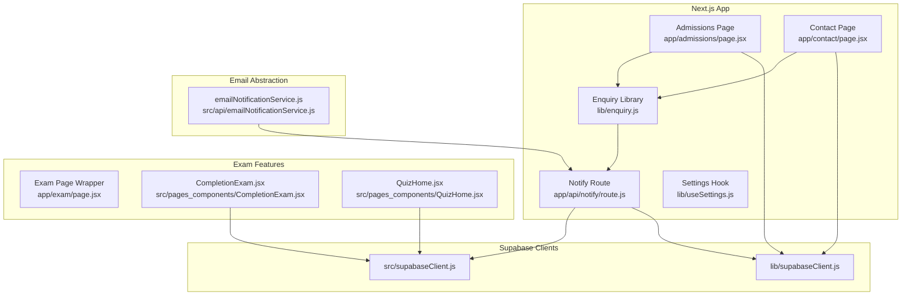
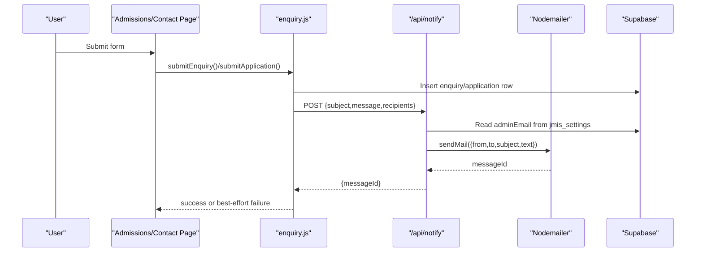
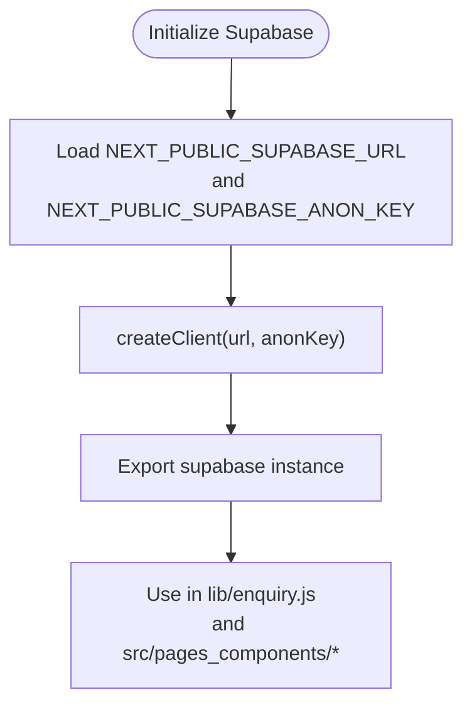
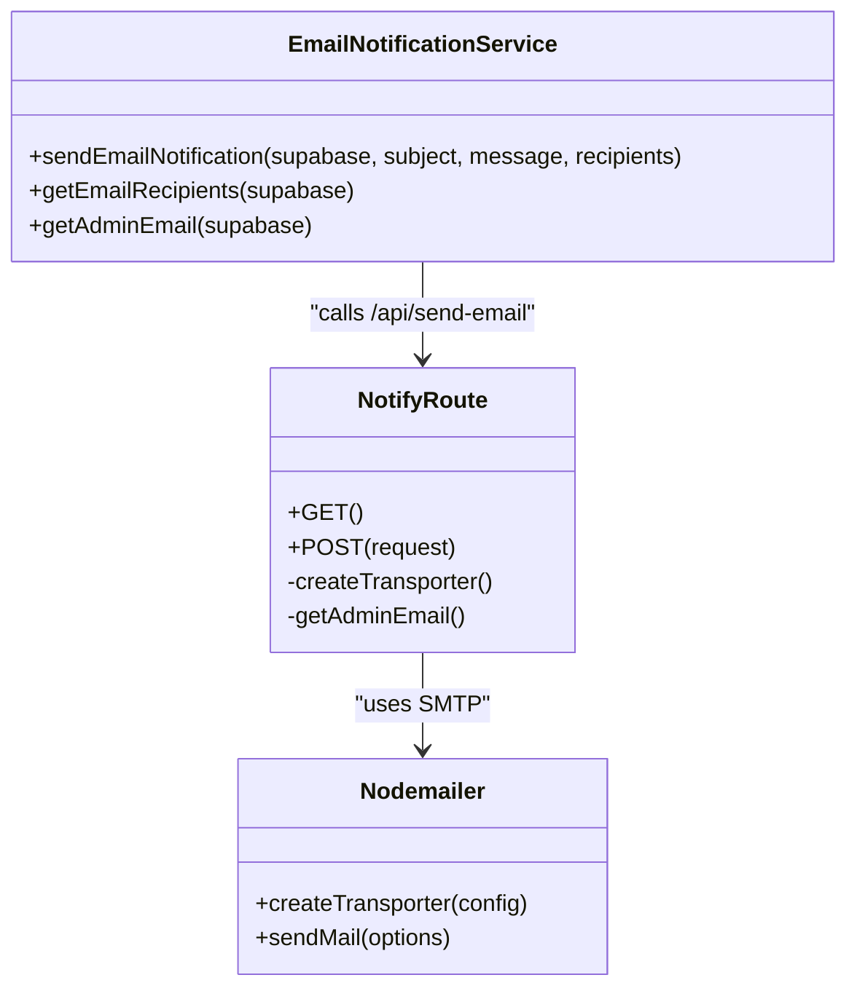
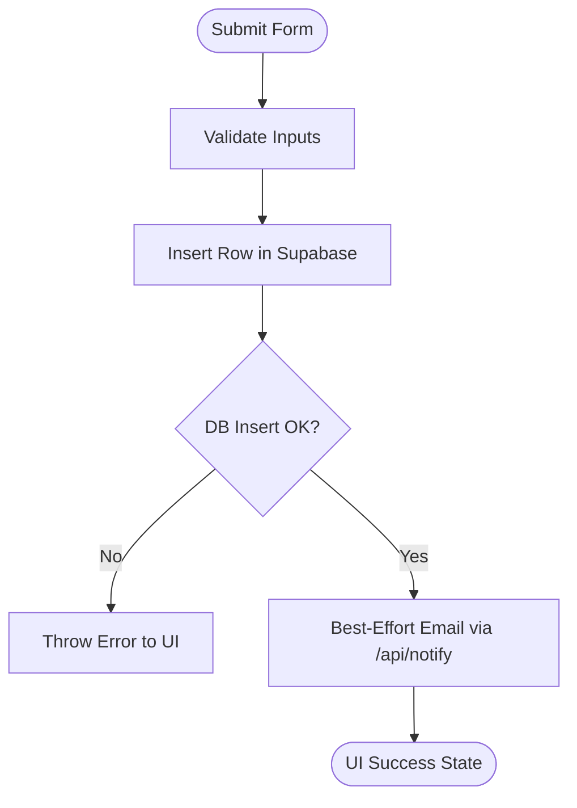
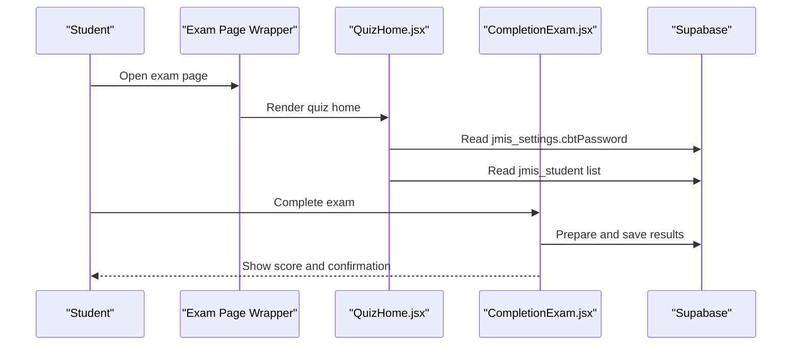
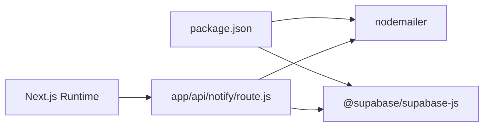
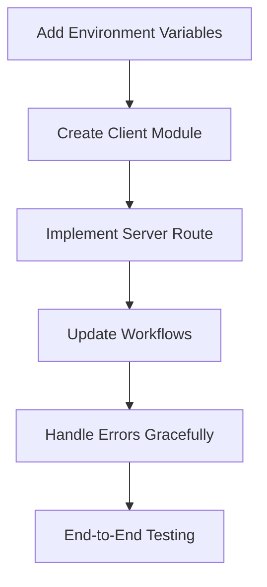

# Integration Patterns

<cite>
**Referenced Files in This Document**
- [lib/supabaseClient.js](file://lib/supabaseClient.js)
- [src/supabaseClient.js](file://src/supabaseClient.js)
- [app/api/notify/route.js](file://app/api/notify/route.js)
- [src/api/emailNotificationService.js](file://src/api/emailNotificationService.js)
- [lib/enquiry.js](file://lib/enquiry.js)
- [app/admissions/page.jsx](file://app/admissions/page.jsx)
- [app/contact/page.jsx](file://app/contact/page.jsx)
- [app/exam/page.jsx](file://app/exam/page.jsx)
- [src/pages_components/CompletionExam.jsx](file://src/pages_components/CompletionExam.jsx)
- [src/pages_components/QuizHome.jsx](file://src/pages_components/QuizHome.jsx)
- [package.json](file://package.json)
- [next.config.mjs](file://next.config.mjs)
</cite>

## Table of Contents
1. [Introduction](#introduction)
2. [Project Structure](#project-structure)
3. [Core Components](#core-components)
4. [Architecture Overview](#architecture-overview)
5. [Detailed Component Analysis](#detailed-component-analysis)
6. [Dependency Analysis](#dependency-analysis)
7. [Performance Considerations](#performance-considerations)
8. [Security and Configuration](#security-and-configuration)
9. [Troubleshooting Guide](#troubleshooting-guide)
10. [Adding New Integrations](#adding-new-integrations)
11. [Conclusion](#conclusion)

## Introduction
This document explains the external service integration patterns used by the JMI School Website, focusing on:
- Supabase client configuration for marketing data and exam data
- Email notification abstraction layer and its SMTP delivery via Nodemailer
- Environment variable configuration and API key management
- Error handling strategies for external services
- Security considerations, rate limiting, and connection pooling
- A repeatable pattern for adding new integrations

The website uses Next.js with server routes for sensitive operations (SMTP credentials), a shared Supabase project for public data, and a small set of reusable libraries that encapsulate database writes and email notifications.

## Project Structure
The integration surface is split between:
- Client-side libraries for Supabase access and form submission
- Server routes for secure email delivery
- Exam components that read and write student and settings data through Supabase
- Configuration files that expose environment variables to the runtime

**Diagram sources**
- [app/admissions/page.jsx:1-177](file://app/admissions/page.jsx#L1-L177)
- [app/contact/page.jsx:1-162](file://app/contact/page.jsx#L1-L162)
- [app/api/notify/route.js:1-115](file://app/api/notify/route.js#L1-L115)
- [lib/enquiry.js:1-129](file://lib/enquiry.js#L1-L129)
- [lib/supabaseClient.js:1-13](file://lib/supabaseClient.js#L1-L13)
- [src/supabaseClient.js:1-7](file://src/supabaseClient.js#L1-L7)
- [src/api/emailNotificationService.js:1-127](file://src/api/emailNotificationService.js#L1-L127)
- [app/exam/page.jsx:1-12](file://app/exam/page.jsx#L1-L12)
- [src/pages_components/CompletionExam.jsx:179-226](file://src/pages_components/CompletionExam.jsx#L179-L226)
- [src/pages_components/QuizHome.jsx:26-57](file://src/pages_components/QuizHome.jsx#L26-L57)

**Section sources**
- [app/admissions/page.jsx:1-177](file://app/admissions/page.jsx#L1-L177)
- [app/contact/page.jsx:1-162](file://app/contact/page.jsx#L1-L162)
- [app/api/notify/route.js:1-115](file://app/api/notify/route.js#L1-L115)
- [lib/enquiry.js:1-129](file://lib/enquiry.js#L1-L129)
- [lib/supabaseClient.js:1-13](file://lib/supabaseClient.js#L1-L13)
- [src/supabaseClient.js:1-7](file://src/supabaseClient.js#L1-L7)
- [src/api/emailNotificationService.js:1-127](file://src/api/emailNotificationService.js#L1-L127)
- [app/exam/page.jsx:1-12](file://app/exam/page.jsx#L1-L12)
- [src/pages_components/CompletionExam.jsx:179-226](file://src/pages_components/CompletionExam.jsx#L179-L226)
- [src/pages_components/QuizHome.jsx:26-57](file://src/pages_components/QuizHome.jsx#L26-L57)

## Core Components
- Supabase clients:
  - `lib/supabaseClient.js` exports a client initialized with public URL and anon key, plus a helper for public storage URLs.
  - `src/supabaseClient.js` provides another client instance used by exam features.
- Email notification abstraction:
  - `src/api/emailNotificationService.js` defines functions to fetch recipients from Supabase settings and send emails via an internal API route.
  - `app/api/notify/route.js` implements the server-only SMTP endpoint using Nodemailer and reads admin email from Supabase settings.
- Form workflows:
  - `lib/enquiry.js` stores enquiries and admissions applications in Supabase and triggers best-effort email notifications via `/api/notify`.
  - `app/admissions/page.jsx` and `app/contact/page.jsx` are user-facing forms that call these libraries.
- Exam features:
  - `app/exam/page.jsx` is a dynamic wrapper for exam pages.
  - `src/pages_components/CompletionExam.jsx` and `src/pages_components/QuizHome.jsx` interact with Supabase for student records and settings.

**Section sources**
- [lib/supabaseClient.js:1-13](file://lib/supabaseClient.js#L1-L13)
- [src/supabaseClient.js:1-7](file://src/supabaseClient.js#L1-L7)
- [src/api/emailNotificationService.js:1-127](file://src/api/emailNotificationService.js#L1-L127)
- [app/api/notify/route.js:1-115](file://app/api/notify/route.js#L1-L115)
- [lib/enquiry.js:1-129](file://lib/enquiry.js#L1-L129)
- [app/admissions/page.jsx:1-177](file://app/admissions/page.jsx#L1-L177)
- [app/contact/page.jsx:1-162](file://app/contact/page.jsx#L1-L162)
- [app/exam/page.jsx:1-12](file://app/exam/page.jsx#L1-L12)
- [src/pages_components/CompletionExam.jsx:179-226](file://src/pages_components/CompletionExam.jsx#L179-L226)
- [src/pages_components/QuizHome.jsx:26-57](file://src/pages_components/QuizHome.jsx#L26-L57)

## Architecture Overview
The system separates client-facing flows from server-only secrets:
- Client components call Supabase directly for public data and store submissions.
- Sensitive operations (SMTP credentials) run inside Next.js server routes.
- Email recipients can be configured in Supabase settings; the server route always includes the school’s admin email.

**Diagram sources**
- [app/admissions/page.jsx:42-64](file://app/admissions/page.jsx#L42-L64)
- [app/contact/page.jsx:30-50](file://app/contact/page.jsx#L30-L50)
- [lib/enquiry.js:29-69](file://lib/enquiry.js#L29-L69)
- [app/api/notify/route.js:48-113](file://app/api/notify/route.js#L48-L113)

## Detailed Component Analysis

### Supabase Client Configuration and Usage
- Public client (`lib/supabaseClient.js`):
  - Initializes with `NEXT_PUBLIC_SUPABASE_URL` and `NEXT_PUBLIC_SUPABASE_ANON_KEY`.
  - Exposes a helper for public storage URLs under a specific bucket path.
- Exam client (`src/supabaseClient.js`):
  - Also initializes with the same public environment variables.
  - Used by exam components to query student records and settings.

Usage patterns:
- Marketing and admissions data:
  - `lib/enquiry.js` inserts into `jmis_enquiries` and `jmis_admissions_applications`.
- Exam data:
  - `src/pages_components/QuizHome.jsx` reads `cbtPassword` from `jmis_settings`.
  - `src/pages_components/CompletionExam.jsx` queries `jmis_student` and prepares result data for saving.

**Diagram sources**
- [lib/supabaseClient.js:1-13](file://lib/supabaseClient.js#L1-L13)
- [src/supabaseClient.js:1-7](file://src/supabaseClient.js#L1-L7)
- [lib/enquiry.js:29-69](file://lib/enquiry.js#L29-L69)
- [src/pages_components/QuizHome.jsx:35-49](file://src/pages_components/QuizHome.jsx#L35-L49)
- [src/pages_components/CompletionExam.jsx:183-226](file://src/pages_components/CompletionExam.jsx#L183-L226)

**Section sources**
- [lib/supabaseClient.js:1-13](file://lib/supabaseClient.js#L1-L13)
- [src/supabaseClient.js:1-7](file://src/supabaseClient.js#L1-L7)
- [lib/enquiry.js:29-69](file://lib/enquiry.js#L29-L69)
- [src/pages_components/QuizHome.jsx:35-49](file://src/pages_components/QuizHome.jsx#L35-L49)
- [src/pages_components/CompletionExam.jsx:183-226](file://src/pages_components/CompletionExam.jsx#L183-L226)

### Email Notification Service Abstraction Layer
The email abstraction has two layers:
- Client-side helper (`src/api/emailNotificationService.js`):
  - Fetches recipients from `jmis_settings.adminEmail` and `additionalemails`.
  - Sends emails via an internal API call to `/api/send-email` (commented usage in this file).
- Server-side route (`app/api/notify/route.js`):
  - Implements the actual SMTP transport using Nodemailer.
  - Reads admin email from Supabase settings and deduplicates recipient lists.
  - Validates required fields and environment variables before sending.

**Diagram sources**
- [src/api/emailNotificationService.js:23-127](file://src/api/emailNotificationService.js#L23-L127)
- [app/api/notify/route.js:15-113](file://app/api/notify/route.js#L15-L113)

**Section sources**
- [src/api/emailNotificationService.js:1-127](file://src/api/emailNotificationService.js#L1-L127)
- [app/api/notify/route.js:1-115](file://app/api/notify/route.js#L1-L115)

### Form Submission and Best-Effort Email Notifications
- `lib/enquiry.js`:
  - Inserts enquiries and admissions applications into Supabase tables.
  - Triggers a fire-and-forget email notification via `/api/notify`, ensuring DB rows remain the source of truth even if email fails.
- Pages:
  - `app/contact/page.jsx` calls `submitEnquiry`.
  - `app/admissions/page.jsx` calls `submitApplication`, which internally reuses `submitEnquiry` to notify the school.

**Diagram sources**
- [lib/enquiry.js:29-69](file://lib/enquiry.js#L29-L69)
- [lib/enquiry.js:71-129](file://lib/enquiry.js#L71-L129)
- [app/contact/page.jsx:30-50](file://app/contact/page.jsx#L30-L50)
- [app/admissions/page.jsx:51-64](file://app/admissions/page.jsx#L51-L64)

**Section sources**
- [lib/enquiry.js:1-129](file://lib/enquiry.js#L1-L129)
- [app/contact/page.jsx:1-162](file://app/contact/page.jsx#L1-L162)
- [app/admissions/page.jsx:1-177](file://app/admissions/page.jsx#L1-L177)

### Exam Data Flow
- `app/exam/page.jsx` forces dynamic rendering and disables caching for exam pages.
- `src/pages_components/QuizHome.jsx` loads admin password and student data from Supabase.
- `src/pages_components/CompletionExam.jsx` prepares and saves results, then sends result emails.

**Diagram sources**
- [app/exam/page.jsx:1-12](file://app/exam/page.jsx#L1-L12)
- [src/pages_components/QuizHome.jsx:35-57](file://src/pages_components/QuizHome.jsx#L35-L57)
- [src/pages_components/CompletionExam.jsx:183-226](file://src/pages_components/CompletionExam.jsx#L183-L226)

**Section sources**
- [app/exam/page.jsx:1-12](file://app/exam/page.jsx#L1-L12)
- [src/pages_components/QuizHome.jsx:26-57](file://src/pages_components/QuizHome.jsx#L26-L57)
- [src/pages_components/CompletionExam.jsx:179-226](file://src/pages_components/CompletionExam.jsx#L179-L226)

## Dependency Analysis
External dependencies relevant to integrations:
- `@supabase/supabase-js` for database and storage access.
- `nodemailer` for SMTP delivery in the server route.
- Next.js runtime for server routes and environment variable exposure.

**Diagram sources**
- [package.json:11-21](file://package.json#L11-L21)
- [app/api/notify/route.js:1-3](file://app/api/notify/route.js#L1-L3)

**Section sources**
- [package.json:11-21](file://package.json#L11-L21)
- [app/api/notify/route.js:1-3](file://app/api/notify/route.js#L1-L3)

## Performance Considerations
- Connection pooling:
  - The Supabase JS client manages connections efficiently; avoid creating multiple clients per request.
  - Reuse the exported `supabase` instances from `lib/supabaseClient.js` and `src/supabaseClient.js`.
- Rate limiting:
  - No explicit rate limiting is implemented around Supabase or SMTP calls.
  - Consider adding middleware or server-side throttling for high-volume endpoints like `/api/notify`.
- Caching:
  - Exam pages disable static generation and force no-store behavior to ensure fresh data.
  - For marketing data, consider enabling cache where appropriate to reduce load.
- Email reliability:
  - Email notifications are best-effort; failures do not block form submissions.
  - Add retry logic or queueing (e.g., background jobs) for critical notifications.

[No sources needed since this section provides general guidance]

## Security and Configuration
Environment variables:
- `NEXT_PUBLIC_SUPABASE_URL` and `NEXT_PUBLIC_SUPABASE_ANON_KEY` are exposed to the browser via Next.js config and used by both Supabase clients.
- `GMAIL_USER` and `GMAIL_APP_PASSWORD` are used only in the server route for SMTP authentication.

API key management:
- Only the public anon key is exposed to the client; never embed secret keys in client code.
- Admin email and additional recipients are stored in Supabase settings and fetched at runtime.

Error handling strategies:
- Supabase errors during DB inserts throw user-facing errors to prevent partial state.
- Email failures are logged and returned as non-blocking responses; the server route returns structured error objects.

Security considerations:
- Keep SMTP credentials server-only.
- Validate and sanitize inputs before inserting into the database.
- Restrict Supabase RLS policies to protect sensitive tables.
- Monitor and log failed email attempts for operational visibility.

**Section sources**
- [lib/supabaseClient.js:4-7](file://lib/supabaseClient.js#L4-L7)
- [src/supabaseClient.js:4-7](file://src/supabaseClient.js#L4-L7)
- [app/api/notify/route.js:15-25](file://app/api/notify/route.js#L15-L25)
- [app/api/notify/route.js:59-68](file://app/api/notify/route.js#L59-L68)
- [lib/enquiry.js:52-56](file://lib/enquiry.js#L52-L56)

## Troubleshooting Guide
Common issues and resolutions:
- Missing SMTP credentials:
  - Ensure `GMAIL_USER` and `GMAIL_APP_PASSWORD` are set in the server environment.
  - The server route returns a clear error when credentials are missing.
- No email recipients configured:
  - Verify `jmis_settings.adminEmail` exists; the server route always adds it to the recipient list.
  - Additional recipients can be provided via the `recipients` field.
- Supabase connection errors:
  - Confirm `NEXT_PUBLIC_SUPABASE_URL` and `NEXT_PUBLIC_SUPABASE_ANON_KEY` are correct.
  - Check network connectivity and Supabase project status.
- Exam data not loading:
  - Ensure `jmis_settings.cbtPassword` and `jmis_student` records exist.
  - Inspect console logs for Supabase errors in exam components.

**Section sources**
- [app/api/notify/route.js:59-68](file://app/api/notify/route.js#L59-L68)
- [app/api/notify/route.js:70-94](file://app/api/notify/route.js#L70-L94)
- [lib/supabaseClient.js:4-7](file://lib/supabaseClient.js#L4-L7)
- [src/pages_components/QuizHome.jsx:35-49](file://src/pages_components/QuizHome.jsx#L35-L49)

## Adding New Integrations
Follow these steps to add a new external service integration while maintaining established patterns:

1. Define environment variables:
   - Add any new secrets to your deployment environment.
   - If exposing public keys, add them to `next.config.mjs` under `env`.

2. Create a client module:
   - For Supabase-like services, create a dedicated client module similar to `lib/supabaseClient.js`.
   - Export a single instance to reuse across the app.

3. Implement server-only logic:
   - Place sensitive operations in a Next.js server route under `app/api/`.
   - Validate inputs and return structured error responses.

4. Integrate with existing workflows:
   - Update libraries like `lib/enquiry.js` to include new data writes or notifications.
   - Ensure UI components call the updated libraries without blocking on non-critical operations.

5. Handle errors gracefully:
   - Log errors and provide user-friendly messages.
   - Use best-effort patterns for non-critical integrations like email.

6. Test end-to-end:
   - Verify environment variables are loaded correctly.
   - Test DB writes, email delivery, and error paths.

**Diagram sources**
- [next.config.mjs:5-6](file://next.config.mjs#L5-L6)
- [lib/supabaseClient.js:1-13](file://lib/supabaseClient.js#L1-L13)
- [app/api/notify/route.js:1-115](file://app/api/notify/route.js#L1-L115)
- [lib/enquiry.js:1-129](file://lib/enquiry.js#L1-L129)

**Section sources**
- [next.config.mjs:5-6](file://next.config.mjs#L5-L6)
- [lib/supabaseClient.js:1-13](file://lib/supabaseClient.js#L1-L13)
- [app/api/notify/route.js:1-115](file://app/api/notify/route.js#L1-L115)
- [lib/enquiry.js:1-129](file://lib/enquiry.js#L1-L129)

## Conclusion
The JMI School Website follows a clear separation of concerns for external integrations:
- Supabase clients handle public data access for marketing and exam features.
- Email notifications are abstracted behind a server-only SMTP route, ensuring secrets stay protected.
- Form submissions prioritize data persistence and treat email delivery as best-effort.
- Environment variables and structured error handling support reliable operation.
- The documented patterns make it straightforward to add new integrations securely and consistently.

[No sources needed since this section summarizes without analyzing specific files]