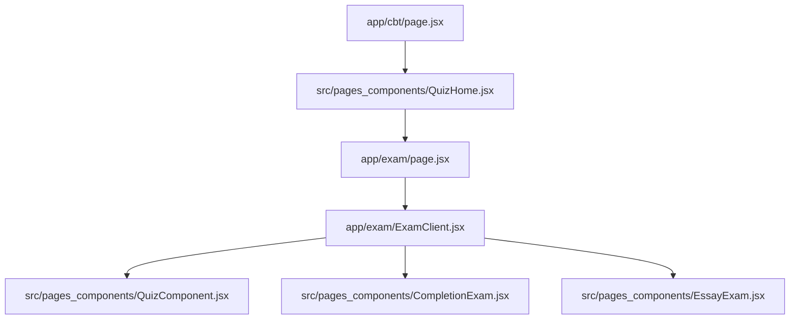
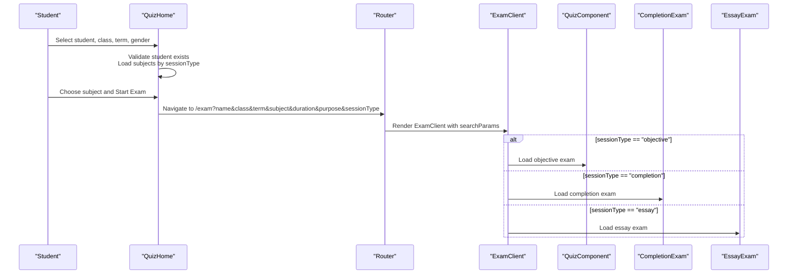
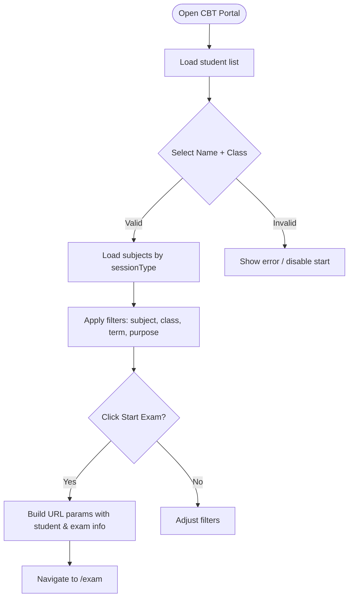
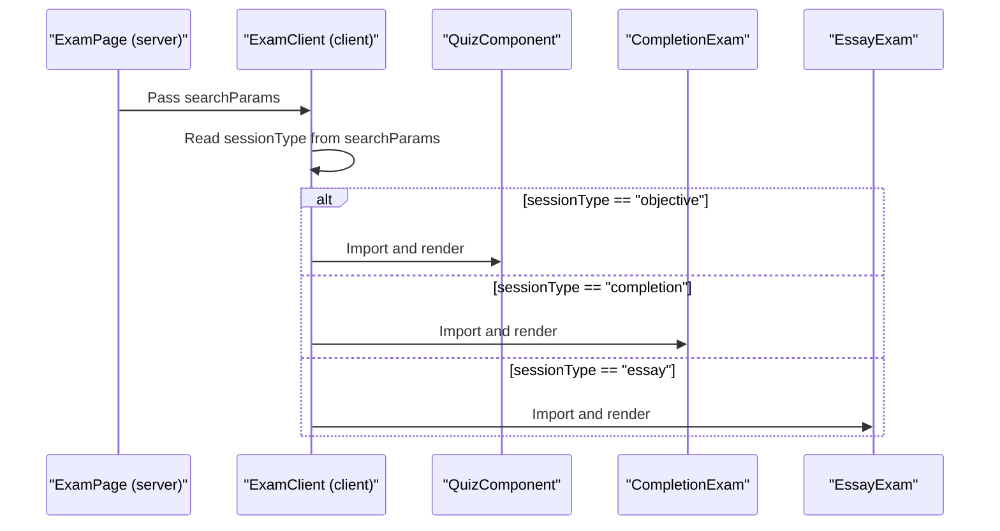
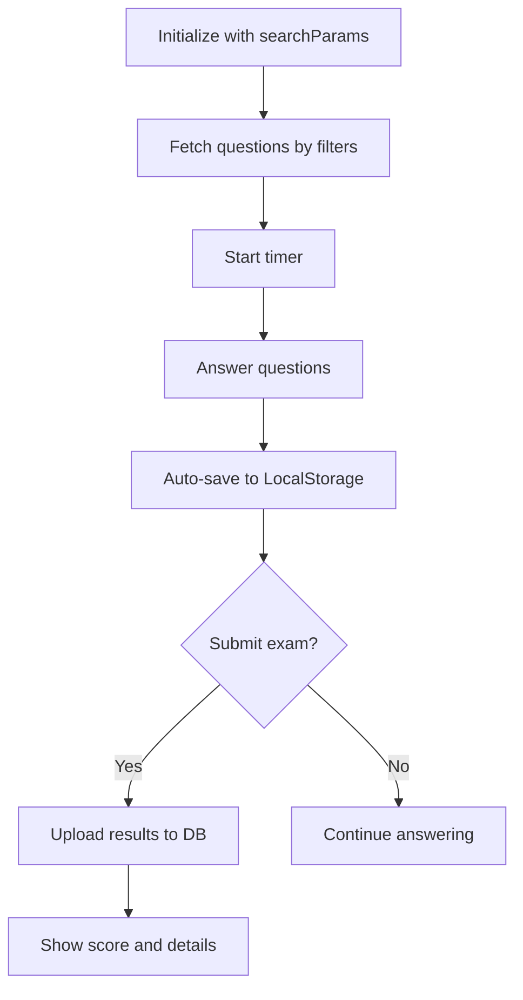
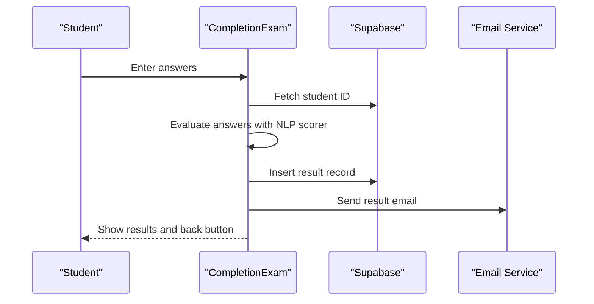
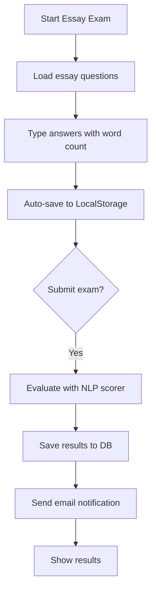
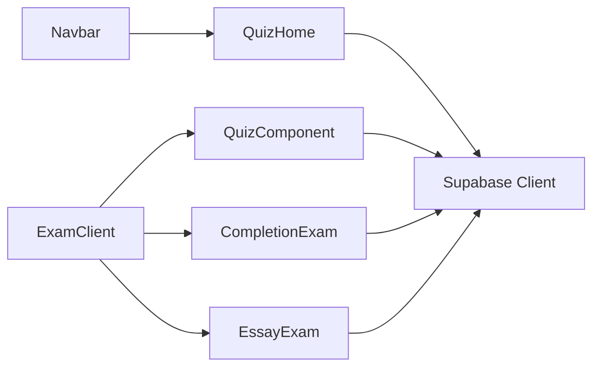

# CBT Portal Entry and Student Authentication

<cite>
**Referenced Files in This Document**
- [app/cbt/page.jsx](file://app/cbt/page.jsx)
- [src/pages_components/QuizHome.jsx](file://src/pages_components/QuizHome.jsx)
- [app/exam/page.jsx](file://app/exam/page.jsx)
- [app/exam/ExamClient.jsx](file://app/exam/ExamClient.jsx)
- [src/pages_components/QuizComponent.jsx](file://src/pages_components/QuizComponent.jsx)
- [src/pages_components/CompletionExam.jsx](file://src/pages_components/CompletionExam.jsx)
- [src/pages_components/EssayExam.jsx](file://src/pages_components/EssayExam.jsx)
- [src/supabaseClient.js](file://src/supabaseClient.js)
- [lib/supabaseClient.js](file://lib/supabaseClient.js)
- [components/Navbar.jsx](file://components/Navbar.jsx)
</cite>

## Table of Contents
1. [Introduction](#introduction)
2. [Project Structure](#project-structure)
3. [Core Components](#core-components)
4. [Architecture Overview](#architecture-overview)
5. [Detailed Component Analysis](#detailed-component-analysis)
6. [Dependency Analysis](#dependency-analysis)
7. [Performance Considerations](#performance-considerations)
8. [Troubleshooting Guide](#troubleshooting-guide)
9. [Conclusion](#conclusion)
10. [Appendices](#appendices)

## Introduction
This document explains how students access the Computer-Based Testing (CBT) portal, authenticate via student identity selection, choose subjects, and take different exam types (objective, completion, essay). It covers the QuizHome component architecture, subject selection interface, student data management, authentication flow, session management, routing to exam interfaces, configuration of subjects, and security considerations for protecting student data and exam integrity.

## Project Structure
The CBT entry point is a Next.js App Router page that renders the QuizHome component. From there, students select their profile and a subject, then navigate to an exam route that dynamically loads the appropriate exam component based on session type.

**Diagram sources**
- [app/cbt/page.jsx:1-11](file://app/cbt/page.jsx#L1-L11)
- [src/pages_components/QuizHome.jsx:1-508](file://src/pages_components/QuizHome.jsx#L1-L508)
- [app/exam/page.jsx:1-12](file://app/exam/page.jsx#L1-L12)
- [app/exam/ExamClient.jsx:1-46](file://app/exam/ExamClient.jsx#L1-L46)
- [src/pages_components/QuizComponent.jsx:1-800](file://src/pages_components/QuizComponent.jsx#L1-L800)
- [src/pages_components/CompletionExam.jsx:1-472](file://src/pages_components/CompletionExam.jsx#L1-L472)
- [src/pages_components/EssayExam.jsx:1-418](file://src/pages_components/EssayExam.jsx#L1-L418)

**Section sources**
- [app/cbt/page.jsx:1-11](file://app/cbt/page.jsx#L1-L11)
- [src/pages_components/QuizHome.jsx:1-508](file://src/pages_components/QuizHome.jsx#L1-L508)
- [app/exam/page.jsx:1-12](file://app/exam/page.jsx#L1-L12)
- [app/exam/ExamClient.jsx:1-46](file://app/exam/ExamClient.jsx#L1-L46)

## Core Components
- CBT entry page: Renders the student-facing quiz home screen.
- QuizHome: Manages student identity selection, subject listing, filters, and navigation to exams.
- Exam router: Dynamically selects objective, completion, or essay exam components based on URL parameters.
- Exam components: Implement timed sessions, answer capture, auto-save, submission, result storage, and email notifications.

Key responsibilities:
- Student identity validation against the student database.
- Subject discovery from question tables filtered by class, term, purpose, and session type.
- Routing with search parameters to preserve context across pages.
- Session locking and admin password verification for exam integrity.
- LocalStorage-based progress persistence and network-aware saving.

**Section sources**
- [app/cbt/page.jsx:1-11](file://app/cbt/page.jsx#L1-L11)
- [src/pages_components/QuizHome.jsx:1-508](file://src/pages_components/QuizHome.jsx#L1-L508)
- [app/exam/ExamClient.jsx:1-46](file://app/exam/ExamClient.jsx#L1-L46)
- [src/pages_components/QuizComponent.jsx:1-800](file://src/pages_components/QuizComponent.jsx#L1-L800)
- [src/pages_components/CompletionExam.jsx:1-472](file://src/pages_components/CompletionExam.jsx#L1-L472)
- [src/pages_components/EssayExam.jsx:1-418](file://src/pages_components/EssayExam.jsx#L1-L418)

## Architecture Overview
The CBT portal uses a client-side workflow:
1. Students enter via /cbt and are presented with QuizHome.
2. They select name, class, term, and gender; the system validates existence in the student table and optionally shows a passport image.
3. Subjects are loaded from question tables based on session type and filters.
4. Starting an exam navigates to /exam with query parameters carrying student context and exam metadata.
5. The exam router chooses the correct exam component and initializes the session.

**Diagram sources**
- [src/pages_components/QuizHome.jsx:151-176](file://src/pages_components/QuizHome.jsx#L151-L176)
- [app/exam/page.jsx:1-12](file://app/exam/page.jsx#L1-L12)
- [app/exam/ExamClient.jsx:22-45](file://app/exam/ExamClient.jsx#L22-L45)

## Detailed Component Analysis

### CBT Entry Page
- Purpose: Public entry point for students to access the CBT portal.
- Behavior: Renders QuizHome without additional logic.

**Section sources**
- [app/cbt/page.jsx:1-11](file://app/cbt/page.jsx#L1-L11)

### QuizHome: Student Identity and Subject Selection
- Student identity:
  - Loads student options (name, class, passport) from the student table.
  - Validates selection by checking if the chosen name/class pair exists.
  - Optionally fetches and displays a passport image for confirmation.
- Subject listing:
  - Fetches subjects from question tables depending on session type:
    - Objective: questions table
    - Completion: completion questions table
    - Essay: essay questions table
  - Normalizes fields such as duration, purpose, term, and timestamps.
- Filters:
  - Filter by subject name, class, term, and purpose (including mapping “midterm” and “test”).
  - Archive toggle shows older exams based on updated_at timestamp.
- Navigation:
  - On “Start Exam”, constructs URL search parameters including name, class, term, gender, subject, duration, purpose, and sessionType, then navigates to /exam.

**Diagram sources**
- [src/pages_components/QuizHome.jsx:51-136](file://src/pages_components/QuizHome.jsx#L51-L136)
- [src/pages_components/QuizHome.jsx:151-176](file://src/pages_components/QuizHome.jsx#L151-L176)
- [src/pages_components/QuizHome.jsx:196-226](file://src/pages_components/QuizHome.jsx#L196-L226)

**Section sources**
- [src/pages_components/QuizHome.jsx:1-508](file://src/pages_components/QuizHome.jsx#L1-L508)

### Exam Router: Dynamic Component Loading
- Server wrapper disables static generation and passes searchParams to the client component.
- Client component reads sessionType from URL and dynamically imports the corresponding exam component to avoid SSR issues.
- Routes:
  - objective -> QuizComponent
  - completion -> CompletionExam
  - essay -> EssayExam

**Diagram sources**
- [app/exam/page.jsx:1-12](file://app/exam/page.jsx#L1-L12)
- [app/exam/ExamClient.jsx:1-46](file://app/exam/ExamClient.jsx#L1-L46)

**Section sources**
- [app/exam/page.jsx:1-12](file://app/exam/page.jsx#L1-L12)
- [app/exam/ExamClient.jsx:1-46](file://app/exam/ExamClient.jsx#L1-L46)

### Objective Exam: QuizComponent
- Data loading:
  - Reads searchParams for student and exam context.
  - Queries the objective questions table with filters for subject, class, purpose, and term.
- Session management:
  - Timer countdown based on duration.
  - Lock screen requiring admin password before starting; prevents tab switching visibility changes.
  - Beforeunload guard prompts for admin password to prevent accidental exit.
- Answer handling:
  - Tracks answers per question and recalculates score incrementally.
  - Auto-saves progress to LocalStorage with resume capability.
- Submission:
  - Marks exam complete locally, uploads results, and shows score.
  - Provides detailed results review and printable output.

**Diagram sources**
- [src/pages_components/QuizComponent.jsx:59-143](file://src/pages_components/QuizComponent.jsx#L59-L143)
- [src/pages_components/QuizComponent.jsx:194-225](file://src/pages_components/QuizComponent.jsx#L194-L225)
- [src/pages_components/QuizComponent.jsx:261-339](file://src/pages_components/QuizComponent.jsx#L261-L339)
- [src/pages_components/QuizComponent.jsx:353-383](file://src/pages_components/QuizComponent.jsx#L353-L383)

**Section sources**
- [src/pages_components/QuizComponent.jsx:1-800](file://src/pages_components/QuizComponent.jsx#L1-L800)

### Completion Exam: CompletionExam
- Data loading:
  - Reads searchParams and queries completion questions table by subject and class.
- Scoring:
  - Uses NLP scoring utility to evaluate free-text answers against expected answers.
- Session management:
  - Locked until admin password is entered.
  - Timer auto-submits when time expires.
- Submission:
  - Prepares result data by fetching student ID, saves to results table, sends email notification, and clears local progress.

**Diagram sources**
- [src/pages_components/CompletionExam.jsx:45-72](file://src/pages_components/CompletionExam.jsx#L45-L72)
- [src/pages_components/CompletionExam.jsx:149-204](file://src/pages_components/CompletionExam.jsx#L149-L204)
- [src/pages_components/CompletionExam.jsx:206-309](file://src/pages_components/CompletionExam.jsx#L206-L309)

**Section sources**
- [src/pages_components/CompletionExam.jsx:1-472](file://src/pages_components/CompletionExam.jsx#L1-L472)

### Essay Exam: EssayExam
- Data loading:
  - Reads searchParams and queries essay questions table by subject and class.
- Scoring:
  - Uses NLP scoring utility to assess essays with keyword matching and word count constraints.
- Session management:
  - Locked until admin password is provided.
  - Timer auto-submits when time expires.
- Submission:
  - Prepares result data, saves to results table, sends email notification, and clears local progress.

**Diagram sources**
- [src/pages_components/EssayExam.jsx:43-65](file://src/pages_components/EssayExam.jsx#L43-L65)
- [src/pages_components/EssayExam.jsx:134-190](file://src/pages_components/EssayExam.jsx#L134-L190)
- [src/pages_components/EssayExam.jsx:192-282](file://src/pages_components/EssayExam.jsx#L192-L282)

**Section sources**
- [src/pages_components/EssayExam.jsx:1-418](file://src/pages_components/EssayExam.jsx#L1-L418)

## Dependency Analysis
- Supabase client:
  - Both frontend modules and library utilities use environment variables to initialize the Supabase client.
  - Public anon key usage ensures read-only or permitted operations on public tables.
- Routing dependencies:
  - Next.js navigation and dynamic imports enable efficient loading of exam components.
- External services:
  - Email notifications are sent after result submission using a shared service.

**Diagram sources**
- [src/supabaseClient.js:1-7](file://src/supabaseClient.js#L1-L7)
- [lib/supabaseClient.js:1-13](file://lib/supabaseClient.js#L1-L13)
- [components/Navbar.jsx:26-49](file://components/Navbar.jsx#L26-L49)
- [src/pages_components/QuizHome.jsx:1-508](file://src/pages_components/QuizHome.jsx#L1-L508)
- [app/exam/ExamClient.jsx:1-46](file://app/exam/ExamClient.jsx#L1-L46)

**Section sources**
- [src/supabaseClient.js:1-7](file://src/supabaseClient.js#L1-L7)
- [lib/supabaseClient.js:1-13](file://lib/supabaseClient.js#L1-L13)
- [components/Navbar.jsx:26-49](file://components/Navbar.jsx#L26-L49)

## Performance Considerations
- Dynamic imports reduce initial bundle size by loading exam components only when needed.
- LocalStorage auto-save minimizes server load and improves resilience during network interruptions.
- Network quality checks help detect connectivity issues and adjust behavior accordingly.
- Filtering subjects on the client reduces unnecessary re-renders and keeps UI responsive.

[No sources needed since this section provides general guidance]

## Troubleshooting Guide
Common issues and resolutions:
- No questions found:
  - Verify subject, class, purpose, and term filters match available records in the database.
  - Check console logs for query parameters and database matches.
- Admin password errors:
  - Ensure the settings table contains the correct password and that the client can fetch it.
- Results not saved:
  - Confirm student ID lookup succeeds and that the results table insert operation completes.
  - Check email notification service for failures post-submission.
- Auto-save not working:
  - Inspect LocalStorage keys and ensure they follow expected naming patterns.
  - Validate that the exam ID includes student name, subject, and class.

**Section sources**
- [src/pages_components/QuizComponent.jsx:59-143](file://src/pages_components/QuizComponent.jsx#L59-L143)
- [src/pages_components/QuizComponent.jsx:194-225](file://src/pages_components/QuizComponent.jsx#L194-L225)
- [src/pages_components/CompletionExam.jsx:149-204](file://src/pages_components/CompletionExam.jsx#L149-L204)
- [src/pages_components/EssayExam.jsx:134-190](file://src/pages_components/EssayExam.jsx#L134-L190)

## Conclusion
The CBT portal provides a streamlined experience for students to authenticate via student identity selection, choose subjects, and take multiple exam types with robust session management. The architecture separates concerns between entry, routing, and exam execution, while leveraging Supabase for data and email notifications for result dissemination. Security measures include admin password protection, lock screens, and careful handling of student data through controlled queries and anonymized anon-key access.

[No sources needed since this section summarizes without analyzing specific files]

## Appendices

### Configuring Subjects
- Create or update records in the relevant question tables:
  - Objective: questions table
  - Completion: completion questions table
  - Essay: essay questions table
- Include fields such as subject, class, duration, purpose, term, and questions array.
- Use filters in QuizHome to display subjects appropriately.

**Section sources**
- [src/pages_components/QuizHome.jsx:107-136](file://src/pages_components/QuizHome.jsx#L107-L136)
- [src/pages_components/QuizHome.jsx:196-226](file://src/pages_components/QuizHome.jsx#L196-L226)

### Managing Student Sessions
- Student identity is validated against the student table before allowing exam start.
- Session state includes timer, answers, current question index, and local save status.
- Admin password protects exam start and prevents unintended exits.

**Section sources**
- [src/pages_components/QuizHome.jsx:51-105](file://src/pages_components/QuizHome.jsx#L51-L105)
- [src/pages_components/QuizComponent.jsx:194-225](file://src/pages_components/QuizComponent.jsx#L194-L225)
- [src/pages_components/CompletionExam.jsx:311-353](file://src/pages_components/CompletionExam.jsx#L311-L353)
- [src/pages_components/EssayExam.jsx:284-311](file://src/pages_components/EssayExam.jsx#L284-L311)

### Handling Navigation Between Exam Interfaces
- Use URL search parameters to pass context across routes.
- The exam router dynamically loads the correct component based on sessionType.
- After submission, components provide navigation back to the CBT home or results view.

**Section sources**
- [src/pages_components/QuizHome.jsx:151-176](file://src/pages_components/QuizHome.jsx#L151-L176)
- [app/exam/ExamClient.jsx:22-45](file://app/exam/ExamClient.jsx#L22-L45)
- [src/pages_components/CompletionExam.jsx:461-463](file://src/pages_components/CompletionExam.jsx#L461-L463)
- [src/pages_components/EssayExam.jsx:407-409](file://src/pages_components/EssayExam.jsx#L407-L409)

### Security Considerations
- Use Supabase anon key for public access; restrict sensitive operations to server-side or admin contexts.
- Enforce admin password for exam start and prevent tab switching to maintain exam integrity.
- Avoid storing sensitive data in LocalStorage beyond necessary progress information.
- Validate all inputs and filter queries to prevent injection or unauthorized data access.
- Secure email notifications by validating recipients and sanitizing message content.

**Section sources**
- [src/supabaseClient.js:1-7](file://src/supabaseClient.js#L1-L7)
- [lib/supabaseClient.js:1-13](file://lib/supabaseClient.js#L1-L13)
- [src/pages_components/QuizComponent.jsx:194-225](file://src/pages_components/QuizComponent.jsx#L194-L225)
- [src/pages_components/CompletionExam.jsx:257-309](file://src/pages_components/CompletionExam.jsx#L257-L309)
- [src/pages_components/EssayExam.jsx:231-282](file://src/pages_components/EssayExam.jsx#L231-L282)