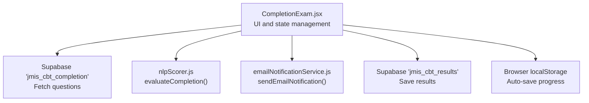
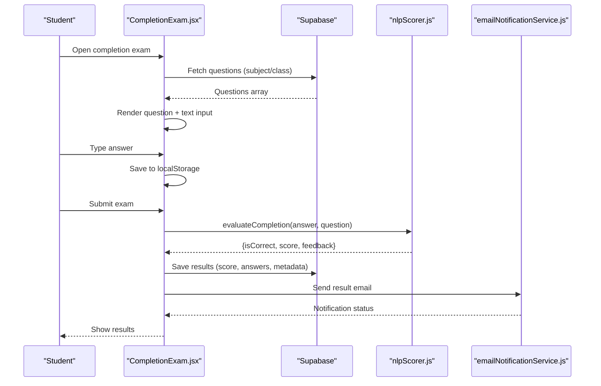
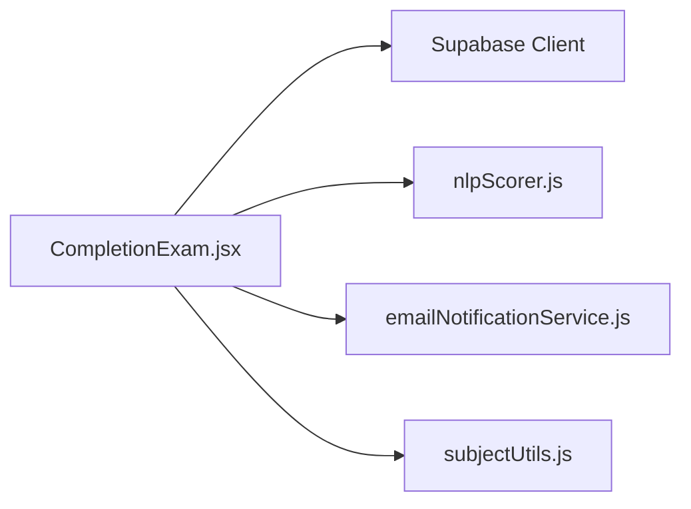
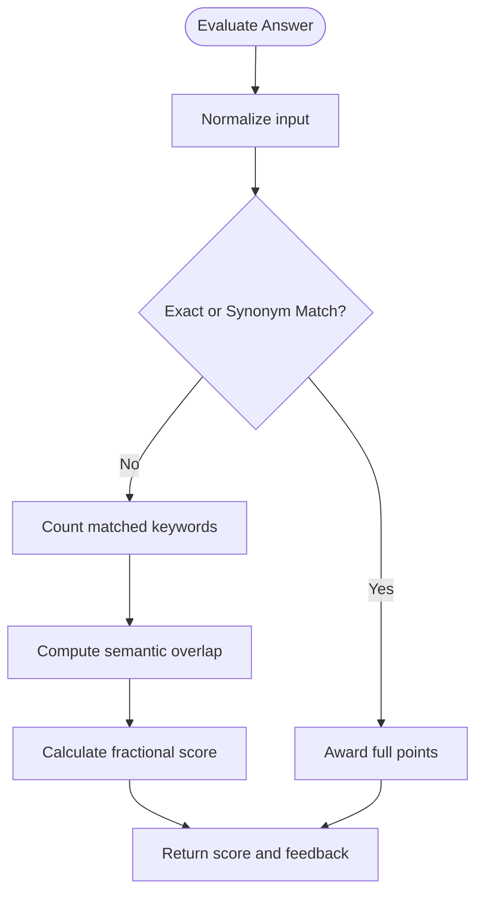

# Completion Fill-in-the-Blank Exams

<cite>
**Referenced Files in This Document**
- [CompletionExam.jsx](file://src/pages_components/CompletionExam.jsx)
- [nlpScorer.js](file://src/utils/nlpScorer.js)
- [subjectUtils.js](file://src/utils/subjectUtils.js)
- [emailNotificationService.js](file://src/api/emailNotificationService.js)
</cite>

## Table of Contents
1. [Introduction](#introduction)
2. [Project Structure](#project-structure)
3. [Core Components](#core-components)
4. [Architecture Overview](#architecture-overview)
5. [Detailed Component Analysis](#detailed-component-analysis)
6. [Dependency Analysis](#dependency-analysis)
7. [Performance Considerations](#performance-considerations)
8. [Troubleshooting Guide](#troubleshooting-guide)
9. [Conclusion](#conclusion)
10. [Appendices](#appendices)

## Introduction
This document explains the completion exam type that handles fill-in-the-blank questions. It covers how the CompletionExam component renders blank fields, captures and validates student answers, scores responses using NLP-based matching, supports manual grading via expected answers and synonyms, and persists results with email notifications. It also documents configuration options for answer tolerance and partial credit strategies.

## Project Structure
The completion exam is implemented as a client-side React component that:
- Loads questions from a dedicated database table
- Renders one question at a time with a text input for answers
- Evaluates answers using an NLP scorer
- Saves progress locally and uploads final results to the database
- Sends result notifications via email

**Diagram sources**
- [CompletionExam.jsx:45-72](file://src/pages_components/CompletionExam.jsx#L45-L72)
- [CompletionExam.jsx:149-181](file://src/pages_components/CompletionExam.jsx#L149-L181)
- [CompletionExam.jsx:183-255](file://src/pages_components/CompletionExam.jsx#L183-L255)
- [CompletionExam.jsx:257-309](file://src/pages_components/CompletionExam.jsx#L257-L309)
- [nlpScorer.js:9-58](file://src/utils/nlpScorer.js#L9-L58)
- [emailNotificationService.js:70-121](file://src/api/emailNotificationService.js#L70-L121)

**Section sources**
- [CompletionExam.jsx:1-472](file://src/pages_components/CompletionExam.jsx#L1-L472)
- [nlpScorer.js:1-181](file://src/utils/nlpScorer.js#L1-L181)
- [emailNotificationService.js:1-127](file://src/api/emailNotificationService.js#L1-L127)

## Core Components
- CompletionExam component: orchestrates fetching questions, rendering inputs, handling navigation, timer, submission, scoring, persistence, and notifications.
- NLP scorer: evaluates free-text answers against expected answers, acceptable synonyms, required keywords, and performs semantic matching using Compromise.
- Subject utilities: provide subject lists and normalization helpers used across the app (including completion exams).
- Email notification service: sends structured result emails to configured recipients.

Key responsibilities:
- Data loading: queries the completion-specific table for questions based on subject and class.
- Answer capture: stores user inputs keyed by question index.
- Scoring: uses evaluateCompletion to determine correctness and feedback.
- Persistence: auto-saves to localStorage; marks complete on submit; uploads to database.
- Notifications: composes and sends result emails.

**Section sources**
- [CompletionExam.jsx:45-72](file://src/pages_components/CompletionExam.jsx#L45-L72)
- [CompletionExam.jsx:100-147](file://src/pages_components/CompletionExam.jsx#L100-L147)
- [CompletionExam.jsx:149-181](file://src/pages_components/CompletionExam.jsx#L149-L181)
- [CompletionExam.jsx:183-255](file://src/pages_components/CompletionExam.jsx#L183-L255)
- [CompletionExam.jsx:257-309](file://src/pages_components/CompletionExam.jsx#L257-L309)
- [nlpScorer.js:9-58](file://src/utils/nlpScorer.js#L9-L58)
- [subjectUtils.js:190-392](file://src/utils/subjectUtils.js#L190-L392)
- [emailNotificationService.js:70-121](file://src/api/emailNotificationService.js#L70-L121)

## Architecture Overview
The completion exam follows a clear flow:
1. Load questions from Supabase into local state.
2. Render each question with a text input field.
3. Capture answers and persist them to localStorage.
4. On submit, evaluate all answers using NLP scoring.
5. Persist results to the database and send email notifications.

**Diagram sources**
- [CompletionExam.jsx:45-72](file://src/pages_components/CompletionExam.jsx#L45-L72)
- [CompletionExam.jsx:149-181](file://src/pages_components/CompletionExam.jsx#L149-L181)
- [CompletionExam.jsx:183-255](file://src/pages_components/CompletionExam.jsx#L183-L255)
- [CompletionExam.jsx:257-309](file://src/pages_components/CompletionExam.jsx#L257-L309)
- [nlpScorer.js:9-58](file://src/utils/nlpScorer.js#L9-L58)
- [emailNotificationService.js:70-121](file://src/api/emailNotificationService.js#L70-L121)

## Detailed Component Analysis

### CompletionExam Component Structure
- State variables include questions, currentQuestion, showScore, score, timeLeft, answers, isSubmitted, examResults, adminPassword, isLocked, passwordInput, and auto-save indicators.
- URL parameters supply student identity, class, term, subject, duration, and purpose.
- The component fetches questions from the completion-specific table and attempts to restore prior progress from localStorage.
- A countdown timer automatically submits when time expires.
- Navigation buttons allow moving between questions; a grid shows answered vs unanswered questions.
- Results display includes total score, correct/incorrect counts, percentage, and per-question breakdown with feedback.

Rendering blanks:
- Each question displays its text and a single-line text input where students type their fill-in-the-blank answer.
- The input value is bound to the answers object keyed by the current question index.

Validation and scoring:
- On submit, the component maps over all questions and calls evaluateCompletion for each answer.
- Scores are summed to produce the total score.
- Per-question details (studentAnswer, isCorrect, score, feedback, expectedAnswers) are stored for review.

Persistence:
- Auto-save writes exam data (answers, currentQuestion, timeLeft, timestamp, isComplete flag) to localStorage.
- On submit, the exam is marked complete in localStorage.
- Final results are uploaded to the database including subject, term, purpose, sessionType, answers, and examResults.

Notifications:
- After successful upload, a detailed email is composed and sent to configured recipients.

Manual grading support:
- Expected answers are included in the question payload and displayed in results for incorrect answers.
- Acceptable synonyms and required keywords enable flexible matching without manual intervention.

Error handling:
- Network or DB errors during question fetch and result upload are caught and surfaced via toast messages.
- LocalStorage operations are wrapped in try/catch to avoid crashes.

**Section sources**
- [CompletionExam.jsx:16-43](file://src/pages_components/CompletionExam.jsx#L16-L43)
- [CompletionExam.jsx:45-72](file://src/pages_components/CompletionExam.jsx#L45-L72)
- [CompletionExam.jsx:74-98](file://src/pages_components/CompletionExam.jsx#L74-L98)
- [CompletionExam.jsx:100-147](file://src/pages_components/CompletionExam.jsx#L100-L147)
- [CompletionExam.jsx:149-181](file://src/pages_components/CompletionExam.jsx#L149-L181)
- [CompletionExam.jsx:183-255](file://src/pages_components/CompletionExam.jsx#L183-L255)
- [CompletionExam.jsx:257-309](file://src/pages_components/CompletionExam.jsx#L257-L309)
- [CompletionExam.jsx:336-468](file://src/pages_components/CompletionExam.jsx#L336-L468)

### Input Validation Mechanisms
- Empty answers are treated as incorrect with zero points and a “No answer provided” feedback.
- Case-insensitive exact matching is performed against expected answers and acceptable synonyms.
- Required keywords must all be present to pass keyword-based checks.
- Semantic similarity uses Compromise to compare nouns between student answer and expected answers.

Note: There is no explicit minimum word count enforcement for completion questions in this implementation.

**Section sources**
- [nlpScorer.js:9-58](file://src/utils/nlpScorer.js#L9-L58)

### Answer Matching Algorithms
The evaluation pipeline prioritizes:
1. Exact match with expected answers.
2. Exact match with acceptable synonyms.
3. Semantic noun overlap between student answer and expected answers.
4. Presence of all required keywords.

If none of these conditions are met, the answer is marked incorrect with zero points.

Complexity considerations:
- For each question, the algorithm iterates through expected answers and compares normalized strings and tokenized nouns.
- Time complexity is roughly O(Q × E × K), where Q is number of questions, E is number of expected answers per question, and K is average token length for noun comparisons.

**Section sources**
- [nlpScorer.js:9-58](file://src/utils/nlpScorer.js#L9-L58)

### Manual Grading Support
- Expected answers are part of the question payload and shown in results for incorrect answers.
- Acceptable synonyms allow alternative correct phrasing without manual regrading.
- Required keywords ensure essential terms are present.
- Feedback messages indicate why an answer was accepted or rejected.

To manually adjust outcomes:
- Update expectedAnswers and acceptableSynonyms in the database for the relevant question.
- Re-run the exam or use administrative tools to recalculate scores if needed.

**Section sources**
- [CompletionExam.jsx:149-181](file://src/pages_components/CompletionExam.jsx#L149-L181)
- [CompletionExam.jsx:449-458](file://src/pages_components/CompletionExam.jsx#L449-L458)
- [nlpScorer.js:9-58](file://src/utils/nlpScorer.js#L9-L58)

### Scoring Methodology
- Each question contributes its points (defaulting to 1 if not specified) when matched exactly, synonym-matched, semantically matched, or keyword-complete.
- Total score is the sum of per-question scores.
- Percentage is computed as (totalScore / totalQuestions) × 100.

Partial credit:
- Not natively supported for completion questions in this implementation; answers are either fully correct or incorrect.
- To implement partial credit, extend evaluateCompletion to return fractional scores based on keyword coverage or semantic similarity thresholds.

**Section sources**
- [CompletionExam.jsx:149-181](file://src/pages_components/CompletionExam.jsx#L149-L181)
- [nlpScorer.js:9-58](file://src/utils/nlpScorer.js#L9-L58)

### Text Processing Utilities
- Normalization: lowercasing and trimming are applied before comparison.
- Tokenization: Compromise extracts nouns for semantic comparison.
- Keyword presence: substring checks for required keywords.

These utilities ensure robust matching across case variations and minor phrasing differences.

**Section sources**
- [nlpScorer.js:9-58](file://src/utils/nlpScorer.js#L9-L58)

### Error Handling for Various Input Formats
- Empty or whitespace-only answers are handled explicitly.
- Non-string inputs are not expected due to controlled text inputs.
- Database query errors and network issues are caught and reported via toast notifications.
- LocalStorage failures are logged and do not block the UI.

**Section sources**
- [CompletionExam.jsx:45-72](file://src/pages_components/CompletionExam.jsx#L45-L72)
- [CompletionExam.jsx:106-147](file://src/pages_components/CompletionExam.jsx#L106-L147)
- [CompletionExam.jsx:183-255](file://src/pages_components/CompletionExam.jsx#L183-L255)
- [nlpScorer.js:9-12](file://src/utils/nlpScorer.js#L9-L12)

## Dependency Analysis
The CompletionExam component depends on:
- Supabase client for data access
- NLP scorer for answer evaluation
- Email notification service for result dissemination
- Subject utilities for standardized subject lists

**Diagram sources**
- [CompletionExam.jsx:8-12](file://src/pages_components/CompletionExam.jsx#L8-L12)
- [nlpScorer.js:1-2](file://src/utils/nlpScorer.js#L1-L2)
- [emailNotificationService.js:1-127](file://src/api/emailNotificationService.js#L1-L127)
- [subjectUtils.js:190-392](file://src/utils/subjectUtils.js#L190-L392)

**Section sources**
- [CompletionExam.jsx:8-12](file://src/pages_components/CompletionExam.jsx#L8-L12)
- [nlpScorer.js:1-2](file://src/utils/nlpScorer.js#L1-L2)
- [emailNotificationService.js:1-127](file://src/api/emailNotificationService.js#L1-L127)
- [subjectUtils.js:190-392](file://src/utils/subjectUtils.js#L190-L392)

## Performance Considerations
- Question fetching occurs once per mount; consider caching if users revisit the same exam.
- LocalStorage saves on every keystroke; debounce if performance becomes an issue.
- NLP processing runs only on submit; keep question sets reasonable in size.
- Email sending is asynchronous; handle retries or queueing for reliability.

[No sources needed since this section provides general guidance]

## Troubleshooting Guide
Common issues and resolutions:
- No questions available: verify that the completion table contains entries for the selected subject and class.
- Answers not saved: check browser localStorage permissions and storage quotas.
- Incorrect scoring: confirm expectedAnswers, acceptableSynonyms, and requiredKeywords are correctly set.
- Emails not sent: ensure email recipients are configured in settings and the API endpoint is reachable.

Operational tips:
- Use toast messages to surface errors during fetch and save operations.
- Inspect console logs for Supabase and email service errors.
- Validate URL parameters passed to the component (name, newClass, subject, duration, purpose).

**Section sources**
- [CompletionExam.jsx:45-72](file://src/pages_components/CompletionExam.jsx#L45-L72)
- [CompletionExam.jsx:183-255](file://src/pages_components/CompletionExam.jsx#L183-L255)
- [emailNotificationService.js:70-121](file://src/api/emailNotificationService.js#L70-L121)

## Conclusion
The completion exam type provides a robust fill-in-the-blank experience with flexible answer matching, automatic progress saving, and comprehensive result reporting. By leveraging NLP-based evaluation, it reduces the need for manual grading while maintaining accuracy. Extending the system to support partial credit and stricter validation can further enhance assessment quality.

[No sources needed since this section summarizes without analyzing specific files]

## Appendices

### Creating Completion Questions
- Prepare a dataset with fields: questionText, expectedAnswers (array), acceptableSynonyms (array), requiredKeywords (array), points (number, optional).
- Insert records into the completion-specific table filtered by subject and class.
- Ensure the subject and class values match those used in the exam URL parameters.

Example structure (conceptual):
- questionText: "The capital of France is ___."
- expectedAnswers: ["Paris"]
- acceptableSynonyms: []
- requiredKeywords: ["Paris"]
- points: 1

**Section sources**
- [CompletionExam.jsx:45-72](file://src/pages_components/CompletionExam.jsx#L45-L72)
- [nlpScorer.js:9-58](file://src/utils/nlpScorer.js#L9-L58)

### Configuring Answer Tolerance Levels
- Add acceptableSynonyms to allow alternate correct phrasings.
- Use requiredKeywords to enforce essential terms.
- Adjust points to weight questions differently.

Tolerance levels:
- Strict: only exact matches or synonyms.
- Flexible: rely on semantic noun overlap.
- Keyword-driven: require all specified keywords.

**Section sources**
- [nlpScorer.js:9-58](file://src/utils/nlpScorer.js#L9-L58)

### Implementing Partial Credit Systems
- Extend evaluateCompletion to compute fractional scores based on:
  - Number of required keywords present
  - Degree of semantic overlap
- Return a score between 0 and points, then aggregate totals accordingly.
- Update UI to reflect partial credit in results and feedback.

Conceptual flow:

[No sources needed since this diagram shows conceptual workflow, not actual code structure]

### Data Model Notes
- Completion questions are stored in a dedicated table and retrieved by subject and class.
- Results are persisted with metadata including subject, term, purpose, sessionType, answers, and examResults.

**Section sources**
- [CompletionExam.jsx:45-72](file://src/pages_components/CompletionExam.jsx#L45-L72)
- [CompletionExam.jsx:235-255](file://src/pages_components/CompletionExam.jsx#L235-L255)