# Computer-Based Testing System

<cite>
**Referenced Files in This Document**   
- [app/cbt/page.jsx](file://app/cbt/page.jsx)
- [app/exam/page.jsx](file://app/exam/page.jsx)
- [app/exam/ExamClient.jsx](file://app/exam/ExamClient.jsx)
- [src/pages_components/QuizHome.jsx](file://src/pages_components/QuizHome.jsx)
- [src/pages_components/QuizComponent.jsx](file://src/pages_components/QuizComponent.jsx)
- [src/pages_components/CompletionExam.jsx](file://src/pages_components/CompletionExam.jsx)
- [src/pages_components/EssayExam.jsx](file://src/pages_components/EssayExam.jsx)
- [src/utils/nlpScorer.js](file://src/utils/nlpScorer.js)
- [src/utils/subjectUtils.js](file://src/utils/subjectUtils.js)
- [src/supabaseClient.js](file://src/supabaseClient.js)
- [lib/supabaseClient.js](file://lib/supabaseClient.js)
- [src/api/emailNotificationService.js](file://src/api/emailNotificationService.js)
</cite>

## Table of Contents
1. [Introduction](#introduction)
2. [Project Structure](#project-structure)
3. [Core Components](#core-components)
4. [Architecture Overview](#architecture-overview)
5. [Detailed Component Analysis](#detailed-component-analysis)
6. [Dependency Analysis](#dependency-analysis)
7. [Performance Considerations](#performance-considerations)
8. [Troubleshooting Guide](#troubleshooting-guide)
9. [Conclusion](#conclusion)
10. [Appendices](#appendices)

## Introduction
This document explains the Computer-Based Testing (CBT) system for Jeshurun Montessori International School. It covers student authentication, exam selection, three exam types (objective multiple choice, completion fill-in-the-blank, essay free text), the exam lifecycle, progress tracking, scoring algorithms, result processing, and operational considerations such as security, time management, and accessibility. The goal is to help educators, administrators, and developers understand how the system works and how to extend it safely.

## Project Structure
The CBT feature is implemented as a Next.js application with:
- Public entry points under app/cbt and app/exam
- Client-side components for quiz flows under src/pages_components
- Scoring utilities under src/utils
- Database client configuration under src/supabaseClient.js and lib/supabaseClient.js
- Email notification service under src/api

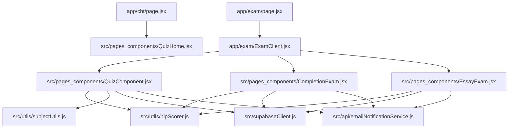

**Diagram sources**
- [app/cbt/page.jsx:1-11](file://app/cbt/page.jsx#L1-L11)
- [app/exam/page.jsx:1-12](file://app/exam/page.jsx#L1-L12)
- [app/exam/ExamClient.jsx:1-46](file://app/exam/ExamClient.jsx#L1-L46)
- [src/pages_components/QuizHome.jsx:1-508](file://src/pages_components/QuizHome.jsx#L1-L508)
- [src/pages_components/QuizComponent.jsx:1-800](file://src/pages_components/QuizComponent.jsx#L1-L800)
- [src/pages_components/CompletionExam.jsx:1-472](file://src/pages_components/CompletionExam.jsx#L1-L472)
- [src/pages_components/EssayExam.jsx:1-418](file://src/pages_components/EssayExam.jsx#L1-L418)
- [src/utils/nlpScorer.js:1-181](file://src/utils/nlpScorer.js#L1-L181)
- [src/utils/subjectUtils.js:1-392](file://src/utils/subjectUtils.js#L1-L392)
- [src/supabaseClient.js:1-7](file://src/supabaseClient.js#L1-L7)
- [src/api/emailNotificationService.js:1-127](file://src/api/emailNotificationService.js#L1-L127)

**Section sources**
- [app/cbt/page.jsx:1-11](file://app/cbt/page.jsx#L1-L11)
- [app/exam/page.jsx:1-12](file://app/exam/page.jsx#L1-L12)
- [app/exam/ExamClient.jsx:1-46](file://app/exam/ExamClient.jsx#L1-L46)
- [src/pages_components/QuizHome.jsx:1-508](file://src/pages_components/QuizHome.jsx#L1-L508)

## Core Components
- QuizHome: Student identity capture, subject listing, filtering, and navigation to an exam session.
- Exam routing: Server wrapper and dynamic client router that selects the correct exam component based on URL parameters.
- Objective exam (QuizComponent): Multiple-choice interface, timer, auto-save, network monitoring, detailed results, and email notifications.
- Completion exam (CompletionExam): Fill-in-the-blank interface with NLP-based evaluation.
- Essay exam (EssayExam): Free-text interface with keyword and semantic scoring via NLP.
- Utilities: NLP scorer for completion and essay questions; subject normalization and mappings.
- Data layer: Supabase client for fetching subjects/questions and saving results; email notification service for result emails.

**Section sources**
- [src/pages_components/QuizHome.jsx:1-508](file://src/pages_components/QuizHome.jsx#L1-L508)
- [app/exam/page.jsx:1-12](file://app/exam/page.jsx#L1-L12)
- [app/exam/ExamClient.jsx:1-46](file://app/exam/ExamClient.jsx#L1-L46)
- [src/pages_components/QuizComponent.jsx:1-800](file://src/pages_components/QuizComponent.jsx#L1-L800)
- [src/pages_components/CompletionExam.jsx:1-472](file://src/pages_components/CompletionExam.jsx#L1-L472)
- [src/pages_components/EssayExam.jsx:1-418](file://src/pages_components/EssayExam.jsx#L1-L418)
- [src/utils/nlpScorer.js:1-181](file://src/utils/nlpScorer.js#L1-L181)
- [src/utils/subjectUtils.js:1-392](file://src/utils/subjectUtils.js#L1-L392)
- [src/supabaseClient.js:1-7](file://src/supabaseClient.js#L1-L7)
- [src/api/emailNotificationService.js:1-127](file://src/api/emailNotificationService.js#L1-L127)

## Architecture Overview
The CBT flow starts at the public entry point, where students enter their identity and select a subject and exam type. The server-side page passes searchParams to a client component that dynamically loads the appropriate exam UI. Each exam component fetches questions from Supabase, manages state locally, enforces time limits, and saves progress to localStorage. On submission, answers are scored (NLP for non-multiple-choice), results are persisted to the database, and email notifications are sent.

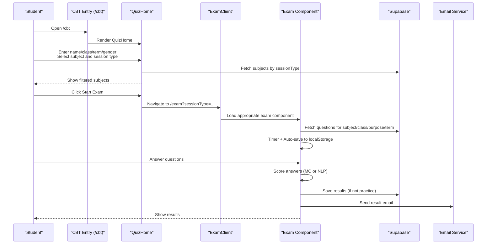

**Diagram sources**
- [app/cbt/page.jsx:1-11](file://app/cbt/page.jsx#L1-L11)
- [src/pages_components/QuizHome.jsx:151-176](file://src/pages_components/QuizHome.jsx#L151-L176)
- [app/exam/page.jsx:1-12](file://app/exam/page.jsx#L1-L12)
- [app/exam/ExamClient.jsx:22-45](file://app/exam/ExamClient.jsx#L22-L45)
- [src/pages_components/QuizComponent.jsx:59-143](file://src/pages_components/QuizComponent.jsx#L59-L143)
- [src/pages_components/CompletionExam.jsx:45-72](file://src/pages_components/CompletionExam.jsx#L45-L72)
- [src/pages_components/EssayExam.jsx:43-65](file://src/pages_components/EssayExam.jsx#L43-L65)
- [src/api/emailNotificationService.js:70-121](file://src/api/emailNotificationService.js#L70-L121)

## Detailed Component Analysis

### Student Authentication Flow
- Identity capture: Name, class, term, and gender are collected on the home screen.
- Validation: The system checks if the student exists in the student table before enabling “Start Exam.”
- Profile picture: If available, the student’s passport image is displayed for confirmation.
- Security: An admin password can be required to unlock the exam session; this is fetched from settings.

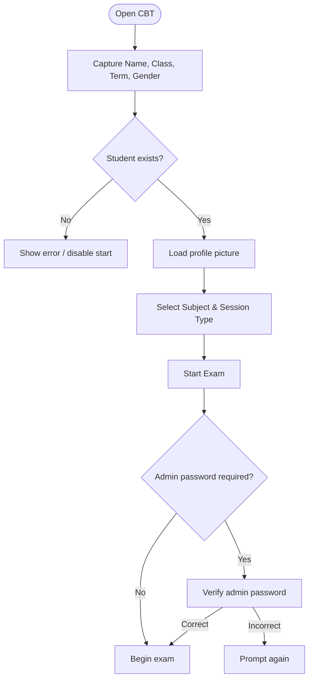

**Diagram sources**
- [src/pages_components/QuizHome.jsx:51-105](file://src/pages_components/QuizHome.jsx#L51-L105)
- [src/pages_components/QuizHome.jsx:151-176](file://src/pages_components/QuizHome.jsx#L151-L176)
- [src/pages_components/QuizComponent.jsx:145-160](file://src/pages_components/QuizComponent.jsx#L145-L160)
- [src/pages_components/CompletionExam.jsx:311-334](file://src/pages_components/CompletionExam.jsx#L311-L334)
- [src/pages_components/EssayExam.jsx:284-297](file://src/pages_components/EssayExam.jsx#L284-L297)

**Section sources**
- [src/pages_components/QuizHome.jsx:51-105](file://src/pages_components/QuizHome.jsx#L51-L105)
- [src/pages_components/QuizHome.jsx:151-176](file://src/pages_components/QuizHome.jsx#L151-L176)
- [src/pages_components/QuizComponent.jsx:145-160](file://src/pages_components/QuizComponent.jsx#L145-L160)
- [src/pages_components/CompletionExam.jsx:311-334](file://src/pages_components/CompletionExam.jsx#L311-L334)
- [src/pages_components/EssayExam.jsx:284-297](file://src/pages_components/EssayExam.jsx#L284-L297)

### Exam Selection Interface
- Subjects are loaded from different tables depending on session type:
  - Objective: jmis_cbtQuestions
  - Completion: jmis_cbt_completion
  - Essay: jmis_cbt_essay
- Filtering supports subject name, class, term, purpose (exam/midterm/test/practice), and archived status.
- Session type selector switches the data source and UI accordingly.

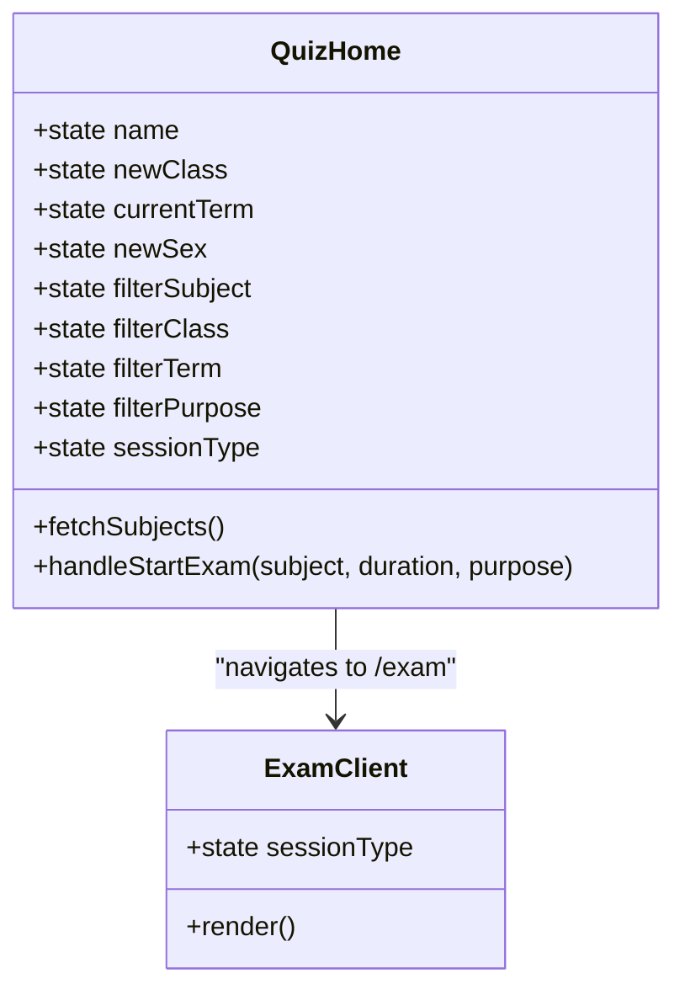

**Diagram sources**
- [src/pages_components/QuizHome.jsx:107-136](file://src/pages_components/QuizHome.jsx#L107-L136)
- [src/pages_components/QuizHome.jsx:196-226](file://src/pages_components/QuizHome.jsx#L196-L226)
- [src/pages_components/QuizHome.jsx:410-424](file://src/pages_components/QuizHome.jsx#L410-L424)
- [app/exam/ExamClient.jsx:22-45](file://app/exam/ExamClient.jsx#L22-L45)

**Section sources**
- [src/pages_components/QuizHome.jsx:107-136](file://src/pages_components/QuizHome.jsx#L107-L136)
- [src/pages_components/QuizHome.jsx:196-226](file://src/pages_components/QuizHome.jsx#L196-L226)
- [src/pages_components/QuizHome.jsx:410-424](file://src/pages_components/QuizHome.jsx#L410-L424)
- [app/exam/ExamClient.jsx:22-45](file://app/exam/ExamClient.jsx#L22-L45)

### Objective Multiple Choice Exam
- Question loading: Queries jmis_cbtQuestions with filters for subject, class, purpose, and term.
- Timer: Converts minutes to seconds and decrements every second; auto-submits when time expires.
- Progress tracking: Auto-saves answers, score, current question, and timeLeft to localStorage.
- Network reliability: Periodically tests connectivity and quality; warns users if offline.
- Scoring: Counts correct options; displays normalized scores for exams vs practice.
- Results: Shows categorized breakdown (correct/incorrect/unattempted), allows printing a detailed report.
- Submission: Saves results to jmis_cbt_results and sends email notifications unless purpose is practice.

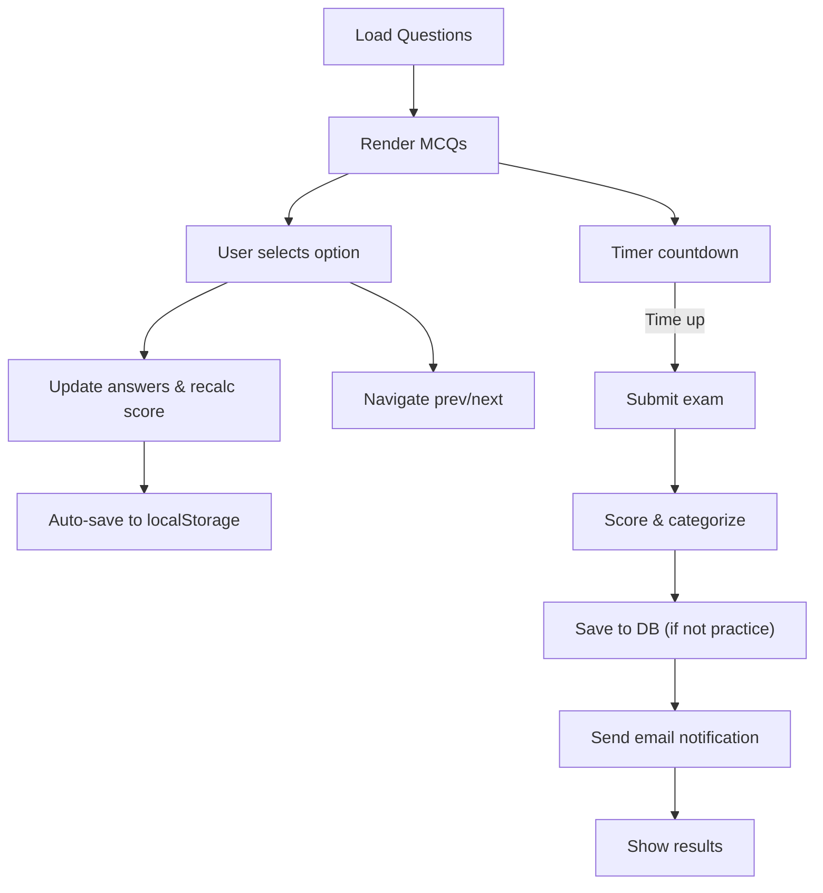

**Diagram sources**
- [src/pages_components/QuizComponent.jsx:59-143](file://src/pages_components/QuizComponent.jsx#L59-L143)
- [src/pages_components/QuizComponent.jsx:194-209](file://src/pages_components/QuizComponent.jsx#L194-L209)
- [src/pages_components/QuizComponent.jsx:261-279](file://src/pages_components/QuizComponent.jsx#L261-L279)
- [src/pages_components/QuizComponent.jsx:281-339](file://src/pages_components/QuizComponent.jsx#L281-L339)
- [src/pages_components/QuizComponent.jsx:353-383](file://src/pages_components/QuizComponent.jsx#L353-L383)
- [src/pages_components/QuizComponent.jsx:386-425](file://src/pages_components/QuizComponent.jsx#L386-L425)

**Section sources**
- [src/pages_components/QuizComponent.jsx:59-143](file://src/pages_components/QuizComponent.jsx#L59-L143)
- [src/pages_components/QuizComponent.jsx:194-209](file://src/pages_components/QuizComponent.jsx#L194-L209)
- [src/pages_components/QuizComponent.jsx:261-279](file://src/pages_components/QuizComponent.jsx#L261-L279)
- [src/pages_components/QuizComponent.jsx:281-339](file://src/pages_components/QuizComponent.jsx#L281-L339)
- [src/pages_components/QuizComponent.jsx:353-383](file://src/pages_components/QuizComponent.jsx#L353-L383)
- [src/pages_components/QuizComponent.jsx:386-425](file://src/pages_components/QuizComponent.jsx#L386-L425)

### Completion Fill-in-the-Blank Exam
- Question loading: Queries jmis_cbt_completion for matching subject/class.
- Input: Single-line text input per question.
- Scoring: Uses NLP scorer evaluateCompletion to match expected answers, synonyms, and keywords.
- Progress: Auto-saves answers and restores previous attempts.
- Submission: Computes total score, persists results, and sends email notifications.

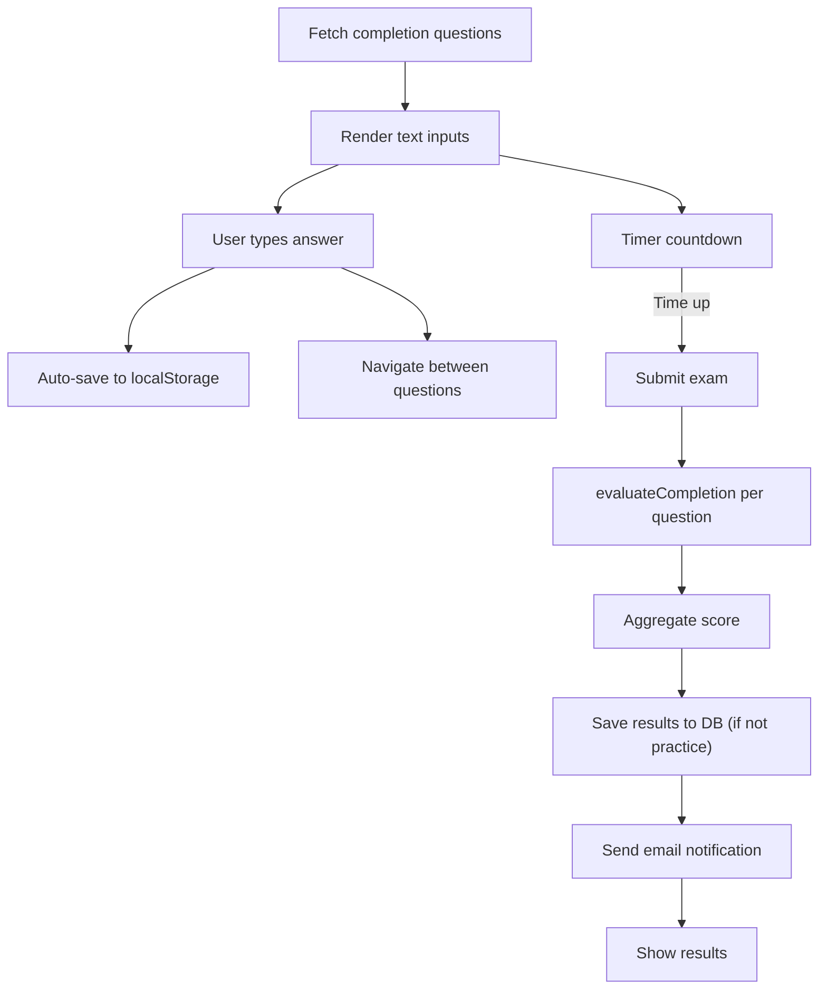

**Diagram sources**
- [src/pages_components/CompletionExam.jsx:45-72](file://src/pages_components/CompletionExam.jsx#L45-L72)
- [src/pages_components/CompletionExam.jsx:100-147](file://src/pages_components/CompletionExam.jsx#L100-L147)
- [src/pages_components/CompletionExam.jsx:149-181](file://src/pages_components/CompletionExam.jsx#L149-L181)
- [src/utils/nlpScorer.js:9-58](file://src/utils/nlpScorer.js#L9-L58)

**Section sources**
- [src/pages_components/CompletionExam.jsx:45-72](file://src/pages_components/CompletionExam.jsx#L45-L72)
- [src/pages_components/CompletionExam.jsx:100-147](file://src/pages_components/CompletionExam.jsx#L100-L147)
- [src/pages_components/CompletionExam.jsx:149-181](file://src/pages_components/CompletionExam.jsx#L149-L181)
- [src/utils/nlpScorer.js:9-58](file://src/utils/nlpScorer.js#L9-L58)

### Essay Free Text Exam
- Question loading: Queries jmis_cbt_essay for matching subject/class.
- Input: Multi-line textarea per question with minimum word count and points.
- Scoring: Uses NLP scorer evaluateEssay to compute keyword matches, semantic similarity, and final score.
- Progress: Auto-saves answers and restores previous attempts.
- Submission: Aggregates scores, persists results, and sends email notifications.

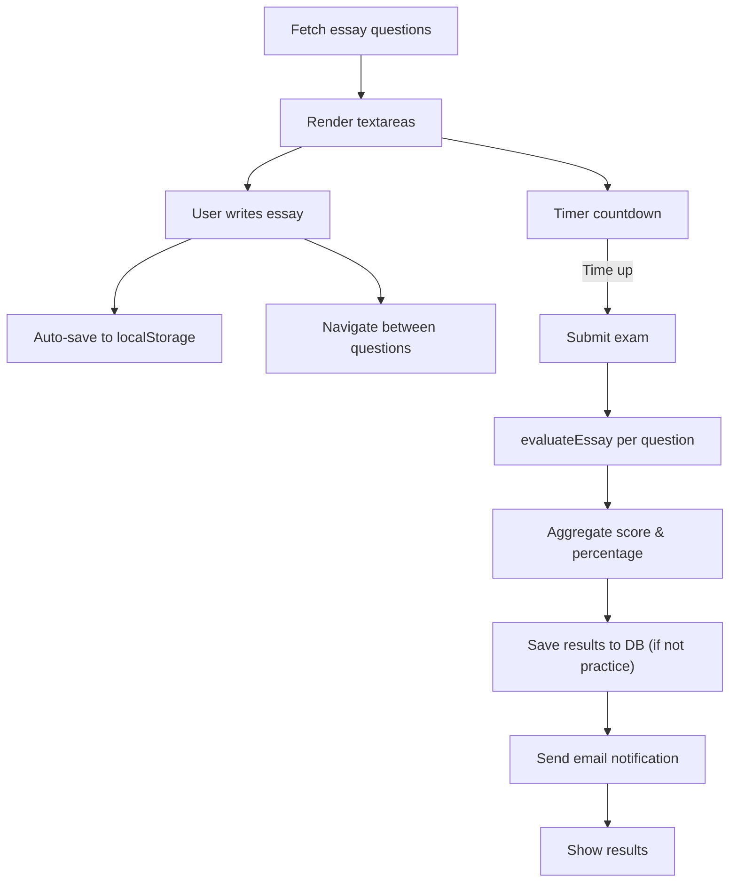

**Diagram sources**
- [src/pages_components/EssayExam.jsx:43-65](file://src/pages_components/EssayExam.jsx#L43-L65)
- [src/pages_components/EssayExam.jsx:92-132](file://src/pages_components/EssayExam.jsx#L92-L132)
- [src/pages_components/EssayExam.jsx:134-168](file://src/pages_components/EssayExam.jsx#L134-L168)
- [src/utils/nlpScorer.js:66-153](file://src/utils/nlpScorer.js#L66-L153)

**Section sources**
- [src/pages_components/EssayExam.jsx:43-65](file://src/pages_components/EssayExam.jsx#L43-L65)
- [src/pages_components/EssayExam.jsx:92-132](file://src/pages_components/EssayExam.jsx#L92-L132)
- [src/pages_components/EssayExam.jsx:134-168](file://src/pages_components/EssayExam.jsx#L134-L168)
- [src/utils/nlpScorer.js:66-153](file://src/utils/nlpScorer.js#L66-L153)

### Exam Lifecycle and Progress Tracking
- Lifecycle stages:
  - Pre-exam: Identity validation, subject selection, admin unlock (if required).
  - During exam: Timer runs, questions rendered, answers saved locally.
  - Post-exam: Scoring, result persistence, email notification, results display.
- Progress tracking:
  - LocalStorage keys include examId, student info, answers, score, currentQuestion, timeLeft, timestamp, and isComplete flag.
  - Auto-load resumes last incomplete attempt for the same student/subject.

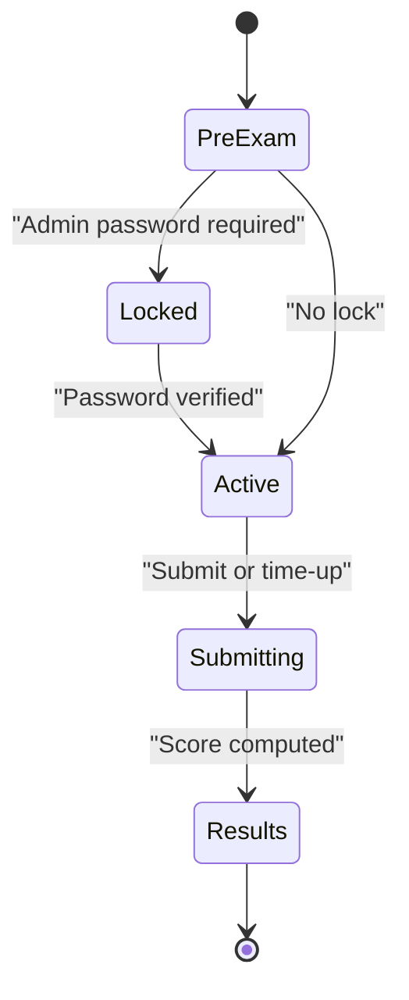

**Diagram sources**
- [src/pages_components/QuizComponent.jsx:194-209](file://src/pages_components/QuizComponent.jsx#L194-L209)
- [src/pages_components/QuizComponent.jsx:281-339](file://src/pages_components/QuizComponent.jsx#L281-L339)
- [src/pages_components/CompletionExam.jsx:74-91](file://src/pages_components/CompletionExam.jsx#L74-L91)
- [src/pages_components/EssayExam.jsx:67-81](file://src/pages_components/EssayExam.jsx#L67-L81)

**Section sources**
- [src/pages_components/QuizComponent.jsx:194-209](file://src/pages_components/QuizComponent.jsx#L194-L209)
- [src/pages_components/QuizComponent.jsx:281-339](file://src/pages_components/QuizComponent.jsx#L281-L339)
- [src/pages_components/CompletionExam.jsx:74-91](file://src/pages_components/CompletionExam.jsx#L74-L91)
- [src/pages_components/EssayExam.jsx:67-81](file://src/pages_components/EssayExam.jsx#L67-L81)

### Scoring Algorithms
- Objective (multiple choice):
  - Correctness determined by isCorrect flag on selected option.
  - Score equals number of correct answers; displayed score may be capped for formal exams.
- Completion:
  - Exact match or synonym accepted first.
  - Semantic similarity using nouns overlap via Compromise NLP.
  - Required keywords must all be present for full credit.
- Essay:
  - Keyword presence (with synonyms) weighted at 70%.
  - Semantic similarity (nouns/verbs overlap) weighted at 30%.
  - Minimum word count enforced; feedback includes word count and keyword coverage.

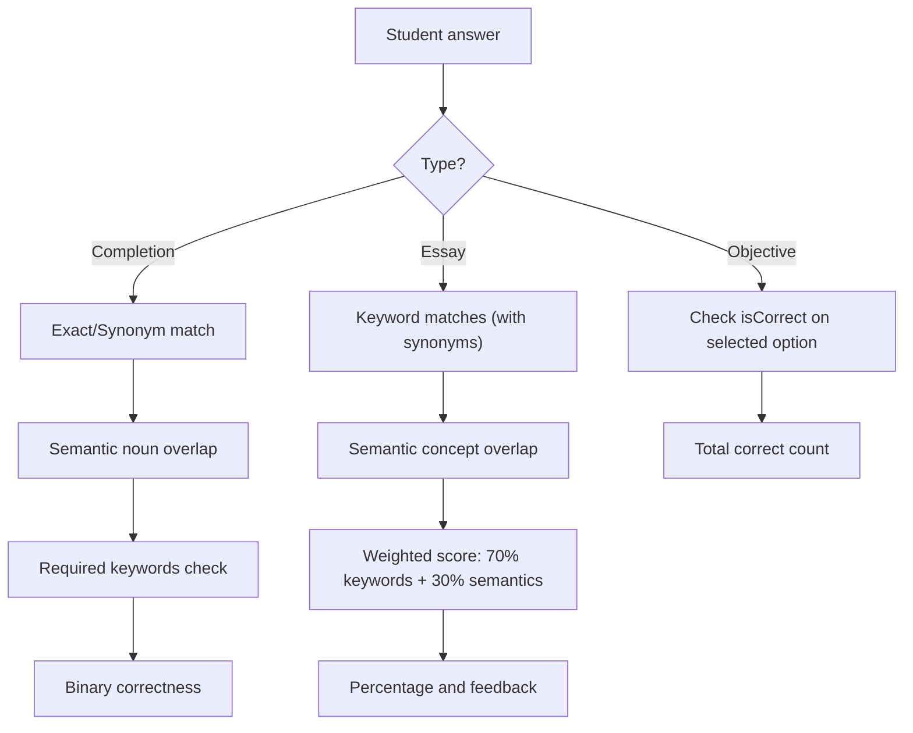

**Diagram sources**
- [src/pages_components/QuizComponent.jsx:261-279](file://src/pages_components/QuizComponent.jsx#L261-L279)
- [src/utils/nlpScorer.js:9-58](file://src/utils/nlpScorer.js#L9-L58)
- [src/utils/nlpScorer.js:66-153](file://src/utils/nlpScorer.js#L66-L153)

**Section sources**
- [src/pages_components/QuizComponent.jsx:261-279](file://src/pages_components/QuizComponent.jsx#L261-L279)
- [src/utils/nlpScorer.js:9-58](file://src/utils/nlpScorer.js#L9-L58)
- [src/utils/nlpScorer.js:66-153](file://src/utils/nlpScorer.js#L66-L153)

### Result Processing and Notifications
- Results are prepared by resolving student ID from jmis_student and computing percentage.
- For objective exams, detailed categories (correct/incorrect/unattempted) are generated for review and printable reports.
- Non-practice sessions persist results to jmis_cbt_results with sessionType and answers.
- Email notifications include summary and detailed breakdowns; recipients are configured in jmis_settings.

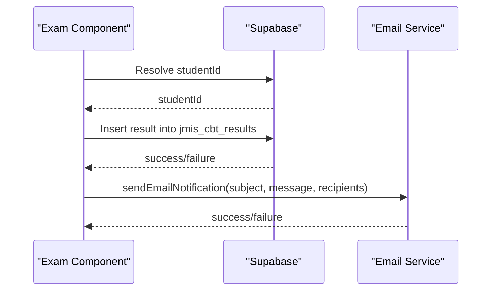

**Diagram sources**
- [src/pages_components/QuizComponent.jsx:386-425](file://src/pages_components/QuizComponent.jsx#L386-L425)
- [src/pages_components/CompletionExam.jsx:206-255](file://src/pages_components/CompletionExam.jsx#L206-L255)
- [src/pages_components/EssayExam.jsx:192-229](file://src/pages_components/EssayExam.jsx#L192-L229)
- [src/api/emailNotificationService.js:70-121](file://src/api/emailNotificationService.js#L70-L121)

**Section sources**
- [src/pages_components/QuizComponent.jsx:386-425](file://src/pages_components/QuizComponent.jsx#L386-L425)
- [src/pages_components/CompletionExam.jsx:206-255](file://src/pages_components/CompletionExam.jsx#L206-L255)
- [src/pages_components/EssayExam.jsx:192-229](file://src/pages_components/EssayExam.jsx#L192-L229)
- [src/api/emailNotificationService.js:70-121](file://src/api/emailNotificationService.js#L70-L121)

## Dependency Analysis
- Routing dependencies:
  - app/cbt/page.jsx renders QuizHome.
  - app/exam/page.jsx wraps ExamClient which conditionally loads one of three exam components.
- Data dependencies:
  - All exam components use src/supabaseClient.js to connect to Supabase.
  - QuizHome reads subjects from different tables based on sessionType.
- Utility dependencies:
  - CompletionExam and EssayExam depend on src/utils/nlpScorer.js for scoring.
  - QuizComponent uses src/utils/subjectUtils.js for subject-related logic.
- Notification dependency:
  - All exam components call src/api/emailNotificationService.js to send result emails.

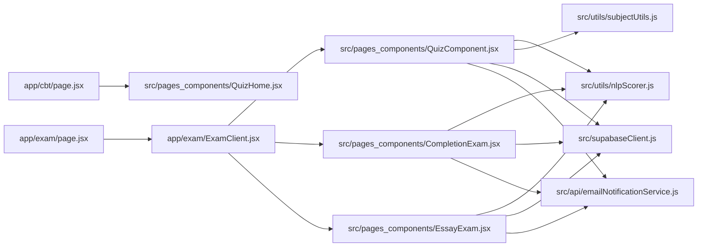

**Diagram sources**
- [app/cbt/page.jsx:1-11](file://app/cbt/page.jsx#L1-L11)
- [app/exam/page.jsx:1-12](file://app/exam/page.jsx#L1-L12)
- [app/exam/ExamClient.jsx:1-46](file://app/exam/ExamClient.jsx#L1-L46)
- [src/pages_components/QuizHome.jsx:1-508](file://src/pages_components/QuizHome.jsx#L1-L508)
- [src/pages_components/QuizComponent.jsx:1-800](file://src/pages_components/QuizComponent.jsx#L1-L800)
- [src/pages_components/CompletionExam.jsx:1-472](file://src/pages_components/CompletionExam.jsx#L1-L472)
- [src/pages_components/EssayExam.jsx:1-418](file://src/pages_components/EssayExam.jsx#L1-L418)
- [src/utils/nlpScorer.js:1-181](file://src/utils/nlpScorer.js#L1-L181)
- [src/utils/subjectUtils.js:1-392](file://src/utils/subjectUtils.js#L1-L392)
- [src/supabaseClient.js:1-7](file://src/supabaseClient.js#L1-L7)
- [src/api/emailNotificationService.js:1-127](file://src/api/emailNotificationService.js#L1-L127)

**Section sources**
- [app/cbt/page.jsx:1-11](file://app/cbt/page.jsx#L1-L11)
- [app/exam/page.jsx:1-12](file://app/exam/page.jsx#L1-L12)
- [app/exam/ExamClient.jsx:1-46](file://app/exam/ExamClient.jsx#L1-L46)
- [src/pages_components/QuizHome.jsx:1-508](file://src/pages_components/QuizHome.jsx#L1-L508)
- [src/pages_components/QuizComponent.jsx:1-800](file://src/pages_components/QuizComponent.jsx#L1-L800)
- [src/pages_components/CompletionExam.jsx:1-472](file://src/pages_components/CompletionExam.jsx#L1-L472)
- [src/pages_components/EssayExam.jsx:1-418](file://src/pages_components/EssayExam.jsx#L1-L418)
- [src/utils/nlpScorer.js:1-181](file://src/utils/nlpScorer.js#L1-L181)
- [src/utils/subjectUtils.js:1-392](file://src/utils/subjectUtils.js#L1-L392)
- [src/supabaseClient.js:1-7](file://src/supabaseClient.js#L1-L7)
- [src/api/emailNotificationService.js:1-127](file://src/api/emailNotificationService.js#L1-L127)

## Performance Considerations
- Client-side rendering: Exam components are dynamically imported to avoid SSR issues and reduce initial bundle size.
- LocalStorage auto-save: Reduces risk of data loss during network interruptions; consider periodic debounced saves.
- Network monitoring: Periodic health checks inform users of poor connectivity; consider queuing submissions when offline.
- Query optimization: Use precise filters (subject, class, purpose, term) to minimize payload sizes.
- Print generation: Detailed results print window builds large HTML strings; consider streaming or pagination for very long exams.

[No sources needed since this section provides general guidance]

## Troubleshooting Guide
- No questions found:
  - Verify subject/class/purpose/term filters match database entries.
  - Check console logs for query parameters and available rows.
- Admin password errors:
  - Ensure jmis_settings contains cbtPassword and that the entered value matches exactly.
- Email failures:
  - Confirm jmis_settings has valid adminEmail/additionalemails and that the API endpoint for sending emails is reachable.
- Auto-save not restoring:
  - Ensure localStorage is enabled and not blocked; verify examId key format and that isComplete is false.
- Time expiration:
  - Confirm timer intervals are active and not paused due to visibility changes or lock states.

**Section sources**
- [src/pages_components/QuizComponent.jsx:59-143](file://src/pages_components/QuizComponent.jsx#L59-L143)
- [src/pages_components/QuizComponent.jsx:145-160](file://src/pages_components/QuizComponent.jsx#L145-L160)
- [src/api/emailNotificationService.js:70-121](file://src/api/emailNotificationService.js#L70-L121)
- [src/pages_components/CompletionExam.jsx:125-147](file://src/pages_components/CompletionExam.jsx#L125-L147)
- [src/pages_components/EssayExam.jsx:115-132](file://src/pages_components/EssayExam.jsx#L115-L132)

## Conclusion
The CBT system provides a robust, extensible platform for administering objective, completion, and essay exams. It integrates secure student verification, flexible subject filtering, resilient progress tracking, and automated result processing with email notifications. Educators can configure subjects and questions across three data tables, while developers can add new exam types by following the established patterns for data fetching, scoring, and result submission.

[No sources needed since this section summarizes without analyzing specific files]

## Appendices

### Implementing a New Exam Type
- Add a new client component under src/pages_components.
- In app/exam/ExamClient.jsx, import and route to the new component based on a new sessionType parameter.
- Create a corresponding data table (e.g., jmis_cbt_newtype) and ensure QuizHome loads subjects from it when sessionType matches.
- Implement scoring logic in src/utils/nlpScorer.js or a dedicated utility module.
- Persist results to jmis_cbt_results with a unique sessionType and send email notifications via src/api/emailNotificationService.js.

**Section sources**
- [app/exam/ExamClient.jsx:1-46](file://app/exam/ExamClient.jsx#L1-L46)
- [src/pages_components/QuizHome.jsx:107-136](file://src/pages_components/QuizHome.jsx#L107-L136)
- [src/utils/nlpScorer.js:1-181](file://src/utils/nlpScorer.js#L1-L181)
- [src/api/emailNotificationService.js:70-121](file://src/api/emailNotificationService.js#L70-L121)

### Configuring Subjects
- Maintain canonical subject names using src/utils/subjectUtils.js mappings and normalization functions.
- Ensure subjects in the database match the canonical names used by the system to avoid mismatches.
- Use schoolSubjects mapping to align class-specific subject availability.

**Section sources**
- [src/utils/subjectUtils.js:1-392](file://src/utils/subjectUtils.js#L1-L392)

### Managing Exam Questions
- Objective questions: Store in jmis_cbtQuestions with fields including questions array, subject, class, purpose, term.
- Completion questions: Store in jmis_cbt_completion with expectedAnswers, acceptableSynonyms, requiredKeywords, points.
- Essay questions: Store in jmis_cbt_essay with expectedAnswer, requiredKeywords, acceptableSynonyms, minWords, points.
- Ensure purpose values are consistent (exam, midterm/test, practice) to control scoring display and result persistence.

**Section sources**
- [src/pages_components/QuizComponent.jsx:59-143](file://src/pages_components/QuizComponent.jsx#L59-L143)
- [src/pages_components/CompletionExam.jsx:45-72](file://src/pages_components/CompletionExam.jsx#L45-L72)
- [src/pages_components/EssayExam.jsx:43-65](file://src/pages_components/EssayExam.jsx#L43-L65)

### Security Considerations
- Admin password protection: Enforce unlocking for exam sessions; store passwords securely in settings.
- Prevent accidental exits: Use browser events to prompt for admin password on beforeunload.
- Visibility change handling: Lock exam when tab loses focus to discourage multitasking.

**Section sources**
- [src/pages_components/QuizComponent.jsx:145-160](file://src/pages_components/QuizComponent.jsx#L145-L160)
- [src/pages_components/QuizComponent.jsx:211-225](file://src/pages_components/QuizComponent.jsx#L211-L225)
- [src/pages_components/QuizComponent.jsx:227-239](file://src/pages_components/QuizComponent.jsx#L227-L239)
- [src/pages_components/CompletionExam.jsx:311-334](file://src/pages_components/CompletionExam.jsx#L311-L334)
- [src/pages_components/EssayExam.jsx:284-297](file://src/pages_components/EssayExam.jsx#L284-L297)

### Time Management
- Duration conversion: Minutes to seconds; countdown interval updates every second.
- Auto-submit on timeout: Ensures exams complete even if the user does not manually submit.
- Timer pause conditions: Respect locked state and showScore state to prevent background ticking.

**Section sources**
- [src/pages_components/QuizComponent.jsx:194-209](file://src/pages_components/QuizComponent.jsx#L194-L209)
- [src/pages_components/CompletionExam.jsx:74-91](file://src/pages_components/CompletionExam.jsx#L74-L91)
- [src/pages_components/EssayExam.jsx:67-81](file://src/pages_components/EssayExam.jsx#L67-L81)

### Accessibility Features
- Clear instructions and visual cues for progress and time remaining.
- Keyboard-friendly navigation buttons for moving between questions.
- High-contrast badges and labels for student, class, and time indicators.
- Printable detailed results for review and record-keeping.

**Section sources**
- [src/pages_components/QuizHome.jsx:331-341](file://src/pages_components/QuizHome.jsx#L331-L341)
- [src/pages_components/QuizComponent.jsx:427-790](file://src/pages_components/QuizComponent.jsx#L427-L790)
- [src/pages_components/CompletionExam.jsx:374-434](file://src/pages_components/CompletionExam.jsx#L374-L434)
- [src/pages_components/EssayExam.jsx:331-385](file://src/pages_components/EssayExam.jsx#L331-L385)