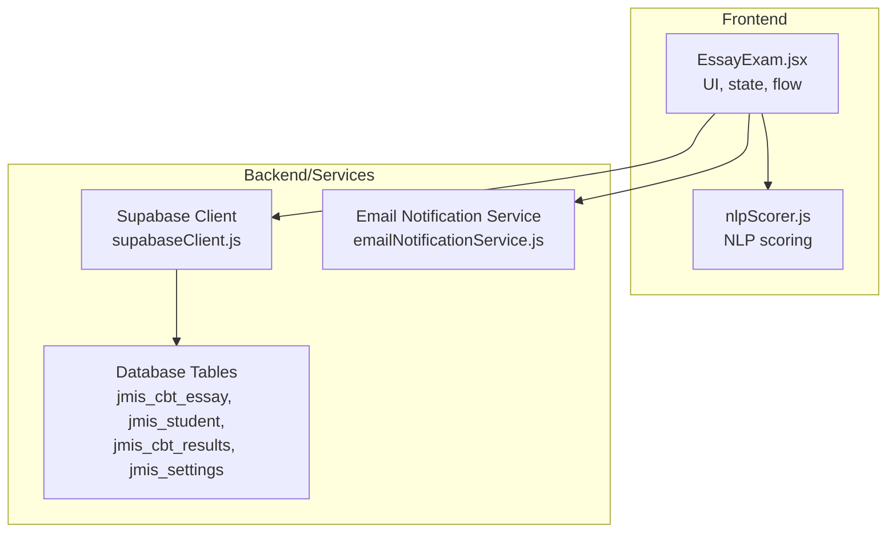
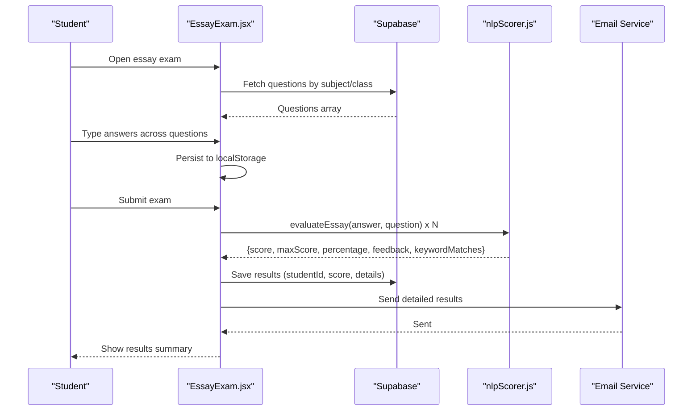
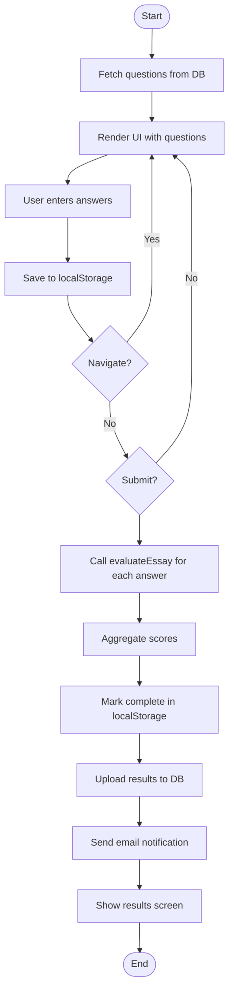
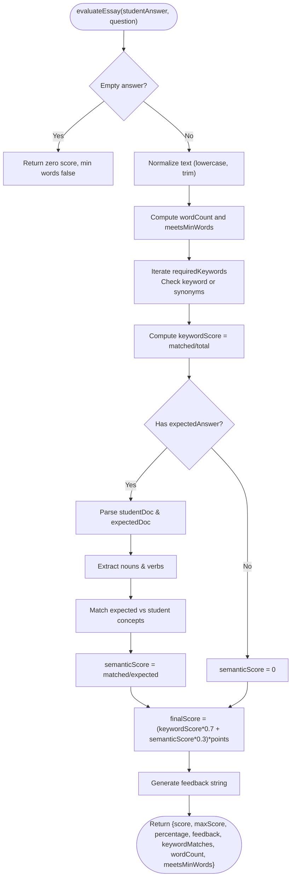
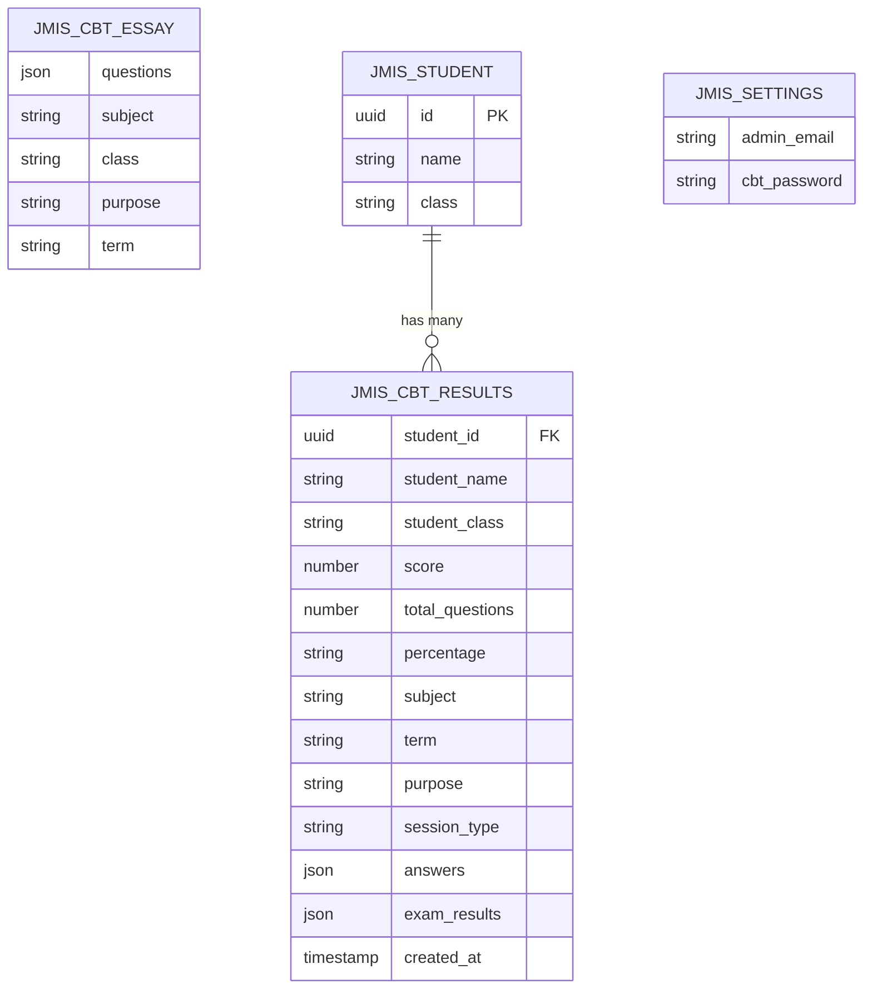
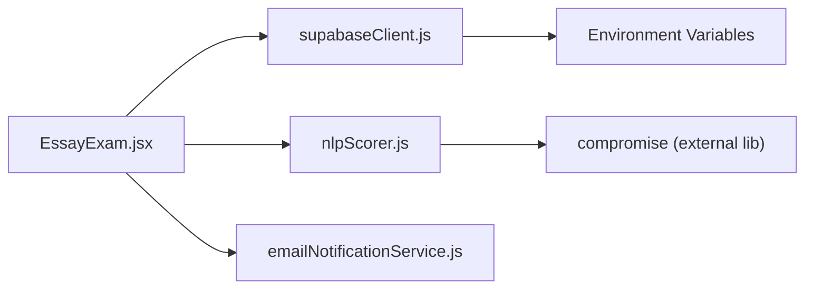

# Essay Free Text Exams

<cite>
**Referenced Files in This Document**
- [EssayExam.jsx](file://src/pages_components/EssayExam.jsx)
- [nlpScorer.js](file://src/utils/nlpScorer.js)
- [supabaseClient.js](file://src/supabaseClient.js)
- [emailNotificationService.js](file://src/api/emailNotificationService.js)
</cite>

## Table of Contents
1. [Introduction](#introduction)
2. [Project Structure](#project-structure)
3. [Core Components](#core-components)
4. [Architecture Overview](#architecture-overview)
5. [Detailed Component Analysis](#detailed-component-analysis)
6. [Dependency Analysis](#dependency-analysis)
7. [Performance Considerations](#performance-considerations)
8. [Troubleshooting Guide](#troubleshooting-guide)
9. [Conclusion](#conclusion)
10. [Appendices](#appendices)

## Introduction
This document explains the essay exam system for free text responses. It covers the EssayExam component architecture, text input handling, NLP-based scoring using the compromise library, and keyword matching algorithms. It also documents how essays are processed, automatically scored, and evaluated against rubrics or key terms, including configuration examples, integration with the NLP scorer utility, text analysis pipeline, performance considerations for large inputs, and customization options for different essay types.

## Project Structure
The essay exam is implemented as a Next.js client component that:
- Loads questions from a database table via Supabase
- Renders a multi-question essay interface with navigation and a timer
- Persists answers to localStorage for resilience
- Scores each answer using an NLP-based utility
- Saves results and sends email notifications

**Diagram sources**
- [EssayExam.jsx:43-65](file://src/pages_components/EssayExam.jsx#L43-L65)
- [EssayExam.jsx:134-168](file://src/pages_components/EssayExam.jsx#L134-L168)
- [EssayExam.jsx:170-282](file://src/pages_components/EssayExam.jsx#L170-L282)
- [nlpScorer.js:66-153](file://src/utils/nlpScorer.js#L66-L153)
- [supabaseClient.js:1-7](file://src/supabaseClient.js#L1-L7)
- [emailNotificationService.js](file://src/api/emailNotificationService.js)

**Section sources**
- [EssayExam.jsx:1-418](file://src/pages_components/EssayExam.jsx#L1-L418)
- [nlpScorer.js:1-181](file://src/utils/nlpScorer.js#L1-L181)
- [supabaseClient.js:1-7](file://src/supabaseClient.js#L1-L7)

## Core Components
- EssayExam (React client component): Manages UI, state, timer, persistence, submission, scoring orchestration, result upload, and email notification.
- nlpScorer (utility): Provides NLP-based evaluation for completion and essay answers using compromise. Includes keyword matching, synonym support, semantic similarity, and feedback generation.
- supabaseClient: Initializes the Supabase client with environment variables.
- emailNotificationService: Sends automated emails with detailed results.

Key responsibilities:
- Data fetching: Load essay questions by subject and class.
- Input handling: Capture free-text answers per question; enforce minimum word count.
- Scoring: Evaluate each answer using evaluateEssay with keyword and semantic scoring.
- Persistence: Save progress to localStorage; mark complete on submit.
- Results: Upload aggregated results and send email notifications.

**Section sources**
- [EssayExam.jsx:15-41](file://src/pages_components/EssayExam.jsx#L15-L41)
- [EssayExam.jsx:43-65](file://src/pages_components/EssayExam.jsx#L43-L65)
- [EssayExam.jsx:92-132](file://src/pages_components/EssayExam.jsx#L92-L132)
- [EssayExam.jsx:134-168](file://src/pages_components/EssayExam.jsx#L134-L168)
- [EssayExam.jsx:170-282](file://src/pages_components/EssayExam.jsx#L170-L282)
- [nlpScorer.js:66-153](file://src/utils/nlpScorer.js#L66-L153)
- [supabaseClient.js:1-7](file://src/supabaseClient.js#L1-L7)
- [emailNotificationService.js](file://src/api/emailNotificationService.js)

## Architecture Overview
The system follows a clear separation between UI orchestration and scoring logic:
- The UI layer fetches questions, manages user input, and coordinates submission.
- The scoring layer uses compromise to compute keyword matches and semantic similarity.
- External services include Supabase for data and settings, and an email service for notifications.

**Diagram sources**
- [EssayExam.jsx:43-65](file://src/pages_components/EssayExam.jsx#L43-L65)
- [EssayExam.jsx:134-168](file://src/pages_components/EssayExam.jsx#L134-L168)
- [EssayExam.jsx:170-282](file://src/pages_components/EssayExam.jsx#L170-L282)
- [nlpScorer.js:66-153](file://src/utils/nlpScorer.js#L66-L153)
- [supabaseClient.js:1-7](file://src/supabaseClient.js#L1-L7)
- [emailNotificationService.js](file://src/api/emailNotificationService.js)

## Detailed Component Analysis

### EssayExam Component
Responsibilities:
- Query parameters: name, newClass, currentTerm, subject, duration, purpose.
- State: questions, currentQuestion, showScore, score, maxScore, timeLeft, answers, isSubmitted, examResults, adminPassword, isLocked, passwordInput, isSavingToStorage, lastSaved.
- Timer: countdown and auto-submit when time expires.
- Persistence: save/load from localStorage keyed by examId.
- Submission: iterate questions, call evaluateEssay, aggregate scores, update UI, persist completion flag, upload results, send email.
- Admin lock: unlock only if password matches settings.

Text input handling:
- Each question renders a textarea bound to answers[currentQuestion].
- Word count displayed; minimum word requirement shown per question.
- Navigation buttons allow moving between questions.

Scoring integration:
- On submit, calls evaluateEssay for each answer and aggregates totalScore/maxScore.
- Stores per-question results including keywordMatches, wordCount, meetsMinWords.

Result upload and notification:
- Prepares result payload with studentId, name, class, score, totalQuestions, percentage.
- Inserts into jmis_cbt_results with subject, term, purpose, sessionType, answers, examResults.
- Sends email with detailed breakdown and keyword match indicators.

**Diagram sources**
- [EssayExam.jsx:43-65](file://src/pages_components/EssayExam.jsx#L43-L65)
- [EssayExam.jsx:92-132](file://src/pages_components/EssayExam.jsx#L92-L132)
- [EssayExam.jsx:134-168](file://src/pages_components/EssayExam.jsx#L134-L168)
- [EssayExam.jsx:170-282](file://src/pages_components/EssayExam.jsx#L170-L282)

**Section sources**
- [EssayExam.jsx:15-41](file://src/pages_components/EssayExam.jsx#L15-L41)
- [EssayExam.jsx:43-65](file://src/pages_components/EssayExam.jsx#L43-L65)
- [EssayExam.jsx:92-132](file://src/pages_components/EssayExam.jsx#L92-L132)
- [EssayExam.jsx:134-168](file://src/pages_components/EssayExam.jsx#L134-L168)
- [EssayExam.jsx:170-282](file://src/pages_components/EssayExam.jsx#L170-L282)
- [EssayExam.jsx:284-311](file://src/pages_components/EssayExam.jsx#L284-L311)
- [EssayExam.jsx:317-415](file://src/pages_components/EssayExam.jsx#L317-L415)

### NLP Scorer Utility (compromise-based)
Responsibilities:
- Completion evaluation: exact match, synonyms, semantic noun matching, required keywords.
- Essay evaluation: keyword matching with synonyms, semantic similarity using nouns/verbs, weighted scoring, feedback generation.

Algorithm highlights:
- Keyword matching: case-insensitive substring checks; supports acceptableSynonyms mapping.
- Semantic similarity: parse both student answer and expected answer; compare nouns and verbs; compute ratio of matched concepts.
- Weighted scoring: 70% keyword score + 30% semantic score; multiplied by points.
- Feedback: includes quality tier, keyword match counts, and word count status.

**Diagram sources**
- [nlpScorer.js:66-153](file://src/utils/nlpScorer.js#L66-L153)
- [nlpScorer.js:158-180](file://src/utils/nlpScorer.js#L158-L180)

**Section sources**
- [nlpScorer.js:1-181](file://src/utils/nlpScorer.js#L1-L181)

### Database and Configuration Integration
- Questions source: jmis_cbt_essay table queried by subject and class; returns an array of questions with fields like questionText, minWords, points, requiredKeywords, acceptableSynonyms, expectedAnswer.
- Student lookup: jmis_student used to resolve studentId by name and class.
- Results storage: jmis_cbt_results stores aggregated and per-question results.
- Settings: jmis_settings provides adminEmail and cbtPassword.

**Diagram sources**
- [EssayExam.jsx:43-65](file://src/pages_components/EssayExam.jsx#L43-L65)
- [EssayExam.jsx:192-229](file://src/pages_components/EssayExam.jsx#L192-L229)
- [EssayExam.jsx:261-275](file://src/pages_components/EssayExam.jsx#L261-L275)

**Section sources**
- [EssayExam.jsx:43-65](file://src/pages_components/EssayExam.jsx#L43-L65)
- [EssayExam.jsx:192-229](file://src/pages_components/EssayExam.jsx#L192-L229)
- [EssayExam.jsx:261-275](file://src/pages_components/EssayExam.jsx#L261-L275)

## Dependency Analysis
- EssayExam depends on:
  - Supabase client for data operations.
  - NLP scorer utility for evaluating answers.
  - Email notification service for sending results.
- nlpScorer depends on compromise for NLP parsing.
- supabaseClient depends on environment variables for URL and anon key.

**Diagram sources**
- [EssayExam.jsx:8-11](file://src/pages_components/EssayExam.jsx#L8-L11)
- [nlpScorer.js:1](file://src/utils/nlpScorer.js#L1)
- [supabaseClient.js:1-7](file://src/supabaseClient.js#L1-L7)

**Section sources**
- [EssayExam.jsx:8-11](file://src/pages_components/EssayExam.jsx#L8-L11)
- [nlpScorer.js:1](file://src/utils/nlpScorer.js#L1)
- [supabaseClient.js:1-7](file://src/supabaseClient.js#L1-L7)

## Performance Considerations
- Large text inputs:
  - normalizeAnswer splits by whitespace to compute wordCount; consider precomputing or caching for very long texts.
  - compromise parsing creates document objects; avoid repeated parsing by caching parsed docs if reusing logic.
- Keyword matching:
  - Substring checks are O(n*m); keep requiredKeywords concise and leverage acceptableSynonyms judiciously.
- Semantic similarity:
  - Extracting nouns/verbs and comparing arrays can be costly; limit expectedAnswer length and concept extraction scope.
- UI responsiveness:
  - Debounce localStorage writes during typing to reduce I/O overhead.
  - Avoid heavy computations on every keystroke; trigger scoring only on submit.
- Network operations:
  - Batch uploads where possible; ensure error handling and retries for robustness.

[No sources needed since this section provides general guidance]

## Troubleshooting Guide
Common issues and resolutions:
- No questions available:
  - Verify jmis_cbt_essay contains entries matching the selected subject and class.
- Incorrect scoring:
  - Ensure requiredKeywords and acceptableSynonyms are correctly configured in question data.
  - Check expectedAnswer for semantic scoring relevance.
- Email not sent:
  - Confirm jmis_settings.adminEmail exists and emailNotificationService is reachable.
- Results not saved:
  - Validate jmis_student has a record matching name and class.
  - Check jmis_cbt_results insert permissions and schema.
- Exam locked:
  - Ensure jmis_settings.cbtPassword matches the entered admin password.

**Section sources**
- [EssayExam.jsx:43-65](file://src/pages_components/EssayExam.jsx#L43-L65)
- [EssayExam.jsx:192-229](file://src/pages_components/EssayExam.jsx#L192-L229)
- [EssayExam.jsx:261-282](file://src/pages_components/EssayExam.jsx#L261-L282)
- [EssayExam.jsx:284-311](file://src/pages_components/EssayExam.jsx#L284-L311)

## Conclusion
The essay exam system integrates a React UI with an NLP-based scoring utility to provide automated evaluation of free-text responses. By combining keyword matching with semantic similarity, it offers flexible rubric-driven assessment. The architecture cleanly separates concerns, leverages Supabase for data persistence, and supports email notifications for comprehensive reporting. With thoughtful configuration of keywords, synonyms, and expected answers, educators can tailor scoring to diverse essay types while maintaining performance and usability.

[No sources needed since this section summarizes without analyzing specific files]

## Appendices

### Configuring Essay Parameters
- Question structure (per question in jmis_cbt_essay.questions):
  - questionText: string
  - minWords: number
  - points: number
  - requiredKeywords: array of strings
  - acceptableSynonyms: object mapping lowercase keyword to array of synonyms
  - expectedAnswer: string (optional) for semantic scoring

Example configuration outline:
- Set minWords to enforce minimum length.
- Define requiredKeywords aligned with core concepts.
- Provide acceptableSynonyms to broaden acceptance.
- Optionally set expectedAnswer to guide semantic scoring.

**Section sources**
- [EssayExam.jsx:348-363](file://src/pages_components/EssayExam.jsx#L348-L363)
- [nlpScorer.js:80-86](file://src/utils/nlpScorer.js#L80-L86)

### Integrating with the NLP Scorer Utility
- Import evaluateEssay from nlpScorer.
- Call evaluateEssay(studentAnswer, question) for each submitted answer.
- Use returned fields: score, maxScore, percentage, feedback, keywordMatches, wordCount, meetsMinWords.
- Aggregate scores across questions to compute totalScore and maxScore.

**Section sources**
- [EssayExam.jsx:11-11](file://src/pages_components/EssayExam.jsx#L11-L11)
- [EssayExam.jsx:134-168](file://src/pages_components/EssayExam.jsx#L134-L168)
- [nlpScorer.js:66-153](file://src/utils/nlpScorer.js#L66-L153)

### Customization Options for Different Essay Types
- Short-answer essays:
  - Lower minWords, emphasize requiredKeywords.
- Long-form essays:
  - Higher minWords, rely more on expectedAnswer for semantic scoring.
- Subject-specific rubrics:
  - Tailor acceptableSynonyms per domain vocabulary.
  - Adjust weighting by modifying scoring weights in nlpScorer if needed.

[No sources needed since this section provides general guidance]