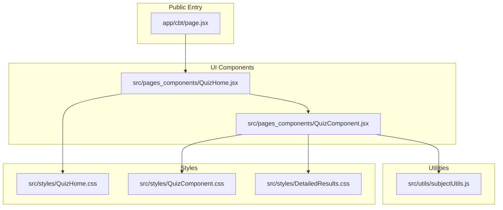
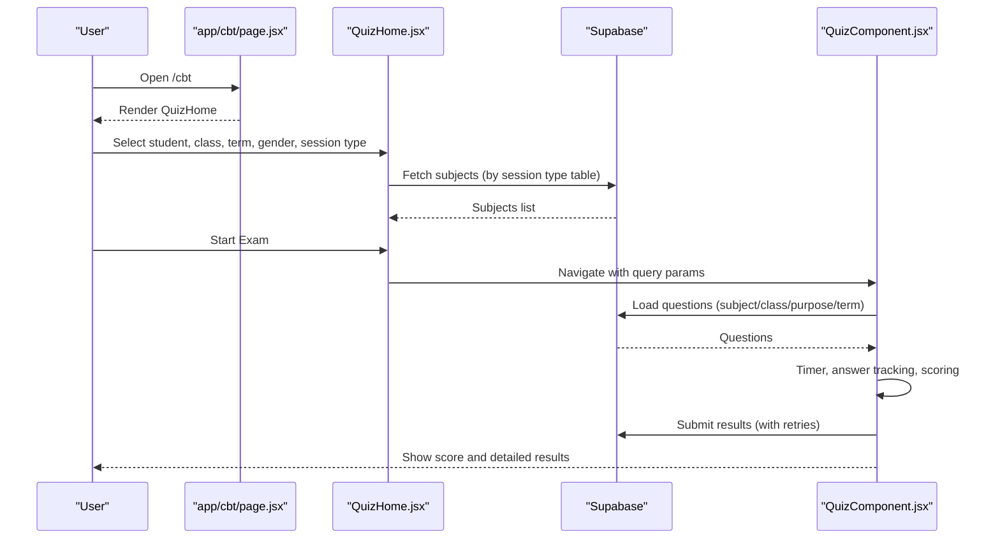
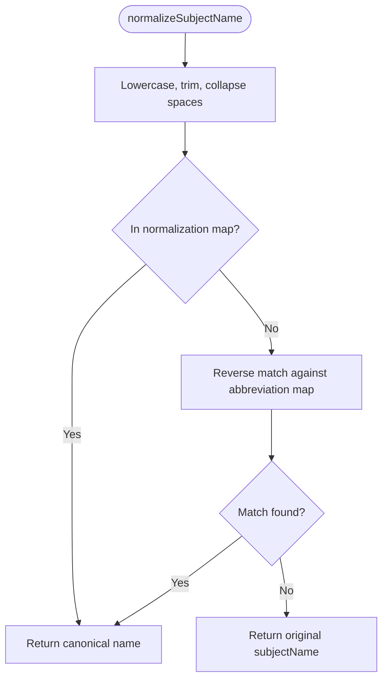
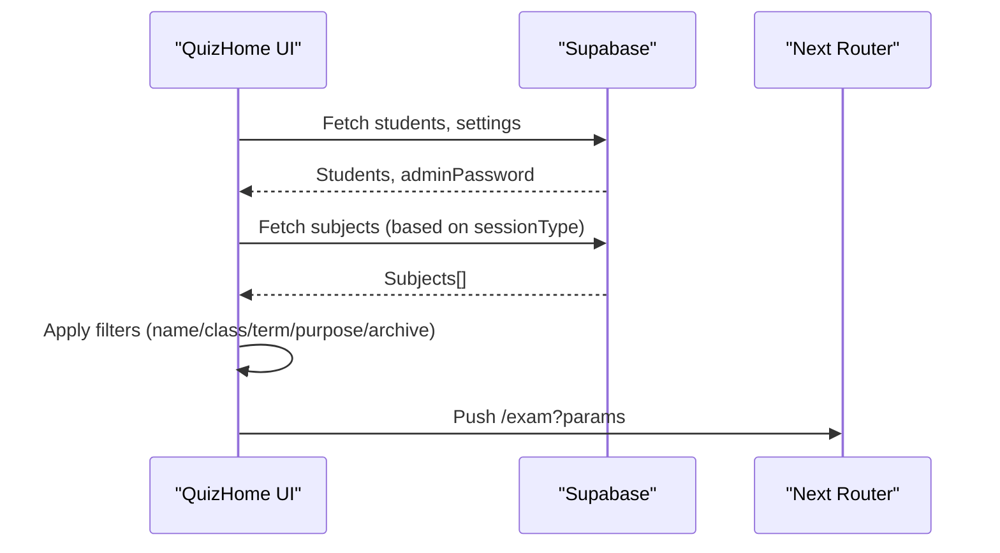
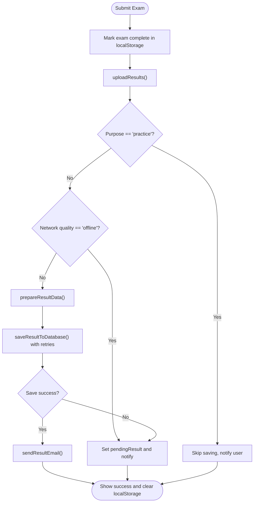
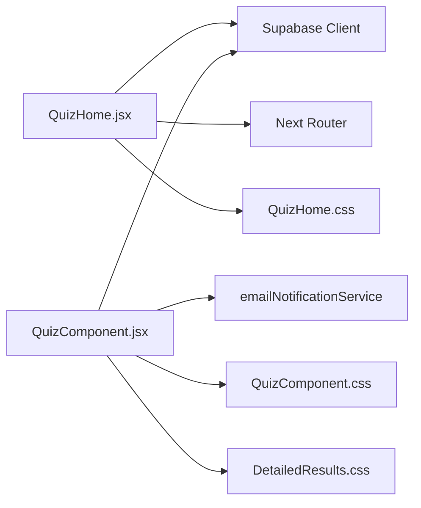

# Exam Utilities and Supporting Functions

<cite>
**Referenced Files in This Document**   
- [subjectUtils.js](file://src/utils/subjectUtils.js)
- [QuizComponent.jsx](file://src/pages_components/QuizComponent.jsx)
- [QuizHome.jsx](file://src/pages_components/QuizHome.jsx)
- [page.jsx](file://app/cbt/page.jsx)
- [QuizComponent.css](file://src/styles/QuizComponent.css)
- [DetailedResults.css](file://src/styles/DetailedResults.css)
- [QuizHome.css](file://src/styles/QuizHome.css)
</cite>

## Table of Contents
1. [Introduction](#introduction)
2. [Project Structure](#project-structure)
3. [Core Components](#core-components)
4. [Architecture Overview](#architecture-overview)
5. [Detailed Component Analysis](#detailed-component-analysis)
6. [Dependency Analysis](#dependency-analysis)
7. [Performance Considerations](#performance-considerations)
8. [Troubleshooting Guide](#troubleshooting-guide)
9. [Conclusion](#conclusion)
10. [Appendices](#appendices)

## Introduction
This document explains the utility functions and styling that support the CBT system, focusing on:
- Subject management utilities for categorization, normalization, abbreviation handling, and exam configuration helpers
- CSS styles for quiz components, result displays, and responsive design patterns
- Practical examples for adding new subjects, customizing exam layouts, and extending the styling system
- Performance optimizations, cross-browser compatibility, and accessibility considerations

## Project Structure
The CBT feature spans a small set of focused modules:
- Utility layer: subject naming, abbreviations, and canonical subject lists
- UI layers: home page to select exams and the exam-taking interface
- Styling: component-specific CSS with responsive and print rules
- Routing entry point for the public CBT experience

**Diagram sources**
- [page.jsx:1-11](file://app/cbt/page.jsx#L1-L11)
- [QuizHome.jsx:1-508](file://src/pages_components/QuizHome.jsx#L1-L508)
- [QuizComponent.jsx:1-1644](file://src/pages_components/QuizComponent.jsx#L1-L1644)
- [subjectUtils.js:1-392](file://src/utils/subjectUtils.js#L1-L392)
- [QuizHome.css:1-193](file://src/styles/QuizHome.css#L1-L193)
- [QuizComponent.css:1-218](file://src/styles/QuizComponent.css#L1-L218)
- [DetailedResults.css:1-185](file://src/styles/DetailedResults.css#L1-L185)

**Section sources**
- [page.jsx:1-11](file://app/cbt/page.jsx#L1-L11)
- [QuizHome.jsx:1-508](file://src/pages_components/QuizHome.jsx#L1-L508)
- [QuizComponent.jsx:1-1644](file://src/pages_components/QuizComponent.jsx#L1-L1644)
- [subjectUtils.js:1-392](file://src/utils/subjectUtils.js#L1-L392)
- [QuizHome.css:1-193](file://src/styles/QuizHome.css#L1-L193)
- [QuizComponent.css:1-218](file://src/styles/QuizComponent.css#L1-L218)
- [DetailedResults.css:1-185](file://src/styles/DetailedResults.css#L1-L185)

## Core Components
- Subject utilities (subjectUtils.js):
  - Abbreviation mapping and reverse mapping
  - Normalization of subject names across variations
  - Canonical school subjects by class level
  - Standard remarks and grade-to-remark mappings
- Quiz home (QuizHome.jsx):
  - Student selection, filters, session type selection
  - Fetches available subjects from database tables based on session type
  - Navigates to the exam route with query parameters
- Quiz component (QuizComponent.jsx):
  - Loads questions via Supabase using subject/class/purpose/term filters
  - Manages timer, answers, score calculation, and submission
  - Handles network reliability, local auto-save, retry logic, and email notifications
  - Provides detailed results view and printable review

**Section sources**
- [subjectUtils.js:1-392](file://src/utils/subjectUtils.js#L1-L392)
- [QuizHome.jsx:1-508](file://src/pages_components/QuizHome.jsx#L1-L508)
- [QuizComponent.jsx:1-1644](file://src/pages_components/QuizComponent.jsx#L1-L1644)

## Architecture Overview
The CBT flow starts at the public entry page, which renders the home screen where students choose an exam. The home screen queries available subjects and navigates to the exam route. The exam component loads questions, manages the test session, and submits results back to the database with retries and offline fallbacks.

**Diagram sources**
- [page.jsx:1-11](file://app/cbt/page.jsx#L1-L11)
- [QuizHome.jsx:107-176](file://src/pages_components/QuizHome.jsx#L107-L176)
- [QuizComponent.jsx:59-143](file://src/pages_components/QuizComponent.jsx#L59-L143)
- [QuizComponent.jsx:1008-1095](file://src/pages_components/QuizComponent.jsx#L1008-L1095)

## Detailed Component Analysis

### Subject Management Utilities (subjectUtils.js)
Key responsibilities:
- Abbreviate and expand subject names consistently
- Normalize subject names to canonical forms
- Provide standardized remarks and grade-based remark options
- Define canonical subject lists per class level

Important exports and data structures:
- SUBJECT_ABBREVIATIONS: Maps full subject names to short codes
- ABBREVIATION_TO_FULL: Reverse map for expansion
- normalizeSubjectName(subjectName): Normalizes input to canonical form
- abbreviateSubject(subjectName): Returns abbreviation if mapped
- expandSubjectAbbreviation(abbr): Expands abbreviation to full name
- STANDARD_REMARKS and GRADE_REMARKS: Lists and mappings for remarks
- schoolSubjects: Class-level canonical subject arrays

Complexity notes:
- Abbreviation lookup is O(1) average due to object key access
- Normalization involves lowercasing, trimming, and optional reverse-map search; overall O(k) where k is number of entries in normalization map or abbreviation map

Error handling:
- If no mapping found, returns original input to avoid breaking downstream logic

Extensibility:
- Add new subjects by updating schoolSubjects per class
- Extend normalization map for new variations
- Update abbreviation maps for consistent display

**Diagram sources**
- [subjectUtils.js:163-185](file://src/utils/subjectUtils.js#L163-L185)

**Section sources**
- [subjectUtils.js:1-392](file://src/utils/subjectUtils.js#L1-L392)

### Quiz Home (QuizHome.jsx)
Responsibilities:
- Collect student details and validate existence
- Fetch profile picture and subjects from Supabase
- Filter subjects by name, class, term, purpose, and archive status
- Support multiple session types (objective, completion, essay)
- Navigate to exam route with normalized parameters

Data flow:
- On mount, fetch admin password and student list
- When student fields change, attempt to load passport image
- When sessionType changes, re-fetch subjects from appropriate table
- Filtering computes archived status based on updated_at timestamp
- Starting an exam constructs URLSearchParams and navigates to /exam

**Diagram sources**
- [QuizHome.jsx:35-136](file://src/pages_components/QuizHome.jsx#L35-L136)
- [QuizHome.jsx:151-176](file://src/pages_components/QuizHome.jsx#L151-L176)
- [QuizHome.jsx:196-226](file://src/pages_components/QuizHome.jsx#L196-L226)

**Section sources**
- [QuizHome.jsx:1-508](file://src/pages_components/QuizHome.jsx#L1-L508)

### Quiz Component (QuizComponent.jsx)
Responsibilities:
- Load questions based on query parameters
- Manage timer, navigation, and answer state
- Calculate score and display results
- Persist progress locally and upload to database with retries
- Send email notifications upon successful submission
- Provide detailed results modal and printable review

Key flows:
- Question loading: Query Supabase with subject/class/purpose/term filters
- Timer: Countdown and auto-submit when time expires
- Answer handling: Update answers, recalculate score, auto-save to localStorage
- Submission: Prepare result data, save to database with retry logic, send email
- Results: Display score, allow download, show detailed results modal

**Diagram sources**
- [QuizComponent.jsx:353-366](file://src/pages_components/QuizComponent.jsx#L353-L366)
- [QuizComponent.jsx:1008-1095](file://src/pages_components/QuizComponent.jsx#L1008-L1095)
- [QuizComponent.jsx:931-1006](file://src/pages_components/QuizComponent.jsx#L931-L1006)

**Section sources**
- [QuizComponent.jsx:1-1644](file://src/pages_components/QuizComponent.jsx#L1-L1644)

### Styling System
- QuizComponent.css:
  - Navbar, quiz info grid, question sections, answer buttons, preview items
  - Score modal and lock screen styles
  - Responsive adjustments for mobile screens
- DetailedResults.css:
  - Modal animations, tab styles, hover effects
  - Print-specific rules for A4 layout, color preservation, hiding controls
  - Responsive and accessibility improvements
- QuizHome.css:
  - Title decoration, card hover effects, instructions panel
  - Filter inputs and focus states
  - Dark mode overrides driven by html[data-theme="dark"]

Responsive patterns:
- Media queries adjust font sizes, navbar width, and grid layouts for smaller screens
- Grid templates use auto-fit and minmax for flexible layouts

Accessibility:
- Focus outlines for interactive elements in detailed results
- High contrast text colors and readable typography
- Print styles ensure readability and hide non-printable UI

Cross-browser compatibility:
- Uses standard CSS properties and widely supported features
- Print-color-adjust and color-adjust for color fidelity during printing
- Avoids vendor-specific hacks except where necessary for print behavior

**Section sources**
- [QuizComponent.css:1-218](file://src/styles/QuizComponent.css#L1-L218)
- [DetailedResults.css:1-185](file://src/styles/DetailedResults.css#L1-L185)
- [QuizHome.css:1-193](file://src/styles/QuizHome.css#L1-L193)

## Dependency Analysis
- QuizHome depends on Supabase for students and subjects, and Next router for navigation
- QuizComponent depends on Supabase for questions and settings, and email notification service
- Both components import Bootstrap CSS and react-toastify styles
- Styles are scoped per component but share common conventions

**Diagram sources**
- [QuizHome.jsx:1-508](file://src/pages_components/QuizHome.jsx#L1-L508)
- [QuizComponent.jsx:1-1644](file://src/pages_components/QuizComponent.jsx#L1-L1644)

**Section sources**
- [QuizHome.jsx:1-508](file://src/pages_components/QuizHome.jsx#L1-L508)
- [QuizComponent.jsx:1-1644](file://src/pages_components/QuizComponent.jsx#L1-L1644)

## Performance Considerations
- Database queries:
  - Use targeted filters (subject, class, purpose, term) to minimize payload size
  - Limit repeated queries by caching subjects in component state
- Local storage:
  - Auto-save reduces data loss risk and improves perceived performance
  - Clearing localStorage after successful save prevents stale data accumulation
- Network monitoring:
  - Periodic latency checks inform user feedback and prevent unnecessary retries
- Rendering:
  - Avoid heavy computations inside render loops; compute categories and scores incrementally
- Print generation:
  - Inline styles in generated HTML ensure consistent output without external dependencies

[No sources needed since this section provides general guidance]

## Troubleshooting Guide
Common issues and resolutions:
- No questions found:
  - Verify subject/class/purpose/term parameters match database records
  - Check console logs for query parameters and available records
- Save failures:
  - Inspect network status indicator and retry attempts
  - Use “Retry Save” when connection is restored
- Email not sent:
  - Confirm admin email exists in settings and recipients list
  - Review toast messages for error details
- Print output missing colors:
  - Ensure print-color-adjust is applied and browser supports it
  - Use “Save as PDF” in print dialog for best results

**Section sources**
- [QuizComponent.jsx:110-143](file://src/pages_components/QuizComponent.jsx#L110-L143)
- [QuizComponent.jsx:1008-1095](file://src/pages_components/QuizComponent.jsx#L1008-L1095)
- [QuizComponent.jsx:931-1006](file://src/pages_components/QuizComponent.jsx#L931-L1006)

## Conclusion
The CBT system combines robust subject utilities, resilient exam workflows, and thoughtful styling to deliver a reliable testing experience. Subject normalization and canonical lists ensure consistency across classes and terms. The exam component handles real-time interactions, persistence, and recovery, while the styling system provides responsive, accessible, and printable interfaces. Extending the system involves updating subject mappings, adjusting filters, and augmenting styles with dark mode and responsive rules.

[No sources needed since this section summarizes without analyzing specific files]

## Appendices

### Adding New Subjects
Steps:
- Update schoolSubjects in subjectUtils.js with canonical subject names per class
- If needed, add normalization entries for new variations
- Optionally update abbreviation mappings for consistent display
- Ensure database records include the new subject with correct class, purpose, and term

**Section sources**
- [subjectUtils.js:190-392](file://src/utils/subjectUtils.js#L190-L392)

### Customizing Exam Layouts
Guidelines:
- Modify QuizComponent.css for navbar, quiz info grid, question sections, and score modal
- Adjust DetailedResults.css for modal animations, tabs, and print layout
- Use QuizHome.css for title decoration, card hover effects, and instruction panels
- Leverage media queries for responsive behavior and dark mode overrides

**Section sources**
- [QuizComponent.css:1-218](file://src/styles/QuizComponent.css#L1-L218)
- [DetailedResults.css:1-185](file://src/styles/DetailedResults.css#L1-L185)
- [QuizHome.css:1-193](file://src/styles/QuizHome.css#L1-L193)

### Extending the Styling System
Recommendations:
- Adopt CSS variables for theme consistency (e.g., container backgrounds, shadow colors)
- Maintain dark mode via html[data-theme="dark"] selectors
- Keep print styles centralized and test across browsers
- Ensure focus states and high contrast for accessibility

**Section sources**
- [QuizHome.css:99-193](file://src/styles/QuizHome.css#L99-L193)
- [DetailedResults.css:159-185](file://src/styles/DetailedResults.css#L159-L185)