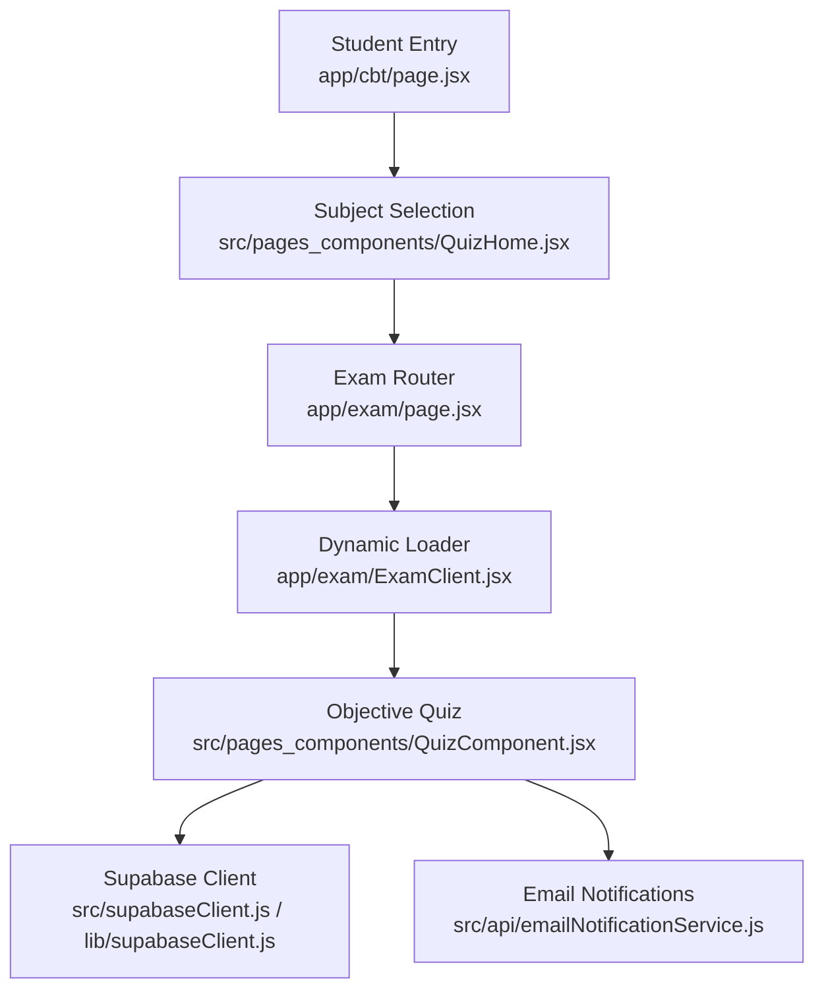
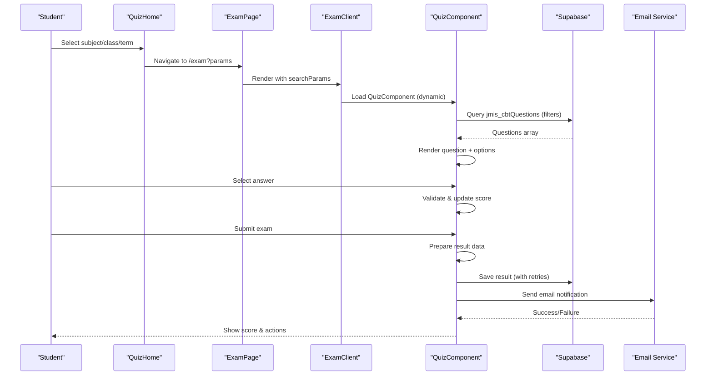
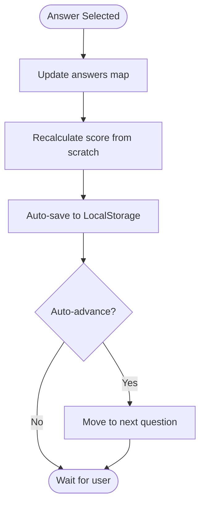
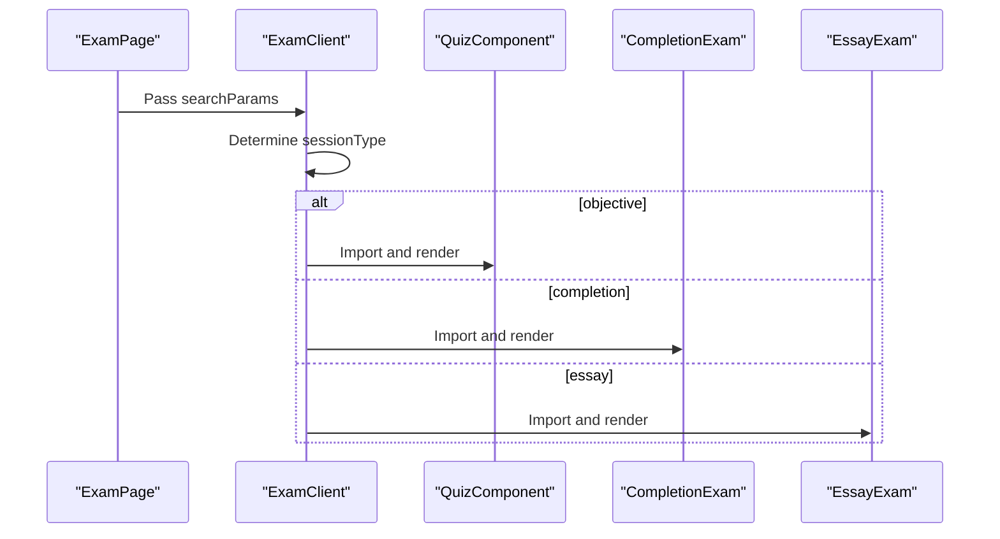
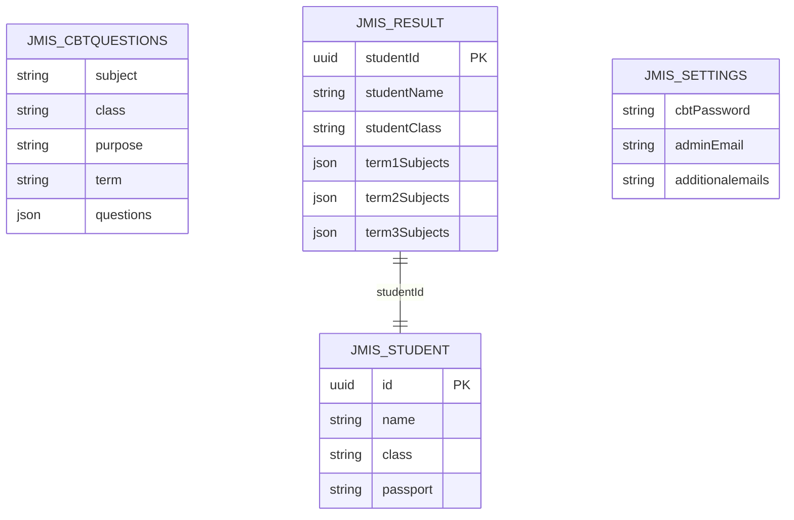
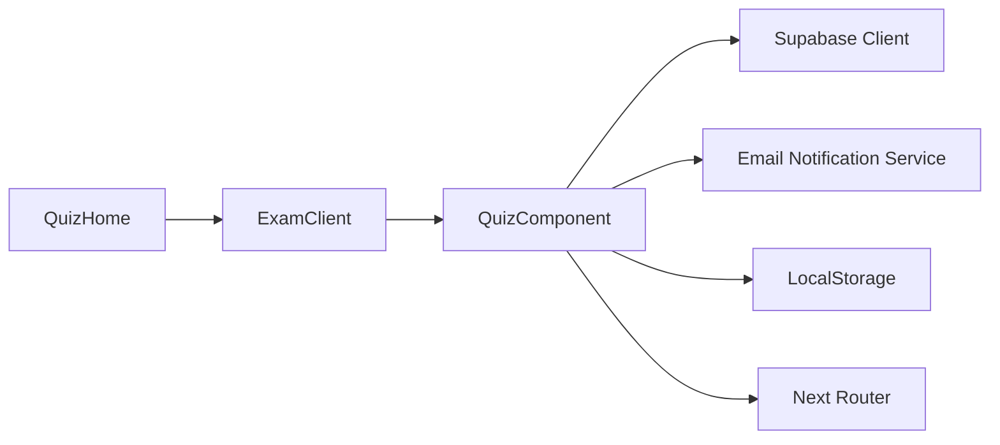

# Objective Multiple Choice Exams

<cite>
**Referenced Files in This Document**
- [QuizComponent.jsx](file://src/pages_components/QuizComponent.jsx)
- [ExamClient.jsx](file://app/exam/ExamClient.jsx)
- [page.jsx (exam)](file://app/exam/page.jsx)
- [page.jsx (cbt)](file://app/cbt/page.jsx)
- [QuizHome.jsx](file://src/pages_components/QuizHome.jsx)
- [subjectUtils.js](file://src/utils/subjectUtils.js)
- [emailNotificationService.js](file://src/api/emailNotificationService.js)
- [supabaseClient.js (src)](file://src/supabaseClient.js)
- [supabaseClient.js (lib)](file://lib/supabaseClient.js)
- [QuizComponent.css](file://src/styles/QuizComponent.css)
</cite>

## Table of Contents
1. [Introduction](#introduction)
2. [Project Structure](#project-structure)
3. [Core Components](#core-components)
4. [Architecture Overview](#architecture-overview)
5. [Detailed Component Analysis](#detailed-component-analysis)
6. [Dependency Analysis](#dependency-analysis)
7. [Performance Considerations](#performance-considerations)
8. [Troubleshooting Guide](#troubleshooting-guide)
9. [Conclusion](#conclusion)
10. [Appendices](#appendices)

## Introduction
This document explains the objective multiple choice exam implementation used by students to take timed, auto-scored quizzes and have results saved to a database with email notifications. It covers how questions are fetched from Supabase, rendered to students, validated on selection, scored automatically, and persisted with robust offline handling. It also documents the ExamClient component’s role in dynamic loading and routing, performance optimizations for large question sets, and accessibility considerations.

## Project Structure
The exam flow is split across Next.js pages and React components:
- The student entry point renders a subject selection UI that navigates to an exam page.
- The exam page dynamically loads the appropriate exam component based on session type.
- The QuizComponent handles fetching questions, rendering, answering, scoring, saving results, and sending notifications.

**Diagram sources**
- [page.jsx (cbt):1-11](file://app/cbt/page.jsx#L1-L11)
- [QuizHome.jsx:151-176](file://src/pages_components/QuizHome.jsx#L151-L176)
- [page.jsx (exam):1-12](file://app/exam/page.jsx#L1-L12)
- [ExamClient.jsx:1-46](file://app/exam/ExamClient.jsx#L1-L46)
- [QuizComponent.jsx:60-143](file://src/pages_components/QuizComponent.jsx#L60-L143)
- [supabaseClient.js (src):1-7](file://src/supabaseClient.js#L1-L7)
- [emailNotificationService.js:70-121](file://src/api/emailNotificationService.js#L70-L121)

**Section sources**
- [page.jsx (cbt):1-11](file://app/cbt/page.jsx#L1-L11)
- [QuizHome.jsx:151-176](file://src/pages_components/QuizHome.jsx#L151-L176)
- [page.jsx (exam):1-12](file://app/exam/page.jsx#L1-L12)
- [ExamClient.jsx:1-46](file://app/exam/ExamClient.jsx#L1-L46)

## Core Components
- QuizComponent: Central client component for objective exams. It fetches questions, manages state (answers, score, timer), validates selections, auto-saves progress, submits results, and sends notifications.
- ExamClient: Dynamic loader that chooses between objective, completion, or essay exam components based on URL parameters.
- QuizHome: Subject selection and navigation to the exam route with query parameters.
- Utilities and services: Supabase clients, subject normalization utilities, and email notification service.

Key responsibilities:
- Fetching questions via Supabase with filters (subject, class, purpose, term).
- Rendering one question at a time with answer options.
- Immediate validation and live score recalculation.
- Timer enforcement and lock screen protection.
- LocalStorage auto-save and resume.
- Persisting results to the database with retry logic and offline fallback.
- Sending email notifications after successful submission.

**Section sources**
- [QuizComponent.jsx:20-143](file://src/pages_components/QuizComponent.jsx#L20-L143)
- [ExamClient.jsx:22-45](file://app/exam/ExamClient.jsx#L22-L45)
- [QuizHome.jsx:151-176](file://src/pages_components/QuizHome.jsx#L151-L176)

## Architecture Overview
The system follows a client-side data-driven flow:
- Student selects a subject and starts an exam.
- The exam router dynamically loads the correct component.
- The quiz component queries Supabase for matching questions.
- Students answer questions; answers are validated immediately and score updated.
- On submit, results are prepared, saved to the database, and emails are sent.
- Network issues trigger local save and retry mechanisms.

**Diagram sources**
- [QuizHome.jsx:151-176](file://src/pages_components/QuizHome.jsx#L151-L176)
- [page.jsx (exam):1-12](file://app/exam/page.jsx#L1-L12)
- [ExamClient.jsx:1-46](file://app/exam/ExamClient.jsx#L1-L46)
- [QuizComponent.jsx:60-143](file://src/pages_components/QuizComponent.jsx#L60-L143)
- [QuizComponent.jsx:823-929](file://src/pages_components/QuizComponent.jsx#L823-L929)
- [emailNotificationService.js:70-121](file://src/api/emailNotificationService.js#L70-L121)

## Detailed Component Analysis

### QuizComponent: Question Rendering, Answer Validation, Auto-Scoring, Progress Tracking
- Question fetching: Queries Supabase table with filters for subject, class, purpose, and term. Logs diagnostic info and handles empty results gracefully.
- Rendering: Displays current question number, question text, and answer options. Provides preview dots indicating answered/unanswered status.
- Answer validation: On option click, updates answers map and recalculates score by iterating all answers and checking each selected option’s correctness flag.
- Auto-scoring: Live score updates per selection; displayed totals adjust based on exam purpose (e.g., capped scores for certain purposes).
- Progress tracking: Stores answers, current question index, time left, and timestamp in LocalStorage; restores previous session if available.
- Timer: Countdown timer enforced; locks exam when tab loses focus; prevents accidental exits without admin password.
- Submission: Prepares result data, saves to database with retry logic, sends email notifications, clears LocalStorage on success, and shows detailed results modal.

**Diagram sources**
- [QuizComponent.jsx:261-279](file://src/pages_components/QuizComponent.jsx#L261-L279)
- [QuizComponent.jsx:281-339](file://src/pages_components/QuizComponent.jsx#L281-L339)

**Section sources**
- [QuizComponent.jsx:60-143](file://src/pages_components/QuizComponent.jsx#L60-L143)
- [QuizComponent.jsx:194-239](file://src/pages_components/QuizComponent.jsx#L194-L239)
- [QuizComponent.jsx:261-339](file://src/pages_components/QuizComponent.jsx#L261-L339)
- [QuizComponent.jsx:1155-1352](file://src/pages_components/QuizComponent.jsx#L1155-L1352)

### ExamClient: Dynamic Loading and Routing
- Dynamically imports exam components to avoid SSR issues.
- Determines session type from URL parameters and renders the corresponding component (objective, completion, or essay).
- Provides a loading placeholder while components load.

**Diagram sources**
- [ExamClient.jsx:1-46](file://app/exam/ExamClient.jsx#L1-L46)
- [page.jsx (exam):1-12](file://app/exam/page.jsx#L1-L12)

**Section sources**
- [ExamClient.jsx:1-46](file://app/exam/ExamClient.jsx#L1-L46)
- [page.jsx (exam):1-12](file://app/exam/page.jsx#L1-L12)

### QuizHome: Navigation and Parameters
- Collects student details and filters subjects.
- Builds query parameters including name, class, term, gender, subject, duration, purpose, and sessionType.
- Navigates to the exam route to start the chosen exam.

**Section sources**
- [QuizHome.jsx:151-176](file://src/pages_components/QuizHome.jsx#L151-L176)
- [page.jsx (cbt):1-11](file://app/cbt/page.jsx#L1-L11)

### Data Models and Database Integration
- Questions are stored in a Supabase table with fields for subject, class, purpose, term, and a questions array containing questionText and answerOptions (each with answerText and isCorrect).
- Results are saved to a results table keyed by studentId and term-specific subject arrays, with fields for test/exam/project scores, grade, remark, and total.
- Settings include admin password and email recipients for notifications.

**Diagram sources**
- [QuizComponent.jsx:60-143](file://src/pages_components/QuizComponent.jsx#L60-L143)
- [QuizComponent.jsx:823-929](file://src/pages_components/QuizComponent.jsx#L823-L929)
- [emailNotificationService.js:24-56](file://src/api/emailNotificationService.js#L24-L56)

**Section sources**
- [QuizComponent.jsx:60-143](file://src/pages_components/QuizComponent.jsx#L60-L143)
- [QuizComponent.jsx:823-929](file://src/pages_components/QuizComponent.jsx#L823-L929)
- [emailNotificationService.js:24-56](file://src/api/emailNotificationService.js#L24-L56)

### Email Notifications
- Composes subject and message with student details, performance summary, and detailed breakdown.
- Retrieves configured recipients from settings and calls the API endpoint to send emails.
- Handles success/failure with toast feedback.

**Section sources**
- [QuizComponent.jsx:931-1006](file://src/pages_components/QuizComponent.jsx#L931-L1006)
- [emailNotificationService.js:70-121](file://src/api/emailNotificationService.js#L70-L121)

### Subject Utilities
- Normalizes subject names and provides mappings for canonical forms.
- Supplies school-specific subject lists per class level used during result preparation.

**Section sources**
- [subjectUtils.js:103-188](file://src/utils/subjectUtils.js#L103-L188)
- [subjectUtils.js:190-392](file://src/utils/subjectUtils.js#L190-L392)

## Dependency Analysis
- QuizComponent depends on:
  - Supabase client for querying questions and saving results.
  - Email notification service for sending alerts.
  - LocalStorage for auto-save/resume.
  - Next.js navigation for post-exam routing.
- ExamClient depends on Next.js dynamic imports to avoid SSR issues and route to the correct exam component.
- QuizHome depends on Supabase to list subjects and navigate to the exam route.

**Diagram sources**
- [QuizComponent.jsx:60-143](file://src/pages_components/QuizComponent.jsx#L60-L143)
- [emailNotificationService.js:70-121](file://src/api/emailNotificationService.js#L70-L121)
- [ExamClient.jsx:1-46](file://app/exam/ExamClient.jsx#L1-L46)
- [QuizHome.jsx:151-176](file://src/pages_components/QuizHome.jsx#L151-L176)

**Section sources**
- [QuizComponent.jsx:60-143](file://src/pages_components/QuizComponent.jsx#L60-L143)
- [ExamClient.jsx:1-46](file://app/exam/ExamClient.jsx#L1-L46)
- [QuizHome.jsx:151-176](file://src/pages_components/QuizHome.jsx#L151-L176)

## Performance Considerations
- Large question sets:
  - Render one question at a time to minimize DOM overhead.
  - Avoid re-fetching questions on every interaction; cache in component state.
  - Use efficient score recalculation by iterating only the answers map once per change.
- Network resilience:
  - Periodic network quality checks inform users and prevent futile saves when offline.
  - Retry logic with delays reduces transient failure impact.
  - LocalStorage persistence ensures progress is not lost during outages.
- UI responsiveness:
  - Debounce heavy operations if needed (e.g., auto-save throttling).
  - Keep modal content lightweight; defer detailed review generation until requested.
- Accessibility:
  - Keyboard navigation for answer buttons and navigation controls.
  - High contrast and readable fonts; clear focus states.
  - Screen reader-friendly labels for question numbers and options.

[No sources needed since this section provides general guidance]

## Troubleshooting Guide
- No questions found:
  - Verify filters (subject, class, purpose, term) match database entries.
  - Check console logs for query diagnostics and available records.
- Save failures:
  - Inspect network status indicator; retry when connection restored.
  - Review retry attempts and pending result state; use “Retry Save” action.
- Email not sent:
  - Confirm recipients configured in settings.
  - Check API endpoint responses and error messages.
- Timer and lock screen:
  - Ensure admin password is correctly set in settings.
  - Tab visibility changes lock the exam; unlock requires correct password.

**Section sources**
- [QuizComponent.jsx:162-192](file://src/pages_components/QuizComponent.jsx#L162-L192)
- [QuizComponent.jsx:1008-1123](file://src/pages_components/QuizComponent.jsx#L1008-L1123)
- [emailNotificationService.js:24-56](file://src/api/emailNotificationService.js#L24-L56)

## Conclusion
The objective multiple choice exam system provides a robust, accessible, and resilient experience for students. It integrates seamlessly with Supabase for data retrieval and persistence, includes real-time validation and auto-scoring, and offers comprehensive offline handling and email notifications. The ExamClient enables flexible routing across different exam types, while the QuizComponent centralizes core functionality. With careful attention to performance and accessibility, the system scales effectively for large question sets and diverse student needs.

[No sources needed since this section summarizes without analyzing specific files]

## Appendices

### Adding New Objective Questions
- Create new entries in the questions table with:
  - Fields: subject, class, purpose, term, and a questions array.
  - Each question object should include questionText and answerOptions where each option has answerText and isCorrect.
- Ensure subject and class values align with normalized names and class-level subject lists.
- Test by selecting the corresponding subject/class/purpose/term in the student portal.

**Section sources**
- [QuizComponent.jsx:60-143](file://src/pages_components/QuizComponent.jsx#L60-L143)
- [subjectUtils.js:103-188](file://src/utils/subjectUtils.js#L103-L188)
- [subjectUtils.js:190-392](file://src/utils/subjectUtils.js#L190-L392)

### Customizing the Interface
- Modify styles in the component stylesheet for layout, colors, and responsive behavior.
- Adjust UI elements such as navbar, question sections, answer buttons, and score modal.
- Ensure accessibility improvements like keyboard focus and screen reader labels.

**Section sources**
- [QuizComponent.css:1-218](file://src/styles/QuizComponent.css#L1-L218)

### Implementing Scoring Logic
- Score calculation iterates through answers and checks each selected option’s correctness flag.
- Displayed totals may be adjusted based on exam purpose (e.g., caps for certain exam types).
- Grade mapping can be extended or customized as needed.

**Section sources**
- [QuizComponent.jsx:261-279](file://src/pages_components/QuizComponent.jsx#L261-L279)
- [QuizComponent.jsx:368-383](file://src/pages_components/QuizComponent.jsx#L368-L383)
- [QuizComponent.jsx:812-821](file://src/pages_components/QuizComponent.jsx#L812-L821)