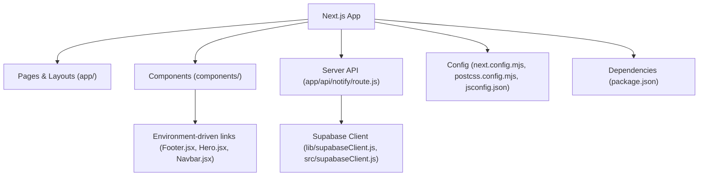
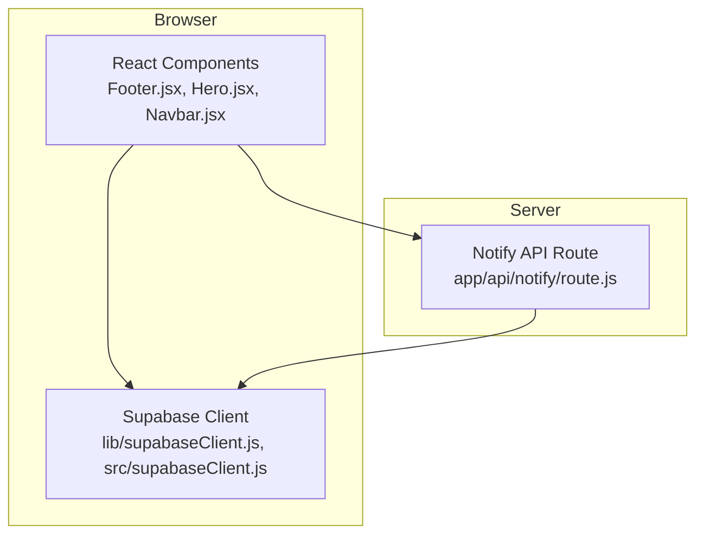
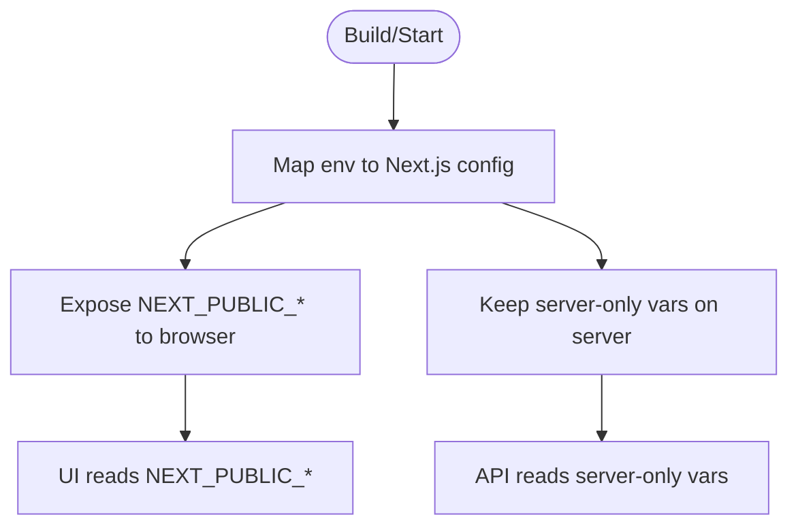
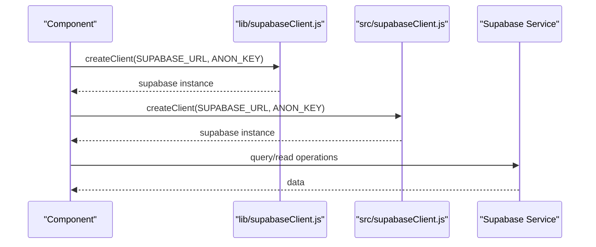
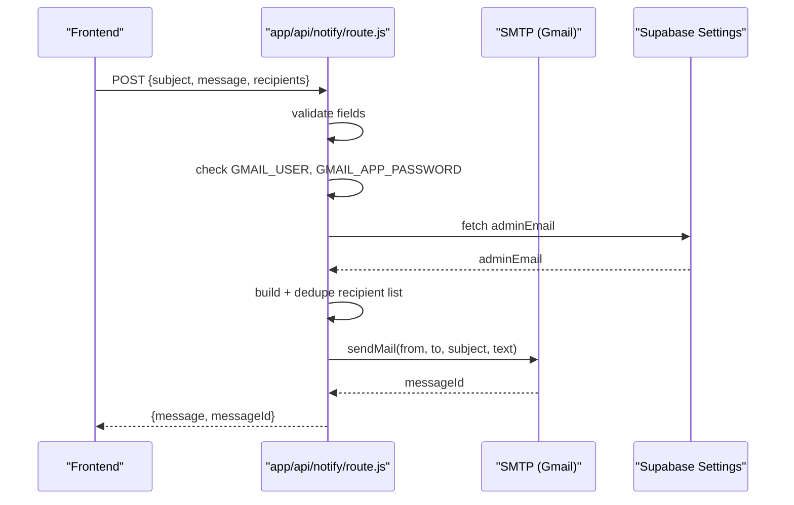
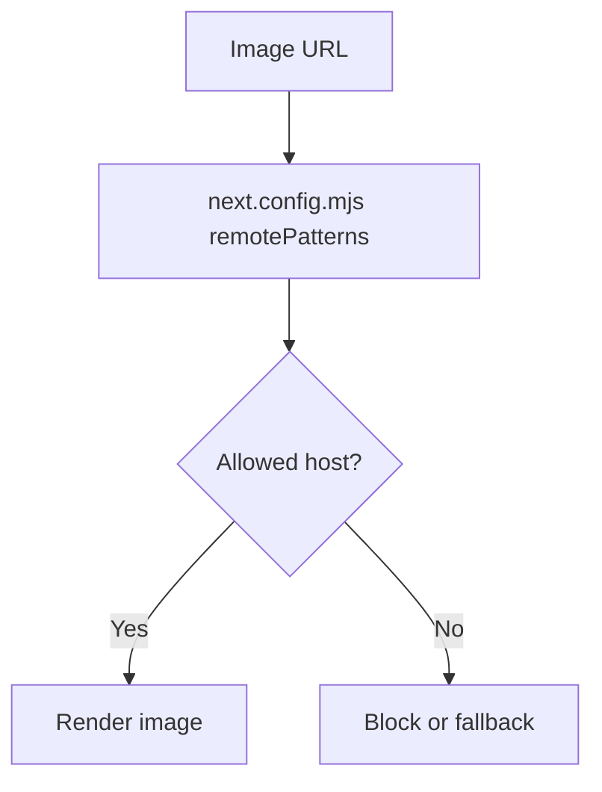
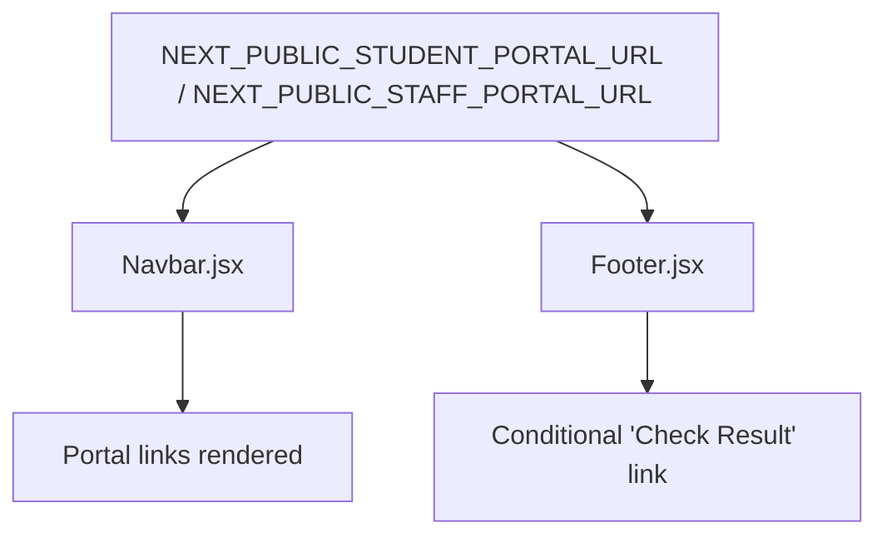
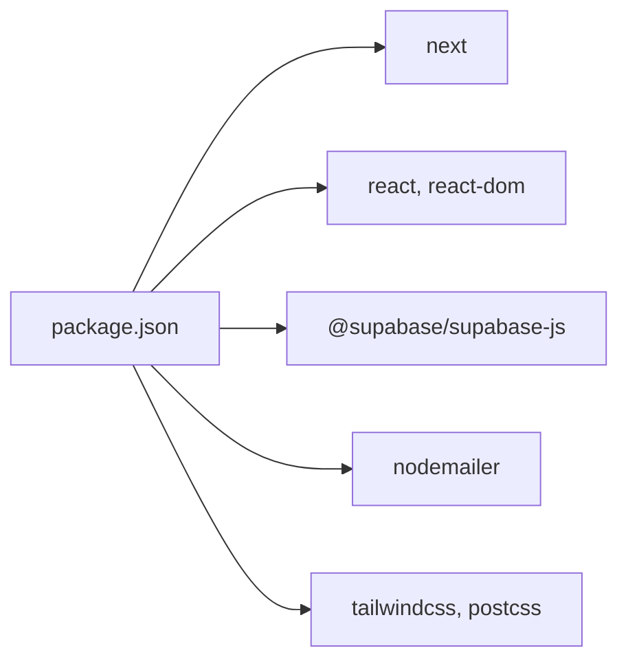

# Configuration and Deployment

<cite>
**Referenced Files in This Document**
- [package.json](file://package.json)
- [next.config.mjs](file://next.config.mjs)
- [jsconfig.json](file://jsconfig.json)
- [postcss.config.mjs](file://postcss.config.mjs)
- [lib/supabaseClient.js](file://lib/supabaseClient.js)
- [src/supabaseClient.js](file://src/supabaseClient.js)
- [app/api/notify/route.js](file://app/api/notify/route.js)
- [components/Footer.jsx](file://components/Footer.jsx)
- [components/Hero.jsx](file://components/Hero.jsx)
- [components/Navbar.jsx](file://components/Navbar.jsx)
</cite>

## Table of Contents
1. Introduction
2. Project Structure
3. Core Components
4. Architecture Overview
5. Detailed Component Analysis
6. Dependency Analysis
7. Performance Considerations
8. Troubleshooting Guide
9. Conclusion
10. Appendices

## Introduction
This document explains how to configure, build, and deploy the Next.js application for production. It covers environment variables, build configuration, deployment strategies, CDN usage for images, monitoring considerations, environment-specific behavior, and rollback procedures. The guidance is derived from the repository’s configuration files and runtime code paths.

## Project Structure
The project is a Next.js application with:
- App Router pages under app/
- Shared UI components under components/
- Client-side utilities and Supabase client under lib/ and src/
- Server API route for email notifications under app/api/notify/route.js
- Build and runtime configuration in next.config.mjs, package.json, postcss.config.mjs, and jsconfig.json

**Section sources**
- [package.json:1-33](file://package.json#L1-L33)
- [next.config.mjs:1-19](file://next.config.mjs#L1-L19)
- [postcss.config.mjs:1-200](file://postcss.config.mjs#L1-L200)
- [jsconfig.json:1-9](file://jsconfig.json#L1-L9)

## Core Components
- Environment variables are exposed to the browser via Next.js env mapping and consumed by Supabase clients and UI components.
- The server-only API route uses server-side credentials for sending emails.
- Image optimization is configured for remote patterns.

Key environment variables used across the app:
- NEXT_PUBLIC_SUPABASE_URL
- NEXT_PUBLIC_SUPABASE_ANON_KEY
- NEXT_PUBLIC_STUDENT_PORTAL_URL
- NEXT_PUBLIC_ADMIN_URL
- NEXT_PUBLIC_STAFF_PORTAL_URL
- GMAIL_USER
- GMAIL_APP_PASSWORD

These variables are read at build time or runtime depending on their prefix and usage context.

**Section sources**
- [next.config.mjs:4-9](file://next.config.mjs#L4-L9)
- [lib/supabaseClient.js:4-7](file://lib/supabaseClient.js#L4-L7)
- [src/supabaseClient.js:4-7](file://src/supabaseClient.js#L4-L7)
- [components/Navbar.jsx:23-24](file://components/Navbar.jsx#L23-L24)
- [components/Footer.jsx:59-70](file://components/Footer.jsx#L59-L70)
- [components/Hero.jsx:14](file://components/Hero.jsx#L14)
- [app/api/notify/route.js:21-22](file://app/api/notify/route.js#L21-L22)
- [app/api/notify/route.js:59-68](file://app/api/notify/route.js#L59-L68)

## Architecture Overview
The runtime architecture includes:
- Browser-facing components that read public environment variables to render links and connect to Supabase.
- A server API route that sends emails using SMTP credentials stored in environment variables and optionally reads admin email from Supabase settings.

**Diagram sources**
- [components/Footer.jsx:59-70](file://components/Footer.jsx#L59-L70)
- [components/Hero.jsx:14](file://components/Hero.jsx#L14)
- [components/Navbar.jsx:23-24](file://components/Navbar.jsx#L23-L24)
- [lib/supabaseClient.js:4-7](file://lib/supabaseClient.js#L4-L7)
- [src/supabaseClient.js:4-7](file://src/supabaseClient.js#L4-L7)
- [app/api/notify/route.js:28-46](file://app/api/notify/route.js#L28-L46)

## Detailed Component Analysis

### Environment Variables and Runtime Exposure
- Public variables are mapped in the Next.js config so they are available in the browser bundle.
- Components consume these variables to conditionally render links and features.
- Server-only variables are only accessible within server routes.

**Diagram sources**
- [next.config.mjs:4-9](file://next.config.mjs#L4-L9)
- [components/Navbar.jsx:23-24](file://components/Navbar.jsx#L23-L24)
- [components/Footer.jsx:59-70](file://components/Footer.jsx#L59-L70)
- [components/Hero.jsx:14](file://components/Hero.jsx#L14)
- [app/api/notify/route.js:21-22](file://app/api/notify/route.js#L21-L22)

**Section sources**
- [next.config.mjs:4-9](file://next.config.mjs#L4-L9)
- [components/Navbar.jsx:23-24](file://components/Navbar.jsx#L23-L24)
- [components/Footer.jsx:59-70](file://components/Footer.jsx#L59-L70)
- [components/Hero.jsx:14](file://components/Hero.jsx#L14)

### Supabase Client Initialization
- Two client instances exist: one in lib/ and one in src/. Both read the same public Supabase URL and anon key from environment variables.
- The lib client also provides a helper to construct storage URLs for public assets.

**Diagram sources**
- [lib/supabaseClient.js:4-12](file://lib/supabaseClient.js#L4-L12)
- [src/supabaseClient.js:4-7](file://src/supabaseClient.js#L4-L7)

**Section sources**
- [lib/supabaseClient.js:4-12](file://lib/supabaseClient.js#L4-L12)
- [src/supabaseClient.js:4-7](file://src/supabaseClient.js#L4-L7)

### Email Notification API
- The server route validates required fields, checks for configured SMTP credentials, resolves recipients (including admin email from Supabase), deduplicates them, and sends email via SMTP.
- Errors return appropriate status codes and messages.

**Diagram sources**
- [app/api/notify/route.js:48-114](file://app/api/notify/route.js#L48-L114)
- [app/api/notify/route.js:28-46](file://app/api/notify/route.js#L28-L46)

**Section sources**
- [app/api/notify/route.js:48-114](file://app/api/notify/route.js#L48-L114)
- [app/api/notify/route.js:28-46](file://app/api/notify/route.js#L28-L46)

### Image Optimization and Remote Patterns
- Images served from Supabase storage are whitelisted via Next.js remotePatterns configuration.
- Components use a helper to generate direct object URLs for public storage assets.

**Diagram sources**
- [next.config.mjs:10-15](file://next.config.mjs#L10-L15)
- [lib/supabaseClient.js:11-12](file://lib/supabaseClient.js#L11-L12)

**Section sources**
- [next.config.mjs:10-15](file://next.config.mjs#L10-L15)
- [lib/supabaseClient.js:11-12](file://lib/supabaseClient.js#L11-L12)

### Environment-Specific Behavior
- Student and Staff portal links are controlled by environment variables with safe defaults when not set.
- The Footer conditionally shows a “Check Result” link if the student portal URL is configured.

**Diagram sources**
- [components/Navbar.jsx:23-24](file://components/Navbar.jsx#L23-L24)
- [components/Footer.jsx:59-70](file://components/Footer.jsx#L59-L70)

**Section sources**
- [components/Navbar.jsx:23-24](file://components/Navbar.jsx#L23-L24)
- [components/Footer.jsx:59-70](file://components/Footer.jsx#L59-L70)

## Dependency Analysis
- The application depends on Next.js, React, Supabase client, Nodemailer, and styling tooling.
- Scripts define development, build, and start commands.

**Diagram sources**
- [package.json:11-27](file://package.json#L11-L27)

**Section sources**
- [package.json:1-33](file://package.json#L1-L33)

## Performance Considerations
- Use Next.js image optimization with remotePatterns to serve optimized images from Supabase storage.
- Keep environment variables minimal and scoped; avoid exposing secrets to the browser.
- Prefer static generation where possible; this project uses dynamic content from Supabase, which is fetched at runtime.
- Ensure CSS is tree-shaken and unused styles are removed by Tailwind/PostCSS pipeline.

[No sources needed since this section provides general guidance]

## Troubleshooting Guide
Common issues and resolutions:
- Email service not configured:
  - Ensure GMAIL_USER and GMAIL_APP_PASSWORD are set in the server environment.
  - The API returns an error if these are missing.
- No recipients resolved:
  - Verify admin email exists in Supabase settings and that additional recipients are correctly formatted.
- Supabase connection errors:
  - Confirm NEXT_PUBLIC_SUPABASE_URL and NEXT_PUBLIC_SUPABASE_ANON_KEY are correct.
- Image loading blocked:
  - Ensure the image host is included in next.config.mjs remotePatterns.

**Section sources**
- [app/api/notify/route.js:59-68](file://app/api/notify/route.js#L59-L68)
- [app/api/notify/route.js:91-94](file://app/api/notify/route.js#L91-L94)
- [lib/supabaseClient.js:4-7](file://lib/supabaseClient.js#L4-L7)
- [next.config.mjs:10-15](file://next.config.mjs#L10-L15)

## Conclusion
This project relies on clearly separated environment variables for browser and server contexts, a server-only email API, and Next.js image optimization for remote assets. Properly configuring environment variables, building with Next.js, and deploying with the correct runtime environment ensures reliable operation across development and production. Monitoring should focus on API logs and Supabase access patterns.

[No sources needed since this section summarizes without analyzing specific files]

## Appendices

### Environment Variables Reference
- NEXT_PUBLIC_SUPABASE_URL: Supabase project URL (browser and server).
- NEXT_PUBLIC_SUPABASE_ANON_KEY: Supabase anon key (browser and server).
- NEXT_PUBLIC_STUDENT_PORTAL_URL: Optional URL for student portal link.
- NEXT_PUBLIC_ADMIN_URL: Optional URL for admin portal link.
- NEXT_PUBLIC_STAFF_PORTAL_URL: Optional URL for staff portal link.
- GMAIL_USER: SMTP username for email sending (server-only).
- GMAIL_APP_PASSWORD: SMTP password/app password for email sending (server-only).

**Section sources**
- [next.config.mjs:4-9](file://next.config.mjs#L4-L9)
- [components/Navbar.jsx:23-24](file://components/Navbar.jsx#L23-L24)
- [components/Footer.jsx:59-70](file://components/Footer.jsx#L59-L70)
- [components/Hero.jsx:14](file://components/Hero.jsx#L14)
- [app/api/notify/route.js:21-22](file://app/api/notify/route.js#L21-L22)
- [app/api/notify/route.js:59-68](file://app/api/notify/route.js#L59-L68)

### Build and Run Commands
- Development: run the dev server.
- Build: produce a production build.
- Start: run the production server.
- Lint: run linting.

**Section sources**
- [package.json:5-9](file://package.json#L5-L9)

### CDN Assets Guidance
- Configure allowed hosts for images in next.config.mjs to enable Next.js image optimization for remote assets.
- Use the provided helper to generate storage URLs for public assets.

**Section sources**
- [next.config.mjs:10-15](file://next.config.mjs#L10-L15)
- [lib/supabaseClient.js:11-12](file://lib/supabaseClient.js#L11-L12)

### Monitoring Recommendations
- Monitor server logs for email API calls and errors.
- Track Supabase queries and storage access for performance insights.
- Set up alerts for failed email sends and database connectivity issues.

[No sources needed since this section provides general guidance]

### Rollback Procedures
- Maintain versioned builds using your hosting platform’s deployment history.
- Revert to a previous commit or artifact if a new release introduces regressions.
- Validate environment variables after rollback to ensure consistency.

[No sources needed since this section provides general guidance]