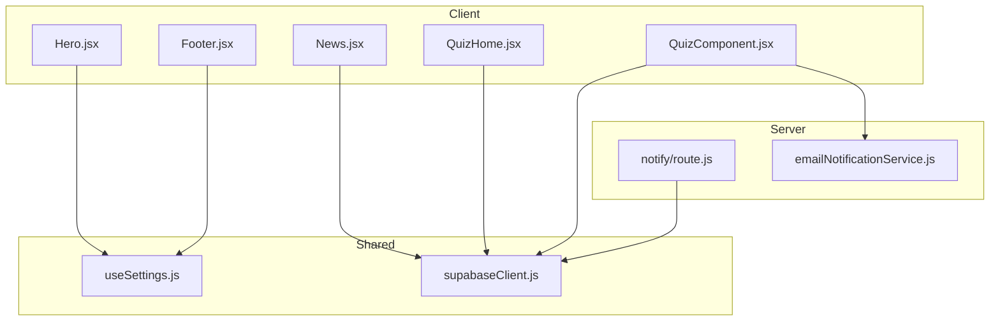
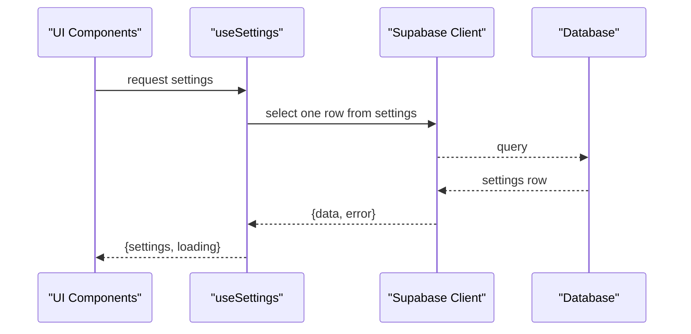
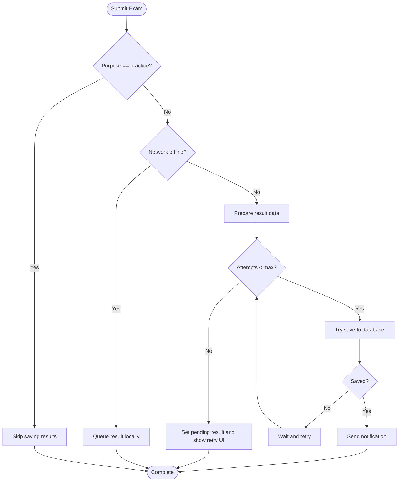
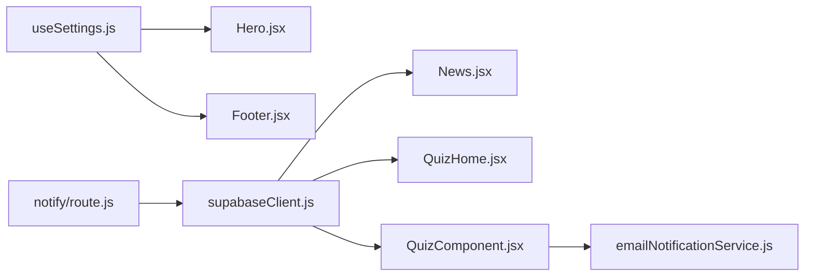

# Data Access Patterns

<cite>
**Referenced Files in This Document**
- [useSettings.js](file://lib/useSettings.js)
- [supabaseClient.js](file://lib/supabaseClient.js)
- [News.jsx](file://components/News.jsx)
- [Hero.jsx](file://components/Hero.jsx)
- [Footer.jsx](file://components/Footer.jsx)
- [QuizHome.jsx](file://src/pages_components/QuizHome.jsx)
- [QuizComponent.jsx](file://src/pages_components/QuizComponent.jsx)
- [route.js](file://app/api/notify/route.js)
- [emailNotificationService.js](file://src/api/emailNotificationService.js)
</cite>

## Table of Contents
1. [Introduction](#introduction)
2. [Project Structure](#project-structure)
3. [Core Components](#core-components)
4. [Architecture Overview](#architecture-overview)
5. [Detailed Component Analysis](#detailed-component-analysis)
6. [Dependency Analysis](#dependency-analysis)
7. [Performance Considerations](#performance-considerations)
8. [Troubleshooting Guide](#troubleshooting-guide)
9. [Conclusion](#conclusion)
10. [Appendices](#appendices)

## Introduction
This document explains how data is accessed and presented across the application, focusing on:
- Centralized settings retrieval via a shared hook
- Query patterns for reading and writing data through Supabase
- Caching strategies using local storage and server-side caching controls
- Real-time considerations and offline support
- Error handling patterns and best practices for consistency and performance

The goal is to provide clear guidance for implementing new data access flows that follow established conventions.

## Project Structure
Data access spans client components, Next.js pages, and server routes:
- Client components read marketing content from a single settings row and render UI accordingly
- The exam flow reads questions, writes results, and persists progress locally for resilience
- A server route sends email notifications while fetching recipients from settings

**Diagram sources**
- [Hero.jsx:1-101](file://components/Hero.jsx#L1-L101)
- [Footer.jsx:1-132](file://components/Footer.jsx#L1-L132)
- [News.jsx:1-60](file://components/News.jsx#L1-L60)
- [QuizHome.jsx:1-508](file://src/pages_components/QuizHome.jsx#L1-L508)
- [QuizComponent.jsx:1-1644](file://src/pages_components/QuizComponent.jsx#L1-L1644)
- [useSettings.js:1-25](file://lib/useSettings.js#L1-L25)
- [supabaseClient.js:1-13](file://lib/supabaseClient.js#L1-L13)
- [route.js:1-115](file://app/api/notify/route.js#L1-L115)
- [emailNotificationService.js:1-44](file://src/api/emailNotificationService.js#L1-L44)

**Section sources**
- [useSettings.js:1-25](file://lib/useSettings.js#L1-L25)
- [supabaseClient.js:1-13](file://lib/supabaseClient.js#L1-L13)
- [News.jsx:1-60](file://components/News.jsx#L1-L60)
- [Hero.jsx:1-101](file://components/Hero.jsx#L1-L101)
- [Footer.jsx:1-132](file://components/Footer.jsx#L1-L132)
- [QuizHome.jsx:1-508](file://src/pages_components/QuizHome.jsx#L1-L508)
- [QuizComponent.jsx:1-1644](file://src/pages_components/QuizComponent.jsx#L1-L1644)
- [route.js:1-115](file://app/api/notify/route.js#L1-L115)
- [emailNotificationService.js:1-44](file://src/api/emailNotificationService.js#L1-L44)

## Core Components
- useSettings hook: centralizes loading of a single settings row used by multiple marketing components
- Supabase clients: browser-side clients for public site and exam features; server-side client in API route
- News component: fetches announcements with graceful degradation if the table is missing
- Exam components: read questions, persist answers locally, write results with retry and offline fallback
- Notify route: server-only email sending with recipients resolved from settings

Key responsibilities:
- Settings-driven content rendering (hero, footer, contact)
- Read-heavy queries for announcements and subjects
- Write path for exam results with robust error handling and retries
- Offline-aware saving and recovery

**Section sources**
- [useSettings.js:1-25](file://lib/useSettings.js#L1-L25)
- [News.jsx:1-60](file://components/News.jsx#L1-L60)
- [QuizHome.jsx:1-508](file://src/pages_components/QuizHome.jsx#L1-L508)
- [QuizComponent.jsx:1-1644](file://src/pages_components/QuizComponent.jsx#L1-L1644)
- [route.js:1-115](file://app/api/notify/route.js#L1-L115)

## Architecture Overview
The data layer uses Supabase as the primary datastore. Marketing sections share a single settings row via a reusable hook. The exam flow combines network requests with local storage for resilience and includes retry logic and offline detection. Server routes encapsulate sensitive operations like email delivery.

**Diagram sources**
- [useSettings.js:1-25](file://lib/useSettings.js#L1-L25)
- [supabaseClient.js:1-13](file://lib/supabaseClient.js#L1-L13)

**Section sources**
- [useSettings.js:1-25](file://lib/useSettings.js#L1-L25)
- [supabaseClient.js:1-13](file://lib/supabaseClient.js#L1-L13)

## Detailed Component Analysis

### useSettings Hook: Centralized Settings Retrieval
- Purpose: Provide a single source of truth for marketing content managed in a settings table
- Behavior:
  - Loads a single row once on mount
  - Exposes settings object and loading state
  - Uses a cancellation flag to avoid stale updates after unmount
- Usage: Consumed by Hero, Footer, and other marketing components to render dynamic content

Best practices demonstrated:
- Minimal re-renders by fetching once
- Safe cleanup to prevent memory leaks or race conditions
- Centralized URL helper for public storage assets

Guidelines for extending:
- Add new fields to the settings row and consume them via the hook
- Keep the hook free of business logic; pass raw settings to components for presentation

**Section sources**
- [useSettings.js:1-25](file://lib/useSettings.js#L1-L25)
- [Hero.jsx:1-101](file://components/Hero.jsx#L1-L101)
- [Footer.jsx:1-132](file://components/Footer.jsx#L1-L132)

### News Component: Graceful Read Pattern
- Reads announcements filtered for public audience
- Orders by creation time and limits results
- Degrades gracefully when the table is missing or empty

Optimization notes:
- Select only needed columns
- Use limit to reduce payload size
- Handle errors by rendering an empty list instead of failing the page

**Section sources**
- [News.jsx:1-60](file://components/News.jsx#L1-L60)

### Exam Flow: Read, Persist, Write with Resilience
- Reading questions:
  - Filters by subject, class, purpose, and term
  - Logs diagnostics to aid troubleshooting
- Local persistence:
  - Auto-saves answers, score, current question, and time left to localStorage
  - Restores progress on load
- Writing results:
  - Prepares result payloads based on existing records
  - Upserts into the results table
  - Retries failed saves up to a configured number of attempts
  - Sends email notifications after successful save
- Offline support:
  - Monitors network quality periodically
  - Queues pending results when offline and offers retry

**Diagram sources**
- [QuizComponent.jsx:800-1200](file://src/pages_components/QuizComponent.jsx#L800-L1200)

**Section sources**
- [QuizComponent.jsx:1-1644](file://src/pages_components/QuizComponent.jsx#L1-L1644)

### QuizHome: Subject Listing and Routing
- Fetches available subjects based on session type
- Normalizes and formats data for display
- Routes to the exam page with search parameters

Query optimization:
- Selects only required fields
- Formats data client-side to minimize downstream processing

**Section sources**
- [QuizHome.jsx:1-508](file://src/pages_components/QuizHome.jsx#L1-L508)

### Notify Route: Server-Side Email Dispatch
- Validates input and environment configuration
- Resolves admin email from settings and deduplicates recipients
- Sends email via SMTP and returns structured responses

Error handling:
- Returns explicit error messages for missing credentials or no recipients
- Logs detailed errors for debugging

**Section sources**
- [route.js:1-115](file://app/api/notify/route.js#L1-L115)

### Email Notification Service: Reusable Sender
- Provides helpers to resolve recipients from settings
- Encapsulates email composition and dispatch logic

Usage pattern:
- Called after successful result submission to notify stakeholders

**Section sources**
- [emailNotificationService.js:1-44](file://src/api/emailNotificationService.js#L1-L44)

## Dependency Analysis
- Marketing components depend on the centralized settings hook and a shared Supabase client
- Exam components depend on a separate Supabase client instance for exam-specific tables
- Server route depends on environment variables and settings to determine recipients
- Email service abstracts recipient resolution and sending

**Diagram sources**
- [useSettings.js:1-25](file://lib/useSettings.js#L1-L25)
- [supabaseClient.js:1-13](file://lib/supabaseClient.js#L1-L13)
- [News.jsx:1-60](file://components/News.jsx#L1-L60)
- [Hero.jsx:1-101](file://components/Hero.jsx#L1-L101)
- [Footer.jsx:1-132](file://components/Footer.jsx#L1-L132)
- [QuizHome.jsx:1-508](file://src/pages_components/QuizHome.jsx#L1-L508)
- [QuizComponent.jsx:1-1644](file://src/pages_components/QuizComponent.jsx#L1-L1644)
- [route.js:1-115](file://app/api/notify/route.js#L1-L115)
- [emailNotificationService.js:1-44](file://src/api/emailNotificationService.js#L1-L44)

**Section sources**
- [useSettings.js:1-25](file://lib/useSettings.js#L1-L25)
- [supabaseClient.js:1-13](file://lib/supabaseClient.js#L1-L13)
- [News.jsx:1-60](file://components/News.jsx#L1-L60)
- [Hero.jsx:1-101](file://components/Hero.jsx#L1-L101)
- [Footer.jsx:1-132](file://components/Footer.jsx#L1-L132)
- [QuizHome.jsx:1-508](file://src/pages_components/QuizHome.jsx#L1-L508)
- [QuizComponent.jsx:1-1644](file://src/pages_components/QuizComponent.jsx#L1-L1644)
- [route.js:1-115](file://app/api/notify/route.js#L1-L115)
- [emailNotificationService.js:1-44](file://src/api/emailNotificationService.js#L1-L44)

## Performance Considerations
- Minimize network calls:
  - Fetch a single settings row once and reuse it across components
  - Select only necessary columns in queries
  - Limit result sets where appropriate
- Reduce re-renders:
  - Keep hooks pure and avoid unnecessary dependencies
  - Avoid frequent state updates inside tight loops
- Optimize lists:
  - Precompute derived data (e.g., formatted subjects) at load time
  - Use stable keys for list items
- Improve perceived performance:
  - Show loading states and skeletons during data fetch
  - Defer non-critical work (e.g., analytics, heavy formatting)
- Network resilience:
  - Monitor connectivity and adapt behavior (offline queueing)
  - Implement retries with backoff for critical writes
- Server-side caching:
  - Disable static generation for dynamic pages requiring live data
  - Use cache-control directives to ensure fresh data when needed

[No sources needed since this section provides general guidance]

## Troubleshooting Guide
Common issues and resolutions:
- Missing or empty announcements:
  - Verify table existence and audience filter
  - Inspect logs for query errors and adjust filters
- No questions found:
  - Confirm subject, class, purpose, and term values match stored data
  - Review query construction and case-insensitive matching
- Failed result uploads:
  - Check network status and retry attempts
  - Validate student ID lookup and payload structure
  - Ensure database permissions allow insert/update
- Email not sent:
  - Verify SMTP credentials are set in environment variables
  - Confirm recipients are resolved from settings and not empty
  - Inspect server logs for transport errors

Operational tips:
- Use toast notifications to surface user-facing errors
- Log diagnostic context (search params, query results) to speed up debugging
- Clear local storage after successful saves to avoid stale state

**Section sources**
- [News.jsx:1-60](file://components/News.jsx#L1-L60)
- [QuizComponent.jsx:1-1644](file://src/pages_components/QuizComponent.jsx#L1-L1644)
- [route.js:1-115](file://app/api/notify/route.js#L1-L115)

## Conclusion
The application follows consistent data access patterns:
- Centralized settings via a shared hook for marketing content
- Efficient read queries with minimal payloads and graceful degradation
- Robust write paths with retries, offline queuing, and clear error feedback
- Separation of concerns between client and server for sensitive operations

Adhering to these patterns ensures maintainability, performance, and reliability as new features are added.

[No sources needed since this section summarizes without analyzing specific files]

## Appendices

### Guidelines for Implementing New Data Access Patterns
- Prefer a single-row settings model for global configuration and expose it via a hook
- Always select only the fields you need and limit results where possible
- Handle missing tables or empty datasets gracefully
- For writes:
  - Prepare payloads centrally
  - Implement retries with exponential backoff
  - Queue operations when offline and provide retry UI
- For real-time needs:
  - Consider Supabase subscriptions if immediate sync is required
  - Debounce frequent updates to avoid excessive network traffic
- For caching:
  - Use local storage for transient state (exam progress)
  - Leverage server-side caching controls for pages that require fresh data
- For error handling:
  - Surface user-friendly messages
  - Log contextual information for debugging
  - Fail fast on invalid inputs and environment misconfiguration

[No sources needed since this section provides general guidance]