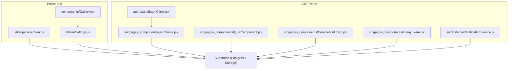
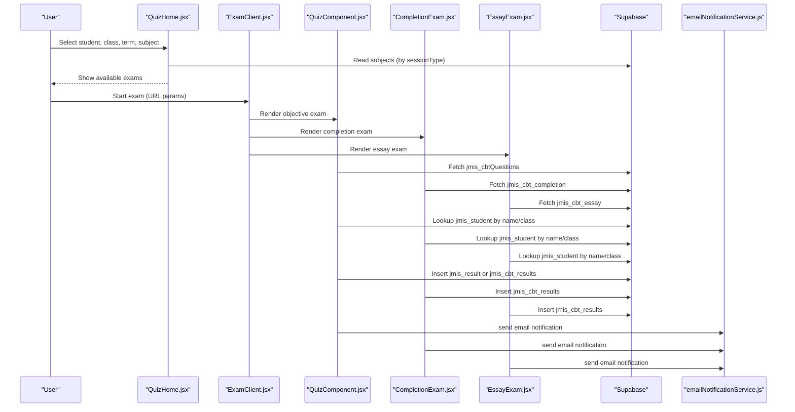
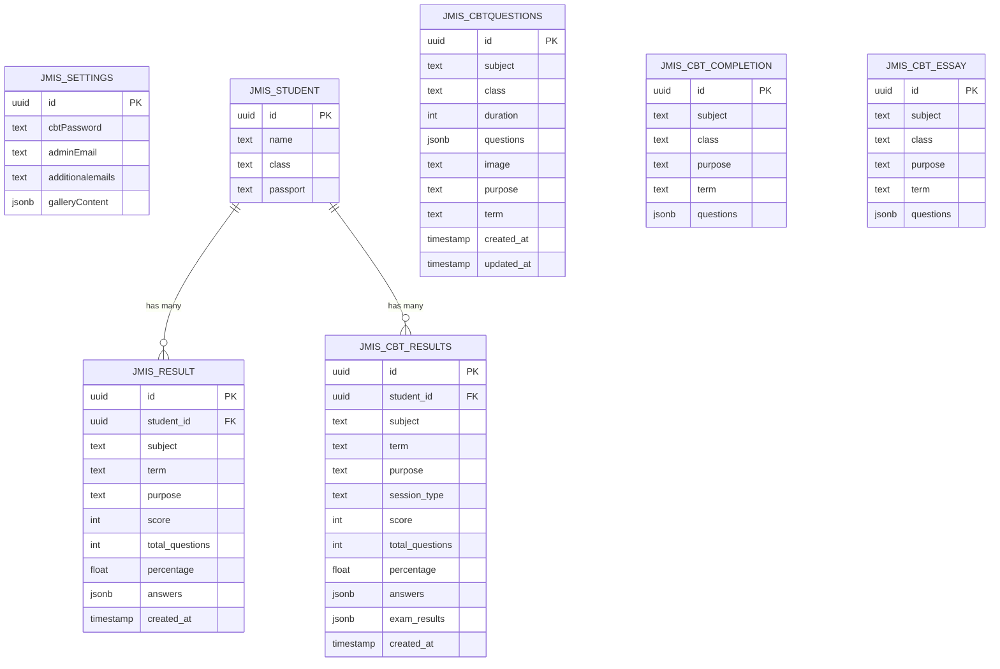
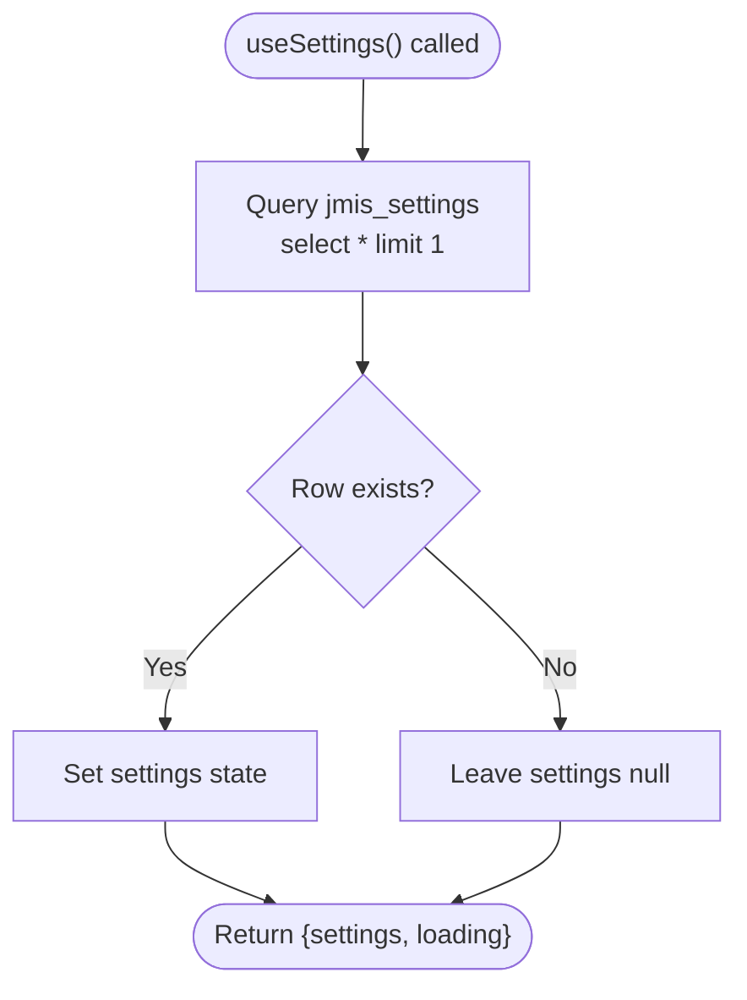
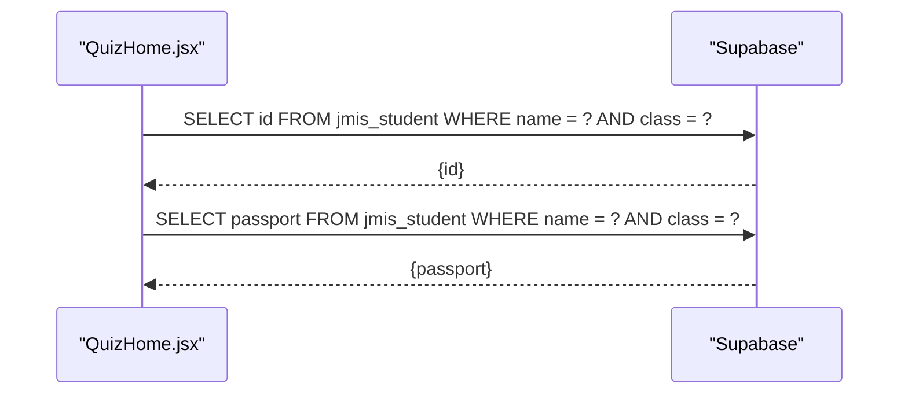
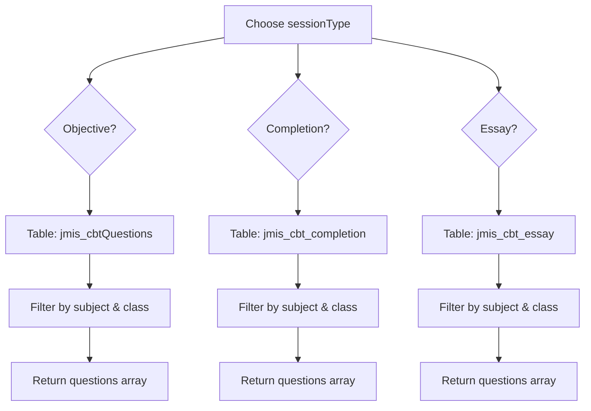
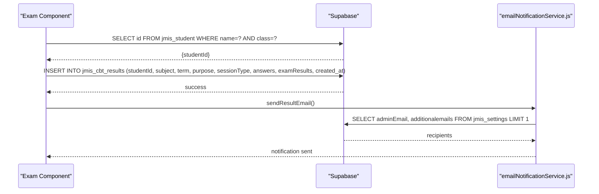
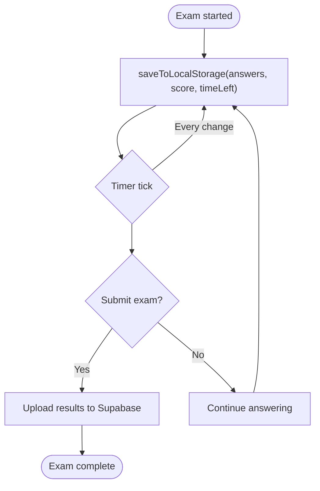
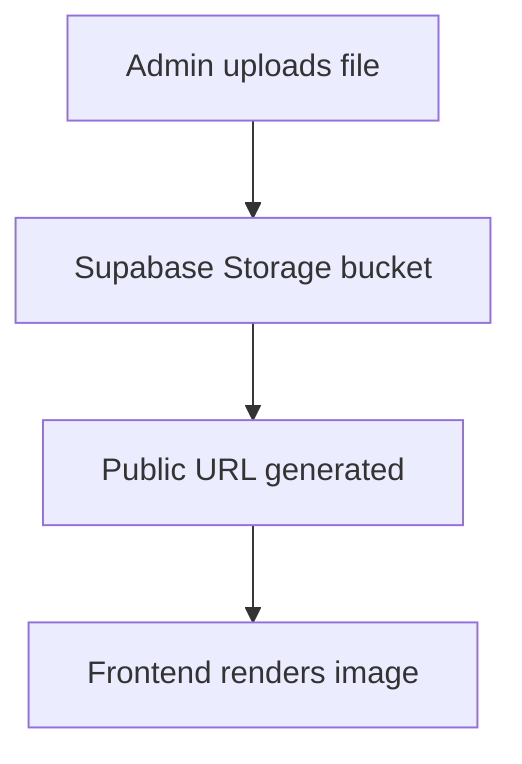
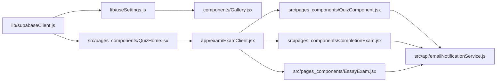

# Data Layer

<cite>
**Referenced Files in This Document**
- [supabaseClient.js](file://lib/supabaseClient.js)
- [useSettings.js](file://lib/useSettings.js)
- [QuizHome.jsx](file://src/pages_components/QuizHome.jsx)
- [ExamClient.jsx](file://app/exam/ExamClient.jsx)
- [QuizComponent.jsx](file://src/pages_components/QuizComponent.jsx)
- [CompletionExam.jsx](file://src/pages_components/CompletionExam.jsx)
- [EssayExam.jsx](file://src/pages_components/EssayExam.jsx)
- [emailNotificationService.js](file://src/api/emailNotificationService.js)
- [next.config.mjs](file://next.config.mjs)
</cite>

## Table of Contents
1. [Introduction](#introduction)
2. [Project Structure](#project-structure)
3. [Core Components](#core-components)
4. [Architecture Overview](#architecture-overview)
5. [Detailed Component Analysis](#detailed-component-analysis)
6. [Dependency Analysis](#dependency-analysis)
7. [Performance Considerations](#performance-considerations)
8. [Troubleshooting Guide](#troubleshooting-guide)
9. [Conclusion](#conclusion)

## Introduction
This document describes the data layer for the JMIC School website with a focus on Supabase integration patterns. It covers:
- Database schema design for settings, student information, and exam questions
- Data access patterns across marketing pages and CBT exam flows
- Caching strategies using local storage and client-side state
- Query optimization techniques used in the codebase
- Examples of CRUD operations, real-time readiness, and file storage management
- Data validation, error handling, and performance considerations

The goal is to make the data layer understandable for both developers and non-technical stakeholders while remaining grounded in the actual implementation.

## Project Structure
The data layer spans two areas:
- Public marketing site under `lib` and `components`, which reads global settings and static assets from Supabase
- CBT exam portal under `src/pages_components`, which reads question sets, student records, and writes results

**Diagram sources**
- [supabaseClient.js:1-12](file://lib/supabaseClient.js#L1-L12)
- [useSettings.js:1-24](file://lib/useSettings.js#L1-L24)
- [QuizHome.jsx:107-136](file://src/pages_components/QuizHome.jsx#L107-L136)
- [ExamClient.jsx:22-45](file://app/exam/ExamClient.jsx#L22-L45)
- [QuizComponent.jsx:59-143](file://src/pages_components/QuizComponent.jsx#L59-L143)
- [CompletionExam.jsx:45-72](file://src/pages_components/CompletionExam.jsx#L45-L72)
- [EssayExam.jsx:43-65](file://src/pages_components/EssayExam.jsx#L43-L65)
- [emailNotificationService.js:24-56](file://src/api/emailNotificationService.js#L24-L56)

**Section sources**
- [supabaseClient.js:1-12](file://lib/supabaseClient.js#L1-L12)
- [useSettings.js:1-24](file://lib/useSettings.js#L1-L24)
- [QuizHome.jsx:107-136](file://src/pages_components/QuizHome.jsx#L107-L136)
- [ExamClient.jsx:22-45](file://app/exam/ExamClient.jsx#L22-L45)

## Core Components
- Supabase client initialization and public storage URL helper
- Settings hook for marketing content
- CBT home page for subject selection and student lookup
- Exam routing component
- Objective, completion, and essay exam components
- Email notification service that reads recipients from settings

Key responsibilities:
- Centralize Supabase configuration and environment variables
- Provide reusable hooks for settings
- Implement query patterns for subjects, students, and results
- Manage local caching for exam progress
- Send notifications after successful result submission

**Section sources**
- [supabaseClient.js:1-12](file://lib/supabaseClient.js#L1-L12)
- [useSettings.js:1-24](file://lib/useSettings.js#L1-L24)
- [QuizHome.jsx:35-65](file://src/pages_components/QuizHome.jsx#L35-L65)
- [ExamClient.jsx:22-45](file://app/exam/ExamClient.jsx#L22-L45)
- [QuizComponent.jsx:59-143](file://src/pages_components/QuizComponent.jsx#L59-L143)
- [CompletionExam.jsx:45-72](file://src/pages_components/CompletionExam.jsx#L45-L72)
- [EssayExam.jsx:43-65](file://src/pages_components/EssayExam.jsx#L43-L65)
- [emailNotificationService.js:24-56](file://src/api/emailNotificationService.js#L24-L56)

## Architecture Overview
The data architecture follows a client-driven pattern:
- The Next.js app initializes a Supabase client using environment variables
- Marketing pages read global settings via a shared hook
- CBT flows select subjects from multiple tables based on session type
- Student identity is resolved by name and class
- Results are written to a results table and emailed to configured recipients

**Diagram sources**
- [QuizHome.jsx:107-136](file://src/pages_components/QuizHome.jsx#L107-L136)
- [ExamClient.jsx:22-45](file://app/exam/ExamClient.jsx#L22-L45)
- [QuizComponent.jsx:59-143](file://src/pages_components/QuizComponent.jsx#L59-L143)
- [CompletionExam.jsx:45-72](file://src/pages_components/CompletionExam.jsx#L45-L72)
- [EssayExam.jsx:43-65](file://src/pages_components/EssayExam.jsx#L43-L65)
- [emailNotificationService.js:70-120](file://src/api/emailNotificationService.js#L70-L120)

## Detailed Component Analysis

### Database Schema Design
Based on usage in the codebase, the following tables are involved:

- jmis_settings
  - Purpose: Global system configuration
  - Fields observed: cbtPassword, adminEmail, additionalemails, galleryContent (array-like), hero/gallery/facility image references
  - Usage: Admin password retrieval, email recipient resolution, marketing content rendering

- jmis_student
  - Purpose: Student identity and profile
  - Fields observed: id, name, class, passport
  - Usage: Resolve student ID by name and class; load profile picture

- Question tables (session-type specific)
  - jmis_cbtQuestions
    - Purpose: Objective (multiple-choice) questions
    - Fields observed: subject, class, duration, questions (array), image, purpose, term, created_at, updated_at
  - jmis_cbt_completion
    - Purpose: Completion (fill-in-the-blank) questions
    - Fields observed: subject, class, purpose, term, questions (array)
  - jmis_cbt_essay
    - Purpose: Essay questions
    - Fields observed: subject, class, purpose, term, questions (array)

- Results tables
  - jmis_result
    - Observed in some flows for result persistence
  - jmis_cbt_results
    - Used by completion and essay flows to persist scores and metadata

Notes:
- Questions are stored as arrays within rows, grouped by subject/class/purpose/term
- Subject listing and filtering rely on these fields
- Images are served from Supabase Storage buckets: passport and cbt

**Diagram sources**
- [useSettings.js:12-20](file://lib/useSettings.js#L12-L20)
- [QuizHome.jsx:51-65](file://src/pages_components/QuizHome.jsx#L51-L65)
- [QuizHome.jsx:107-136](file://src/pages_components/QuizHome.jsx#L107-L136)
- [QuizComponent.jsx:59-143](file://src/pages_components/QuizComponent.jsx#L59-L143)
- [CompletionExam.jsx:45-72](file://src/pages_components/CompletionExam.jsx#L45-L72)
- [EssayExam.jsx:43-65](file://src/pages_components/EssayExam.jsx#L43-L65)
- [CompletionExam.jsx:235-254](file://src/pages_components/CompletionExam.jsx#L235-L254)
- [EssayExam.jsx:216-229](file://src/pages_components/EssayExam.jsx#L216-L229)
- [QuizComponent.jsx:841-920](file://src/pages_components/QuizComponent.jsx#L841-L920)

**Section sources**
- [useSettings.js:12-20](file://lib/useSettings.js#L12-L20)
- [QuizHome.jsx:51-65](file://src/pages_components/QuizHome.jsx#L51-L65)
- [QuizHome.jsx:107-136](file://src/pages_components/QuizHome.jsx#L107-L136)
- [QuizComponent.jsx:59-143](file://src/pages_components/QuizComponent.jsx#L59-L143)
- [CompletionExam.jsx:45-72](file://src/pages_components/CompletionExam.jsx#L45-L72)
- [EssayExam.jsx:43-65](file://src/pages_components/EssayExam.jsx#L43-L65)
- [CompletionExam.jsx:235-254](file://src/pages_components/CompletionExam.jsx#L235-L254)
- [EssayExam.jsx:216-229](file://src/pages_components/EssayExam.jsx#L216-L229)
- [QuizComponent.jsx:841-920](file://src/pages_components/QuizComponent.jsx#L841-L920)

### Data Access Patterns

#### Settings Access Pattern
- A shared hook fetches a single row from jmis_settings and exposes it to UI components
- Components use this data to render marketing sections and construct public asset URLs

**Diagram sources**
- [useSettings.js:12-20](file://lib/useSettings.js#L12-L20)

**Section sources**
- [useSettings.js:12-20](file://lib/useSettings.js#L12-L20)

#### Student Identity Resolution
- Student lookup uses exact matches on name and class to retrieve the student ID
- Profile pictures are loaded from the passport field and served via Supabase Storage

**Diagram sources**
- [QuizHome.jsx:51-65](file://src/pages_components/QuizHome.jsx#L51-L65)
- [QuizHome.jsx:67-105](file://src/pages_components/QuizHome.jsx#L67-L105)

**Section sources**
- [QuizHome.jsx:51-65](file://src/pages_components/QuizHome.jsx#L51-L65)
- [QuizHome.jsx:67-105](file://src/pages_components/QuizHome.jsx#L67-L105)

#### Question Retrieval by Session Type
- The home page selects the correct table based on session type:
  - Objective: jmis_cbtQuestions
  - Completion: jmis_cbt_completion
  - Essay: jmis_cbt_essay
- Each exam component then queries its respective table with filters for subject and class

**Diagram sources**
- [QuizHome.jsx:107-136](file://src/pages_components/QuizHome.jsx#L107-L136)
- [QuizComponent.jsx:59-143](file://src/pages_components/QuizComponent.jsx#L59-L143)
- [CompletionExam.jsx:45-72](file://src/pages_components/CompletionExam.jsx#L45-L72)
- [EssayExam.jsx:43-65](file://src/pages_components/EssayExam.jsx#L43-L65)

**Section sources**
- [QuizHome.jsx:107-136](file://src/pages_components/QuizHome.jsx#L107-L136)
- [QuizComponent.jsx:59-143](file://src/pages_components/QuizComponent.jsx#L59-L143)
- [CompletionExam.jsx:45-72](file://src/pages_components/CompletionExam.jsx#L45-L72)
- [EssayExam.jsx:43-65](file://src/pages_components/EssayExam.jsx#L43-L65)

#### Result Submission Flow
- After scoring, the app resolves the student ID and inserts a result record
- For completion and essay sessions, results are inserted into jmis_cbt_results
- For objective sessions, the code also references jmis_result in some paths

**Diagram sources**
- [CompletionExam.jsx:206-254](file://src/pages_components/CompletionExam.jsx#L206-L254)
- [EssayExam.jsx:192-229](file://src/pages_components/EssayExam.jsx#L192-L229)
- [emailNotificationService.js:24-56](file://src/api/emailNotificationService.js#L24-L56)

**Section sources**
- [CompletionExam.jsx:206-254](file://src/pages_components/CompletionExam.jsx#L206-L254)
- [EssayExam.jsx:192-229](file://src/pages_components/EssayExam.jsx#L192-L229)
- [emailNotificationService.js:24-56](file://src/api/emailNotificationService.js#L24-L56)

### Caching Strategies
- LocalStorage auto-save:
  - Each exam component persists answers, current question index, time left, and timestamps
  - On re-entry, the most recent incomplete exam is restored automatically
- Client-side state:
  - Answers and scores are kept in React state during the session
- Network quality monitoring:
  - The objective exam periodically probes connectivity and classifies network quality

**Diagram sources**
- [QuizComponent.jsx:281-339](file://src/pages_components/QuizComponent.jsx#L281-L339)
- [CompletionExam.jsx:106-147](file://src/pages_components/CompletionExam.jsx#L106-L147)
- [EssayExam.jsx:98-132](file://src/pages_components/EssayExam.jsx#L98-L132)

**Section sources**
- [QuizComponent.jsx:281-339](file://src/pages_components/QuizComponent.jsx#L281-L339)
- [CompletionExam.jsx:106-147](file://src/pages_components/CompletionExam.jsx#L106-L147)
- [EssayExam.jsx:98-132](file://src/pages_components/EssayExam.jsx#L98-L132)

### Query Optimization Techniques
- Case-insensitive matching:
  - Uses ilike for subject and class filters to handle inconsistent casing
- Purpose normalization:
  - Treats 'test' and 'midterm' equivalently when querying and filtering
- Targeted column selection:
  - Selects only needed columns (e.g., questions, subject, class, purpose, term)
- Single-row reads for settings:
  - Uses limit(1) or .single() to minimize payload size
- Conditional query building:
  - Builds queries dynamically based on provided parameters (subject, class, purpose, term)

Examples:
- Objective questions: dynamic query with optional filters
- Completion and essay questions: simple filter by subject and class
- Settings: single-row reads for passwords and emails

**Section sources**
- [QuizComponent.jsx:81-106](file://src/pages_components/QuizComponent.jsx#L81-L106)
- [QuizHome.jsx:196-226](file://src/pages_components/QuizHome.jsx#L196-L226)
- [useSettings.js:12-20](file://lib/useSettings.js#L12-L20)

### Real-Time Subscriptions
- The codebase does not implement Supabase real-time subscriptions
- However, the Supabase client includes realtime-js dependencies, indicating readiness for future real-time features such as live leaderboards or synchronized exam states

[No sources needed since this section provides general guidance]

### File Storage Management
- Public images for marketing content are served from a public storage bucket
- Passport photos and subject images are referenced by filename and constructed into URLs
- The Next.js config allows remote images from the Supabase domain

**Diagram sources**
- [supabaseClient.js:9-12](file://lib/supabaseClient.js#L9-L12)
- [QuizHome.jsx:236-237](file://src/pages_components/QuizHome.jsx#L236-L237)
- [next.config.mjs:10-15](file://next.config.mjs#L10-L15)

**Section sources**
- [supabaseClient.js:9-12](file://lib/supabaseClient.js#L9-L12)
- [QuizHome.jsx:236-237](file://src/pages_components/QuizHome.jsx#L236-L237)
- [next.config.mjs:10-15](file://next.config.mjs#L10-L15)

## Dependency Analysis
The data layer has clear separation between client initialization, settings access, and exam flows:

**Diagram sources**
- [supabaseClient.js:1-12](file://lib/supabaseClient.js#L1-L12)
- [useSettings.js:1-24](file://lib/useSettings.js#L1-L24)
- [QuizHome.jsx:1-136](file://src/pages_components/QuizHome.jsx#L1-L136)
- [ExamClient.jsx:1-45](file://app/exam/ExamClient.jsx#L1-L45)
- [QuizComponent.jsx:1-143](file://src/pages_components/QuizComponent.jsx#L1-L143)
- [CompletionExam.jsx:1-72](file://src/pages_components/CompletionExam.jsx#L1-L72)
- [EssayExam.jsx:1-65](file://src/pages_components/EssayExam.jsx#L1-L65)
- [emailNotificationService.js:1-56](file://src/api/emailNotificationService.js#L1-L56)

**Section sources**
- [supabaseClient.js:1-12](file://lib/supabaseClient.js#L1-L12)
- [useSettings.js:1-24](file://lib/useSettings.js#L1-L24)
- [QuizHome.jsx:1-136](file://src/pages_components/QuizHome.jsx#L1-L136)
- [ExamClient.jsx:1-45](file://app/exam/ExamClient.jsx#L1-L45)
- [QuizComponent.jsx:1-143](file://src/pages_components/QuizComponent.jsx#L1-L143)
- [CompletionExam.jsx:1-72](file://src/pages_components/CompletionExam.jsx#L1-L72)
- [EssayExam.jsx:1-65](file://src/pages_components/EssayExam.jsx#L1-L65)
- [emailNotificationService.js:1-56](file://src/api/emailNotificationService.js#L1-L56)

## Performance Considerations
- Minimize payload sizes:
  - Use targeted column selection and limit(1) for settings
- Reduce redundant queries:
  - Cache settings in a hook and reuse across components
- Optimize string matching:
  - Prefer normalized inputs and consistent casing to reduce ilike overhead
- Avoid heavy SSR:
  - Dynamically import exam components to prevent server-side issues
- Monitor network quality:
  - Periodic health checks help adapt behavior under poor connectivity

Recommendations:
- Introduce a small in-memory cache for settings to avoid repeated reads
- Add pagination or limits for large question sets if they grow significantly
- Consider server-side functions for complex queries to offload client work

[No sources needed since this section provides general guidance]

## Troubleshooting Guide
Common issues and resolutions:
- No questions found:
  - Verify subject, class, purpose, and term values match database entries
  - Check case sensitivity and spacing; normalize inputs before querying
- Student not found:
  - Ensure name and class exactly match stored values
  - Confirm student records exist before starting an exam
- Email notifications failing:
  - Validate adminEmail and additionalemails in jmis_settings
  - Check API endpoint availability and response status

Error handling patterns in the code:
- Toast messages for user feedback
- Console logging for debugging
- Graceful fallbacks when settings are missing

**Section sources**
- [QuizComponent.jsx:108-140](file://src/pages_components/QuizComponent.jsx#L108-L140)
- [CompletionExam.jsx:54-69](file://src/pages_components/CompletionExam.jsx#L54-L69)
- [EssayExam.jsx:52-62](file://src/pages_components/EssayExam.jsx#L52-L62)
- [emailNotificationService.js:70-120](file://src/api/emailNotificationService.js#L70-L120)

## Conclusion
The data layer integrates Supabase for relational data and storage, with clear patterns for reading settings, resolving student identities, retrieving exam questions, and persisting results. It employs practical optimizations like targeted queries, case-insensitive matching, and local caching. While real-time subscriptions are not yet implemented, the client setup supports future enhancements. Proper data validation, robust error handling, and thoughtful query construction ensure a reliable experience for students and administrators alike.