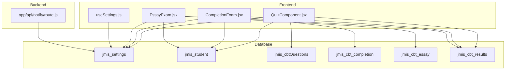
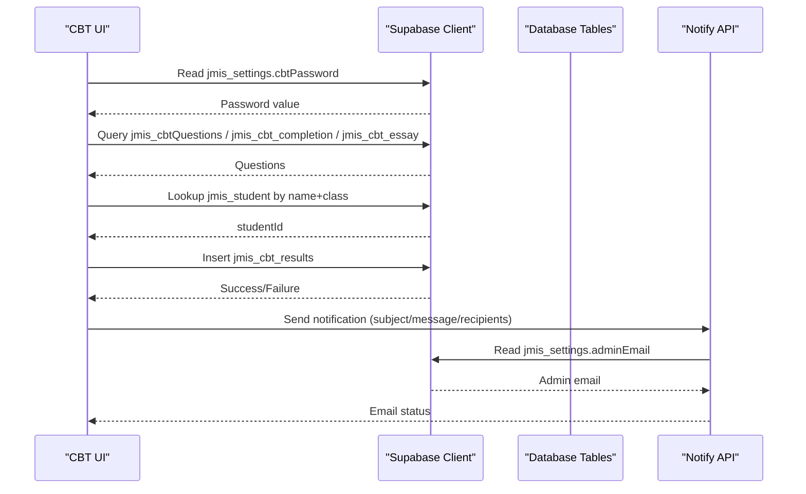
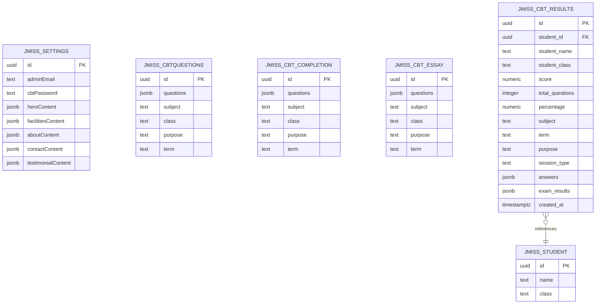
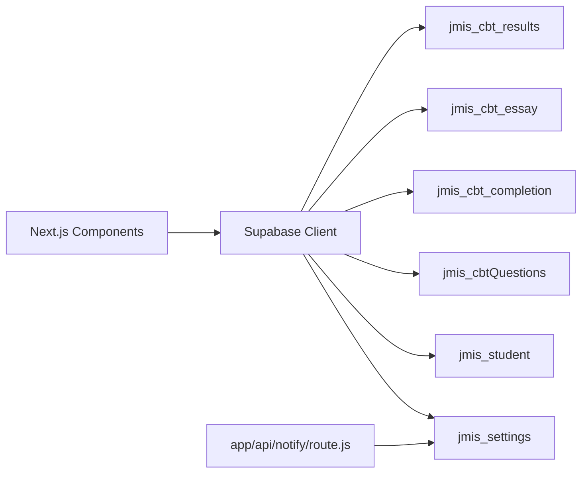

# Database Schema Design

<cite>
**Referenced Files in This Document**
- [supabaseClient.js](file://lib/supabaseClient.js)
- [useSettings.js](file://lib/useSettings.js)
- [QuizComponent.jsx](file://src/pages_components/QuizComponent.jsx)
- [CompletionExam.jsx](file://src/pages_components/CompletionExam.jsx)
- [EssayExam.jsx](file://src/pages_components/EssayExam.jsx)
- [route.js](file://app/api/notify/route.js)
</cite>

## Table of Contents
1. [Introduction](#introduction)
2. [Project Structure](#project-structure)
3. [Core Components](#core-components)
4. [Architecture Overview](#architecture-overview)
5. [Detailed Component Analysis](#detailed-component-analysis)
6. [Dependency Analysis](#dependency-analysis)
7. [Performance Considerations](#performance-considerations)
8. [Troubleshooting Guide](#troubleshooting-guide)
9. [Conclusion](#conclusion)

## Introduction
This document describes the JMI School database schema as used by the application’s client-side components and server API. It focuses on the following tables:
- jmis_settings: school configuration and content
- jmis_student: student identity and class
- jmis_cbtQuestions: objective question sets
- jmis_cbt_completion: completion-style question sets
- jmis_cbt_essay: essay-style question sets
- jmis_cbt_results: exam results (inferred from usage)

The documentation explains entity relationships, field definitions inferred from code usage, data types and constraints implied by operations, business rules, validation patterns, indexing strategies, performance considerations, and migration/versioning approaches.

## Project Structure
The repository is a Next.js application that uses Supabase for data access. The relevant parts for this schema are:
- lib/supabaseClient.js: shared Supabase client initialization
- lib/useSettings.js: hook to read settings from jmis_settings
- src/pages_components/*: CBT UI components that query and write to the database
- app/api/notify/route.js: server API that reads admin email from jmis_settings and sends notifications

**Diagram sources**
- [QuizComponent.jsx:60-143](file://src/pages_components/QuizComponent.jsx#L60-L143)
- [CompletionExam.jsx:45-72](file://src/pages_components/CompletionExam.jsx#L45-L72)
- [EssayExam.jsx:43-65](file://src/pages_components/EssayExam.jsx#L43-L65)
- [useSettings.js:12-21](file://lib/useSettings.js#L12-L21)
- [route.js:27-46](file://app/api/notify/route.js#L27-L46)

**Section sources**
- [supabaseClient.js:1-13](file://lib/supabaseClient.js#L1-L13)
- [useSettings.js:1-25](file://lib/useSettings.js#L1-L25)
- [QuizComponent.jsx:1-1644](file://src/pages_components/QuizComponent.jsx#L1-L1644)
- [CompletionExam.jsx:1-472](file://src/pages_components/CompletionExam.jsx#L1-L472)
- [EssayExam.jsx:1-418](file://src/pages_components/EssayExam.jsx#L1-L418)
- [route.js:1-115](file://app/api/notify/route.js#L1-L115)

## Core Components
This section summarizes the entities and their roles:
- jmis_settings: stores site-wide configuration such as adminEmail and cbtPassword; also holds rich content fields referenced by marketing components.
- jmis_student: stores student identity and class; used to resolve studentId for result records.
- jmis_cbtQuestions: stores objective question sets per subject/class/purpose/term.
- jmis_cbt_completion: stores completion-style questions per subject/class.
- jmis_cbt_essay: stores essay-style questions per subject/class with scoring metadata.
- jmis_cbt_results: stores exam outcomes including scores, answers, and metadata.

Key responsibilities:
- Question retrieval and filtering by subject, class, purpose, and term.
- Student lookup by name and class to obtain studentId.
- Result submission with session type and timestamps.
- Settings-driven behavior (admin password, admin email).

**Section sources**
- [QuizComponent.jsx:60-143](file://src/pages_components/QuizComponent.jsx#L60-L143)
- [CompletionExam.jsx:45-72](file://src/pages_components/CompletionExam.jsx#L45-L72)
- [EssayExam.jsx:43-65](file://src/pages_components/EssayExam.jsx#L43-L65)
- [QuizComponent.jsx:792-800](file://src/pages_components/QuizComponent.jsx#L792-L800)
- [CompletionExam.jsx:206-233](file://src/pages_components/CompletionExam.jsx#L206-L233)
- [EssayExam.jsx:192-214](file://src/pages_components/EssayExam.jsx#L192-L214)
- [useSettings.js:12-21](file://lib/useSettings.js#L12-L21)

## Architecture Overview
The system follows a client-server pattern where Next.js pages/components call Supabase directly for reading/writing data. A small server route handles email delivery and reads admin email from settings.

**Diagram sources**
- [QuizComponent.jsx:145-160](file://src/pages_components/QuizComponent.jsx#L145-L160)
- [QuizComponent.jsx:60-143](file://src/pages_components/QuizComponent.jsx#L60-L143)
- [QuizComponent.jsx:792-800](file://src/pages_components/QuizComponent.jsx#L792-L800)
- [CompletionExam.jsx:235-255](file://src/pages_components/CompletionExam.jsx#L235-L255)
- [EssayExam.jsx:216-229](file://src/pages_components/EssayExam.jsx#L216-L229)
- [route.js:27-46](file://app/api/notify/route.js#L27-L46)

## Detailed Component Analysis

### Entity: jmis_settings
Purpose:
- Holds administrative and content configuration consumed across the app.

Inferred fields and types:
- adminEmail: string/email
- cbtPassword: string
- Additional content fields (e.g., heroContent, facilitiesContent, aboutContent, contactContent, testimonialContent) referenced by marketing components.

Constraints and business rules:
- Single-row configuration accessed via limit(1).
- adminEmail is used to include the school office in notifications.
- cbtPassword gates exam unlocking.

Validation and error handling:
- Graceful fallbacks when fetching settings fail or return empty arrays.

Indexing strategy:
- Not applicable at single-row level; ensure efficient reads by avoiding unnecessary columns.

Migration/versioning:
- Content fields evolve over time; maintain backward compatibility in components.

**Section sources**
- [useSettings.js:12-21](file://lib/useSettings.js#L12-L21)
- [route.js:27-46](file://app/api/notify/route.js#L27-L46)
- [QuizComponent.jsx:145-160](file://src/pages_components/QuizComponent.jsx#L145-L160)
- [CompletionExam.jsx:311-334](file://src/pages_components/CompletionExam.jsx#L311-L334)
- [EssayExam.jsx:284-297](file://src/pages_components/EssayExam.jsx#L284-L297)

### Entity: jmis_student
Purpose:
- Identity and class information for students taking exams.

Inferred fields and types:
- id: identifier (used as foreign key in results)
- name: string
- class: string

Constraints and business rules:
- Lookups performed by exact match on name and class to retrieve id.
- Class values are normalized to uppercase when stored in results.

Validation and error handling:
- If no student found, result submission is aborted with user-facing error.

Indexing strategy:
- Composite index on (name, class) recommended to optimize lookups.

Migration/versioning:
- Ensure consistent casing policies between input and storage.

**Section sources**
- [QuizComponent.jsx:792-800](file://src/pages_components/QuizComponent.jsx#L792-L800)
- [CompletionExam.jsx:206-233](file://src/pages_components/CompletionExam.jsx#L206-L233)
- [EssayExam.jsx:192-214](file://src/pages_components/EssayExam.jsx#L192-L214)

### Entity: jmis_cbtQuestions
Purpose:
- Objective multiple-choice question sets.

Inferred fields and types:
- questions: JSON array of question objects
- subject: string
- class: string
- purpose: string (e.g., test, midterm, exam, practice)
- term: string

Constraints and business rules:
- Filtering by subject, class, purpose, and term using case-insensitive matching.
- Purpose normalization treats 'test' and 'midterm' equivalently during queries.
- First row returned contains the questions array.

Validation and error handling:
- Empty dataset triggers user-friendly error message.

Indexing strategy:
- Indexes on (subject, class, purpose, term) to speed up filtered queries.

Migration/versioning:
- Evolving question schema should be versioned within the questions JSON structure if needed.

**Section sources**
- [QuizComponent.jsx:60-143](file://src/pages_components/QuizComponent.jsx#L60-L143)

### Entity: jmis_cbt_completion
Purpose:
- Completion-style question sets where students type answers evaluated by NLP.

Inferred fields and types:
- questions: JSON array of completion questions
- subject: string
- class: string
- purpose: string
- term: string

Constraints and business rules:
- Filtered by subject and class.
- Answers evaluated server-side or client-side using an NLP scorer before saving results.

Validation and error handling:
- No questions available yields an error toast.

Indexing strategy:
- Index on (subject, class) to optimize retrieval.

Migration/versioning:
- Scoring logic may change; keep backward compatibility for historical results.

**Section sources**
- [CompletionExam.jsx:45-72](file://src/pages_components/CompletionExam.jsx#L45-L72)

### Entity: jmis_cbt_essay
Purpose:
- Essay-style question sets with scoring metadata (minWords, points).

Inferred fields and types:
- questions: JSON array of essay questions
- subject: string
- class: string
- purpose: string
- term: string

Constraints and business rules:
- Filtered by subject and class.
- Each question includes minWords and points; word count enforced in UI.

Validation and error handling:
- Missing questions surface an error toast.

Indexing strategy:
- Index on (subject, class).

Migration/versioning:
- Scoring rubrics may evolve; preserve old scoring outputs in results.

**Section sources**
- [EssayExam.jsx:43-65](file://src/pages_components/EssayExam.jsx#L43-L65)

### Entity: jmis_cbt_results
Purpose:
- Stores exam outcomes for all session types.

Inferred fields and types:
- studentId: identifier referencing jmis_student.id
- studentName: string
- studentClass: string (uppercase)
- score: numeric
- totalQuestions: integer
- percentage: numeric (string-formatted decimal)
- subject: string
- term: string
- purpose: string
- sessionType: enum-like string ('objective', 'completion', 'essay')
- answers: JSON object/array of responses
- examResults: JSON object containing detailed evaluation results
- created_at: timestamp ISO string

Constraints and business rules:
- Practice sessions do not persist results.
- Results include both high-level metrics and detailed per-question feedback.
- Timestamps recorded at insertion time.

Validation and error handling:
- Insert errors are caught and surfaced to users.

Indexing strategy:
- Index on (studentId, subject, term, sessionType, created_at) for reporting and analytics.

Migration/versioning:
- Extensible JSON fields allow evolution without schema changes.

**Section sources**
- [QuizComponent.jsx:942-981](file://src/pages_components/QuizComponent.jsx#L942-L981)
- [CompletionExam.jsx:235-255](file://src/pages_components/CompletionExam.jsx#L235-L255)
- [EssayExam.jsx:216-229](file://src/pages_components/EssayExam.jsx#L216-L229)

### Data Model Diagram

**Diagram sources**
- [useSettings.js:12-21](file://lib/useSettings.js#L12-L21)
- [QuizComponent.jsx:60-143](file://src/pages_components/QuizComponent.jsx#L60-L143)
- [CompletionExam.jsx:45-72](file://src/pages_components/CompletionExam.jsx#L45-L72)
- [EssayExam.jsx:43-65](file://src/pages_components/EssayExam.jsx#L43-L65)
- [CompletionExam.jsx:235-255](file://src/pages_components/CompletionExam.jsx#L235-L255)
- [EssayExam.jsx:216-229](file://src/pages_components/EssayExam.jsx#L216-L229)

## Dependency Analysis
- Frontend components depend on Supabase client initialized in lib/supabaseClient.js.
- All components read settings from jmis_settings for passwords and emails.
- Exam flows depend on jmis_student to resolve studentId.
- Question sets are retrieved from three separate tables based on exam type.
- Results are persisted to jmis_cbt_results.
- Server API reads admin email from jmis_settings to include it in notifications.

**Diagram sources**
- [supabaseClient.js:1-13](file://lib/supabaseClient.js#L1-L13)
- [route.js:27-46](file://app/api/notify/route.js#L27-L46)
- [QuizComponent.jsx:60-143](file://src/pages_components/QuizComponent.jsx#L60-L143)
- [CompletionExam.jsx:45-72](file://src/pages_components/CompletionExam.jsx#L45-L72)
- [EssayExam.jsx:43-65](file://src/pages_components/EssayExam.jsx#L43-L65)
- [CompletionExam.jsx:235-255](file://src/pages_components/CompletionExam.jsx#L235-L255)
- [EssayExam.jsx:216-229](file://src/pages_components/EssayExam.jsx#L216-L229)

**Section sources**
- [supabaseClient.js:1-13](file://lib/supabaseClient.js#L1-L13)
- [route.js:1-115](file://app/api/notify/route.js#L1-L115)

## Performance Considerations
- Use targeted column selection to reduce payload size (e.g., select only required fields).
- Add composite indexes on frequently filtered columns:
  - jmis_cbtQuestions(subject, class, purpose, term)
  - jmis_cbt_completion(subject, class)
  - jmis_cbt_essay(subject, class)
  - jmis_student(name, class)
  - jmis_cbt_results(student_id, subject, term, session_type, created_at)
- Avoid full-table scans by leveraging indexed filters in queries.
- Cache settings in memory where appropriate to reduce repeated reads.
- For large question sets, consider pagination or splitting into smaller batches.

[No sources needed since this section provides general guidance]

## Troubleshooting Guide
Common issues and resolutions:
- No questions found:
  - Verify subject/class/purpose/term filters match database entries.
  - Check case-insensitive matching behavior.
- Unable to fetch student ID:
  - Confirm student exists with exact name and class.
- Failed to save results:
  - Inspect network errors and Supabase permissions.
  - Validate that non-practice sessions attempt persistence.
- Email notifications failing:
  - Ensure GMAIL_USER and GMAIL_APP_PASSWORD are configured.
  - Confirm adminEmail is set in jmis_settings.

Operational checks:
- Settings loading: confirm single-row fetch succeeds.
- Password gating: verify cbtPassword retrieval and comparison logic.

**Section sources**
- [QuizComponent.jsx:60-143](file://src/pages_components/QuizComponent.jsx#L60-L143)
- [QuizComponent.jsx:792-800](file://src/pages_components/QuizComponent.jsx#L792-L800)
- [CompletionExam.jsx:235-255](file://src/pages_components/CompletionExam.jsx#L235-L255)
- [EssayExam.jsx:216-229](file://src/pages_components/EssayExam.jsx#L216-L229)
- [route.js:59-68](file://app/api/notify/route.js#L59-L68)

## Conclusion
The JMI School database schema centers around configurable settings, student identity, and three question domains (objective, completion, essay), with results aggregated in a unified results table. The design leverages JSON columns for flexible question structures and relies on client-side filtering and server-side scoring. Proper indexing, careful validation, and robust error handling are essential for reliable operation. Migration strategies should focus on backward-compatible evolution of JSON schemas and consistent naming/casing policies.

[No sources needed since this section summarizes without analyzing specific files]