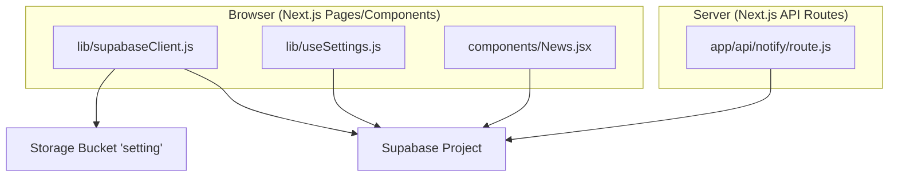
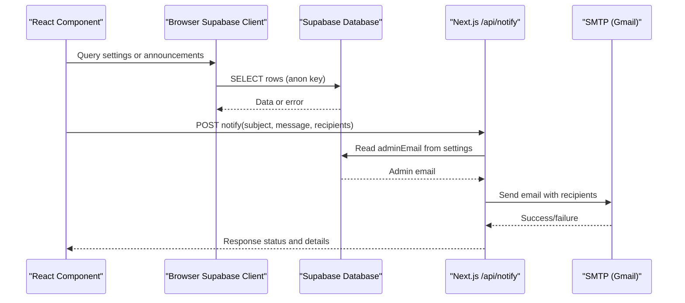
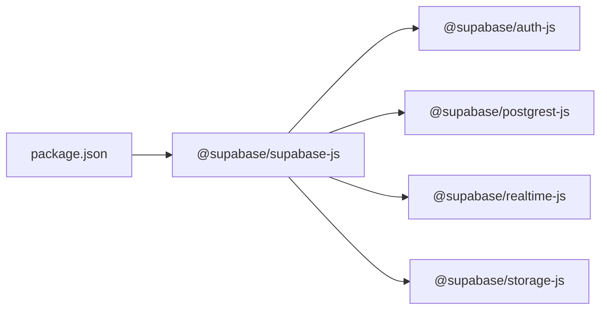

# Supabase Integration

<cite>
**Referenced Files in This Document**
- [lib/supabaseClient.js](file://lib/supabaseClient.js)
- [src/supabaseClient.js](file://src/supabaseClient.js)
- [lib/enquiry.js](file://lib/enquiry.js)
- [lib/useSettings.js](file://lib/useSettings.js)
- [components/News.jsx](file://components/News.jsx)
- [app/api/notify/route.js](file://app/api/notify/route.js)
- [package.json](file://package.json)
</cite>

## Table of Contents
1. Introduction
2. Project Structure
3. Core Components
4. Architecture Overview
5. Detailed Component Analysis
6. Dependency Analysis
7. Performance Considerations
8. Troubleshooting Guide
9. Conclusion

## Introduction
This document explains how the project integrates with Supabase for data access, storage, and server-side operations. It covers client configuration, environment variables, authentication model, database queries, real-time capabilities, file storage usage, security considerations, connection pooling, error handling strategies, and troubleshooting guidance based on the actual codebase.

## Project Structure
The integration spans a few key areas:
- Client initialization for browser and Node environments
- Data fetching hooks and components that query public tables
- Server API route for sending emails using credentials kept server-only
- Dependencies declared in package configuration

**Diagram sources**
- [lib/supabaseClient.js:1-13](file://lib/supabaseClient.js#L1-L13)
- [lib/useSettings.js:1-25](file://lib/useSettings.js#L1-L25)
- [components/News.jsx:1-60](file://components/News.jsx#L1-L60)
- [app/api/notify/route.js:1-115](file://app/api/notify/route.js#L1-L115)

**Section sources**
- [lib/supabaseClient.js:1-13](file://lib/supabaseClient.js#L1-L13)
- [src/supabaseClient.js:1-7](file://src/supabaseClient.js#L1-L7)
- [lib/useSettings.js:1-25](file://lib/useSettings.js#L1-L25)
- [components/News.jsx:1-60](file://components/News.jsx#L1-L60)
- [app/api/notify/route.js:1-115](file://app/api/notify/route.js#L1-L115)
- [package.json:11-22](file://package.json#L11-L22)

## Core Components
- Supabase client initialization for the browser-facing site uses the anon key and URL exposed to the client.
- A second client instance is created in a server-only API route to fetch settings without exposing secrets to the browser.
- Database reads are performed from React components and hooks using the shared client.
- Storage URLs are constructed for public assets under a specific bucket.

Key responsibilities:
- lib/supabaseClient.js: Creates the browser client and exposes a helper for public storage URLs.
- src/supabaseClient.js: Provides an alternative client instance used elsewhere in the codebase.
- lib/useSettings.js: Fetches global settings from a single row in the settings table.
- components/News.jsx: Reads announcements filtered by audience and sorts by date.
- app/api/notify/route.js: Server-only email sender that reads admin email from Supabase and sends notifications via SMTP.

**Section sources**
- [lib/supabaseClient.js:1-13](file://lib/supabaseClient.js#L1-L13)
- [src/supabaseClient.js:1-7](file://src/supabaseClient.js#L1-L7)
- [lib/useSettings.js:1-25](file://lib/useSettings.js#L1-L25)
- [components/News.jsx:1-60](file://components/News.jsx#L1-L60)
- [app/api/notify/route.js:1-115](file://app/api/notify/route.js#L1-L115)

## Architecture Overview
The application uses a hybrid approach:
- Browser-side: Uses the Supabase anon key to perform read/write operations governed by Row Level Security policies.
- Server-side: Uses a Next.js API route to send emails while reading dynamic recipients from Supabase. Credentials remain server-only.

**Diagram sources**
- [lib/useSettings.js:1-25](file://lib/useSettings.js#L1-L25)
- [components/News.jsx:1-60](file://components/News.jsx#L1-L60)
- [app/api/notify/route.js:1-115](file://app/api/notify/route.js#L1-L115)

## Detailed Component Analysis

### Supabase Client Initialization
- The browser client is created with the project URL and anon key exposed to the client.
- A helper constructs direct URLs for public files stored under a specific folder.
- An additional client instance exists in another module for use in different contexts.

Security notes:
- Only the anon key is used on the client side; sensitive keys must not be exposed.
- Access control should rely on Supabase Row Level Security policies.

**Section sources**
- [lib/supabaseClient.js:1-13](file://lib/supabaseClient.js#L1-L13)
- [src/supabaseClient.js:1-7](file://src/supabaseClient.js#L1-L7)

### Settings Hook (useSettings)
- Fetches a single row from the settings table and provides loading state.
- Designed for marketing sections to render content managed centrally.

Error handling:
- Gracefully handles missing data and errors by keeping loading false and returning no settings when unavailable.

**Section sources**
- [lib/useSettings.js:1-25](file://lib/useSettings.js#L1-L25)

### News Component (Public Announcements)
- Reads announcements with a public audience filter and orders by creation time.
- Handles empty results gracefully and degrades if the table does not exist yet.

Performance:
- Limits results to a small number to reduce payload size.

**Section sources**
- [components/News.jsx:1-60](file://components/News.jsx#L1-L60)

### Email Notification API Route (/api/notify)
- Server-only endpoint that composes and sends emails using SMTP.
- Resolves final recipients by combining caller-provided recipients with the admin email fetched from Supabase.
- Validates required fields and environment configuration before sending.

Error handling:
- Returns structured JSON responses for validation errors, missing configuration, and send failures.
- Logs detailed errors for debugging.

**Section sources**
- [app/api/notify/route.js:1-115](file://app/api/notify/route.js#L1-L115)

### Enquiry Submission Flow
- Inserts enquiries and admissions applications into Supabase tables.
- On success, triggers a fire-and-forget notification to the school via the server API route.
- Errors during inserts throw user-facing messages; email failures do not block the primary operation.

Reliability:
- Database insert is the source of truth; email delivery is best-effort.

**Section sources**
- [lib/enquiry.js:1-129](file://lib/enquiry.js#L1-L129)

### Real-Time Subscriptions
- The Supabase JS SDK includes real-time capabilities through its dependencies.
- While the current codebase primarily uses request-based queries, you can extend components to subscribe to changes using the same client instance.

[No sources needed since this section describes general capability available via the SDK]

### File Storage Operations
- Public storage URLs are constructed for assets under a dedicated folder.
- Use the helper to build links to publicly accessible files.

Security note:
- Ensure only intended files are placed in the public folder and that RLS/storage policies restrict write access appropriately.

**Section sources**
- [lib/supabaseClient.js:9-13](file://lib/supabaseClient.js#L9-L13)

## Dependency Analysis
The project depends on the Supabase JavaScript SDK which bundles PostgREST, Realtime, Storage, and Auth clients. These enable database queries, real-time subscriptions, file storage, and authentication flows.

**Diagram sources**
- [package.json:11-22](file://package.json#L11-L22)

**Section sources**
- [package.json:11-22](file://package.json#L11-L22)

## Performance Considerations
- Prefer selecting only needed columns to minimize payload size.
- Limit result sets where appropriate (e.g., recent announcements).
- Cache static settings in component state to avoid repeated requests.
- Use server-side routes for operations requiring secrets or heavy processing.
- Avoid unnecessary re-renders by memoizing derived values and cleaning up subscriptions in effects.

[No sources needed since this section provides general guidance]

## Troubleshooting Guide
Common issues and resolutions:
- Missing environment variables:
  - Ensure NEXT_PUBLIC_SUPABASE_URL and NEXT_PUBLIC_SUPABASE_ANON_KEY are set for client-side code.
  - For the email API route, ensure GMAIL_USER and GMAIL_APP_PASSWORD are configured server-side.
- No recipients resolved:
  - Verify that the settings table contains a valid admin email and that the API route can read it.
- Network or offline conditions:
  - Implement retries and local persistence for critical operations; surface user-friendly messages.
- Database errors:
  - Inspect error objects returned by Supabase calls and map them to user-facing messages.
- Storage access:
  - Confirm the storage bucket and folder are public for read access and that file names match expected paths.

Operational tips:
- Log errors consistently on both client and server sides.
- Validate inputs early in API routes to fail fast with clear messages.
- Keep secrets out of the browser bundle; use server-only routes for sensitive work.

**Section sources**
- [app/api/notify/route.js:27-46](file://app/api/notify/route.js#L27-L46)
- [app/api/notify/route.js:48-115](file://app/api/notify/route.js#L48-L115)
- [lib/enquiry.js:29-69](file://lib/enquiry.js#L29-L69)

## Conclusion
The project integrates Supabase using a secure, layered approach:
- Browser code uses the anon key for controlled access.
- Server routes handle sensitive tasks like email delivery while reading dynamic configuration from Supabase.
- Components demonstrate practical patterns for querying public data and constructing storage URLs.
By following the security, performance, and troubleshooting guidance above, you can extend the integration with real-time subscriptions and additional features while maintaining reliability and safety.