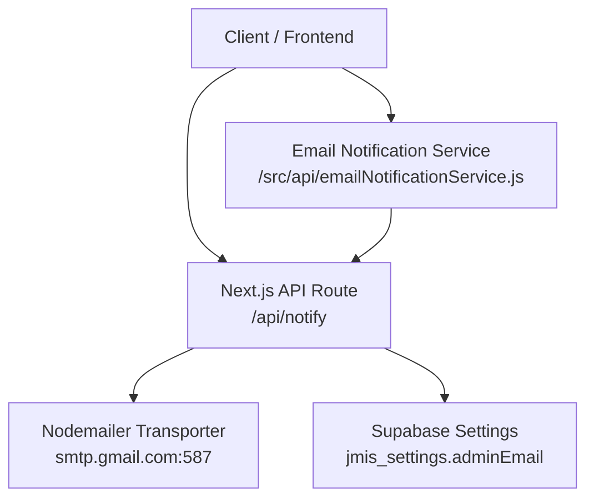
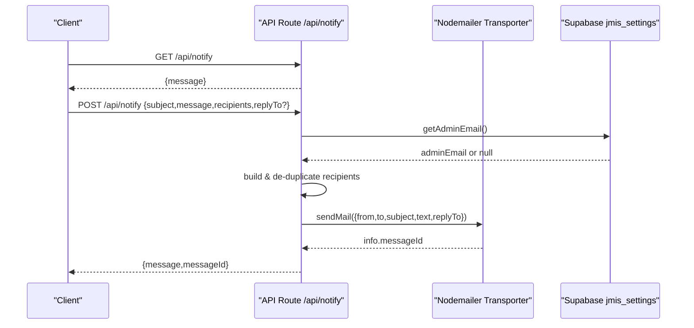
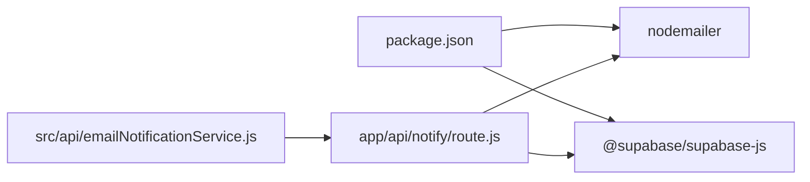

# API Route Implementation

<cite>
**Referenced Files in This Document**
- [route.js](file://app/api/notify/route.js)
- [emailNotificationService.js](file://src/api/emailNotificationService.js)
- [supabaseClient.js](file://lib/supabaseClient.js)
- [next.config.mjs](file://next.config.mjs)
- [package.json](file://package.json)
</cite>

## Table of Contents
1. [Introduction](#introduction)
2. [Project Structure](#project-structure)
3. [Core Components](#core-components)
4. [Architecture Overview](#architecture-overview)
5. [Detailed Component Analysis](#detailed-component-analysis)
6. [Dependency Analysis](#dependency-analysis)
7. [Performance Considerations](#performance-considerations)
8. [Troubleshooting Guide](#troubleshooting-guide)
9. [Conclusion](#conclusion)
10. [Appendices](#appendices)

## Introduction
This document explains the email notification API route implementation for server-side email sending using Nodemailer with Gmail SMTP. It covers:
- GET and POST methods, request/response schemas, and authentication requirements
- SMTP configuration via environment variables (GMAIL_USER and GMAIL_APP_PASSWORD)
- Security considerations for server-side email sending
- Examples of making API calls and handling error responses
- Rate limiting recommendations
- Admin email retrieval from Supabase settings and recipient deduplication logic

## Project Structure
The email notification feature is implemented as a Next.js App Router API route under app/api/notify. It uses Nodemailer to send emails via Gmail SMTP and optionally retrieves admin recipients from Supabase. A client-side service exists to call this API from other parts of the application.

**Diagram sources**
- [route.js:15-25](file://app/api/notify/route.js#L15-L25)
- [route.js:27-46](file://app/api/notify/route.js#L27-L46)
- [emailNotificationService.js:23-56](file://src/api/emailNotificationService.js#L23-L56)

**Section sources**
- [route.js:1-115](file://app/api/notify/route.js#L1-L115)
- [emailNotificationService.js:1-127](file://src/api/emailNotificationService.js#L1-L127)
- [supabaseClient.js:1-13](file://lib/supabaseClient.js#L1-L13)
- [next.config.mjs:1-19](file://next.config.mjs#L1-L19)
- [package.json:11-17](file://package.json#L11-L17)

## Core Components
- API Route (/api/notify): Provides GET health check and POST email sending endpoint.
- SMTP Transporter: Configured with Gmail SMTP using environment variables.
- Supabase Integration: Retrieves admin email from jmis_settings table.
- Email Notification Service: Client-side helper that fetches recipients and calls the API.

Key responsibilities:
- Validate inputs and environment configuration on POST.
- Build and de-duplicate recipient lists by combining caller-provided recipients with admin email from Supabase.
- Send email via Nodemailer and return structured JSON responses.

**Section sources**
- [route.js:10-13](file://app/api/notify/route.js#L10-L13)
- [route.js:15-25](file://app/api/notify/route.js#L15-L25)
- [route.js:27-46](file://app/api/notify/route.js#L27-L46)
- [route.js:48-114](file://app/api/notify/route.js#L48-L114)
- [emailNotificationService.js:23-56](file://src/api/emailNotificationService.js#L23-L56)
- [emailNotificationService.js:69-121](file://src/api/emailNotificationService.js#L69-L121)

## Architecture Overview
The API route is server-only; SMTP credentials never reach the browser bundle. The flow:
- GET returns a simple status message.
- POST validates payload and environment, resolves recipients (including admin email), de-duplicates them, and sends email via Nodemailer.

**Diagram sources**
- [route.js:10-13](file://app/api/notify/route.js#L10-L13)
- [route.js:27-46](file://app/api/notify/route.js#L27-L46)
- [route.js:48-114](file://app/api/notify/route.js#L48-L114)

## Detailed Component Analysis

### API Route: GET /api/notify
- Purpose: Health check to verify the API is running.
- Request: None.
- Response: JSON object with a message indicating the API is running.
- Authentication: Not required.

**Section sources**
- [route.js:10-13](file://app/api/notify/route.js#L10-L13)

### API Route: POST /api/notify
- Purpose: Send an email using Gmail SMTP via Nodemailer.
- Request schema:
  - subject: string (required)
  - message: string (required)
  - recipients: string | string[] (optional)
  - replyTo: string (optional)
- Response schema:
  - Success: { message: string, messageId: string }
  - Error: { error: string, details?: string }
- Authentication: Not enforced at the route level. See security considerations below.

Processing steps:
- Validates required fields (subject, message).
- Verifies environment variables for SMTP are set.
- Resolves admin email from Supabase settings.
- Builds recipient list from provided recipients plus admin email.
- De-duplicates recipients case-insensitively while preserving first-seen casing.
- Sends email via Nodemailer and returns success response with messageId.

Error handling:
- Missing fields: 400 Bad Request.
- Missing SMTP credentials: 500 Internal Server Error.
- No recipients resolved: 500 Internal Server Error.
- SMTP or runtime errors: 500 Internal Server Error with details.

Rate limiting:
- Not implemented in this route. Add middleware or a rate limiter to prevent abuse.

Security considerations:
- Credentials are read from server-side environment variables only.
- Do not expose GMAIL_USER or GMAIL_APP_PASSWORD to the client.
- Consider adding authentication/authorization checks before allowing email sends.
- Validate and sanitize input to avoid injection or abuse.

**Section sources**
- [route.js:48-114](file://app/api/notify/route.js#L48-L114)

### SMTP Configuration with Nodemailer and Gmail
- Host: smtp.gmail.com
- Port: 587
- Secure: false (STARTTLS)
- Auth: user = GMAIL_USER, pass = GMAIL_APP_PASSWORD
- Environment variables:
  - GMAIL_USER: Gmail address used as sender
  - GMAIL_APP_PASSWORD: Gmail App Password for SMTP access

Notes:
- Use a Gmail App Password, not your regular password.
- Ensure the account allows less secure apps or has appropriate permissions per Google’s current policy.
- Keep these values out of version control.

**Section sources**
- [route.js:15-25](file://app/api/notify/route.js#L15-L25)
- [route.js:59-68](file://app/api/notify/route.js#L59-L68)

### Admin Email Retrieval from Supabase Settings
- Source table: jmis_settings
- Field: adminEmail
- Behavior:
  - If present, admin email is always included in the recipient list.
  - Errors fetching settings are logged and treated as no admin email.

Recipient resolution:
- Combines provided recipients with admin email.
- Trims and filters empty entries.
- De-duplicates by lowercase email while preserving original casing.

**Section sources**
- [route.js:27-46](file://app/api/notify/route.js#L27-L46)
- [route.js:70-94](file://app/api/notify/route.js#L70-L94)

### Recipient Deduplication Logic
- Input normalization: array or single string converted to array.
- Merge with admin email if available.
- Trim whitespace and remove empty strings.
- Case-insensitive de-duplication using a Set keyed by lowercase email.
- Resulting list is joined into a comma-separated string for Nodemailer.

Complexity:
- Time: O(n) where n is number of recipients after merge.
- Space: O(n) for the Set and resulting array.

**Section sources**
- [route.js:70-94](file://app/api/notify/route.js#L70-L94)

### Email Notification Service (Client-Side Helper)
- Provides functions to:
  - Get all configured recipients from Supabase (adminEmail and additional emails).
  - Get admin email specifically.
  - Send email notifications by calling the API route.
- Notes:
  - The service currently references /api/send-email in its fetch call; ensure the actual endpoint matches the deployed route (/api/notify).
  - Returns structured results with success flag and optional messageId or error details.

**Section sources**
- [emailNotificationService.js:23-56](file://src/api/emailNotificationService.js#L23-L56)
- [emailNotificationService.js:58-67](file://src/api/emailNotificationService.js#L58-L67)
- [emailNotificationService.js:69-121](file://src/api/emailNotificationService.js#L69-L121)

### Environment Variables and Configuration
- NEXT_PUBLIC_SUPABASE_URL and NEXT_PUBLIC_SUPABASE_ANON_KEY are exposed to the client via Next config and used by Supabase clients.
- GMAIL_USER and GMAIL_APP_PASSWORD must be set on the server environment for SMTP to work.
- Ensure these variables are configured in your deployment environment (e.g., Vercel, Docker, local .env file).

**Section sources**
- [next.config.mjs:4-9](file://next.config.mjs#L4-L9)
- [supabaseClient.js:4-7](file://lib/supabaseClient.js#L4-L7)
- [route.js:21-23](file://app/api/notify/route.js#L21-L23)
- [route.js:59-68](file://app/api/notify/route.js#L59-L68)

## Dependency Analysis
External dependencies relevant to email notifications:
- nodemailer: SMTP transport for sending emails.
- @supabase/supabase-js: Used to retrieve admin email from settings.

Internal relationships:
- API route depends on Nodemailer and Supabase client.
- Client service depends on the API route and optionally Supabase to resolve recipients.

**Diagram sources**
- [package.json:11-17](file://package.json#L11-L17)
- [route.js:1-3](file://app/api/notify/route.js#L1-L3)
- [emailNotificationService.js:91-102](file://src/api/emailNotificationService.js#L91-L102)

**Section sources**
- [package.json:11-17](file://package.json#L11-L17)
- [route.js:1-3](file://app/api/notify/route.js#L1-L3)
- [emailNotificationService.js:91-102](file://src/api/emailNotificationService.js#L91-L102)

## Performance Considerations
- SMTP latency: Sending emails is I/O-bound; consider asynchronous processing for high-volume scenarios.
- Connection reuse: Nodemailer reuses connections by default; keep transporter creation minimal.
- Recipient list size: Large recipient lists increase SMTP overhead; prefer batching or queueing.
- Database reads: Fetching admin email adds a network call; cache results if frequently accessed.

[No sources needed since this section provides general guidance]

## Troubleshooting Guide
Common issues and resolutions:
- Missing environment variables:
  - Symptom: 500 error indicating email service not configured.
  - Action: Set GMAIL_USER and GMAIL_APP_PASSWORD in server environment.
- No recipients resolved:
  - Symptom: 500 error stating no email recipients configured.
  - Action: Provide recipients or ensure adminEmail exists in jmis_settings.
- SMTP authentication failure:
  - Symptom: Network or auth errors when sending.
  - Action: Verify Gmail App Password and account permissions.
- Supabase fetch errors:
  - Symptom: Logs show errors fetching admin email.
  - Action: Check NEXT_PUBLIC_SUPABASE_URL and NEXT_PUBLIC_SUPABASE_ANON_KEY; validate table and row existence.

Response codes:
- 400: Missing required fields (subject, message).
- 500: Configuration errors, no recipients, or SMTP/runtime failures.

**Section sources**
- [route.js:52-68](file://app/api/notify/route.js#L52-L68)
- [route.js:91-94](file://app/api/notify/route.js#L91-L94)
- [route.js:107-113](file://app/api/notify/route.js#L107-L113)

## Conclusion
The email notification API provides a secure, server-only endpoint for sending emails via Gmail SMTP. It supports flexible recipient management by merging caller-provided addresses with an admin email from Supabase and de-duplicates recipients to avoid duplicates. Proper environment configuration and security measures are essential to protect credentials and prevent abuse. For production use, add authentication, authorization, and rate limiting to harden the endpoint.

[No sources needed since this section summarizes without analyzing specific files]

## Appendices

### API Reference

#### GET /api/notify
- Description: Health check endpoint.
- Request: None.
- Response:
  - 200 OK: { message: string }

**Section sources**
- [route.js:10-13](file://app/api/notify/route.js#L10-L13)

#### POST /api/notify
- Description: Send an email notification.
- Request body:
  - subject: string (required)
  - message: string (required)
  - recipients: string | string[] (optional)
  - replyTo: string (optional)
- Responses:
  - 200 OK: { message: string, messageId: string }
  - 400 Bad Request: { error: string }
  - 500 Internal Server Error: { error: string, details?: string }

**Section sources**
- [route.js:48-114](file://app/api/notify/route.js#L48-L114)

### Example API Calls

- Health check:
  - Method: GET
  - URL: /api/notify
  - Expected response: { message: "Notify API is running" }

- Send email:
  - Method: POST
  - URL: /api/notify
  - Headers: Content-Type: application/json
  - Body example:
    - {
        "subject": "Admission Application Received",
        "message": "Thank you for your application.",
        "recipients": ["applicant@example.com"],
        "replyTo": "noreply@example.com"
      }
  - Expected success response: { message: "Email sent successfully", messageId: "<id>" }

Note: Replace domain and credentials with your own values. Ensure environment variables are set on the server.

**Section sources**
- [route.js:10-13](file://app/api/notify/route.js#L10-L13)
- [route.js:48-114](file://app/api/notify/route.js#L48-L114)

### Environment Setup Checklist
- Set GMAIL_USER and GMAIL_APP_PASSWORD on the server environment.
- Configure NEXT_PUBLIC_SUPABASE_URL and NEXT_PUBLIC_SUPABASE_ANON_KEY for Supabase access.
- Ensure jmis_settings contains adminEmail (and optionally additional emails) for automatic recipient inclusion.

**Section sources**
- [route.js:21-23](file://app/api/notify/route.js#L21-L23)
- [route.js:59-68](file://app/api/notify/route.js#L59-L68)
- [next.config.mjs:4-9](file://next.config.mjs#L4-L9)
- [supabaseClient.js:4-7](file://lib/supabaseClient.js#L4-L7)

### Security Recommendations
- Enforce authentication/authorization on the POST endpoint to restrict who can send emails.
- Implement rate limiting to prevent abuse and reduce spam risk.
- Validate and sanitize all inputs to prevent injection attacks.
- Log sensitive information carefully; avoid logging full messages or credentials.
- Rotate Gmail App Passwords periodically and limit their scope.

[No sources needed since this section provides general guidance]