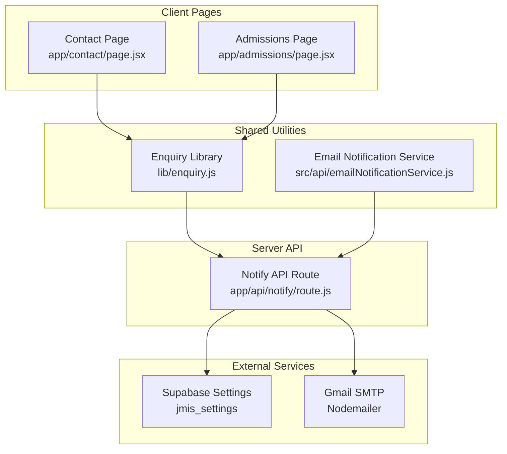
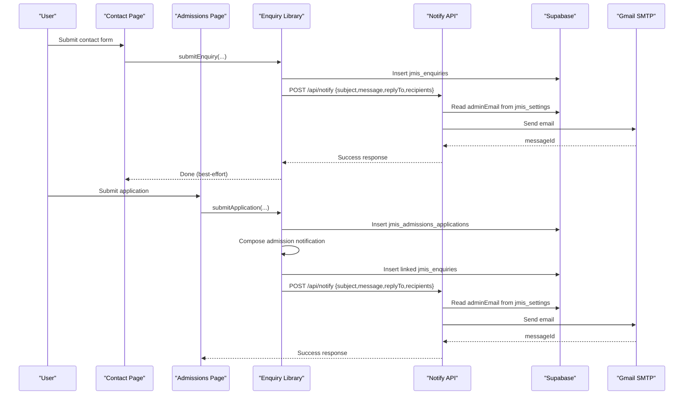
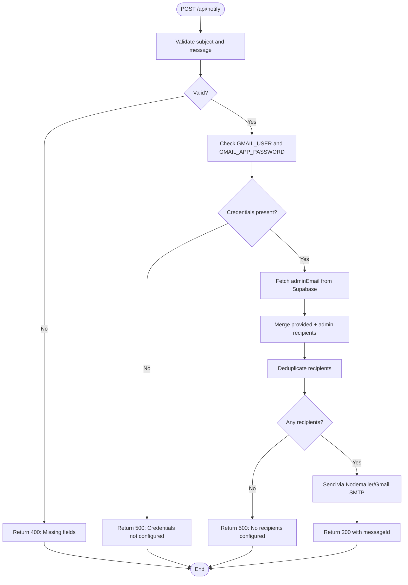
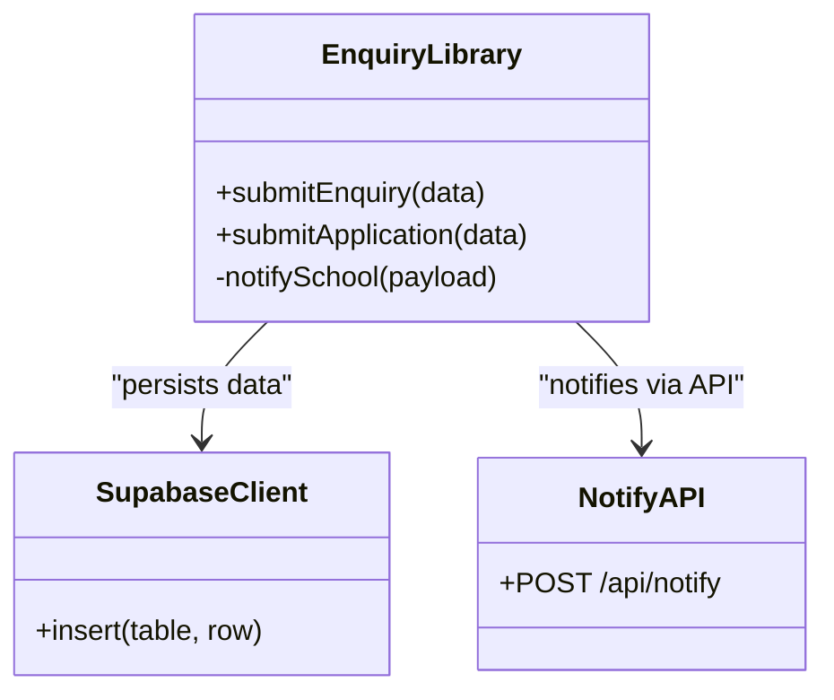
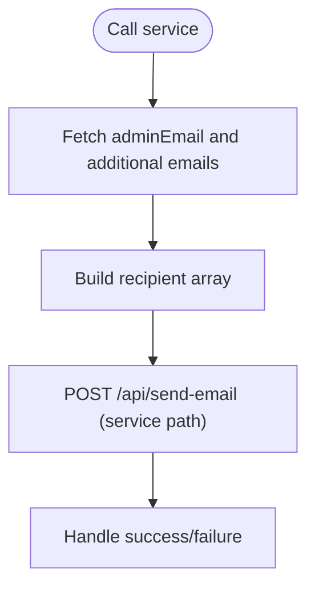
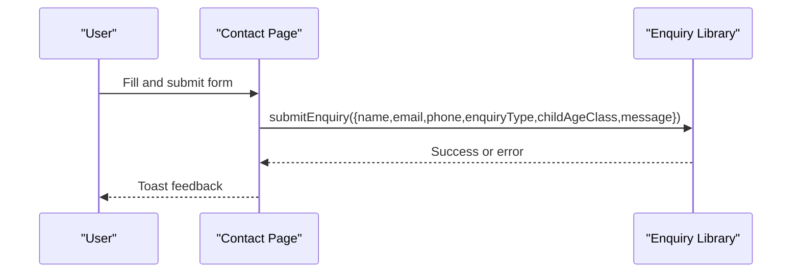
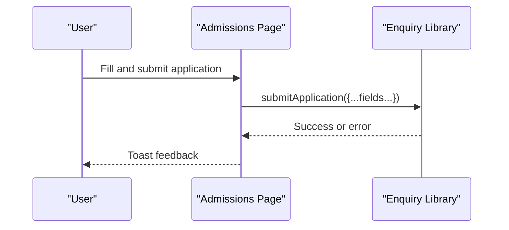
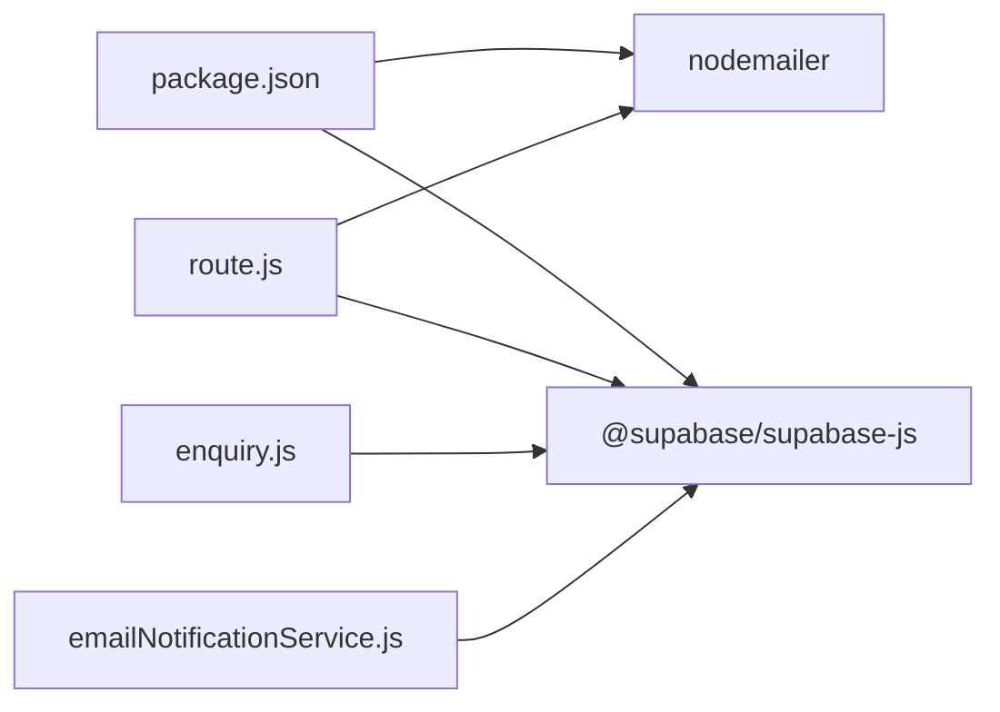

# Email Notification System

<cite>
**Referenced Files in This Document**
- [route.js](file://app/api/notify/route.js)
- [emailNotificationService.js](file://src/api/emailNotificationService.js)
- [enquiry.js](file://lib/enquiry.js)
- [page.jsx (Contact)](file://app/contact/page.jsx)
- [page.jsx (Admissions)](file://app/admissions/page.jsx)
- [package.json](file://package.json)
</cite>

## Table of Contents
1. [Introduction](#introduction)
2. [Project Structure](#project-structure)
3. [Core Components](#core-components)
4. [Architecture Overview](#architecture-overview)
5. [Detailed Component Analysis](#detailed-component-analysis)
6. [Dependency Analysis](#dependency-analysis)
7. [Performance Considerations](#performance-considerations)
8. [Troubleshooting Guide](#troubleshooting-guide)
9. [Conclusion](#conclusion)
10. [Appendices](#appendices)

## Introduction
This document explains the email notification system used by the school website for contact form submissions and admissions inquiries. It covers:
- Server-side email sending with Nodemailer and SMTP configuration
- Security considerations for credentials and data handling
- API route behavior for processing requests
- How contact and admissions pages integrate with the backend
- Guidance for adding new email templates, configuring recipients, and handling delivery errors
- Rate limiting, error handling strategies, and monitoring delivery status

The system prioritizes reliability: database records are the source of truth, while email notifications are best-effort and must not block user workflows.

## Project Structure
The email notification flow spans client pages, a serverless API route, and shared utilities:
- Client pages collect user input and call the server API or shared library functions
- The server API uses Nodemailer to send emails via Gmail SMTP
- Shared libraries handle Supabase interactions and compose messages

**Diagram sources**
- [page.jsx (Contact):1-162](file://app/contact/page.jsx#L1-L162)
- [page.jsx (Admissions):1-177](file://app/admissions/page.jsx#L1-L177)
- [enquiry.js:1-129](file://lib/enquiry.js#L1-L129)
- [emailNotificationService.js:1-127](file://src/api/emailNotificationService.js#L1-L127)
- [route.js:1-115](file://app/api/notify/route.js#L1-L115)

**Section sources**
- [page.jsx (Contact):1-162](file://app/contact/page.jsx#L1-L162)
- [page.jsx (Admissions):1-177](file://app/admissions/page.jsx#L1-L177)
- [enquiry.js:1-129](file://lib/enquiry.js#L1-L129)
- [emailNotificationService.js:1-127](file://src/api/emailNotificationService.js#L1-L127)
- [route.js:1-115](file://app/api/notify/route.js#L1-L115)

## Core Components
- Notify API Route: Accepts POST requests, validates inputs, resolves recipients from settings and caller-provided lists, and sends emails using Nodemailer over Gmail SMTP.
- Enquiry Library: Provides functions to submit enquiries and applications to Supabase and trigger email notifications via the Notify API.
- Email Notification Service: A reusable service that composes recipient lists from Supabase settings and calls the Notify API.
- Contact and Admissions Pages: User-facing forms that capture data and invoke the enquiry submission functions.

Key responsibilities:
- Input validation and safe defaults
- Recipient resolution and deduplication
- Secure credential usage via environment variables
- Best-effort email delivery without blocking user flows
- Clear error responses and logging

**Section sources**
- [route.js:1-115](file://app/api/notify/route.js#L1-L115)
- [enquiry.js:1-129](file://lib/enquiry.js#L1-L129)
- [emailNotificationService.js:1-127](file://src/api/emailNotificationService.js#L1-L127)
- [page.jsx (Contact):1-162](file://app/contact/page.jsx#L1-L162)
- [page.jsx (Admissions):1-177](file://app/admissions/page.jsx#L1-L177)

## Architecture Overview
The system follows a layered approach:
- UI layer collects user input
- Business logic layer persists data and composes notifications
- Transport layer sends emails via SMTP
- Configuration layer reads recipients from Supabase settings

**Diagram sources**
- [page.jsx (Contact):30-50](file://app/contact/page.jsx#L30-L50)
- [page.jsx (Admissions):51-64](file://app/admissions/page.jsx#L51-L64)
- [enquiry.js:32-69](file://lib/enquiry.js#L32-L69)
- [enquiry.js:73-128](file://lib/enquiry.js#L73-L128)
- [route.js:48-114](file://app/api/notify/route.js#L48-L114)

## Detailed Component Analysis

### Notify API Route (/api/notify)
Responsibilities:
- Validate request payload
- Resolve recipients from both caller-provided list and Supabase settings
- Deduplicate recipients
- Configure Nodemailer transport with Gmail SMTP
- Send email and return structured response

Security considerations:
- Credentials are read from environment variables and never exposed to clients
- Reply-to is optional and sanitized
- Errors are generic to avoid leaking internal details

Error handling:
- Missing required fields return 400
- Missing SMTP credentials return 500 with guidance
- No recipients resolved returns 500
- SMTP failures return 500 with message details

Rate limiting:
- Not implemented; consider adding middleware or per-IP throttling at the platform level

Monitoring:
- Logs include success/failure and message IDs where available

**Diagram sources**
- [route.js:48-114](file://app/api/notify/route.js#L48-L114)

**Section sources**
- [route.js:1-115](file://app/api/notify/route.js#L1-L115)

### Enquiry Library (lib/enquiry.js)
Responsibilities:
- Provide fire-and-forget notification helper that calls /api/notify
- Persist enquiries and applications to Supabase
- Compose human-readable notification bodies
- Ensure email failures do not block user experience

Design patterns:
- Fire-and-forget pattern for email notifications
- Separation of persistence and notification concerns
- Staff-specific recipient list combined with dynamic admin email

Best practices:
- Always insert into Supabase first; notify after
- Use replyTo to enable direct replies from the school inbox
- Include contextual fields in the email body for actionable follow-up

**Diagram sources**
- [enquiry.js:1-129](file://lib/enquiry.js#L1-L129)
- [route.js:48-114](file://app/api/notify/route.js#L48-L114)

**Section sources**
- [enquiry.js:1-129](file://lib/enquiry.js#L1-L129)

### Email Notification Service (src/api/emailNotificationService.js)
Responsibilities:
- Retrieve all configured recipients from Supabase settings
- Provide helpers to get admin email and full recipient list
- Call the Notify API with composed payloads

Notes:
- The service currently targets an older endpoint path; ensure it aligns with the active route
- It demonstrates how to build recipient arrays from settings

**Diagram sources**
- [emailNotificationService.js:24-56](file://src/api/emailNotificationService.js#L24-L56)
- [emailNotificationService.js:70-121](file://src/api/emailNotificationService.js#L70-L121)

**Section sources**
- [emailNotificationService.js:1-127](file://src/api/emailNotificationService.js#L1-L127)

### Contact Page (app/contact/page.jsx)
Responsibilities:
- Render contact form
- Validate inputs on the client side
- Call submitEnquiry to persist and notify

Integration points:
- Uses react-toastify for user feedback
- Delegates business logic to lib/enquiry.js

**Diagram sources**
- [page.jsx (Contact):30-50](file://app/contact/page.jsx#L30-L50)
- [enquiry.js:32-69](file://lib/enquiry.js#L32-L69)

**Section sources**
- [page.jsx (Contact):1-162](file://app/contact/page.jsx#L1-L162)

### Admissions Page (app/admissions/page.jsx)
Responsibilities:
- Render multi-field application form
- Validate inputs on the client side
- Call submitApplication to persist and notify

Integration points:
- Uses react-toastify for user feedback
- Delegates business logic to lib/enquiry.js

**Diagram sources**
- [page.jsx (Admissions):51-64](file://app/admissions/page.jsx#L51-L64)
- [enquiry.js:73-128](file://lib/enquiry.js#L73-L128)

**Section sources**
- [page.jsx (Admissions):1-177](file://app/admissions/page.jsx#L1-L177)

## Dependency Analysis
External dependencies relevant to email functionality:
- Nodemailer: Used by the Notify API to send emails via SMTP
- Supabase JS Client: Used to fetch settings and persist data
- React and Next.js: Framework and UI runtime

**Diagram sources**
- [package.json:11-22](file://package.json#L11-L22)
- [route.js:1-4](file://app/api/notify/route.js#L1-L4)
- [enquiry.js:1-4](file://lib/enquiry.js#L1-L4)
- [emailNotificationService.js:1-4](file://src/api/emailNotificationService.js#L1-L4)

**Section sources**
- [package.json:1-33](file://package.json#L1-L33)
- [route.js:1-115](file://app/api/notify/route.js#L1-L115)
- [enquiry.js:1-129](file://lib/enquiry.js#L1-L129)
- [emailNotificationService.js:1-127](file://src/api/emailNotificationService.js#L1-L127)

## Performance Considerations
- Avoid synchronous operations in the request path; current implementation uses async/await appropriately.
- Minimize repeated Supabase calls by caching settings when appropriate (e.g., within process lifetime).
- Consider batching or queuing email sends if high volume is expected.
- Keep email payloads concise; attach large files only when necessary.

[No sources needed since this section provides general guidance]

## Troubleshooting Guide
Common issues and resolutions:
- Missing required fields: Ensure subject and message are included in POST payloads.
- SMTP credentials not configured: Set GMAIL_USER and GMAIL_APP_PASSWORD environment variables.
- No recipients configured: Verify jmis_settings.adminEmail exists and is valid; ensure caller-provided recipients are non-empty.
- Email delivery failures: Inspect logs for error messages and messageId; verify SMTP connectivity and account permissions.
- Endpoint mismatch: If using emailNotificationService.js, ensure it calls the correct active route.

Operational tips:
- Log and monitor messageId values for traceability.
- Implement retry logic for transient network errors.
- Add rate limiting at the platform or reverse proxy level to protect against abuse.
- Use structured logging and alerting for failed deliveries.

**Section sources**
- [route.js:48-114](file://app/api/notify/route.js#L48-L114)
- [emailNotificationService.js:70-121](file://src/api/emailNotificationService.js#L70-L121)

## Conclusion
The email notification system integrates user-facing forms with a secure server-side API that sends emails via Gmail SMTP. It emphasizes reliability by making database persistence the source of truth and treating email delivery as best-effort. To extend the system:
- Add new email templates by composing richer message bodies in the enquiry library before calling the Notify API.
- Configure recipients through Supabase settings and/or caller-provided lists.
- Enhance security by validating and sanitizing inputs, rotating credentials, and enforcing least privilege.
- Improve resilience with retries, rate limiting, and comprehensive monitoring.

[No sources needed since this section summarizes without analyzing specific files]

## Appendices

### Adding New Email Templates
- Compose template content in the business logic layer (lib/enquiry.js) before invoking the Notify API.
- Include contextual fields such as name, email, phone, enquiry type, and child details to make emails actionable.
- For HTML templates, extend the Notify API to accept and render HTML content safely.

**Section sources**
- [enquiry.js:58-68](file://lib/enquiry.js#L58-L68)
- [enquiry.js:107-127](file://lib/enquiry.js#L107-L127)
- [route.js:96-106](file://app/api/notify/route.js#L96-L106)

### Configuring Recipients
- Primary recipients come from jmis_settings.adminEmail.
- Additional recipients can be supplied by callers or parsed from additionalemails in settings.
- The Notify API merges and deduplicates recipients to avoid duplicates.

**Section sources**
- [route.js:27-46](file://app/api/notify/route.js#L27-L46)
- [route.js:70-94](file://app/api/notify/route.js#L70-L94)
- [emailNotificationService.js:24-56](file://src/api/emailNotificationService.js#L24-L56)

### Handling Email Delivery Errors
- Validate inputs early to prevent unnecessary SMTP calls.
- Return clear error responses for missing credentials and no recipients.
- Log detailed error information server-side while keeping client responses generic.
- Implement retries for transient failures and alert on persistent errors.

**Section sources**
- [route.js:48-114](file://app/api/notify/route.js#L48-L114)

### Rate Limiting Strategy
- Introduce per-IP or per-user rate limiting at the platform level (e.g., Next.js middleware or reverse proxy).
- Enforce limits on /api/notify to prevent abuse.
- Monitor and alert on spikes in request volume.

[No sources needed since this section provides general guidance]

### Monitoring Email Delivery Status
- Capture and store messageId values returned by Nodemailer.
- Track delivery outcomes via SMTP provider dashboards or third-party services.
- Implement health checks for the Notify API and SMTP connectivity.

**Section sources**
- [route.js:96-106](file://app/api/notify/route.js#L96-L106)