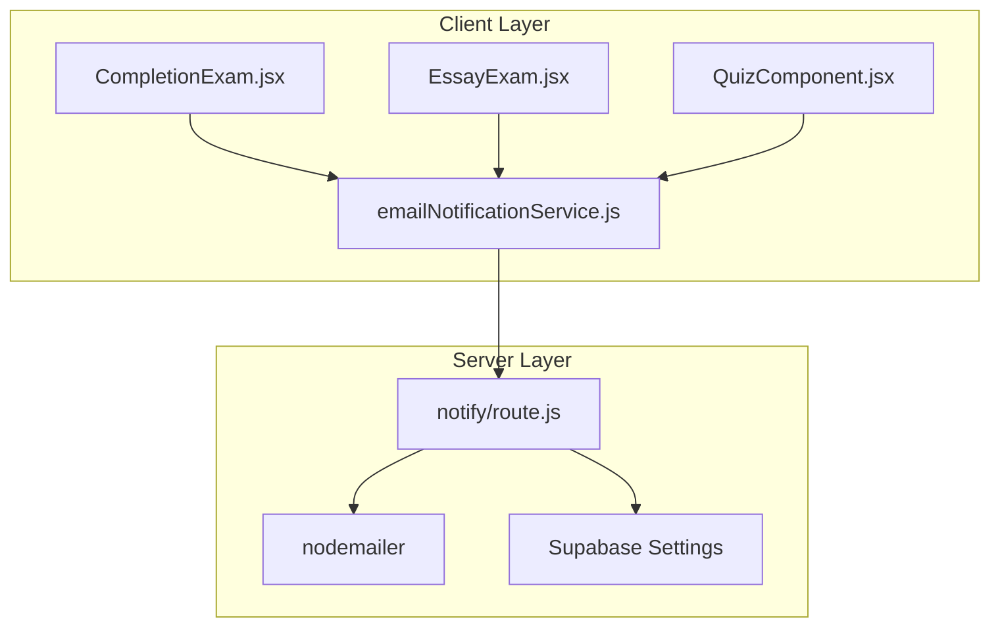
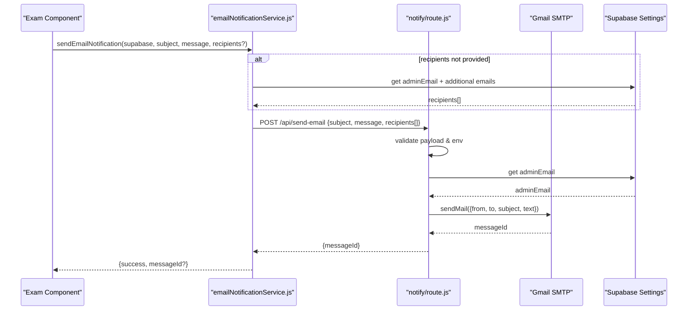
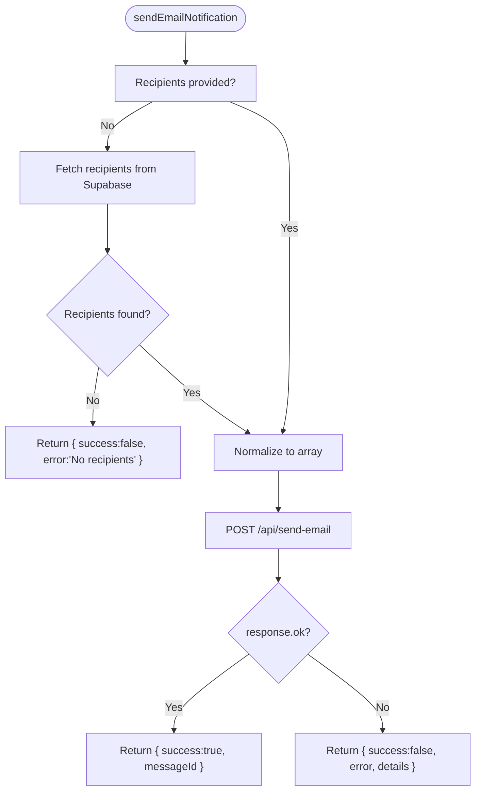
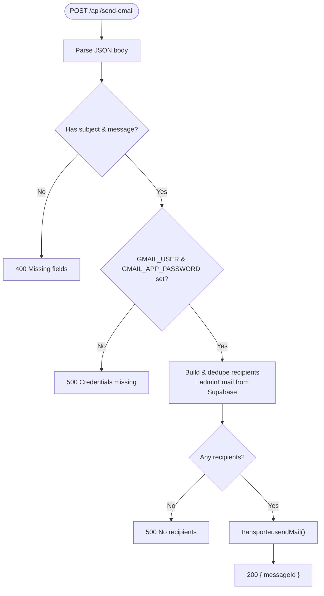
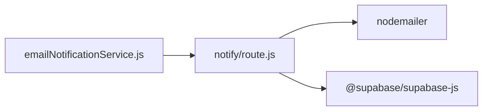

# Email Service Abstraction

<cite>
**Referenced Files in This Document**
- [emailNotificationService.js](file://src/api/emailNotificationService.js)
- [route.js](file://app/api/notify/route.js)
- [CompletionExam.jsx](file://src/pages_components/CompletionExam.jsx)
- [EssayExam.jsx](file://src/pages_components/EssayExam.jsx)
- [QuizComponent.jsx](file://src/pages_components/QuizComponent.jsx)
- [package.json](file://package.json)
</cite>

## Table of Contents
1. [Introduction](#introduction)
2. [Project Structure](#project-structure)
3. [Core Components](#core-components)
4. [Architecture Overview](#architecture-overview)
5. [Detailed Component Analysis](#detailed-component-analysis)
6. [Dependency Analysis](#dependency-analysis)
7. [Performance Considerations](#performance-considerations)
8. [Troubleshooting Guide](#troubleshooting-guide)
9. [Conclusion](#conclusion)

## Introduction
This document explains the email service abstraction layer that encapsulates email sending logic, provides a clean interface for different parts of the application, and manages configuration through environment variables and database settings. The system consists of:
- A client-side service module that prepares recipients and calls a server API to send emails.
- A Next.js API route that authenticates with an SMTP provider and sends messages.
- Integration points in exam components that trigger notifications after user actions.

The design keeps sensitive credentials out of the browser bundle by performing actual email delivery on the server while exposing a simple function for callers.

## Project Structure
The email-related code is organized into two main layers:
- Client-facing service: `src/api/emailNotificationService.js`
- Server-side transport: `app/api/notify/route.js`
- Consumers: exam components under `src/pages_components`

**Diagram sources**
- [emailNotificationService.js:70-121](file://src/api/emailNotificationService.js#L70-L121)
- [route.js:15-25](file://app/api/notify/route.js#L15-L25)
- [route.js:28-46](file://app/api/notify/route.js#L28-L46)
- [CompletionExam.jsx:305](file://src/pages_components/CompletionExam.jsx#L305)
- [EssayExam.jsx:278](file://src/pages_components/EssayExam.jsx#L278)
- [QuizComponent.jsx:992-993](file://src/pages_components/QuizComponent.jsx#L992-L993)

**Section sources**
- [emailNotificationService.js:1-127](file://src/api/emailNotificationService.js#L1-L127)
- [route.js:1-115](file://app/api/notify/route.js#L1-L115)

## Core Components
- Email notification service (client):
  - Resolves recipients from Supabase settings when not provided.
  - Normalizes recipients to an array.
  - Calls the server endpoint to deliver the message.
  - Returns a structured result indicating success or failure.
- Notify API route (server):
  - Validates request payload.
  - Ensures required SMTP credentials are configured.
  - Builds a deduplicated recipient list including the school admin inbox.
  - Sends email via nodemailer using Gmail SMTP.
  - Returns a response with a message ID on success.

Key responsibilities:
- Configuration management:
  - SMTP credentials via environment variables.
  - Recipients via Supabase settings table.
- Error handling:
  - Input validation errors.
  - Missing credentials.
  - No recipients resolved.
  - Transport-level failures.
- Logging:
  - Console logs for debugging and observability.

**Section sources**
- [emailNotificationService.js:24-67](file://src/api/emailNotificationService.js#L24-L67)
- [emailNotificationService.js:70-121](file://src/api/emailNotificationService.js#L70-L121)
- [route.js:48-113](file://app/api/notify/route.js#L48-L113)

## Architecture Overview
The email flow uses a client-server pattern:
- The client service composes the email payload and delegates delivery to the server.
- The server validates inputs, resolves recipients, and uses nodemailer to send the email.
- Supabase settings provide dynamic recipient configuration.

**Diagram sources**
- [emailNotificationService.js:70-121](file://src/api/emailNotificationService.js#L70-L121)
- [route.js:48-113](file://app/api/notify/route.js#L48-L113)
- [route.js:28-46](file://app/api/notify/route.js#L28-L46)

## Detailed Component Analysis

### Email Notification Service (Client)
Responsibilities:
- Resolve recipients from Supabase settings if not explicitly provided.
- Normalize recipients to an array.
- Call the server endpoint to send the email.
- Return a consistent result object.

Public methods:
- sendEmailNotification(supabase, subject, message, recipients = null)
  - Parameters:
    - supabase: Supabase client instance used to fetch settings.
    - subject: Email subject string.
    - message: Email body text.
    - recipients: Optional array or string of additional recipients; if omitted, recipients are fetched from settings.
  - Returns:
    - On success: { success: true, messageId: string }
    - On failure: { success: false, error: string, details?: string }
- getEmailRecipients(supabase)
  - Reads adminEmail and additionalemails from settings.
  - Returns an array of unique recipients or null if none found.
- getAdminEmail(supabase)
  - Returns the first recipient from settings (typically admin).

Error handling:
- Logs warnings when no recipients are configured.
- Catches network and JSON parsing errors.
- Propagates structured error responses to callers.

Logging:
- Emits console logs for outgoing recipients, subject, message length, API status, and results.

Integration examples:
- Exam components import and call sendEmailNotification with their own subjects and messages.

**Diagram sources**
- [emailNotificationService.js:70-121](file://src/api/emailNotificationService.js#L70-L121)

**Section sources**
- [emailNotificationService.js:24-67](file://src/api/emailNotificationService.js#L24-L67)
- [emailNotificationService.js:70-121](file://src/api/emailNotificationService.js#L70-L121)

### Notify API Route (Server)
Responsibilities:
- Validate incoming request fields.
- Ensure SMTP credentials are present.
- Build a deduplicated recipient list including the school admin inbox.
- Send email via nodemailer using Gmail SMTP.
- Return a standardized response.

Request contract:
- Method: POST
- Body:
  - subject: string (required)
  - message: string (required)
  - recipients: string | string[] (optional)
  - replyTo: string (optional)
- Response:
  - Success: { message: string, messageId: string }
  - Validation error: { error: string } with 400
  - Configuration error: { error: string } with 500
  - Transport error: { error: string, details: string } with 500

Recipient resolution:
- Combines caller-provided recipients with the adminEmail from Supabase settings.
- Trims and filters empty values.
- Deduplicates by lowercase email while preserving original casing.

Transport configuration:
- Uses nodemailer with Gmail SMTP host and port.
- Credentials loaded from environment variables.

**Diagram sources**
- [route.js:48-113](file://app/api/notify/route.js#L48-L113)
- [route.js:28-46](file://app/api/notify/route.js#L28-L46)

**Section sources**
- [route.js:15-25](file://app/api/notify/route.js#L15-L25)
- [route.js:48-113](file://app/api/notify/route.js#L48-L113)

### Consumer Integrations
The following components integrate with the email service:
- CompletionExam.jsx: Imports and invokes sendEmailNotification to notify after completion.
- EssayExam.jsx: Invokes sendEmailNotification to notify after essay submission.
- QuizComponent.jsx: Invokes sendEmailNotification to notify after quiz results.

Common pattern:
- Import sendEmailNotification.
- Prepare subject and message strings.
- Optionally pass additional recipients.
- Await the result and handle success/failure accordingly.

**Section sources**
- [CompletionExam.jsx:305](file://src/pages_components/CompletionExam.jsx#L305)
- [EssayExam.jsx:278](file://src/pages_components/EssayExam.jsx#L278)
- [QuizComponent.jsx:992-993](file://src/pages_components/QuizComponent.jsx#L992-L993)

## Dependency Analysis
External dependencies relevant to email delivery:
- nodemailer: Used by the server route to send emails via SMTP.
- @supabase/supabase-js: Used to read settings for recipients and admin email.

**Diagram sources**
- [emailNotificationService.js:92-102](file://src/api/emailNotificationService.js#L92-L102)
- [route.js:1-3](file://app/api/notify/route.js#L1-L3)
- [package.json:11-16](file://package.json#L11-L16)

**Section sources**
- [package.json:11-16](file://package.json#L11-L16)

## Performance Considerations
- Network latency: Each email triggers a client-to-server HTTP call followed by SMTP delivery. Batch operations should consider queuing or background jobs if high volume is expected.
- Database reads: Recipient resolution queries Supabase on each send. Consider caching recipients at runtime if frequently accessed.
- Transport reuse: The current implementation creates a new nodemailer transporter per request. For higher throughput, consider creating a shared transporter instance.
- Payload size: Large messages increase network overhead. Consider truncating or summarizing content where appropriate.

[No sources needed since this section provides general guidance]

## Troubleshooting Guide
Common issues and resolutions:
- Missing SMTP credentials:
  - Symptom: Server returns a configuration error.
  - Resolution: Set GMAIL_USER and GMAIL_APP_PASSWORD environment variables.
- No recipients configured:
  - Symptom: Server returns “No email recipients configured”.
  - Resolution: Ensure jmis_settings contains adminEmail or provide recipients in the request.
- Invalid request payload:
  - Symptom: 400 error due to missing subject or message.
  - Resolution: Include both subject and message in the request body.
- Transport failures:
  - Symptom: 500 error with details about SMTP failure.
  - Resolution: Verify SMTP settings, account permissions, and network connectivity.

Logging strategies:
- Client service logs outgoing recipients, subject, message length, API status, and results.
- Server route logs credential checks, recipient resolution, and send outcomes.

**Section sources**
- [emailNotificationService.js:70-121](file://src/api/emailNotificationService.js#L70-L121)
- [route.js:48-113](file://app/api/notify/route.js#L48-L113)

## Conclusion
The email service abstraction cleanly separates concerns between client composition and server delivery. It centralizes configuration via environment variables and Supabase settings, exposes a simple API for consumers, and implements robust error handling and logging. To extend the system:
- Add new templates by composing subject/message strings in consumer components before calling sendEmailNotification.
- Support additional providers by abstracting the transport layer behind a pluggable strategy and updating the server route to select the appropriate provider based on configuration.

[No sources needed since this section summarizes without analyzing specific files]