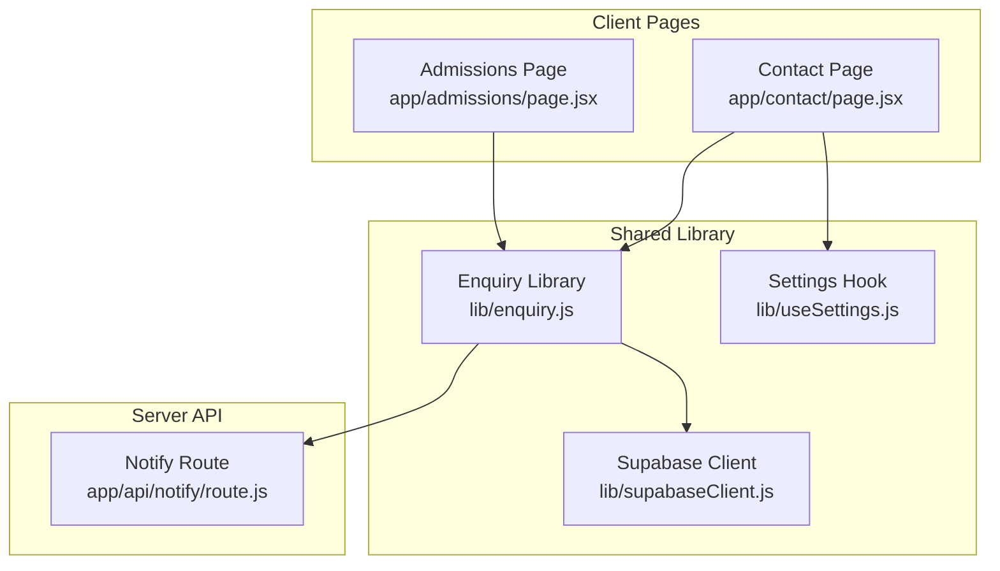
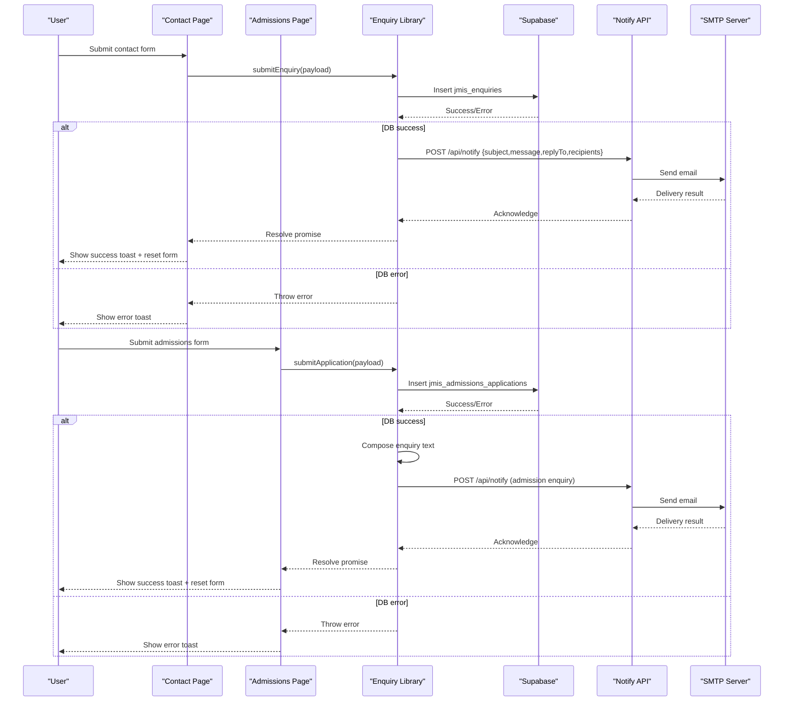
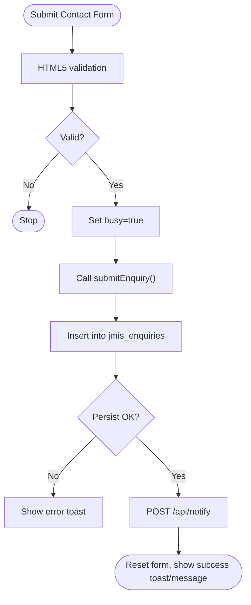
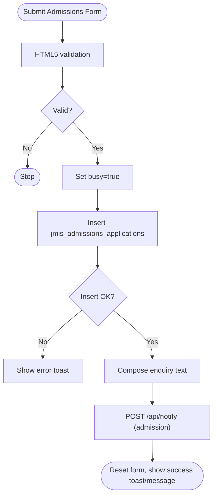
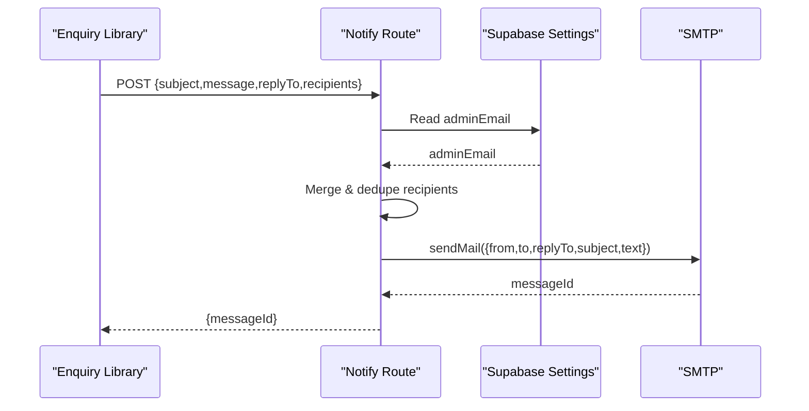
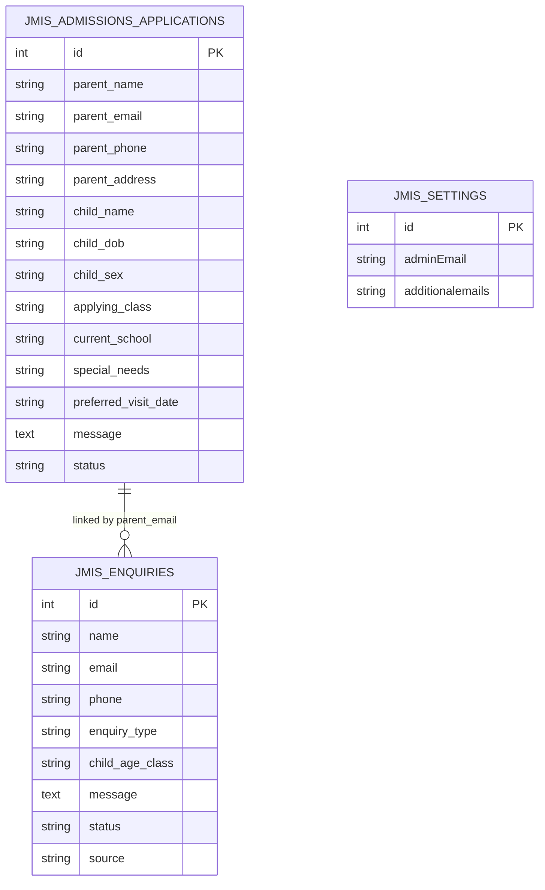
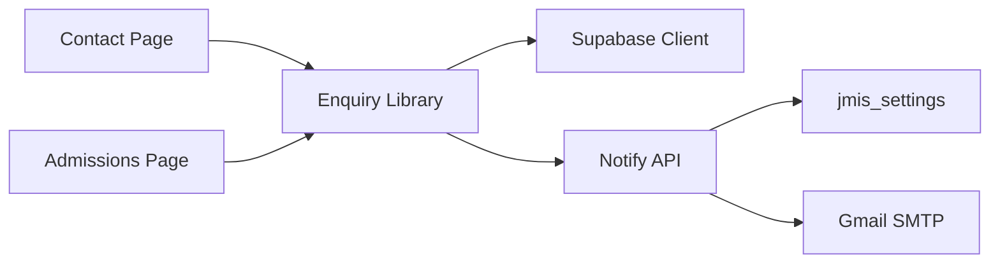

# Form Integration

<cite>
**Referenced Files in This Document**
- [page.jsx](file://app/contact/page.jsx)
- [page.jsx](file://app/admissions/page.jsx)
- [enquiry.js](file://lib/enquiry.js)
- [route.js](file://app/api/notify/route.js)
- [supabaseClient.js](file://lib/supabaseClient.js)
- [useSettings.js](file://lib/useSettings.js)
- [emailNotificationService.js](file://src/api/emailNotificationService.js)
</cite>

## Table of Contents
1. [Introduction](#introduction)
2. [Project Structure](#project-structure)
3. [Core Components](#core-components)
4. [Architecture Overview](#architecture-overview)
5. [Detailed Component Analysis](#detailed-component-analysis)
6. [Dependency Analysis](#dependency-analysis)
7. [Performance Considerations](#performance-considerations)
8. [Troubleshooting Guide](#troubleshooting-guide)
9. [Conclusion](#conclusion)
10. [Appendices](#appendices)

## Introduction
This document explains how contact forms and admission inquiries are integrated with the email notification system on the website. It covers the end-to-end flow from user submission to database persistence and email delivery, including validation rules, error handling, user feedback (loading states and success/error notifications), and guidance for adding new fields and customizing notifications.

## Project Structure
The form integration spans client-side pages, a shared library for data and notifications, and a server API route that sends emails via SMTP.

**Diagram sources**
- [page.jsx:1-162](file://app/contact/page.jsx#L1-L162)
- [page.jsx:1-177](file://app/admissions/page.jsx#L1-L177)
- [enquiry.js:1-129](file://lib/enquiry.js#L1-L129)
- [supabaseClient.js:1-13](file://lib/supabaseClient.js#L1-L13)
- [useSettings.js:1-25](file://lib/useSettings.js#L1-L25)
- [route.js:1-115](file://app/api/notify/route.js#L1-L115)

**Section sources**
- [page.jsx:1-162](file://app/contact/page.jsx#L1-L162)
- [page.jsx:1-177](file://app/admissions/page.jsx#L1-L177)
- [enquiry.js:1-129](file://lib/enquiry.js#L1-L129)
- [route.js:1-115](file://app/api/notify/route.js#L1-L115)
- [supabaseClient.js:1-13](file://lib/supabaseClient.js#L1-L13)
- [useSettings.js:1-25](file://lib/useSettings.js#L1-L25)

## Core Components
- Contact page form: Captures name, email, phone, enquiry type, child age/class, and message. Submits via the shared enquiry library and shows loading/success feedback.
- Admissions page form: Captures parent and child details, class applying for, optional preferences, and messages. Submits via the application function which also creates an enquiry row and notifies the school.
- Enquiry library: Persists enquiries and applications to Supabase and triggers best-effort email notifications through the notify API.
- Notify API route: Validates payload, resolves recipients (including admin email from settings), and sends email via SMTP.

Key responsibilities:
- Client pages manage UI state, validate required fields using HTML attributes, and handle user feedback.
- The library ensures data is stored reliably and attempts to notify by email without blocking the user experience.
- The server route centralizes email sending and recipient resolution.

**Section sources**
- [page.jsx:1-162](file://app/contact/page.jsx#L1-L162)
- [page.jsx:1-177](file://app/admissions/page.jsx#L1-L177)
- [enquiry.js:1-129](file://lib/enquiry.js#L1-L129)
- [route.js:1-115](file://app/api/notify/route.js#L1-L115)

## Architecture Overview
The submission flow uses a two-phase approach: persist first, then notify. This ensures no data loss even if email delivery fails.

**Diagram sources**
- [page.jsx:1-162](file://app/contact/page.jsx#L1-L162)
- [page.jsx:1-177](file://app/admissions/page.jsx#L1-L177)
- [enquiry.js:1-129](file://lib/enquiry.js#L1-L129)
- [route.js:1-115](file://app/api/notify/route.js#L1-L115)

## Detailed Component Analysis

### Contact Form Flow
- Validation: Required fields enforced via HTML attributes; browser prevents submission when missing.
- State management: Local state tracks form values, busy indicator, and sent confirmation.
- Submission: Calls the shared library to insert into the enquiries table and trigger email notification.
- Feedback: Shows a loading button state, a success toast, and a brief success message below the form.

**Diagram sources**
- [page.jsx:1-162](file://app/contact/page.jsx#L1-L162)
- [enquiry.js:1-129](file://lib/enquiry.js#L1-L129)
- [route.js:1-115](file://app/api/notify/route.js#L1-L115)

**Section sources**
- [page.jsx:1-162](file://app/contact/page.jsx#L1-L162)
- [enquiry.js:1-129](file://lib/enquiry.js#L1-L129)

### Admissions Form Flow
- Validation: Required fields enforced via HTML attributes; selects constrain choices.
- State management: Tracks form values, busy indicator, and done confirmation.
- Submission: Inserts an application record and composes an enquiry entry linking to the same contact email, then triggers email notification.
- Feedback: Shows a loading button state, a success toast, and a brief success message below the form.

**Diagram sources**
- [page.jsx:1-177](file://app/admissions/page.jsx#L1-L177)
- [enquiry.js:1-129](file://lib/enquiry.js#L1-L129)
- [route.js:1-115](file://app/api/notify/route.js#L1-L115)

**Section sources**
- [page.jsx:1-177](file://app/admissions/page.jsx#L1-L177)
- [enquiry.js:1-129](file://lib/enquiry.js#L1-L129)

### Email Notification Service
- Recipient resolution: The notify route reads the admin email from settings and merges it with any additional recipients provided by the caller. It deduplicates recipients while preserving order.
- SMTP configuration: Uses environment variables for credentials and connects to Gmail SMTP.
- Payload validation: Requires subject and message; returns appropriate errors if missing or misconfigured.
- Best-effort design: The client library treats email failures as non-blocking; the database row remains the source of truth.

**Diagram sources**
- [enquiry.js:1-129](file://lib/enquiry.js#L1-L129)
- [route.js:1-115](file://app/api/notify/route.js#L1-L115)

**Section sources**
- [route.js:1-115](file://app/api/notify/route.js#L1-L115)
- [enquiry.js:1-129](file://lib/enquiry.js#L1-L129)

### Data Models and Relationships
- jmis_enquiries: Stores contact enquiries with status and source metadata.
- jmis_admissions_applications: Stores detailed admission applications.
- jmis_settings: Holds admin email and other site-wide settings used by both client hooks and server routes.

**Diagram sources**
- [enquiry.js:1-129](file://lib/enquiry.js#L1-L129)
- [route.js:1-115](file://app/api/notify/route.js#L1-L115)

**Section sources**
- [enquiry.js:1-129](file://lib/enquiry.js#L1-L129)
- [route.js:1-115](file://app/api/notify/route.js#L1-L115)

## Dependency Analysis
- Client pages depend on the enquiry library for data operations and on the settings hook for dynamic content.
- The enquiry library depends on the Supabase client and calls the notify API for email delivery.
- The notify route depends on environment variables and Supabase settings to resolve recipients and send mail.

**Diagram sources**
- [page.jsx:1-162](file://app/contact/page.jsx#L1-L162)
- [page.jsx:1-177](file://app/admissions/page.jsx#L1-L177)
- [enquiry.js:1-129](file://lib/enquiry.js#L1-L129)
- [supabaseClient.js:1-13](file://lib/supabaseClient.js#L1-L13)
- [route.js:1-115](file://app/api/notify/route.js#L1-L115)

**Section sources**
- [page.jsx:1-162](file://app/contact/page.jsx#L1-L162)
- [page.jsx:1-177](file://app/admissions/page.jsx#L1-L177)
- [enquiry.js:1-129](file://lib/enquiry.js#L1-L129)
- [supabaseClient.js:1-13](file://lib/supabaseClient.js#L1-L13)
- [route.js:1-115](file://app/api/notify/route.js#L1-L115)

## Performance Considerations
- Database-first persistence ensures reliability even if email delivery is delayed or fails.
- Email notifications are fire-and-forget from the client perspective; they do not block form submission UX.
- Deduplication of recipients avoids redundant emails and reduces SMTP load.
- Keep form payloads minimal and only include necessary fields to reduce network overhead.

[No sources needed since this section provides general guidance]

## Troubleshooting Guide
Common issues and where to look:
- Missing required fields: Browser validation will prevent submission; ensure all required inputs have proper attributes.
- Database insert failure: Check Supabase permissions and schema; errors are thrown back to the client and shown via toast.
- Email service not configured: The notify route requires environment variables for SMTP; missing values return a specific error.
- No recipients resolved: Ensure admin email exists in settings; otherwise the route returns an error indicating no recipients.
- Network errors: If the notify API call fails, the client logs the error but does not block the user; verify server availability and CORS/network policies.

Operational checks:
- Verify environment variables for SMTP are set on the server.
- Confirm jmis_settings contains a valid admin email.
- Inspect console logs for error messages from the notify route and client-side fetch calls.

**Section sources**
- [route.js:1-115](file://app/api/notify/route.js#L1-L115)
- [enquiry.js:1-129](file://lib/enquiry.js#L1-L129)

## Conclusion
The form integration follows a robust pattern: persist data immediately, then attempt email notification without blocking the user. This design guarantees lead capture even under transient email failures. The notify route centralizes recipient resolution and SMTP usage, while client pages provide clear feedback through loading states and toast notifications. Extending forms or customizing notifications involves updating the relevant page, enriching the payload in the library, and adjusting the notify route’s message composition as needed.

[No sources needed since this section summarizes without analyzing specific files]

## Appendices

### Adding New Form Fields
Steps to add a field to either form:
- Add the input/select element to the page component and bind it to local state.
- Mark required fields with HTML attributes to enable built-in validation.
- Extend the form state initialization and update handler to include the new field.
- Update the payload passed to the library functions so the new value is persisted and included in notifications.
- If the field affects email content, adjust the message composition in the library to include the new data.

Reference paths:
- Contact form fields and state: [page.jsx:19-41](file://app/contact/page.jsx#L19-L41)
- Admissions form fields and state: [page.jsx:36-49](file://app/admissions/page.jsx#L36-L49)
- Payload mapping for enquiries: [enquiry.js:32-69](file://lib/enquiry.js#L32-L69)
- Payload mapping for applications: [enquiry.js:73-128](file://lib/enquiry.js#L73-L128)

**Section sources**
- [page.jsx:1-162](file://app/contact/page.jsx#L1-L162)
- [page.jsx:1-177](file://app/admissions/page.jsx#L1-L177)
- [enquiry.js:1-129](file://lib/enquiry.js#L1-L129)

### Customizing Email Templates
- Subject lines and body text are composed in the library before calling the notify API.
- To customize per form type, branch on the enquiry type or source within the library and adjust the subject/text accordingly.
- For richer formatting, consider adding HTML content to the notify route and passing structured templates from the library.

Reference paths:
- Enquiry subject/text composition: [enquiry.js:59-68](file://lib/enquiry.js#L59-L68)
- Application detail composition: [enquiry.js:107-127](file://lib/enquiry.js#L107-L127)
- Notify route email sending: [route.js:96-103](file://app/api/notify/route.js#L96-L103)

**Section sources**
- [enquiry.js:1-129](file://lib/enquiry.js#L1-L129)
- [route.js:1-115](file://app/api/notify/route.js#L1-L115)

### Implementing Form State Management
- Use local state to track form values, submission status, and success indicators.
- Provide a reusable setter helper to update fields by key.
- Reset form state after successful submission to prepare for subsequent entries.

Reference paths:
- Contact page state and handlers: [page.jsx:17-49](file://app/contact/page.jsx#L17-L49)
- Admissions page state and handlers: [page.jsx:46-64](file://app/admissions/page.jsx#L46-L64)

**Section sources**
- [page.jsx:1-162](file://app/contact/page.jsx#L1-L162)
- [page.jsx:1-177](file://app/admissions/page.jsx#L1-L177)

### User Feedback Mechanisms
- Loading states: Disable the submit button and change label during submission.
- Success notifications: Show a toast and an inline success message after successful submission.
- Error notifications: Catch errors from the library and display a toast with a user-friendly message.

Reference paths:
- Contact feedback: [page.jsx:30-50](file://app/contact/page.jsx#L30-L50), [page.jsx:144-155](file://app/contact/page.jsx#L144-L155)
- Admissions feedback: [page.jsx:51-64](file://app/admissions/page.jsx#L51-L64), [page.jsx:160-171](file://app/admissions/page.jsx#L160-L171)

**Section sources**
- [page.jsx:1-162](file://app/contact/page.jsx#L1-L162)
- [page.jsx:1-177](file://app/admissions/page.jsx#L1-L177)

### Additional Notes
- There is an alternative email service file present in the repository that references a different endpoint; the active implementation uses the notify route described above. When integrating future changes, prefer the notify route for consistency.

Reference path:
- Alternative service file: [emailNotificationService.js:1-127](file://src/api/emailNotificationService.js#L1-L127)

**Section sources**
- [emailNotificationService.js:1-127](file://src/api/emailNotificationService.js#L1-L127)