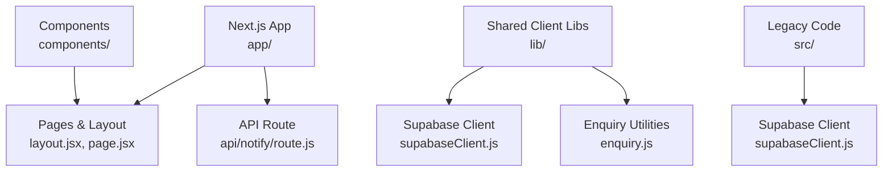
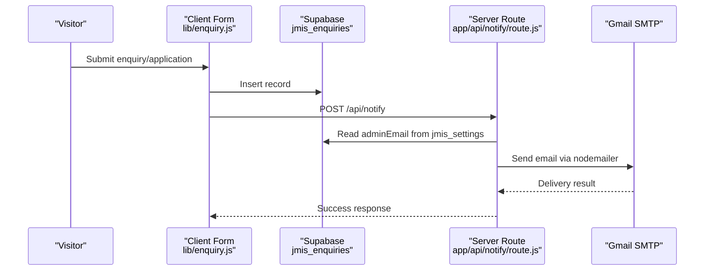

# Getting Started

<cite>
**Referenced Files in This Document**
- [package.json](file://package.json)
- [next.config.mjs](file://next.config.mjs)
- [lib/supabaseClient.js](file://lib/supabaseClient.js)
- [src/supabaseClient.js](file://src/supabaseClient.js)
- [app/api/notify/route.js](file://app/api/notify/route.js)
- [lib/enquiry.js](file://lib/enquiry.js)
- [app/layout.jsx](file://app/layout.jsx)
- [app/page.jsx](file://app/page.jsx)
- [.gitignore](file://.gitignore)
</cite>

## Table of Contents
1. Introduction
2. Project Structure
3. Prerequisites and Environment Setup
4. Installation Steps
5. Initial Configuration
6. Development Workflow and Commands
7. Supabase Setup
8. Email Service Setup (Gmail)
9. Running the Site Locally
10. Troubleshooting
11. Conclusion

## Introduction
This guide helps you set up, configure, and run the JMI School Website locally. It covers environment requirements, installation steps, initial configuration for Supabase and email, development workflow, and common troubleshooting tips. The site is a Next.js application that reads content from a shared Supabase project and sends notifications via Gmail using an app password.

## Project Structure
The website uses a modern Next.js App Router layout with client components and server routes:
- app/: Next.js pages and API routes
  - app/api/notify/route.js: Server-side email notification endpoint
- lib/: Shared client utilities and Supabase client
- src/: Additional utilities, styles, and legacy client code
- components/: Reusable UI components used by pages
- public/: Static assets

**Diagram sources**
- [app/layout.jsx:1-24](file://app/layout.jsx#L1-L24)
- [app/page.jsx:1-27](file://app/page.jsx#L1-L27)
- [app/api/notify/route.js:1-115](file://app/api/notify/route.js#L1-L115)
- [lib/supabaseClient.js:1-13](file://lib/supabaseClient.js#L1-L13)
- [lib/enquiry.js:1-129](file://lib/enquiry.js#L1-L129)
- [src/supabaseClient.js:1-7](file://src/supabaseClient.js#L1-L7)

**Section sources**
- [app/layout.jsx:1-24](file://app/layout.jsx#L1-L24)
- [app/page.jsx:1-27](file://app/page.jsx#L1-L27)
- [app/api/notify/route.js:1-115](file://app/api/notify/route.js#L1-L115)
- [lib/supabaseClient.js:1-13](file://lib/supabaseClient.js#L1-L13)
- [lib/enquiry.js:1-129](file://lib/enquiry.js#L1-L129)
- [src/supabaseClient.js:1-7](file://src/supabaseClient.js#L1-L7)

## Prerequisites and Environment Setup
- Node.js: Use a recent LTS version compatible with Next.js 16.x. If you encounter issues, try switching to a different LTS release using your Node version manager.
- npm or yarn: Any modern package manager will work; this repository includes a lockfile.
- Database: No local database is required. Data is stored in a shared Supabase project.
- Email service: Gmail SMTP via nodemailer requires an App Password.

Key dependencies and scripts are defined in the package manifest.

**Section sources**
- [package.json:1-33](file://package.json#L1-L33)

## Installation Steps
1. Install dependencies
   - Run the install command for your package manager.
2. Start the development server
   - Run the dev script to start the local server.
3. Build and start production
   - Build the app and then start the production server.

Common commands:
- Install dependencies
- Start development server
- Build for production
- Start production server
- Lint the code

**Section sources**
- [package.json:5-10](file://package.json#L5-L10)

## Initial Configuration
Create a local environment file to supply runtime variables. Add the following keys:
- NEXT_PUBLIC_SUPABASE_URL
- NEXT_PUBLIC_SUPABASE_ANON_KEY
- NEXT_PUBLIC_STUDENT_PORTAL_URL
- NEXT_PUBLIC_ADMIN_URL
- GMAIL_USER
- GMAIL_APP_PASSWORD

Notes:
- NEXT_PUBLIC_* variables are exposed to the browser bundle.
- GMAIL_* variables are used only on the server route and must not be exposed to the client.
- .env.local is ignored by Git to keep secrets out of version control.

Environment exposure is configured in the Next.js config.

**Section sources**
- [next.config.mjs:4-9](file://next.config.mjs#L4-L9)
- [.gitignore:8-8](file://.gitignore#L8-L8)

## Development Workflow and Commands
- Development mode: Runs the Next.js dev server with hot reloading.
- Build: Compiles the app for production.
- Start: Runs the compiled production build.
- Lint: Checks code quality.

Use these commands during development to iterate quickly and ensure code quality.

**Section sources**
- [package.json:5-10](file://package.json#L5-L10)

## Supabase Setup
The website connects to a shared Supabase project using the anonymous key.

What you need:
- A Supabase project URL
- An anon key with read access to the tables used by the site

Where it’s used:
- Client Supabase client initialization
- Server route reading settings for email recipients

Steps:
1. Create or obtain a Supabase project.
2. Copy the project URL and anon key into your environment file as NEXT_PUBLIC_SUPABASE_URL and NEXT_PUBLIC_SUPABASE_ANON_KEY.
3. Ensure the following tables exist in your Supabase project:
   - jmis_settings
   - jmis_enquiries
   - jmis_admissions_applications
4. Populate jmis_settings.adminEmail with the school office email address. This is used to receive notifications.

Important:
- Remote image domains are whitelisted in Next.js config for Supabase storage.
- Public storage URLs are constructed for images managed through the admin dashboard.

**Section sources**
- [lib/supabaseClient.js:1-13](file://lib/supabaseClient.js#L1-L13)
- [src/supabaseClient.js:1-7](file://src/supabaseClient.js#L1-L7)
- [next.config.mjs:10-15](file://next.config.mjs#L10-L15)
- [lib/enquiry.js:29-69](file://lib/enquiry.js#L29-L69)
- [lib/enquiry.js:71-128](file://lib/enquiry.js#L71-L128)

## Email Service Setup (Gmail)
The site sends notifications via Gmail SMTP using nodemailer.

Requirements:
- A Gmail account
- An App Password generated for the account
- Set GMAIL_USER to the Gmail address
- Set GMAIL_APP_PASSWORD to the generated App Password

How it works:
- The server route /api/notify composes and sends emails using nodemailer.
- Recipients include any caller-provided addresses plus the admin email fetched from jmis_settings.
- The contact form and admissions flow trigger notifications after persisting data to Supabase.

**Diagram sources**
- [lib/enquiry.js:32-69](file://lib/enquiry.js#L32-L69)
- [app/api/notify/route.js:15-25](file://app/api/notify/route.js#L15-L25)
- [app/api/notify/route.js:27-46](file://app/api/notify/route.js#L27-L46)
- [app/api/notify/route.js:48-114](file://app/api/notify/route.js#L48-L114)

**Section sources**
- [app/api/notify/route.js:1-115](file://app/api/notify/route.js#L1-L115)
- [lib/enquiry.js:32-69](file://lib/enquiry.js#L32-L69)

## Running the Site Locally
After installing dependencies and configuring environment variables:
1. Start the development server.
2. Open the local URL in your browser.
3. Test the home page and forms.
4. Verify Supabase connectivity by checking that marketing sections load data from jmis_settings.
5. Test email notifications by submitting a contact or admissions form.

The root layout defines global metadata and wraps the site with Navbar and Footer.

**Section sources**
- [app/layout.jsx:6-11](file://app/layout.jsx#L6-L11)
- [app/layout.jsx:13-23](file://app/layout.jsx#L13-L23)
- [app/page.jsx:11-26](file://app/page.jsx#L11-L26)

## Troubleshooting
- Missing environment variables
  - Symptom: Runtime errors or missing values in the browser/server.
  - Fix: Ensure all required variables are present in your environment file.
  - Reference: [next.config.mjs:4-9](file://next.config.mjs#L4-L9)

- Supabase connection issues
  - Symptom: Pages fail to load content or throw errors when querying tables.
  - Fix: Verify NEXT_PUBLIC_SUPABASE_URL and NEXT_PUBLIC_SUPABASE_ANON_KEY. Confirm tables jmis_settings, jmis_enquiries, and jmis_admissions_applications exist and contain required rows.
  - Reference: [lib/supabaseClient.js:1-13](file://lib/supabaseClient.js#L1-L13), [lib/enquiry.js:29-69](file://lib/enquiry.js#L29-L69)

- Email not sending
  - Symptom: Notifications do not arrive after form submission.
  - Fix: Confirm GMAIL_USER and GMAIL_APP_PASSWORD are set. Generate a new App Password if needed. Ensure jmis_settings.adminEmail is populated.
  - Reference: [app/api/notify/route.js:59-68](file://app/api/notify/route.js#L59-L68), [app/api/notify/route.js:78-94](file://app/api/notify/route.js#L78-L94)

- Images not loading
  - Symptom: Hero/gallery/facility images fail to render.
  - Fix: Ensure remotePatterns allow the Supabase storage domain.
  - Reference: [next.config.mjs:10-15](file://next.config.mjs#L10-L15)

- Secrets accidentally committed
  - Symptom: Sensitive files appear in version control.
  - Fix: Remove them from history and rely on .gitignore rules for .env*.local.
  - Reference: [.gitignore:8-8](file://.gitignore#L8-L8)

## Conclusion
You now have everything needed to install, configure, and run the JMI School Website locally. Configure Supabase and Gmail credentials, start the development server, and begin contributing. For ongoing development, use the provided scripts and follow the troubleshooting guidance when issues arise.