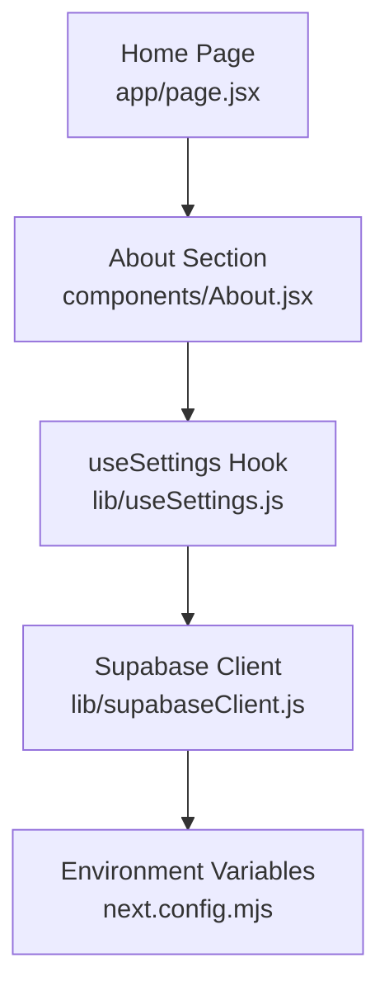
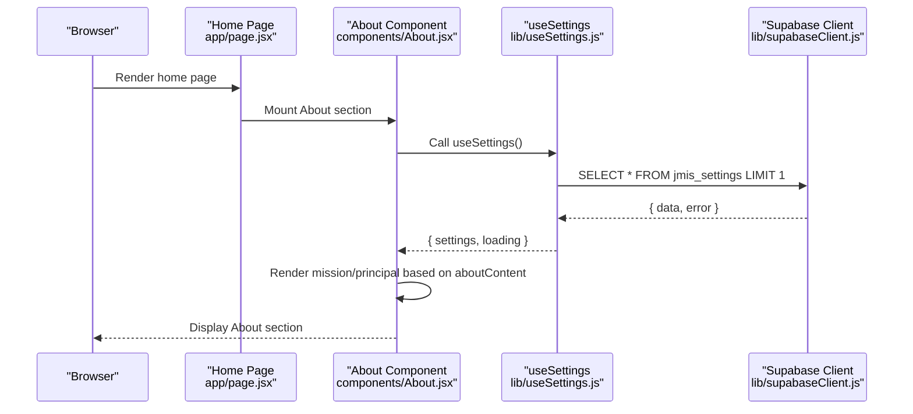
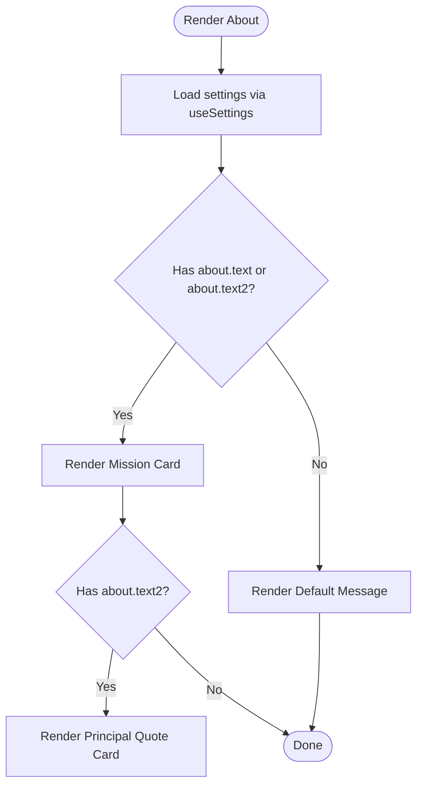
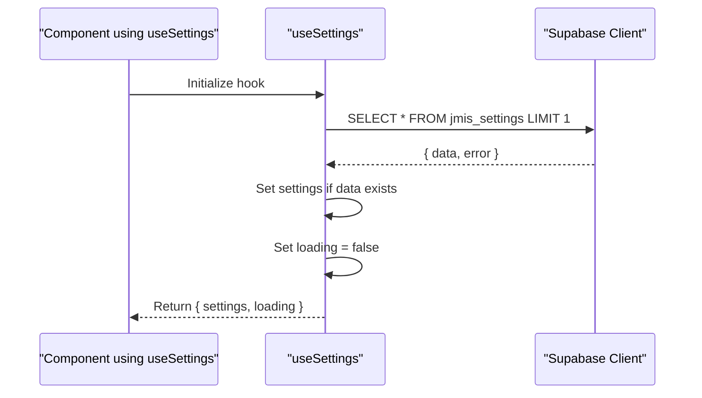
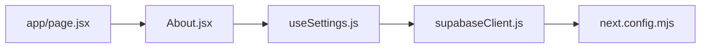

# About Section

<cite>
**Referenced Files in This Document**
- [About.jsx](file://components/About.jsx)
- [useSettings.js](file://lib/useSettings.js)
- [supabaseClient.js](file://lib/supabaseClient.js)
- [page.jsx](file://app/page.jsx)
- [next.config.mjs](file://next.config.mjs)
</cite>

## Table of Contents
1. [Introduction](#introduction)
2. [Project Structure](#project-structure)
3. [Core Components](#core-components)
4. [Architecture Overview](#architecture-overview)
5. [Detailed Component Analysis](#detailed-component-analysis)
6. [Dependency Analysis](#dependency-analysis)
7. [Performance Considerations](#performance-considerations)
8. [Troubleshooting Guide](#troubleshooting-guide)
9. [Conclusion](#conclusion)
10. [Appendices](#appendices)

## Introduction
This document explains the About section component that presents school information, mission statements, and institutional details on the public website. It covers how content is structured, how rich text is handled, and how dynamic updates are powered by Supabase via a shared settings hook. It also provides guidance for updating content, managing media assets, customizing layout, organizing content effectively, and maintaining consistency across screen sizes.

## Project Structure
The About section is rendered as part of the home page and consumes centralized site settings from Supabase. The key files involved are:
- The About component that renders the section UI
- A shared useSettings hook that fetches settings from Supabase
- A Supabase client configured with environment variables
- The home page that includes the About component

**Diagram sources**
- [page.jsx:1-26](file://app/page.jsx#L1-L26)
- [About.jsx:1-46](file://components/About.jsx#L1-L46)
- [useSettings.js:1-25](file://lib/useSettings.js#L1-L25)
- [supabaseClient.js:1-13](file://lib/supabaseClient.js#L1-L13)
- [next.config.mjs:1-18](file://next.config.mjs#L1-L18)

**Section sources**
- [page.jsx:1-26](file://app/page.jsx#L1-L26)
- [About.jsx:1-46](file://components/About.jsx#L1-L46)
- [useSettings.js:1-25](file://lib/useSettings.js#L1-L25)
- [supabaseClient.js:1-13](file://lib/supabaseClient.js#L1-L13)
- [next.config.mjs:1-18](file://next.config.mjs#L1-L18)

## Core Components
- About component: Renders the “About the school” section, including the mission statement and principal’s welcome message. It reads content from the aboutContent object provided by useSettings and conditionally displays sections based on available fields.
- useSettings hook: Fetches a single row from the jmis_settings table and exposes it to components. It handles loading state and cleanup to avoid stale updates.
- Supabase client: Initializes the Supabase client using environment variables and provides a helper URL builder for public storage objects under the setting folder.

Key responsibilities:
- Data fetching: Centralized retrieval of settings from Supabase
- Rendering: Conditional display of mission and principal messages
- Environment configuration: Securely load Supabase credentials at build time

**Section sources**
- [About.jsx:1-46](file://components/About.jsx#L1-L46)
- [useSettings.js:1-25](file://lib/useSettings.js#L1-L25)
- [supabaseClient.js:1-13](file://lib/supabaseClient.js#L1-L13)

## Architecture Overview
The About section follows a client-side data flow pattern:
- The home page includes the About component
- About uses the useSettings hook to fetch settings from Supabase
- The hook queries the jmis_settings table and returns the settings object
- About renders the mission and principal message based on aboutContent fields

**Diagram sources**
- [page.jsx:1-26](file://app/page.jsx#L1-L26)
- [About.jsx:1-46](file://components/About.jsx#L1-L46)
- [useSettings.js:1-25](file://lib/useSettings.js#L1-L25)
- [supabaseClient.js:1-13](file://lib/supabaseClient.js#L1-L13)

## Detailed Component Analysis

### About Component
Responsibilities:
- Reads aboutContent from settings
- Displays the mission statement (about.text) when present
- Displays the principal’s welcome quote (about.text2) when present
- Falls back to a default message if neither field is set
- Uses Tailwind classes for responsive layout and styling

Rich text handling:
- Text is rendered with whitespace preservation using a pre-line style class, allowing line breaks to be preserved without HTML parsing. No HTML rendering is performed; this keeps content safe and simple.

Conditional rendering:
- If both about.text and about.text2 are absent, a fallback paragraph is shown to ensure the section always has meaningful content.

Layout and responsiveness:
- The section uses a centered container with padding and spacing utilities to maintain readability on mobile and desktop.
- Cards with rounded corners and subtle borders provide visual hierarchy for mission and quotes.

**Diagram sources**
- [About.jsx:1-46](file://components/About.jsx#L1-L46)

**Section sources**
- [About.jsx:1-46](file://components/About.jsx#L1-L46)

### useSettings Hook
Responsibilities:
- Fetches a single row from jmis_settings on mount
- Exposes settings and loading state to consumers
- Ensures cleanup to prevent state updates after unmount

Data source:
- The hook queries the jmis_settings table and sets the first row as settings if available.

Error handling:
- Errors are ignored in the current implementation; the hook proceeds to set loading to false regardless. Consumers should handle missing settings gracefully.

**Diagram sources**
- [useSettings.js:1-25](file://lib/useSettings.js#L1-L25)
- [supabaseClient.js:1-13](file://lib/supabaseClient.js#L1-L13)

**Section sources**
- [useSettings.js:1-25](file://lib/useSettings.js#L1-L25)

### Supabase Client
Responsibilities:
- Creates a Supabase client using NEXT_PUBLIC_SUPABASE_URL and NEXT_PUBLIC_SUPABASE_ANON_KEY
- Provides a helper function to build public URLs for files stored under the setting folder

Environment integration:
- Environment variables are injected into the Next.js config so they are available at runtime.

Storage URL helper:
- settingFileUrl(file) constructs a public URL for an asset under the setting bucket path.

**Section sources**
- [supabaseClient.js:1-13](file://lib/supabaseClient.js#L1-L13)
- [next.config.mjs:1-18](file://next.config.mjs#L1-L18)

## Dependency Analysis
The About section depends on:
- useSettings for data access
- Supabase client for network requests
- Tailwind CSS classes for styling and responsiveness
- Home page for inclusion in the site structure

**Diagram sources**
- [About.jsx:1-46](file://components/About.jsx#L1-L46)
- [useSettings.js:1-25](file://lib/useSettings.js#L1-L25)
- [supabaseClient.js:1-13](file://lib/supabaseClient.js#L1-L13)
- [next.config.mjs:1-18](file://next.config.mjs#L1-L18)
- [page.jsx:1-26](file://app/page.jsx#L1-L26)

**Section sources**
- [About.jsx:1-46](file://components/About.jsx#L1-L46)
- [useSettings.js:1-25](file://lib/useSettings.js#L1-L25)
- [supabaseClient.js:1-13](file://lib/supabaseClient.js#L1-L13)
- [next.config.mjs:1-18](file://next.config.mjs#L1-L18)
- [page.jsx:1-26](file://app/page.jsx#L1-L26)

## Performance Considerations
- Single-row query: The hook fetches only one row from jmis_settings, minimizing database load.
- Client-side rendering: The About section renders on the client; ensure critical content is accessible even if settings are delayed.
- Avoid re-renders: The hook runs once per component lifecycle; consider caching strategies if multiple sections consume the same settings.
- Image optimization: When adding images to the About section, use optimized formats and appropriate sizing to reduce payload.

[No sources needed since this section provides general guidance]

## Troubleshooting Guide
Common issues and resolutions:
- Missing content: If the About section shows the fallback message, verify that aboutContent fields exist in jmis_settings and that the admin dashboard has updated them.
- Network errors: If settings do not load, check Supabase project configuration and environment variables (NEXT_PUBLIC_SUPABASE_URL and NEXT_PUBLIC_SUPABASE_ANON_KEY).
- Storage access: For media assets, ensure files are uploaded to the public setting folder and referenced correctly via the settingFileUrl helper.

Operational tips:
- Validate environment variables in next.config.mjs to ensure they are passed to the client.
- Inspect browser network tab to confirm successful Supabase queries.
- Confirm that the jmis_settings table exists and contains a row.

**Section sources**
- [useSettings.js:1-25](file://lib/useSettings.js#L1-L25)
- [supabaseClient.js:1-13](file://lib/supabaseClient.js#L1-L13)
- [next.config.mjs:1-18](file://next.config.mjs#L1-L18)

## Conclusion
The About section delivers school mission and institutional messaging through a clean, responsive interface powered by centralized settings. Content is fetched dynamically from Supabase and rendered safely with preserved line breaks. By following best practices for content organization, media management, and responsive design, you can maintain consistency and clarity across devices while enabling easy updates via the admin dashboard.

[No sources needed since this section summarizes without analyzing specific files]

## Appendices

### Content Structure and Fields
- aboutContent.text: Mission statement displayed in a highlighted card
- aboutContent.text2: Principal’s welcome quote displayed in an italicized block
- Fallback message: Shown when both fields are empty to ensure meaningful content

Updating content:
- Edit the jmis_settings row via the admin dashboard to update aboutContent fields
- Changes propagate to the About section automatically on next render

Media assets:
- Upload images to the public setting folder in Supabase Storage
- Reference assets using the settingFileUrl helper to generate public URLs

Customizing layout:
- Adjust Tailwind classes in the About component to modify spacing, typography, and card styles
- Ensure responsive behavior by testing on various screen sizes

Best practices:
- Keep mission statements concise and scannable
- Use consistent tone and branding across all sections
- Maintain accessibility by ensuring sufficient contrast and readable font sizes

**Section sources**
- [About.jsx:1-46](file://components/About.jsx#L1-L46)
- [supabaseClient.js:1-13](file://lib/supabaseClient.js#L1-L13)