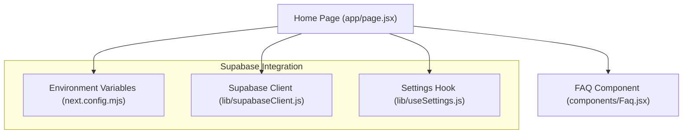
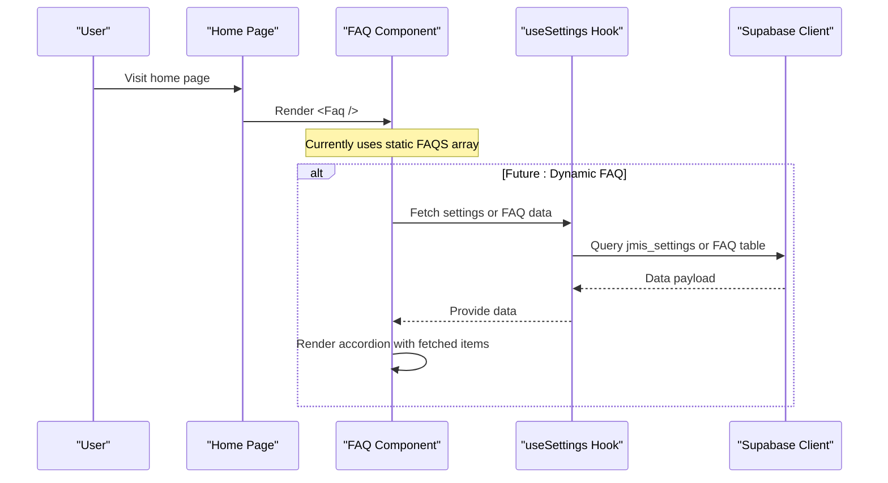
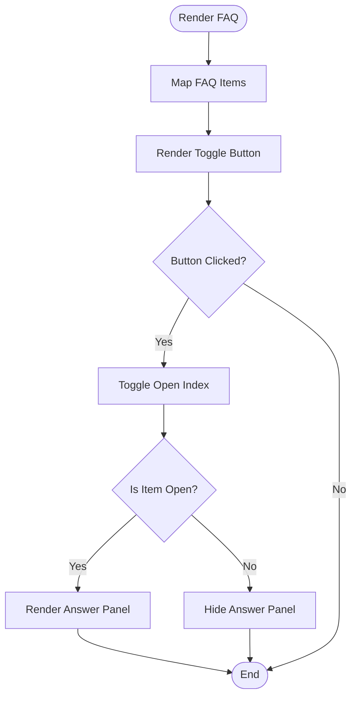
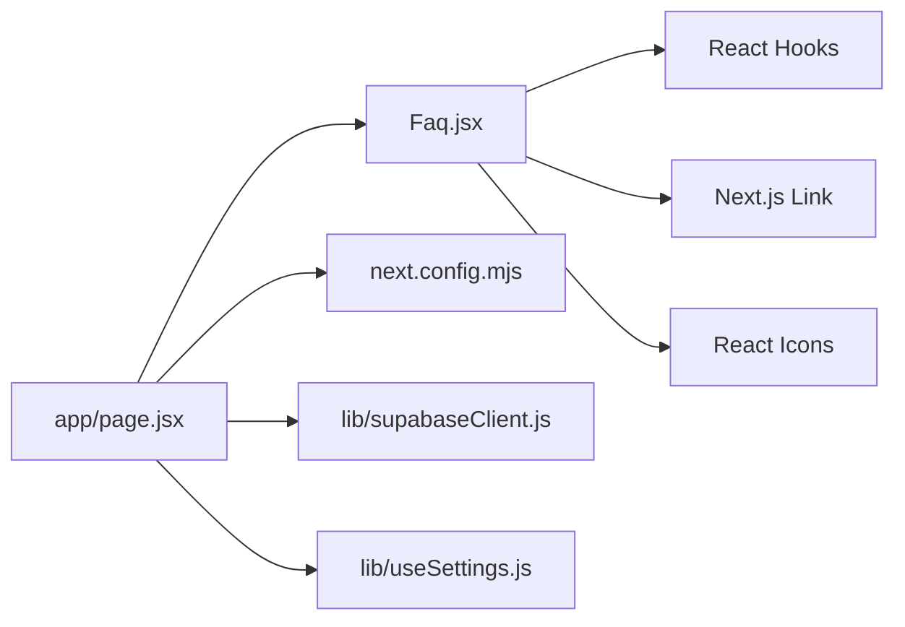

# FAQ Section

<cite>
**Referenced Files in This Document**
- [Faq.jsx](file://components/Faq.jsx)
- [page.jsx](file://app/page.jsx)
- [supabaseClient.js](file://lib/supabaseClient.js)
- [useSettings.js](file://lib/useSettings.js)
- [next.config.mjs](file://next.config.mjs)
</cite>

## Table of Contents
1. [Introduction](#introduction)
2. [Project Structure](#project-structure)
3. [Core Components](#core-components)
4. [Architecture Overview](#architecture-overview)
5. [Detailed Component Analysis](#detailed-component-analysis)
6. [Dependency Analysis](#dependency-analysis)
7. [Performance Considerations](#performance-considerations)
8. [Troubleshooting Guide](#troubleshooting-guide)
9. [Conclusion](#conclusion)
10. [Appendices](#appendices)

## Introduction
This document explains the FAQ section component, which currently provides an accordion-style interface for frequently asked questions on the public site. It covers how the component is structured, how it renders and manages state, and where it is integrated into the application. It also outlines how to extend the component to support search, categorization, and dynamic content from Supabase, including guidance for adding new FAQs, organizing by topic, customizing behavior, and ensuring accessibility for keyboard navigation and screen readers.

## Project Structure
The FAQ section is implemented as a client-side React component and rendered on the home page. The project uses Next.js with environment variables configured for Supabase integration elsewhere in the app.

**Diagram sources**
- [page.jsx:1-27](file://app/page.jsx#L1-L27)
- [Faq.jsx:1-73](file://components/Faq.jsx#L1-L73)
- [supabaseClient.js:1-13](file://lib/supabaseClient.js#L1-L13)
- [useSettings.js:1-25](file://lib/useSettings.js#L1-L25)
- [next.config.mjs:1-18](file://next.config.mjs#L1-L18)

**Section sources**
- [page.jsx:1-27](file://app/page.jsx#L1-L27)
- [Faq.jsx:1-73](file://components/Faq.jsx#L1-L73)
- [supabaseClient.js:1-13](file://lib/supabaseClient.js#L1-L13)
- [useSettings.js:1-25](file://lib/useSettings.js#L1-L25)
- [next.config.mjs:1-18](file://next.config.mjs#L1-L18)

## Core Components
- FAQ Accordion Component: Renders a list of question-answer pairs as collapsible items. Only one item can be open at a time. Each item has a button that toggles visibility and includes accessible attributes.
- Home Page Integration: The FAQ component is included as a section on the home page.

Key behaviors:
- Single-open accordion state managed via local component state.
- Accessible toggle buttons with aria-expanded reflecting open state.
- Visual indicators using icons to show expand/collapse state.

**Section sources**
- [Faq.jsx:31-72](file://components/Faq.jsx#L31-L72)
- [page.jsx:1-27](file://app/page.jsx#L1-L27)

## Architecture Overview
Currently, the FAQ data is static within the component. The rest of the site demonstrates a pattern for fetching content from Supabase via a shared hook and client. To make the FAQ dynamic, you can follow the same pattern used elsewhere in the app.

**Diagram sources**
- [page.jsx:1-27](file://app/page.jsx#L1-L27)
- [Faq.jsx:1-73](file://components/Faq.jsx#L1-L73)
- [useSettings.js:1-25](file://lib/useSettings.js#L1-L25)
- [supabaseClient.js:1-13](file://lib/supabaseClient.js#L1-L13)

## Detailed Component Analysis

### Accordion Behavior and State Management
- State: Tracks the index of the currently expanded item; clicking the same item collapses it.
- Rendering: Maps over the FAQ array to produce buttons and optional answer panels.
- Accessibility: Buttons include aria-expanded to reflect state; focus management relies on native button behavior.

**Diagram sources**
- [Faq.jsx:31-72](file://components/Faq.jsx#L31-L72)

**Section sources**
- [Faq.jsx:31-72](file://components/Faq.jsx#L31-L72)

### Current Data Model
- Static array of objects with question and answer fields.
- No categories or tags are present in the current implementation.

To add categories and search later, consider extending the data model to include fields such as category and tags.

**Section sources**
- [Faq.jsx:8-29](file://components/Faq.jsx#L8-L29)

### Integration with Supabase
- The app already configures Supabase environment variables and exposes a client instance.
- A shared hook fetches a single row from a settings table to populate other sections. You can adopt this pattern to load FAQ content from Supabase.

Recommended approach:
- Create a dedicated FAQ table in Supabase with fields like id, question, answer, category, order, and active flag.
- Use the existing Supabase client to query the FAQ table.
- Optionally reuse the settings hook pattern if you prefer storing FAQs in a JSON field within the settings table.

**Section sources**
- [supabaseClient.js:1-13](file://lib/supabaseClient.js#L1-L13)
- [useSettings.js:1-25](file://lib/useSettings.js#L1-L25)
- [next.config.mjs:1-18](file://next.config.mjs#L1-L18)

### Adding New FAQs
- For the current static version, add a new object to the FAQ array with question and answer properties.
- For a dynamic version, insert a new record into your FAQ table in Supabase with appropriate fields.

**Section sources**
- [Faq.jsx:8-29](file://components/Faq.jsx#L8-L29)

### Organizing Questions by Topic
- Extend each FAQ item with a category field.
- Add UI controls to filter by category before rendering the accordion.
- Ensure filters do not break keyboard navigation or accessibility attributes.

**Section sources**
- [Faq.jsx:31-72](file://components/Faq.jsx#L31-L72)

### Customizing Accordion Behavior
- Allow multiple open items by changing state to track an array of open indices instead of a single index.
- Add animations or transitions for smoother UX.
- Persist user preference (e.g., last opened item) using localStorage if needed.

**Section sources**
- [Faq.jsx:31-72](file://components/Faq.jsx#L31-L72)

### Search Functionality
- Add a text input to filter FAQs by question or answer content.
- Debounce input changes to avoid excessive re-renders.
- Provide clear feedback when no results match.

**Section sources**
- [Faq.jsx:31-72](file://components/Faq.jsx#L31-L72)

### Accessibility Features
- Keyboard Navigation: Users can tab between accordion buttons and press Enter or Space to toggle.
- Screen Reader Compatibility: Buttons include aria-expanded to indicate state; ensure answers are associated with their respective buttons using standard patterns.
- Focus Management: Keep focus on the button after toggling; avoid moving focus unexpectedly.

**Section sources**
- [Faq.jsx:42-60](file://components/Faq.jsx#L42-L60)

## Dependency Analysis
The FAQ component depends on:
- React hooks for state management.
- Next.js Link for navigation to contact.
- Icons for visual cues.

Other modules in the app demonstrate Supabase usage through a client and a settings hook.

**Diagram sources**
- [Faq.jsx:1-73](file://components/Faq.jsx#L1-L73)
- [page.jsx:1-27](file://app/page.jsx#L1-L27)
- [next.config.mjs:1-18](file://next.config.mjs#L1-L18)
- [supabaseClient.js:1-13](file://lib/supabaseClient.js#L1-L13)
- [useSettings.js:1-25](file://lib/useSettings.js#L1-L25)

**Section sources**
- [Faq.jsx:1-73](file://components/Faq.jsx#L1-L73)
- [page.jsx:1-27](file://app/page.jsx#L1-L27)
- [next.config.mjs:1-18](file://next.config.mjs#L1-L18)
- [supabaseClient.js:1-13](file://lib/supabaseClient.js#L1-L13)
- [useSettings.js:1-25](file://lib/useSettings.js#L1-L25)

## Performance Considerations
- Keep the FAQ dataset small for client-side rendering; paginate or lazy-load if growing large.
- Avoid unnecessary re-renders by memoizing filtered lists when implementing search and categories.
- Use stable keys for list items to improve reconciliation performance.

[No sources needed since this section provides general guidance]

## Troubleshooting Guide
- Environment Variables: Ensure NEXT_PUBLIC_SUPABASE_URL and NEXT_PUBLIC_SUPABASE_ANON_KEY are set in your environment so Supabase calls work.
- Network Errors: If fetching dynamic FAQ data, handle errors gracefully and provide fallback UI.
- Accessibility Issues: Verify that all interactive elements are focusable and have correct ARIA attributes.

**Section sources**
- [next.config.mjs:1-18](file://next.config.mjs#L1-L18)
- [supabaseClient.js:1-13](file://lib/supabaseClient.js#L1-L13)
- [useSettings.js:1-25](file://lib/useSettings.js#L1-L25)
- [Faq.jsx:42-60](file://components/Faq.jsx#L42-L60)

## Conclusion
The FAQ section currently offers a simple, accessible accordion with static content. The codebase provides a clear path to evolve it into a dynamic, searchable, and categorized experience by leveraging Supabase and the existing patterns used elsewhere in the application. By following the recommendations above, you can add new FAQs, organize them by topic, implement search and filtering, customize behavior, and maintain strong accessibility standards.

[No sources needed since this section summarizes without analyzing specific files]

## Appendices

### Example: Adding a New FAQ (Static)
- Add a new entry to the FAQ array with question and answer fields.

**Section sources**
- [Faq.jsx:8-29](file://components/Faq.jsx#L8-L29)

### Example: Making FAQs Dynamic with Supabase
- Create a FAQ table in Supabase with fields for question, answer, category, order, and active status.
- Use the Supabase client to fetch FAQs and render them in the accordion.
- Reuse the settings hook pattern if you prefer storing FAQs within the settings table.

**Section sources**
- [supabaseClient.js:1-13](file://lib/supabaseClient.js#L1-L13)
- [useSettings.js:1-25](file://lib/useSettings.js#L1-L25)

### Example: Implementing Search and Categories
- Add a search input and category filters.
- Filter the FAQ list based on input and selected categories.
- Debounce search input to optimize performance.

**Section sources**
- [Faq.jsx:31-72](file://components/Faq.jsx#L31-L72)