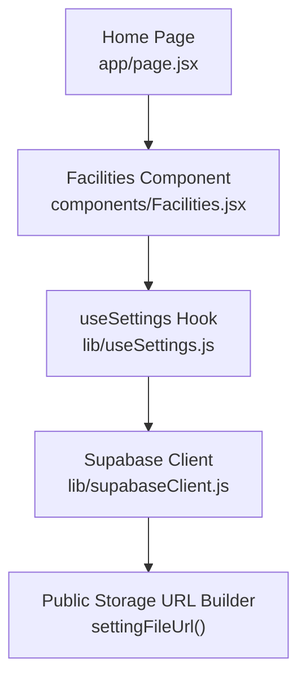
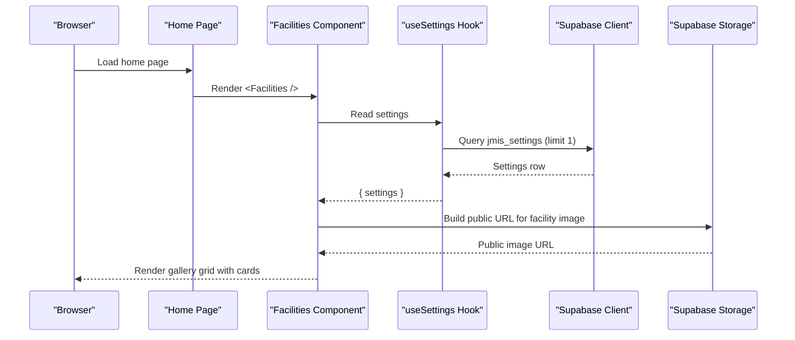
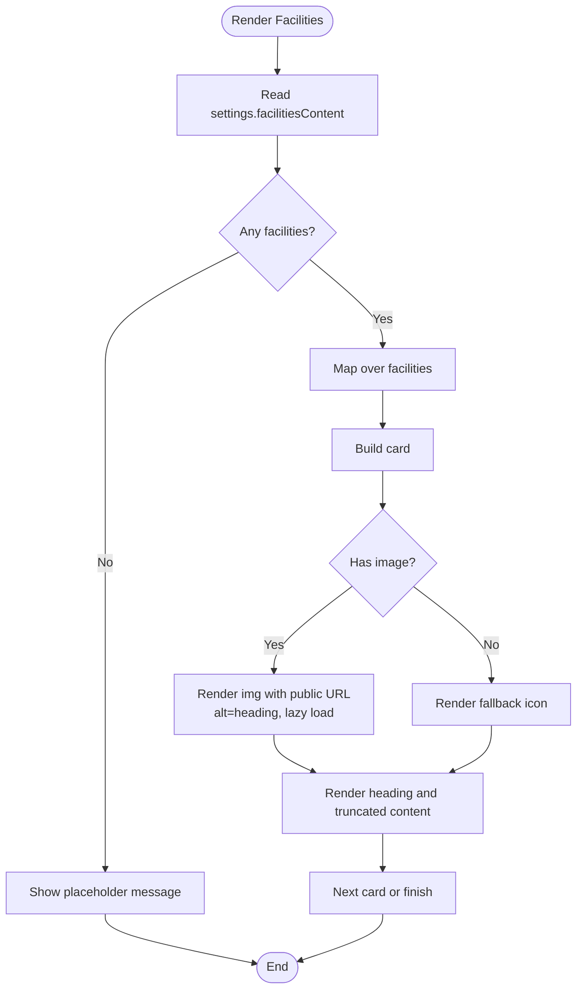
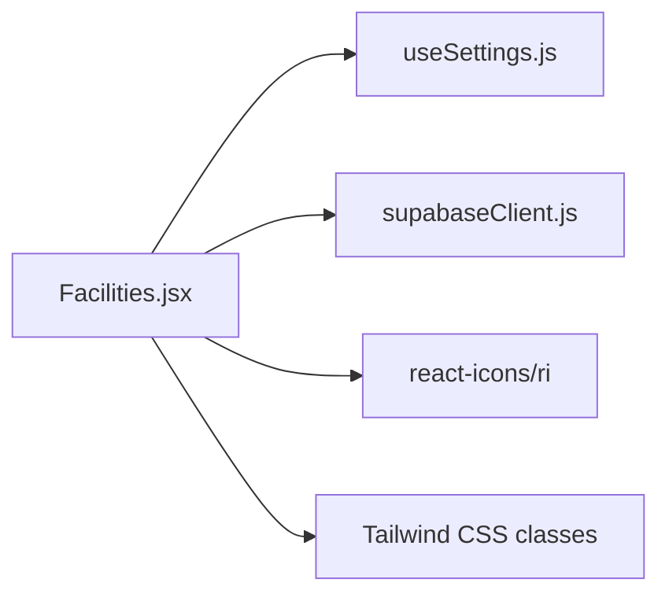

# Facilities Section

<cite>
**Referenced Files in This Document**
- [Facilities.jsx](file://components/Facilities.jsx)
- [page.jsx](file://app/page.jsx)
- [useSettings.js](file://lib/useSettings.js)
- [supabaseClient.js](file://lib/supabaseClient.js)
</cite>

## Table of Contents
1. [Introduction](#introduction)
2. [Project Structure](#project-structure)
3. [Core Components](#core-components)
4. [Architecture Overview](#architecture-overview)
5. [Detailed Component Analysis](#detailed-component-analysis)
6. [Dependency Analysis](#dependency-analysis)
7. [Performance Considerations](#performance-considerations)
8. [Troubleshooting Guide](#troubleshooting-guide)
9. [Conclusion](#conclusion)

## Introduction
The Facilities section showcases school facilities using a gallery-style grid of cards. Each card displays an image, a heading, and a short description. The content is driven by a centralized settings record, allowing administrators to manage facility items without changing code. The component uses responsive Tailwind classes for layout, lazy loading for images, and accessible alt text derived from the facility heading.

## Project Structure
The Facilities section is implemented as a client-side React component and integrated into the home page. Data flows from Supabase through a shared hook into the component, which renders a responsive grid of facility cards.

**Diagram sources**
- [page.jsx:1-27](file://app/page.jsx#L1-L27)
- [Facilities.jsx:1-56](file://components/Facilities.jsx#L1-L56)
- [useSettings.js:1-25](file://lib/useSettings.js#L1-L25)
- [supabaseClient.js:1-13](file://lib/supabaseClient.js#L1-L13)

**Section sources**
- [page.jsx:1-27](file://app/page.jsx#L1-L27)
- [Facilities.jsx:1-56](file://components/Facilities.jsx#L1-L56)

## Core Components
- Facilities component: Renders the section title, subtitle, and a responsive grid of facility cards. It reads data from the shared settings and maps each item to a card with an image (or fallback icon), heading, and truncated description.
- useSettings hook: Fetches the single settings row from Supabase and exposes it to components.
- supabaseClient: Provides the Supabase client instance and a helper to build public URLs for storage objects used by facility images.

Key responsibilities:
- Data binding: Reads `settings.facilitiesContent` and safely defaults to an empty array.
- Rendering: Builds a responsive grid and individual cards with hover effects and consistent spacing.
- Image handling: Uses a public URL builder and lazy loading; provides a fallback icon when no image is present.
- Accessibility: Sets meaningful alt text on images based on the facility heading.

**Section sources**
- [Facilities.jsx:1-56](file://components/Facilities.jsx#L1-L56)
- [useSettings.js:1-25](file://lib/useSettings.js#L1-L25)
- [supabaseClient.js:1-13](file://lib/supabaseClient.js#L1-L13)

## Architecture Overview
The Facilities section follows a simple client-side data flow:

**Diagram sources**
- [page.jsx:1-27](file://app/page.jsx#L1-L27)
- [Facilities.jsx:1-56](file://components/Facilities.jsx#L1-L56)
- [useSettings.js:1-25](file://lib/useSettings.js#L1-L25)
- [supabaseClient.js:1-13](file://lib/supabaseClient.js#L1-L13)

## Detailed Component Analysis

### Facilities Component
Responsibilities:
- Reads `facilitiesContent` from settings and renders a responsive grid.
- For each facility, renders a card with:
  - Image area: Uses a public URL builder; falls back to an icon if no image exists.
  - Heading and description: Truncated description for consistent card height.
- Applies hover effects and consistent spacing via utility classes.

Data model per facility:
- image: File name or path stored under the public setting folder.
- heading: Text used as both visible title and image alt text.
- content: Short descriptive paragraph.

Responsive behavior:
- Grid adapts from one column on small screens to two columns on medium screens and three columns on large screens.

Accessibility:
- Images include alt text derived from the facility heading.
- A clear section heading and subtitle provide context.

**Diagram sources**
- [Facilities.jsx:1-56](file://components/Facilities.jsx#L1-L56)

**Section sources**
- [Facilities.jsx:1-56](file://components/Facilities.jsx#L1-L56)

### Data Source: useSettings Hook
Responsibilities:
- Fetches the first row from `jmis_settings`.
- Exposes `settings` and `loading` state to consumers.
- Ensures cleanup on unmount.

Integration:
- Facilities consumes this hook to obtain `settings.facilitiesContent`.

**Section sources**
- [useSettings.js:1-25](file://lib/useSettings.js#L1-L25)

### Storage URL Helper: supabaseClient
Responsibilities:
- Creates a Supabase client using environment variables.
- Provides `settingFileUrl(file)` to construct public URLs for files under the `setting` storage folder.

Usage:
- Facilities calls `settingFileUrl(f.image)` to render facility images.

**Section sources**
- [supabaseClient.js:1-13](file://lib/supabaseClient.js#L1-L13)

## Dependency Analysis
The Facilities component depends on:
- useSettings for data access.
- supabaseClient for building image URLs.
- Tailwind CSS classes for layout and styling.
- react-icons for a fallback icon when no image is provided.

**Diagram sources**
- [Facilities.jsx:1-56](file://components/Facilities.jsx#L1-L56)
- [useSettings.js:1-25](file://lib/useSettings.js#L1-L25)
- [supabaseClient.js:1-13](file://lib/supabaseClient.js#L1-L13)

**Section sources**
- [Facilities.jsx:1-56](file://components/Facilities.jsx#L1-L56)

## Performance Considerations
- Lazy loading: Facility images use lazy loading to defer offscreen image requests.
- Public storage URLs: Using a direct public URL avoids extra server-side processing at render time.
- Responsive grid: Tailwind’s responsive grid reduces layout shifts and improves perceived performance on smaller devices.
- Image optimization recommendations:
  - Serve images in modern formats (e.g., WebP/AVIF) where supported.
  - Use appropriate dimensions and compression to balance quality and size.
  - Consider adding explicit width/height attributes to prevent layout shift during image load.
  - If available, integrate a CDN or image transformation service to serve optimized variants.

[No sources needed since this section provides general guidance]

## Troubleshooting Guide
Common issues and resolutions:
- No facilities displayed:
  - Ensure `settings.facilitiesContent` is populated in the admin dashboard.
  - Verify that the settings row exists and the field contains an array of items.
- Images not showing:
  - Confirm that `f.image` contains a valid file name under the public `setting` storage folder.
  - Check that `NEXT_PUBLIC_SUPABASE_URL` is correctly set and the storage object is public.
- Placeholder icon appears:
  - Occurs when `f.image` is missing or empty. Add an image to the facility item to display the photo.
- Layout issues:
  - Adjust Tailwind grid classes to change the number of columns or spacing.
  - Modify card height or padding to fit your design system.

**Section sources**
- [Facilities.jsx:1-56](file://components/Facilities.jsx#L1-L56)
- [supabaseClient.js:1-13](file://lib/supabaseClient.js#L1-L13)

## Conclusion
The Facilities section provides a clean, responsive gallery of school facilities powered by centralized settings. It balances simplicity and extensibility: administrators can add or update facilities through the settings record, while developers can customize the layout and behavior by adjusting the component and its dependencies. With lazy loading and accessible alt text, the implementation prioritizes performance and usability.

[No sources needed since this section summarizes without analyzing specific files]