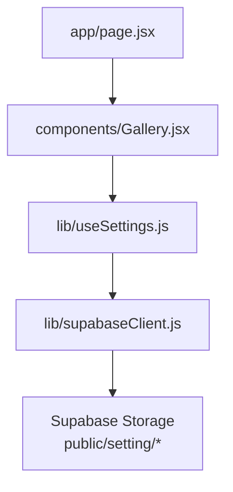
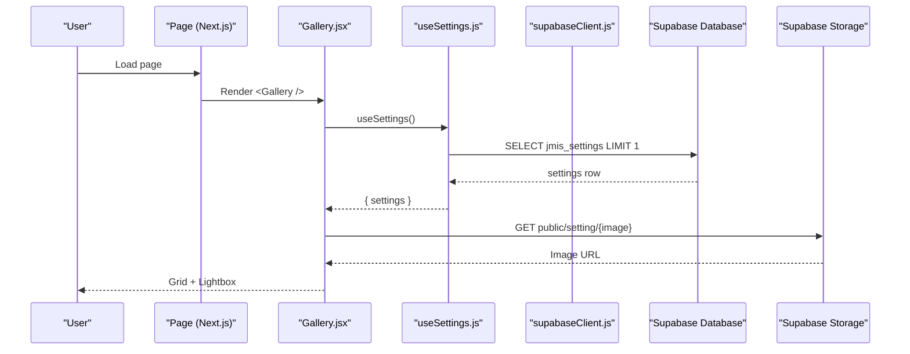
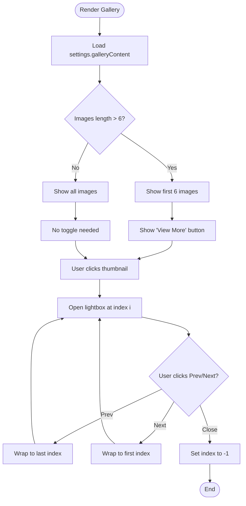
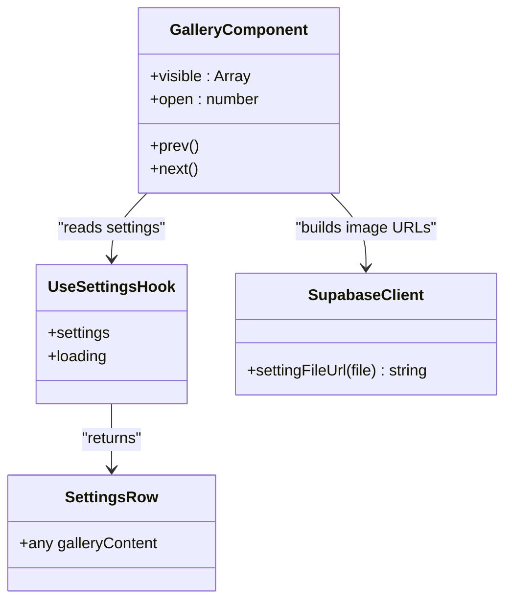
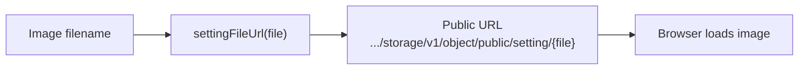
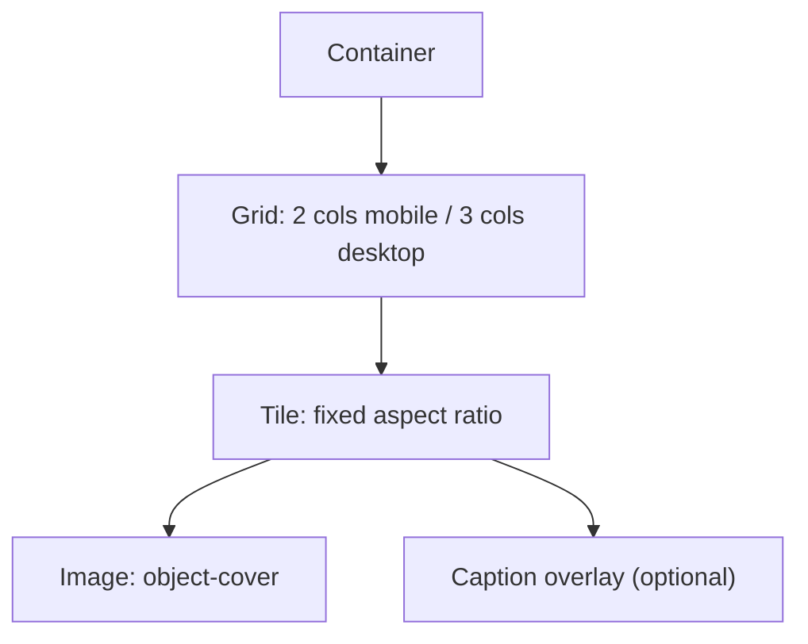
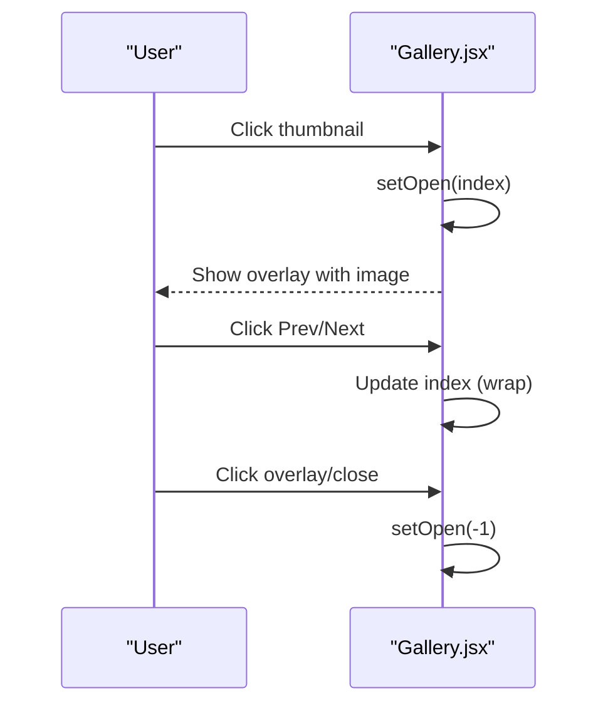
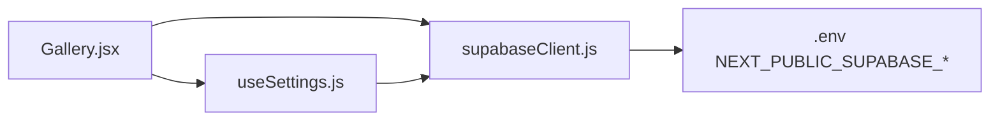

# Gallery Section

<cite>
**Referenced Files in This Document**
- [Gallery.jsx](file://components/Gallery.jsx)
- [useSettings.js](file://lib/useSettings.js)
- [supabaseClient.js](file://lib/supabaseClient.js)
- [page.jsx](file://app/page.jsx)
- [next.config.mjs](file://next.config.mjs)
</cite>

## Table of Contents
1. [Introduction](#introduction)
2. [Project Structure](#project-structure)
3. [Core Components](#core-components)
4. [Architecture Overview](#architecture-overview)
5. [Detailed Component Analysis](#detailed-component-analysis)
6. [Dependency Analysis](#dependency-analysis)
7. [Performance Considerations](#performance-considerations)
8. [Troubleshooting Guide](#troubleshooting-guide)
9. [Conclusion](#conclusion)

## Introduction
This document explains the Gallery section component, which renders a responsive image grid with a custom lightbox and a “View More” toggle. Images are sourced from Supabase Storage through a shared settings record managed by an admin dashboard. The gallery uses lazy loading for performance and is styled with Tailwind CSS classes.

## Project Structure
The Gallery section is a client-side React component integrated into the Next.js application:
- The page includes the Gallery component.
- The component reads content from a shared settings hook that fetches data from Supabase.
- Image URLs are built using a helper that points to public storage objects.

**Diagram sources**
- [page.jsx:1-20](file://app/page.jsx#L1-L20)
- [Gallery.jsx:1-119](file://components/Gallery.jsx#L1-L119)
- [useSettings.js:1-25](file://lib/useSettings.js#L1-L25)
- [supabaseClient.js:1-13](file://lib/supabaseClient.js#L1-L13)

**Section sources**
- [page.jsx:1-20](file://app/page.jsx#L1-L20)
- [Gallery.jsx:1-119](file://components/Gallery.jsx#L1-L119)
- [useSettings.js:1-25](file://lib/useSettings.js#L1-L25)
- [supabaseClient.js:1-13](file://lib/supabaseClient.js#L1-L13)

## Core Components
- Gallery component: Renders the grid, handles “View More”, and implements a lightweight lightbox with previous/next navigation.
- useSettings hook: Fetches the single settings row from Supabase and exposes it to components.
- supabaseClient helper: Builds public URLs for images stored under a specific folder.

Key responsibilities:
- Data source: `settings.galleryContent` array.
- Rendering: Responsive grid with hover effects and optional captions.
- Interaction: Lightbox open/close, prev/next navigation.
- Performance: Lazy loading of images.

**Section sources**
- [Gallery.jsx:1-119](file://components/Gallery.jsx#L1-L119)
- [useSettings.js:1-25](file://lib/useSettings.js#L1-L25)
- [supabaseClient.js:1-13](file://lib/supabaseClient.js#L1-L13)

## Architecture Overview
The gallery follows a simple client-side data flow:
1. The page mounts the Gallery component.
2. Gallery calls useSettings to load settings.
3. useSettings queries Supabase for the settings row.
4. Gallery maps over `galleryContent` to render thumbnails.
5. Clicking a thumbnail opens the lightbox; navigation updates the active index.
6. Image URLs are generated via settingFileUrl pointing to public storage.

**Diagram sources**
- [page.jsx:1-20](file://app/page.jsx#L1-L20)
- [Gallery.jsx:1-119](file://components/Gallery.jsx#L1-L119)
- [useSettings.js:1-25](file://lib/useSettings.js#L1-L25)
- [supabaseClient.js:1-13](file://lib/supabaseClient.js#L1-L13)

## Detailed Component Analysis

### Gallery Component Behavior
- Data binding: Reads `settings?.galleryContent || []`.
- Pagination: Shows up to 6 items initially; toggles to show all when “View More” is clicked.
- Lightbox: Opens on thumbnail click; supports previous/next navigation and closing via overlay or close button.
- Accessibility: Uses semantic buttons, aria-modal, and descriptive labels.
- Styling: Uses Tailwind utility classes for layout, spacing, aspect ratio, hover scale, and overlays.

**Diagram sources**
- [Gallery.jsx:1-119](file://components/Gallery.jsx#L1-L119)

**Section sources**
- [Gallery.jsx:1-119](file://components/Gallery.jsx#L1-L119)

### Data Source and Settings Integration
- useSettings fetches a single row from `jmis_settings`.
- Gallery expects `galleryContent` to be an array of image entries.
- Each entry should include:
  - `image`: filename stored under the public storage folder.
  - `content` or `description`: used as alt text and caption.

**Diagram sources**
- [useSettings.js:1-25](file://lib/useSettings.js#L1-L25)
- [Gallery.jsx:1-119](file://components/Gallery.jsx#L1-L119)
- [supabaseClient.js:1-13](file://lib/supabaseClient.js#L1-L13)

**Section sources**
- [useSettings.js:1-25](file://lib/useSettings.js#L1-L25)
- [Gallery.jsx:1-119](file://components/Gallery.jsx#L1-L119)

### Image URL Resolution and Storage Path
- All images are served from a public folder in Supabase Storage.
- The helper constructs a direct public URL for each file.
- Next.js is configured to allow remote images from the Supabase domain.

**Diagram sources**
- [supabaseClient.js:1-13](file://lib/supabaseClient.js#L1-L13)
- [next.config.mjs:1-18](file://next.config.mjs#L1-L18)

**Section sources**
- [supabaseClient.js:1-13](file://lib/supabaseClient.js#L1-L13)
- [next.config.mjs:1-18](file://next.config.mjs#L1-L18)

### Responsive Grid Layout
- Two-column grid on small screens, three columns on medium and larger screens.
- Uniform aspect ratio for consistent tile sizing.
- Hover effect scales the image slightly for visual feedback.

**Diagram sources**
- [Gallery.jsx:1-119](file://components/Gallery.jsx#L1-L119)

**Section sources**
- [Gallery.jsx:1-119](file://components/Gallery.jsx#L1-L119)

### Lightbox Functionality
- Overlay opens when a thumbnail is clicked.
- Previous/Next buttons wrap around the current set of visible images.
- Closing is supported via overlay click, close button, and keyboard-friendly focus management through native elements.

**Diagram sources**
- [Gallery.jsx:1-119](file://components/Gallery.jsx#L1-L119)

**Section sources**
- [Gallery.jsx:1-119](file://components/Gallery.jsx#L1-L119)

## Dependency Analysis
- Gallery depends on:
  - useSettings for data.
  - supabaseClient for URL generation.
  - Tailwind CSS utilities for styling.
  - react-icons for icons.
- useSettings depends on:
  - supabaseClient for database access.
- supabaseClient depends on environment variables for Supabase URL and anon key.

**Diagram sources**
- [Gallery.jsx:1-119](file://components/Gallery.jsx#L1-L119)
- [useSettings.js:1-25](file://lib/useSettings.js#L1-L25)
- [supabaseClient.js:1-13](file://lib/supabaseClient.js#L1-L13)

**Section sources**
- [Gallery.jsx:1-119](file://components/Gallery.jsx#L1-L119)
- [useSettings.js:1-25](file://lib/useSettings.js#L1-L25)
- [supabaseClient.js:1-13](file://lib/supabaseClient.js#L1-L13)

## Performance Considerations
- Lazy loading: Images use browser lazy loading to defer offscreen images.
- Initial payload: Only the first six images are shown by default; users can expand to view more.
- Remote image optimization: Next.js allows remote images from the configured Supabase domain.
- Recommendations:
  - Serve appropriately sized images from Supabase or a CDN.
  - Consider adding width/height attributes to prevent layout shifts.
  - For very large galleries, implement server-side pagination or virtualization.

[No sources needed since this section provides general guidance]

## Troubleshooting Guide
- Empty gallery:
  - Ensure `settings.galleryContent` exists and contains entries.
  - Verify the settings row exists in Supabase.
- Images not loading:
  - Confirm filenames match those stored in Supabase Storage under the public folder.
  - Check that the Supabase project URL and anon key are correctly set in environment variables.
  - Validate that Next.js remotePatterns allow the Supabase domain.
- Lightbox not opening:
  - Ensure thumbnails are rendered and clickable.
  - Verify no JavaScript errors in the console.

**Section sources**
- [useSettings.js:1-25](file://lib/useSettings.js#L1-L25)
- [supabaseClient.js:1-13](file://lib/supabaseClient.js#L1-L13)
- [next.config.mjs:1-18](file://next.config.mjs#L1-L18)
- [Gallery.jsx:1-119](file://components/Gallery.jsx#L1-L119)

## Conclusion
The Gallery component provides a performant, accessible, and user-friendly way to showcase school photos. It integrates cleanly with Supabase for content and storage, uses a simple lightbox for viewing full-size images, and adapts to different screen sizes. With proper image assets and correct environment configuration, it delivers a smooth experience across devices.

[No sources needed since this section summarizes without analyzing specific files]