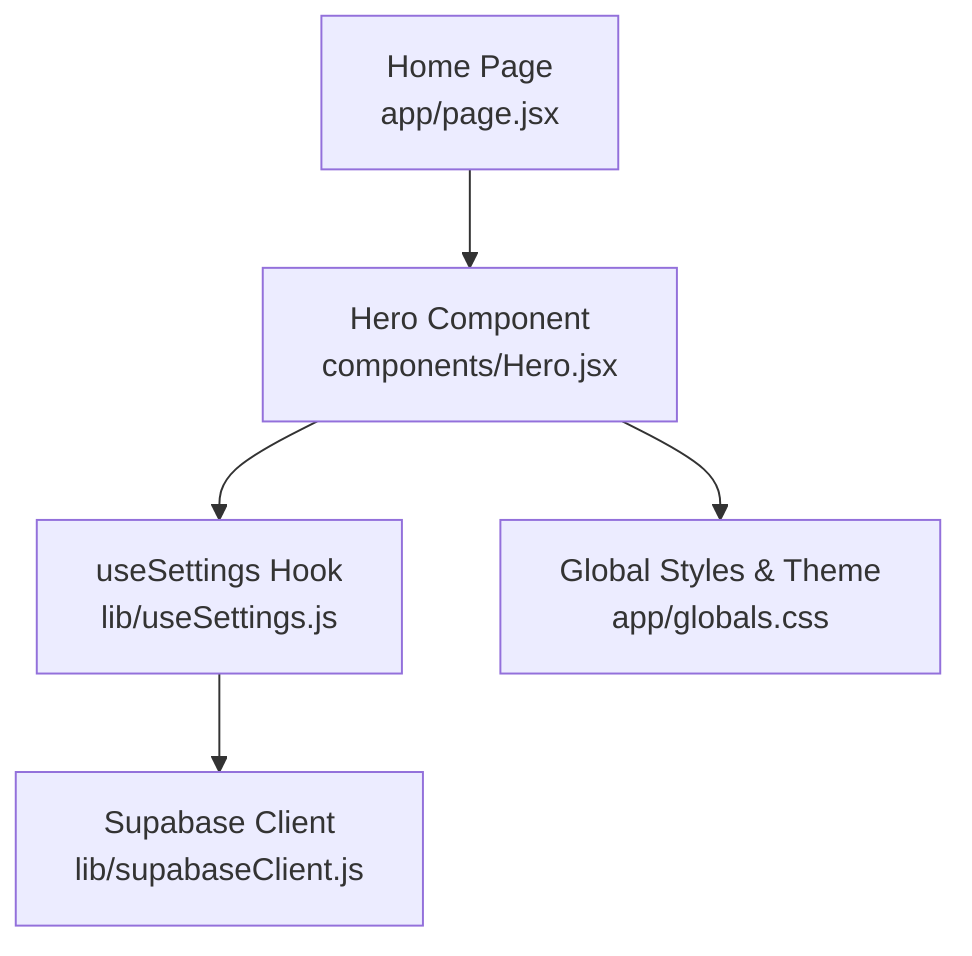
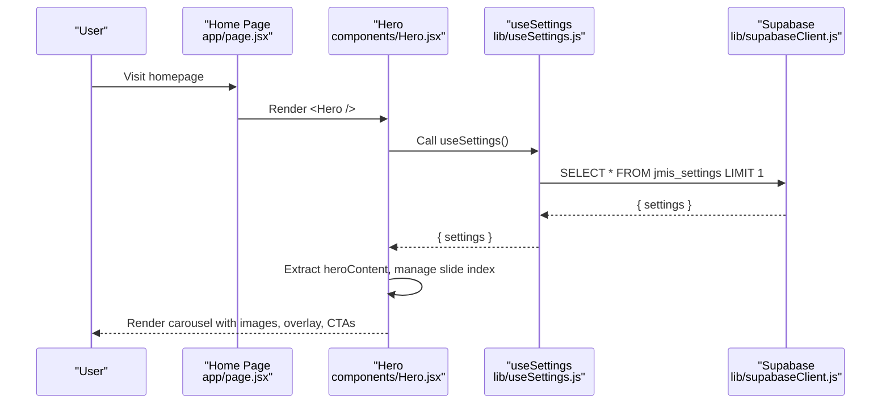
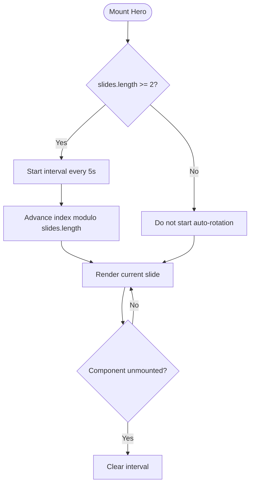
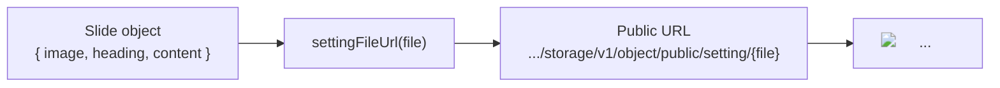
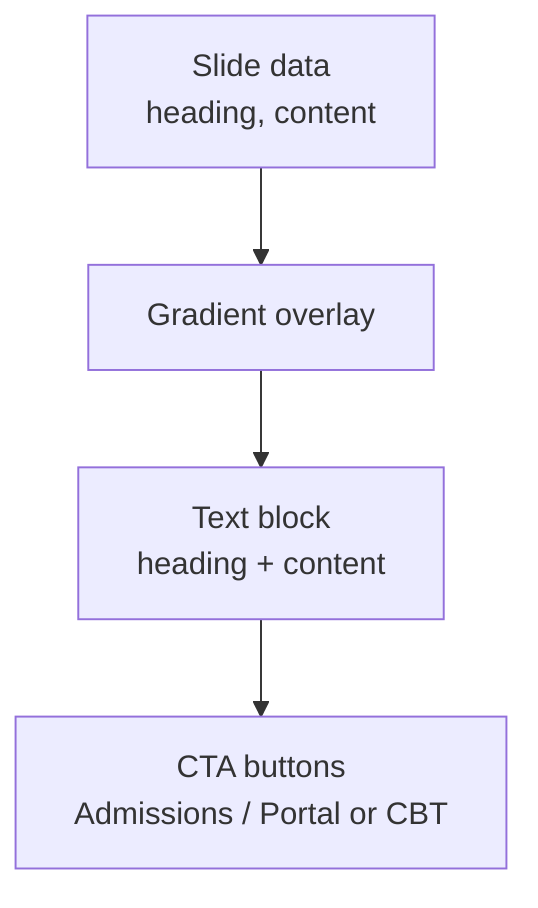
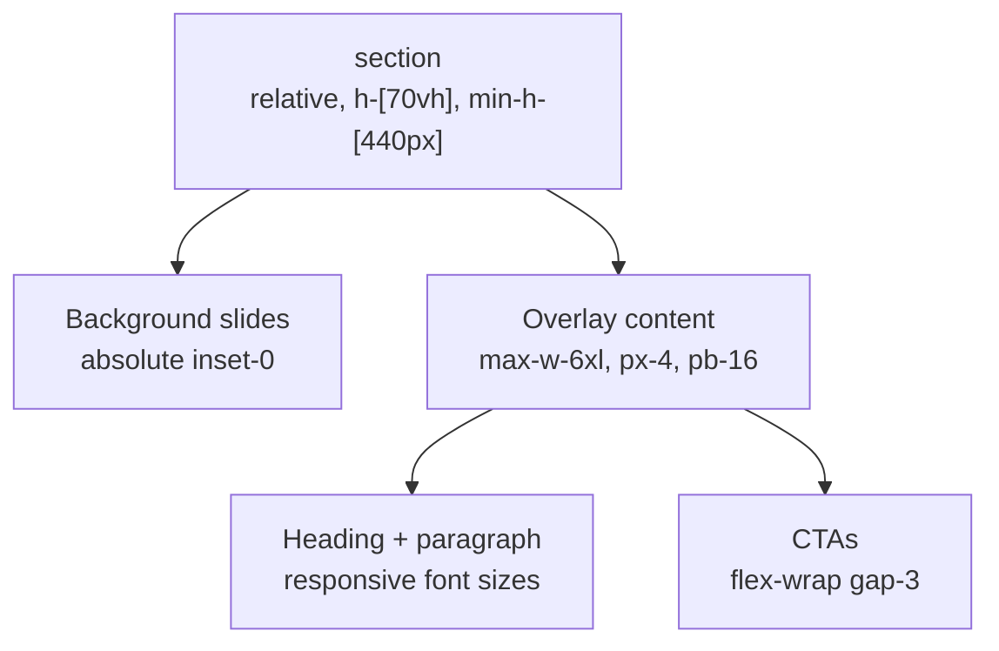
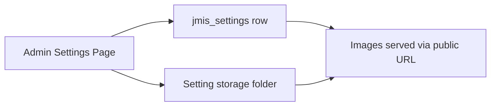
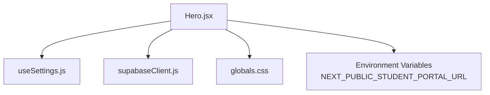

# Hero Section

<cite>
**Referenced Files in This Document**
- [Hero.jsx](file://components/Hero.jsx)
- [useSettings.js](file://lib/useSettings.js)
- [supabaseClient.js](file://lib/supabaseClient.js)
- [page.jsx](file://app/page.jsx)
- [globals.css](file://app/globals.css)
</cite>

## Table of Contents
1. [Introduction](#introduction)
2. [Project Structure](#project-structure)
3. [Core Components](#core-components)
4. [Architecture Overview](#architecture-overview)
5. [Detailed Component Analysis](#detailed-component-analysis)
6. [Dependency Analysis](#dependency-analysis)
7. [Performance Considerations](#performance-considerations)
8. [Troubleshooting Guide](#troubleshooting-guide)
9. [Conclusion](#conclusion)
10. [Appendices](#appendices)

## Introduction
This document explains the Hero section component that powers the site’s top-of-page carousel. It covers how hero slides are fetched from Supabase settings, how images and text overlays are rendered, how navigation works, and how responsive design is implemented. It also provides guidance on customizing content, accessibility considerations, mobile behavior, and performance optimization for large images.

## Project Structure
The Hero section is a client-side React component integrated into the home page. It reads configuration from a single settings row in Supabase and renders a full-bleed carousel with overlay text and call-to-action buttons.

**Diagram sources**
- [page.jsx:1-27](file://app/page.jsx#L1-L27)
- [Hero.jsx:1-101](file://components/Hero.jsx#L1-L101)
- [useSettings.js:1-25](file://lib/useSettings.js#L1-L25)
- [supabaseClient.js:1-13](file://lib/supabaseClient.js#L1-L13)
- [globals.css:1-43](file://app/globals.css#L1-L43)

**Section sources**
- [page.jsx:1-27](file://app/page.jsx#L1-L27)
- [Hero.jsx:1-101](file://components/Hero.jsx#L1-L101)

## Core Components
- Hero component: Renders the carousel, manages slide index state, auto-advances slides, and displays overlay text and CTAs.
- useSettings hook: Fetches the single settings row from Supabase and exposes it to components.
- supabaseClient: Provides the Supabase client instance and a helper to build public URLs for storage objects used by hero images.
- Global styles: Define brand colors and gradients used as fallback backgrounds and theme tokens.

Key responsibilities:
- Data fetching: Retrieve settings containing heroContent array.
- Rendering: Map each slide to a background image with an overlay gradient and text.
- Navigation: Auto-rotate every 5 seconds when there are multiple slides; provide dot indicators for manual navigation.
- Responsiveness: Use Tailwind utilities to adapt heights, typography, and spacing across screen sizes.

**Section sources**
- [Hero.jsx:1-101](file://components/Hero.jsx#L1-L101)
- [useSettings.js:1-25](file://lib/useSettings.js#L1-L25)
- [supabaseClient.js:1-13](file://lib/supabaseClient.js#L1-L13)
- [globals.css:1-43](file://app/globals.css#L1-L43)

## Architecture Overview
The Hero component composes data from Supabase and renders UI using Tailwind CSS. The flow is:
1. Home page mounts and includes the Hero component.
2. Hero calls useSettings to fetch jmis_settings.
3. useSettings queries Supabase and returns the settings object.
4. Hero extracts heroContent and renders slides with images and text overlays.
5. Images are served via a public URL helper that points to the setting storage folder.

**Diagram sources**
- [page.jsx:1-27](file://app/page.jsx#L1-L27)
- [Hero.jsx:1-101](file://components/Hero.jsx#L1-L101)
- [useSettings.js:1-25](file://lib/useSettings.js#L1-L25)
- [supabaseClient.js:1-13](file://lib/supabaseClient.js#L1-L13)

## Detailed Component Analysis

### Carousel Implementation
- Slide rotation: When there are two or more slides, the component sets an interval to advance the active index every 5 seconds. The interval is cleared on unmount to prevent memory leaks.
- Transition effect: Slides are stacked absolutely and transitioned via opacity changes with a smooth duration.
- Fallback: If no slides exist, a brand gradient fills the hero area.

**Diagram sources**
- [Hero.jsx:16-20](file://components/Hero.jsx#L16-L20)

**Section sources**
- [Hero.jsx:16-20](file://components/Hero.jsx#L16-L20)

### Image Management
- Source: Each slide contains an image field that references a file stored under the setting storage folder.
- URL generation: A helper builds a public URL for the storage object so images can be loaded directly without server processing.
- Rendering: Uses a standard img element with full width/height and object-cover to fill the hero area.

**Diagram sources**
- [Hero.jsx:34-36](file://components/Hero.jsx#L34-L36)
- [supabaseClient.js:9-12](file://lib/supabaseClient.js#L9-L12)

**Section sources**
- [Hero.jsx:34-36](file://components/Hero.jsx#L34-L36)
- [supabaseClient.js:9-12](file://lib/supabaseClient.js#L9-L12)

### Text Overlay Functionality
- Overlay: A semi-transparent gradient is layered over each image to ensure text legibility.
- Content: Each slide provides a heading and content string; if missing, default values are shown.
- CTAs: Two primary actions are displayed:
  - “Enroll Your Child” links to admissions.
  - A secondary action either opens the student portal (if configured via environment variable) or links to a CBT quiz page.

**Diagram sources**
- [Hero.jsx:36-80](file://components/Hero.jsx#L36-L80)

**Section sources**
- [Hero.jsx:36-80](file://components/Hero.jsx#L36-L80)

### Responsive Design Patterns
- Height: The hero uses viewport-relative height with a minimum pixel height to ensure visibility on small screens.
- Typography: Font sizes scale up on medium and larger breakpoints for readability.
- Spacing: Padding and margins adjust for mobile vs desktop layouts.
- Background: Images cover the entire hero area while preserving aspect ratio.

**Diagram sources**
- [Hero.jsx:25-80](file://components/Hero.jsx#L25-L80)

**Section sources**
- [Hero.jsx:25-80](file://components/Hero.jsx#L25-L80)

### Accessibility Features
- Alt text: Each slide image includes descriptive alt text derived from the slide heading or a default value.
- Navigation: Dot indicators have aria-label attributes indicating their slide number for screen readers.
- Keyboard: Buttons are native elements, enabling keyboard focus and activation.

**Section sources**
- [Hero.jsx:35](file://components/Hero.jsx#L35)
- [Hero.jsx:87-93](file://components/Hero.jsx#L87-L93)

### Configuration Through Admin Dashboard
- Data source: All marketing sections read from a single settings row in Supabase. The Hero section specifically consumes the heroContent array within that row.
- Storage: Images referenced by heroContent are uploaded to the same storage bucket used by the admin Settings page. Public URLs are generated at runtime for safe access.

**Diagram sources**
- [useSettings.js:6-18](file://lib/useSettings.js#L6-L18)
- [supabaseClient.js:9-12](file://lib/supabaseClient.js#L9-L12)
- [Hero.jsx:8-12](file://components/Hero.jsx#L8-L12)

**Section sources**
- [useSettings.js:6-18](file://lib/useSettings.js#L6-L18)
- [supabaseClient.js:9-12](file://lib/supabaseClient.js#L9-L12)
- [Hero.jsx:8-12](file://components/Hero.jsx#L8-L12)

### Customization Examples
- Customize hero images:
  - Upload new images to the setting storage folder via the admin dashboard.
  - Reference the uploaded file names in the heroContent array so they render correctly.
- Customize text content:
  - Update the heading and content fields per slide in the settings row.
- Navigation behavior:
  - Auto-rotation occurs only when there are two or more slides.
  - Users can manually navigate using the dot indicators.
- Styling options:
  - Adjust hero height, typography, and spacing using Tailwind classes already applied in the component.
  - Modify the global brand gradient or colors in the global stylesheet to match branding needs.

[No sources needed since this section provides general guidance based on analyzed files]

## Dependency Analysis
The Hero component depends on:
- useSettings hook for data retrieval.
- Supabase client for database and storage access.
- Tailwind utility classes for styling.
- Environment variables for optional external links.

**Diagram sources**
- [Hero.jsx:1-101](file://components/Hero.jsx#L1-L101)
- [useSettings.js:1-25](file://lib/useSettings.js#L1-L25)
- [supabaseClient.js:1-13](file://lib/supabaseClient.js#L1-L13)
- [globals.css:1-43](file://app/globals.css#L1-L43)

**Section sources**
- [Hero.jsx:1-101](file://components/Hero.jsx#L1-L101)
- [useSettings.js:1-25](file://lib/useSettings.js#L1-L25)
- [supabaseClient.js:1-13](file://lib/supabaseClient.js#L1-L13)
- [globals.css:1-43](file://app/globals.css#L1-L43)

## Performance Considerations
- Image loading:
  - Images are served directly from Supabase storage via public URLs. Ensure images are optimized (compressed, appropriate dimensions) to reduce load times.
  - Using a plain img element avoids Next.js image pipeline overhead but requires careful sizing and compression on the server side.
- Memory management:
  - The auto-rotation interval is cleared on component unmount to prevent leaks.
- Rendering efficiency:
  - Slides are pre-rendered and toggled via opacity transitions, minimizing reflows during rotation.
- Network requests:
  - Settings are fetched once per mount; consider caching strategies if additional pages reuse the same data.

[No sources needed since this section provides general guidance]

## Troubleshooting Guide
- No slides appear:
  - Verify that the settings row exists and contains a non-empty heroContent array.
  - Confirm that image filenames in heroContent match actual files in the setting storage folder.
- Images fail to load:
  - Ensure the storage folder is set to public and accessible via the generated URL pattern.
  - Check network requests for 404 errors on image URLs.
- Auto-rotation not working:
  - Rotation only starts when there are two or more slides. Add additional slides to enable automatic cycling.
- CTAs not visible:
  - Confirm environment variables are set if using the student portal link; otherwise, the fallback CBT link will be shown.

**Section sources**
- [Hero.jsx:16-20](file://components/Hero.jsx#L16-L20)
- [Hero.jsx:34-36](file://components/Hero.jsx#L34-L36)
- [Hero.jsx:63-79](file://components/Hero.jsx#L63-L79)
- [supabaseClient.js:9-12](file://lib/supabaseClient.js#L9-L12)

## Conclusion
The Hero section delivers a dynamic, content-driven carousel powered by Supabase settings. It combines efficient data fetching, straightforward image handling, and responsive design to present engaging hero content with clear calls to action. By configuring heroContent through the admin dashboard and optimizing images, teams can maintain a high-quality, accessible, and performant hero experience across devices.

[No sources needed since this section summarizes without analyzing specific files]

## Appendices

### Data Model Overview
- jmis_settings: Single row containing site-wide configuration, including heroContent.
- heroContent: Array of slide objects with fields such as image, heading, and content.
- Setting storage: Folder holding images referenced by heroContent; accessed via public URLs.

[No sources needed since this section provides conceptual overview]