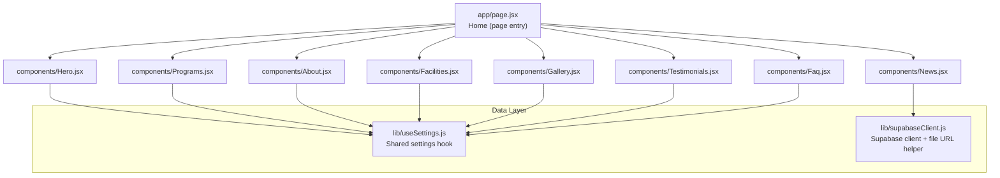
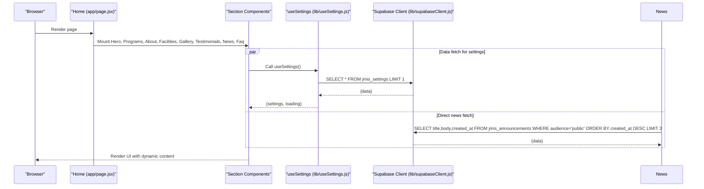
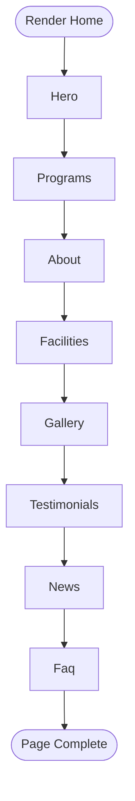
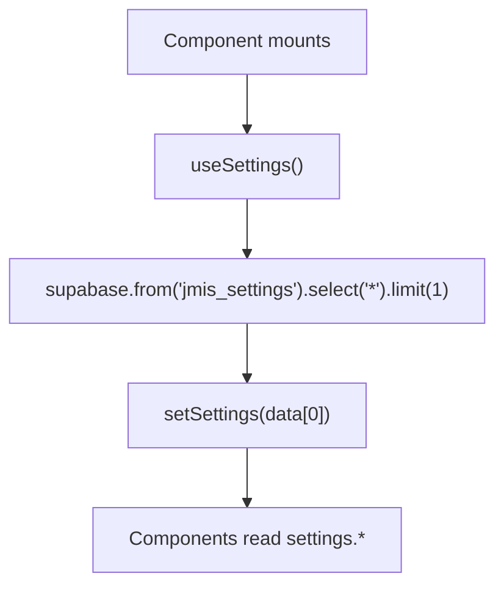
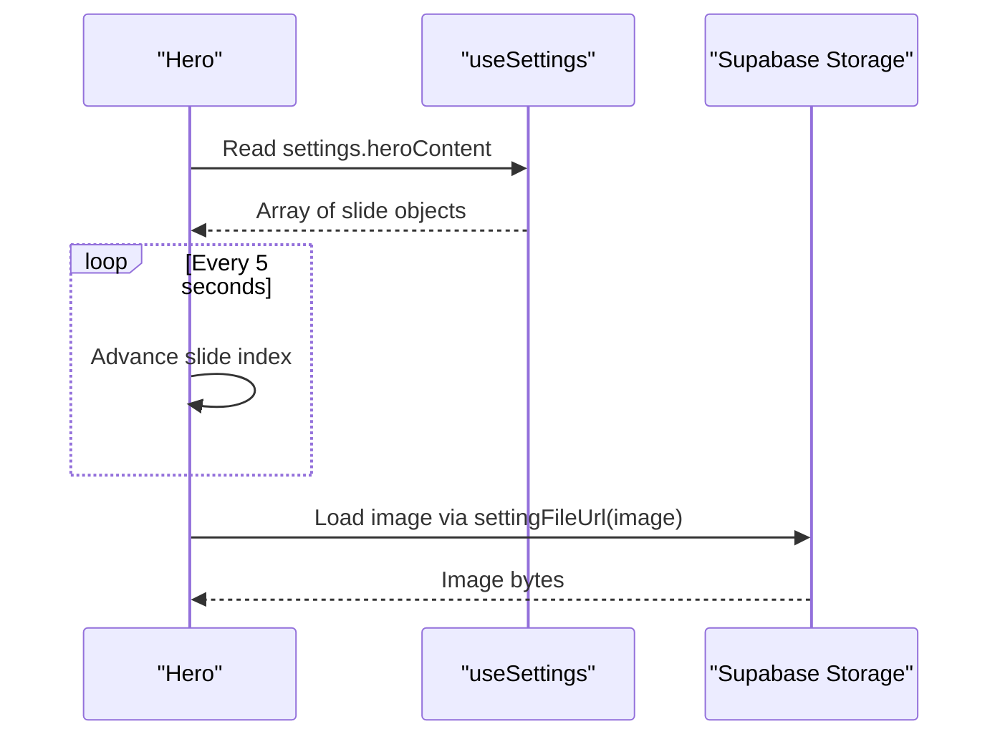
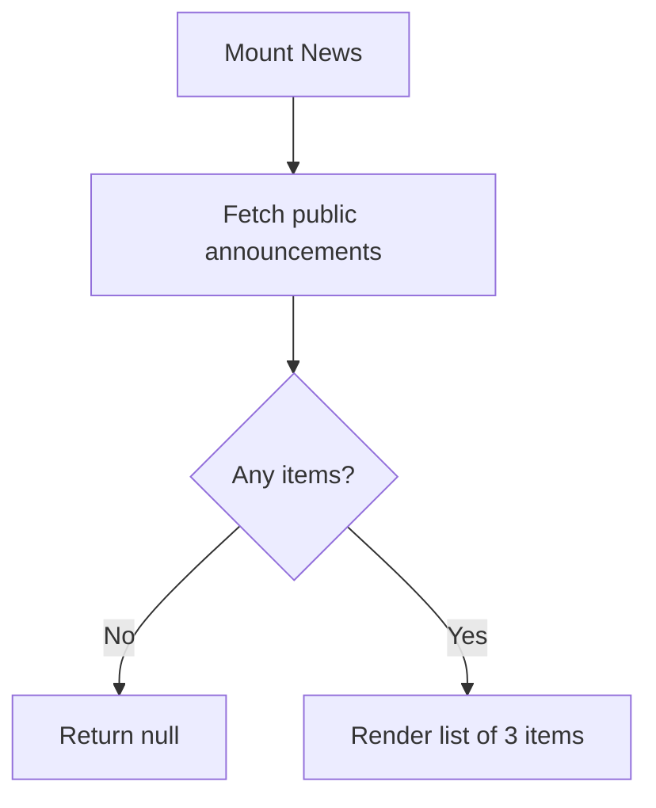
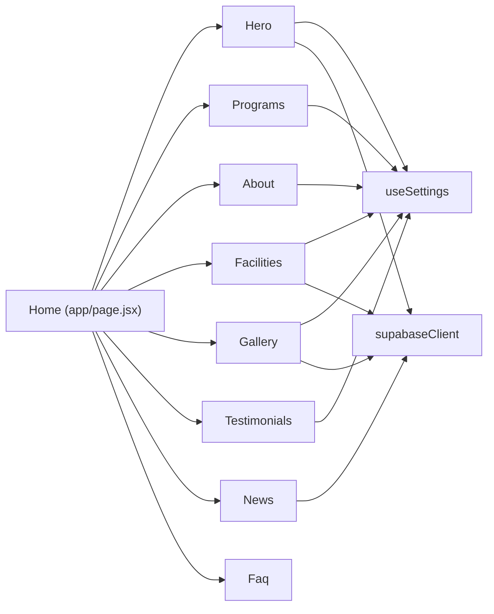
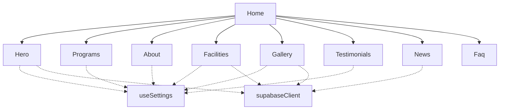

# Home Page Composition

<cite>
**Referenced Files in This Document**
- [app/page.jsx](file://app/page.jsx)
- [components/Hero.jsx](file://components/Hero.jsx)
- [components/Programs.jsx](file://components/Programs.jsx)
- [components/About.jsx](file://components/About.jsx)
- [components/Facilities.jsx](file://components/Facilities.jsx)
- [components/Gallery.jsx](file://components/Gallery.jsx)
- [components/Testimonials.jsx](file://components/Testimonials.jsx)
- [components/News.jsx](file://components/News.jsx)
- [components/Faq.jsx](file://components/Faq.jsx)
- [lib/useSettings.js](file://lib/useSettings.js)
- [lib/supabaseClient.js](file://lib/supabaseClient.js)
- [package.json](file://package.json)
</cite>

## Table of Contents
1. [Introduction](#introduction)
2. [Project Structure](#project-structure)
3. [Core Components](#core-components)
4. [Architecture Overview](#architecture-overview)
5. [Detailed Component Analysis](#detailed-component-analysis)
6. [Dependency Analysis](#dependency-analysis)
7. [Performance Considerations](#performance-considerations)
8. [Troubleshooting Guide](#troubleshooting-guide)
9. [Conclusion](#conclusion)
10. [Appendices](#appendices)

## Introduction
This document explains how the home page is composed and orchestrated, focusing on the main Home component that renders marketing sections in a fixed order: Hero, Programs, About, Facilities, Gallery, Testimonials, News, FAQ. It also documents the data flow from Supabase to components via a shared settings hook, how dynamic content is loaded and displayed, and provides guidance for adding or modifying sections with performance best practices.

## Project Structure
The home page is implemented as a Next.js App Router page that composes multiple React components. Each section component is self-contained and reads its own data either from a centralized settings object or directly from Supabase tables.

**Diagram sources**
- [app/page.jsx:1-27](file://app/page.jsx#L1-L27)
- [lib/useSettings.js:1-25](file://lib/useSettings.js#L1-L25)
- [lib/supabaseClient.js:1-13](file://lib/supabaseClient.js#L1-L13)

**Section sources**
- [app/page.jsx:1-27](file://app/page.jsx#L1-L27)

## Core Components
- Home (app/page.jsx): Renders the marketing sections in a fixed sequence. No runtime logic; pure composition.
- Hero: Carousel driven by settings.heroContent images and copy. Uses environment variable for student portal link fallback.
- Programs: Displays program cards and “Why Choose Us” highlights sourced from settings.aboutContent.details when available.
- About: Shows mission text and principal’s welcome from settings.aboutContent fields.
- Facilities: Grid of facility cards from settings.facilitiesContent with lazy-loaded images.
- Gallery: Image grid with “View More” and a custom lightbox; images from settings.galleryContent.
- Testimonials: Auto-rotating testimonial carousel from settings.testimonialContent.
- News: Fetches public announcements from jmis_announcements table; degrades gracefully if table missing.
- Faq: Static accordion with predefined questions and answers.

All components are marked as client components where needed to use state and effects.

**Section sources**
- [app/page.jsx:1-27](file://app/page.jsx#L1-L27)
- [components/Hero.jsx:1-101](file://components/Hero.jsx#L1-L101)
- [components/Programs.jsx:1-89](file://components/Programs.jsx#L1-L89)
- [components/About.jsx:1-46](file://components/About.jsx#L1-L46)
- [components/Facilities.jsx:1-56](file://components/Facilities.jsx#L1-L56)
- [components/Gallery.jsx:1-119](file://components/Gallery.jsx#L1-L119)
- [components/Testimonials.jsx:1-57](file://components/Testimonials.jsx#L1-L57)
- [components/News.jsx:1-60](file://components/News.jsx#L1-L60)
- [components/Faq.jsx:1-73](file://components/Faq.jsx#L1-L73)

## Architecture Overview
The architecture follows a simple, decoupled pattern:
- The Home page composes sections in a deterministic order.
- Most sections consume a single source of truth: the jmis_settings row fetched once by useSettings.
- Images are served from a public Supabase storage bucket using a helper URL builder.
- One section (News) queries a separate table directly.

**Diagram sources**
- [lib/useSettings.js:1-25](file://lib/useSettings.js#L1-L25)
- [lib/supabaseClient.js:1-13](file://lib/supabaseClient.js#L1-L13)
- [components/News.jsx:1-60](file://components/News.jsx#L1-L60)

## Detailed Component Analysis

### Home Orchestration and Rendering Order
- The Home component imports and renders sections sequentially, establishing a stable rendering order for SEO and user experience.
- No conditional logic is applied at this level; each section controls its own visibility based on data availability.

**Diagram sources**
- [app/page.jsx:1-27](file://app/page.jsx#L1-L27)

**Section sources**
- [app/page.jsx:1-27](file://app/page.jsx#L1-L27)

### Data Flow: Shared Settings Hook
- useSettings performs a single query to jmis_settings and exposes settings and loading state to all consumers.
- Components access specific slices of the settings object (e.g., heroContent, aboutContent, facilitiesContent, galleryContent, testimonialContent).

**Diagram sources**
- [lib/useSettings.js:1-25](file://lib/useSettings.js#L1-L25)

**Section sources**
- [lib/useSettings.js:1-25](file://lib/useSettings.js#L1-L25)

### Section-by-Section Behavior

#### Hero
- Reads slides from settings.heroContent and auto-rotates them.
- Uses settingFileUrl to build image URLs from storage filenames.
- Provides two CTAs: Enroll Your Child and either Check Result (external portal) or Take a CBT Quiz.

**Diagram sources**
- [components/Hero.jsx:1-101](file://components/Hero.jsx#L1-L101)
- [lib/supabaseClient.js:1-13](file://lib/supabaseClient.js#L1-L13)

**Section sources**
- [components/Hero.jsx:1-101](file://components/Hero.jsx#L1-L101)

#### Programs
- Renders three program cards with static content.
- “Why Choose Us” strip prefers settings.aboutContent.details; otherwise falls back to built-in highlights.

**Section sources**
- [components/Programs.jsx:1-89](file://components/Programs.jsx#L1-L89)

#### About
- Displays mission and principal quote from settings.aboutContent fields.
- Gracefully shows default messaging when no content is provided.

**Section sources**
- [components/About.jsx:1-46](file://components/About.jsx#L1-L46)

#### Facilities
- Grid of facility cards from settings.facilitiesContent.
- Images are lazy-loaded to improve initial load performance.

**Section sources**
- [components/Facilities.jsx:1-56](file://components/Facilities.jsx#L1-L56)

#### Gallery
- Shows up to six images initially with a “View More” toggle.
- Includes a lightweight lightbox with keyboard-like navigation via prev/next buttons.
- All images are lazy-loaded.

**Section sources**
- [components/Gallery.jsx:1-119](file://components/Gallery.jsx#L1-L119)

#### Testimonials
- Auto-rotates testimonials every 7 seconds when more than one item exists.
- Uses settingFileUrl for author images.

**Section sources**
- [components/Testimonials.jsx:1-57](file://components/Testimonials.jsx#L1-L57)

#### News
- Queries jmis_announcements for public items, ordered by newest, limited to three.
- Handles missing table or empty results gracefully by rendering nothing.

**Diagram sources**
- [components/News.jsx:1-60](file://components/News.jsx#L1-L60)

**Section sources**
- [components/News.jsx:1-60](file://components/News.jsx#L1-L60)

#### FAQ
- Static accordion with predefined questions and answers.
- No external data dependency.

**Section sources**
- [components/Faq.jsx:1-73](file://components/Faq.jsx#L1-L73)

## Dependency Analysis
- Components depend on:
  - lib/useSettings.js for centralized settings
  - lib/supabaseClient.js for Supabase client and public file URL generation
  - react-icons for consistent iconography
  - next/link for internal navigation
- The Home page has no runtime dependencies beyond importing child components.
- package.json confirms Next.js 16, React 19, Supabase JS client, Tailwind CSS tooling.

**Diagram sources**
- [app/page.jsx:1-27](file://app/page.jsx#L1-L27)
- [lib/useSettings.js:1-25](file://lib/useSettings.js#L1-L25)
- [lib/supabaseClient.js:1-13](file://lib/supabaseClient.js#L1-L13)

**Section sources**
- [package.json:1-33](file://package.json#L1-L33)

## Performance Considerations
- Lazy loading of images:
  - Facilities and Gallery use native lazy loading to defer offscreen images.
- Minimal re-renders:
  - useSettings fetches settings once per component lifecycle; components only re-render when their local state changes.
- Conditional rendering:
  - Testimonials returns null when there are no items to avoid unnecessary layout shifts.
  - News returns null when there are no announcements.
- Carousel timers:
  - Hero and Testimonials set intervals only when there are enough items and clean up on unmount to prevent memory leaks.
- Avoid heavy libraries:
  - Gallery implements a custom lightbox without third-party dependencies to reduce bundle size.
- Environment-based routing:
  - Hero uses an environment variable to decide between result checking and CBT quiz links, avoiding extra network calls.

Recommendations:
- Consider code splitting large sections if they grow significantly (e.g., dynamic imports for non-critical sections).
- Add error boundaries around sections that perform network requests to isolate failures.
- Cache settings at the edge or via Next.js caching strategies if the site scales.

[No sources needed since this section provides general guidance]

## Troubleshooting Guide
- Settings not loading:
  - Verify Supabase credentials and that jmis_settings contains a row. useSettings logs no errors but sets loading to false after attempt.
- Images not displaying:
  - Ensure files exist in the public setting storage bucket and filenames match those stored in settings.
- News section empty:
  - If jmis_announcements does not exist or has no public rows, the section will render nothing. Confirm table existence and audience='public'.
- Carousel not rotating:
  - Carousels require at least two items; ensure arrays have sufficient length.
- Navigation links:
  - Confirm NEXT_PUBLIC_STUDENT_PORTAL_URL is set if you expect the “Check Result” button to open an external portal.

**Section sources**
- [lib/useSettings.js:1-25](file://lib/useSettings.js#L1-L25)
- [lib/supabaseClient.js:1-13](file://lib/supabaseClient.js#L1-L13)
- [components/Hero.jsx:1-101](file://components/Hero.jsx#L1-L101)
- [components/News.jsx:1-60](file://components/News.jsx#L1-L60)

## Conclusion
The home page uses a clear composition model: a central Home component orchestrates marketing sections in a fixed order, while each section independently consumes data from a shared settings hook or direct Supabase queries. This design keeps components cohesive, simplifies updates, and supports dynamic content management through the admin dashboard. With careful attention to lazy loading, conditional rendering, and cleanup of side effects, the page remains performant and maintainable.

[No sources needed since this section summarizes without analyzing specific files]

## Appendices

### How to Add a New Section
Steps:
1. Create a new component under components/ (e.g., SectionName.jsx) marked as a client component if it uses state/effects.
2. Decide data source:
   - For content managed by admin: add a field to jmis_settings and read it via useSettings.
   - For independent data: query directly via supabaseClient.
3. Import and insert the component into app/page.jsx in the desired position within the Home component.
4. Provide sensible defaults or empty states so the page remains usable before content is added.

**Section sources**
- [app/page.jsx:1-27](file://app/page.jsx#L1-L27)
- [lib/useSettings.js:1-25](file://lib/useSettings.js#L1-L25)
- [lib/supabaseClient.js:1-13](file://lib/supabaseClient.js#L1-L13)

### How to Modify Existing Sections
- Update content via the admin Settings page to change fields like heroContent, aboutContent, facilitiesContent, galleryContent, testimonialContent.
- For News, manage entries in jmis_announcements with audience='public'.
- For static content (FAQ, Program cards), edit the corresponding component files.

**Section sources**
- [components/Hero.jsx:1-101](file://components/Hero.jsx#L1-L101)
- [components/Programs.jsx:1-89](file://components/Programs.jsx#L1-L89)
- [components/About.jsx:1-46](file://components/About.jsx#L1-L46)
- [components/Facilities.jsx:1-56](file://components/Facilities.jsx#L1-L56)
- [components/Gallery.jsx:1-119](file://components/Gallery.jsx#L1-L119)
- [components/Testimonials.jsx:1-57](file://components/Testimonials.jsx#L1-L57)
- [components/News.jsx:1-60](file://components/News.jsx#L1-L60)
- [components/Faq.jsx:1-73](file://components/Faq.jsx#L1-L73)

### Understanding the Component Hierarchy
- Home is the root container for the marketing sections.
- Each section is a leaf component responsible for its own UI and data fetching.
- Shared utilities (useSettings, supabaseClient) provide reusable data access patterns.

**Diagram sources**
- [app/page.jsx:1-27](file://app/page.jsx#L1-L27)
- [lib/useSettings.js:1-25](file://lib/useSettings.js#L1-L25)
- [lib/supabaseClient.js:1-13](file://lib/supabaseClient.js#L1-L13)