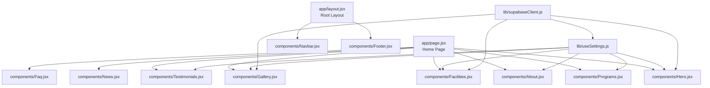
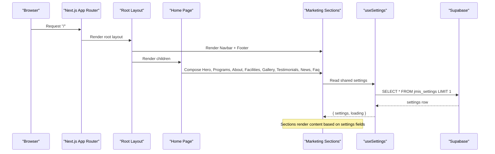
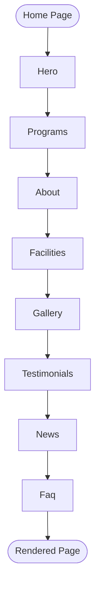
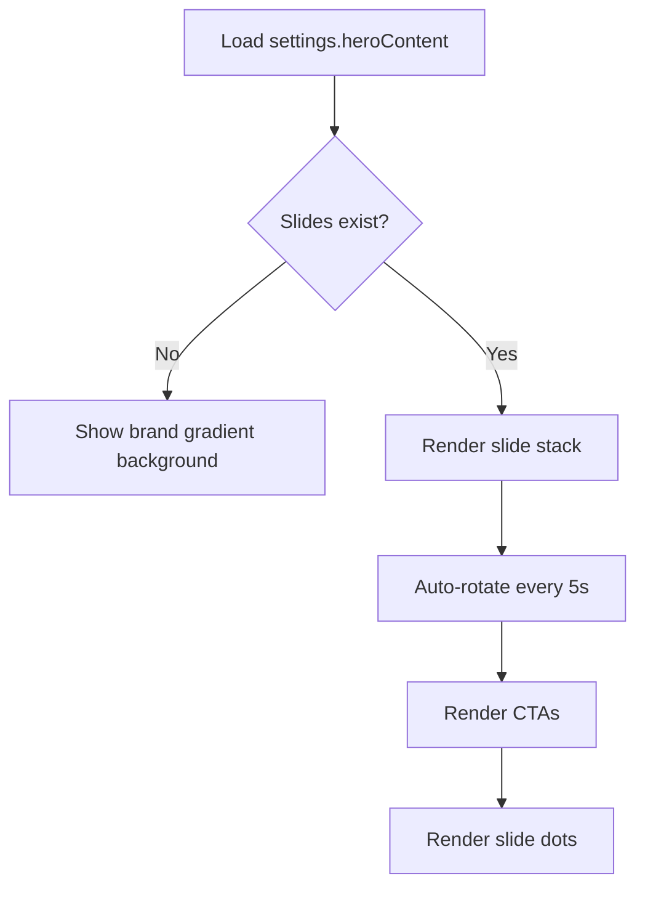
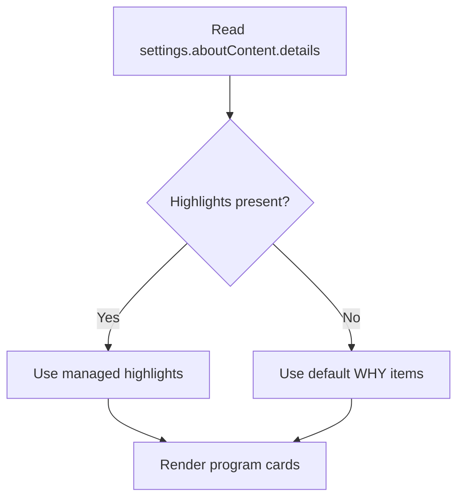
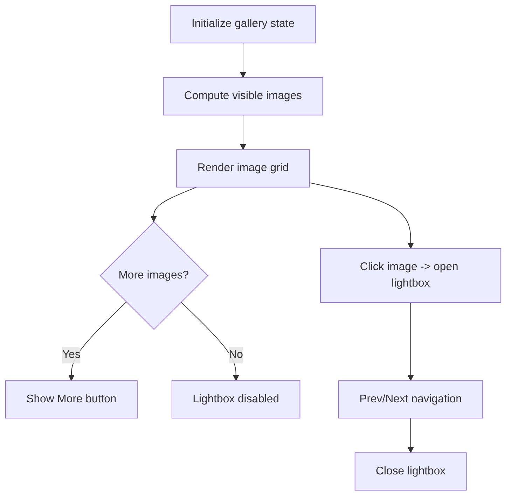
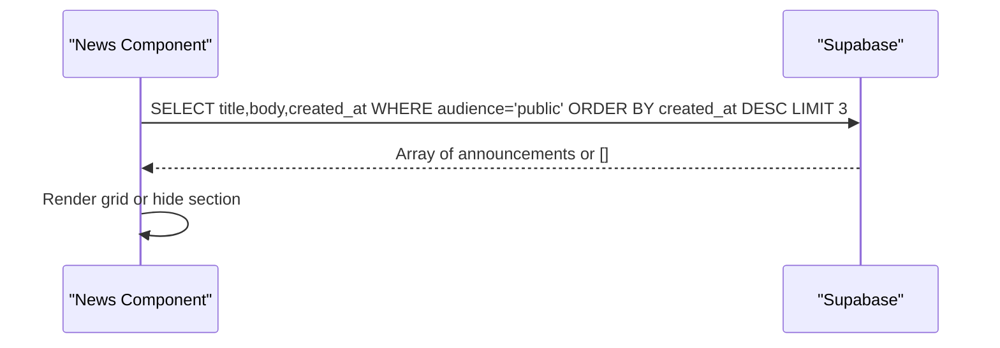
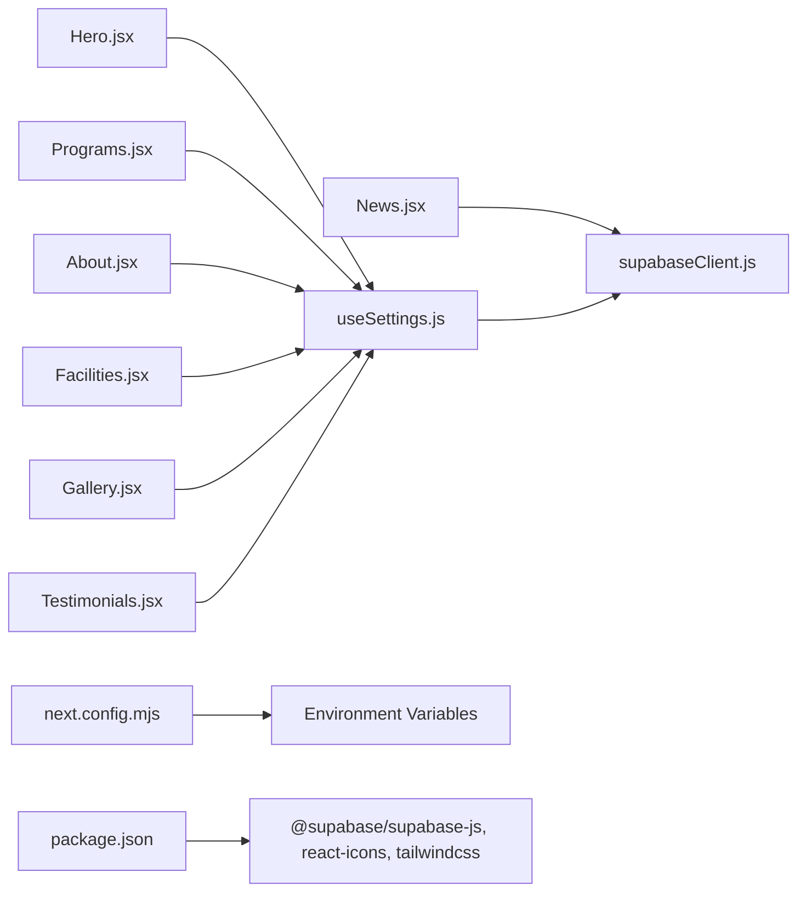

# Marketing Website

<cite>
**Referenced Files in This Document**
- [app/page.jsx](file://app/page.jsx)
- [app/layout.jsx](file://app/layout.jsx)
- [components/Hero.jsx](file://components/Hero.jsx)
- [components/Programs.jsx](file://components/Programs.jsx)
- [components/About.jsx](file://components/About.jsx)
- [components/Facilities.jsx](file://components/Facilities.jsx)
- [components/Gallery.jsx](file://components/Gallery.jsx)
- [components/Testimonials.jsx](file://components/Testimonials.jsx)
- [components/News.jsx](file://components/News.jsx)
- [components/Faq.jsx](file://components/Faq.jsx)
- [lib/useSettings.js](file://lib/useSettings.js)
- [lib/supabaseClient.js](file://lib/supabaseClient.js)
- [next.config.mjs](file://next.config.mjs)
- [package.json](file://package.json)
</cite>

## Table of Contents
1. [Introduction](#introduction)
2. [Project Structure](#project-structure)
3. [Core Components](#core-components)
4. [Architecture Overview](#architecture-overview)
5. [Detailed Component Analysis](#detailed-component-analysis)
6. [Dependency Analysis](#dependency-analysis)
7. [Performance Considerations](#performance-considerations)
8. [Troubleshooting Guide](#troubleshooting-guide)
9. [Conclusion](#conclusion)
10. [Appendices](#appendices)

## Introduction
This document explains the marketing website’s home page composition, dynamic content management via Supabase, component patterns, responsive design approach, and content workflow. It also provides guidance for adding new sections, updating content, customizing layout, optimizing performance, and improving SEO.

The home page composes multiple marketing sections: Hero, Programs, About, Facilities, Gallery, Testimonials, News, and FAQ. Most sections read content from a single settings row in Supabase, while some fetch additional data (for example, announcements). The site uses Next.js App Router with React client components and Tailwind CSS for styling.

## Project Structure
At a high level:
- app/page.jsx is the marketing home page that composes all visible sections.
- app/layout.jsx defines global metadata, navigation, and footer.
- Each section lives under components/.
- lib/useSettings.js centralizes fetching the shared settings row from Supabase.
- lib/supabaseClient.js configures the Supabase client and public image URL helper.
- next.config.mjs exposes environment variables and remote image allow-listing.
- package.json declares dependencies including Next.js, Supabase JS client, and Tailwind.

**Diagram sources**
- [app/page.jsx:1-27](file://app/page.jsx#L1-L27)
- [app/layout.jsx:1-24](file://app/layout.jsx#L1-L24)
- [components/Hero.jsx:1-101](file://components/Hero.jsx#L1-L101)
- [components/Programs.jsx:1-89](file://components/Programs.jsx#L1-L89)
- [components/About.jsx:1-46](file://components/About.jsx#L1-L46)
- [components/Facilities.jsx:1-56](file://components/Facilities.jsx#L1-L56)
- [components/Gallery.jsx:1-119](file://components/Gallery.jsx#L1-L119)
- [components/Testimonials.jsx:1-57](file://components/Testimonials.jsx#L1-L57)
- [components/News.jsx:1-60](file://components/News.jsx#L1-L60)
- [components/Faq.jsx:1-73](file://components/Faq.jsx#L1-L73)
- [lib/useSettings.js:1-25](file://lib/useSettings.js#L1-L25)
- [lib/supabaseClient.js:1-13](file://lib/supabaseClient.js#L1-L13)

**Section sources**
- [app/page.jsx:1-27](file://app/page.jsx#L1-L27)
- [app/layout.jsx:1-24](file://app/layout.jsx#L1-L24)

## Core Components
- Home page composition: The home page renders all marketing sections in order.
- Shared settings hook: useSettings reads a single jmis_settings row from Supabase and returns settings and loading state.
- Supabase client: supabaseClient exports the Supabase instance and a helper to build public URLs for images stored under a specific storage folder.
- Section components: Each marketing section is a client component that consumes either useSettings or direct Supabase calls.

Key responsibilities:
- Hero: Full-bleed carousel using heroContent; auto-rotates slides; shows CTAs.
- Programs: Displays program cards and “Why Choose Us” highlights sourced from aboutContent.details when available.
- About: Renders mission text and principal’s welcome from aboutContent.
- Facilities: Grid of facility cards with images and descriptions from facilitiesContent.
- Gallery: Image grid with show-more and lightbox; images from galleryContent.
- Testimonials: Auto-rotating quotes with optional author image from testimonialContent.
- News: Fetches recent public announcements from jmis_announcements.
- Faq: Static FAQ accordion.

**Section sources**
- [app/page.jsx:1-27](file://app/page.jsx#L1-L27)
- [lib/useSettings.js:1-25](file://lib/useSettings.js#L1-L25)
- [lib/supabaseClient.js:1-13](file://lib/supabaseClient.js#L1-L13)
- [components/Hero.jsx:1-101](file://components/Hero.jsx#L1-L101)
- [components/Programs.jsx:1-89](file://components/Programs.jsx#L1-L89)
- [components/About.jsx:1-46](file://components/About.jsx#L1-L46)
- [components/Facilities.jsx:1-56](file://components/Facilities.jsx#L1-L56)
- [components/Gallery.jsx:1-119](file://components/Gallery.jsx#L1-L119)
- [components/Testimonials.jsx:1-57](file://components/Testimonials.jsx#L1-L57)
- [components/News.jsx:1-60](file://components/News.jsx#L1-L60)
- [components/Faq.jsx:1-73](file://components/Faq.jsx#L1-L73)

## Architecture Overview
The marketing site follows a simple, scalable architecture:
- Next.js App Router serves pages and layouts.
- Client components render interactive UI.
- Data flows from Supabase into components through a shared hook or direct queries.
- Images are served from Supabase Storage using a public URL helper.
- Global layout injects Navbar and Footer.

**Diagram sources**
- [app/layout.jsx:1-24](file://app/layout.jsx#L1-L24)
- [app/page.jsx:1-27](file://app/page.jsx#L1-L27)
- [lib/useSettings.js:1-25](file://lib/useSettings.js#L1-L25)
- [lib/supabaseClient.js:1-13](file://lib/supabaseClient.js#L1-L13)

## Detailed Component Analysis

### Home Page Composition
- The home page imports and renders each marketing section in a fixed order.
- All sections are client components and consume data from Supabase.

**Diagram sources**
- [app/page.jsx:1-27](file://app/page.jsx#L1-L27)

**Section sources**
- [app/page.jsx:1-27](file://app/page.jsx#L1-L27)

### Hero Section
- Reads heroContent from settings and renders an auto-rotating full-bleed carousel.
- Uses plain  tags with settingFileUrl to avoid next/image complexity for remote images.
- Provides two CTAs: Enroll Your Child and Check Result (or CBT Quiz fallback).

**Diagram sources**
- [components/Hero.jsx:1-101](file://components/Hero.jsx#L1-L101)
- [lib/supabaseClient.js:1-13](file://lib/supabaseClient.js#L1-L13)

**Section sources**
- [components/Hero.jsx:1-101](file://components/Hero.jsx#L1-L101)

### Programs Section
- Displays three program cards with icons and bullet points.
- “Why Choose Us” strip prefers school-managed highlights from aboutContent.details; otherwise falls back to built-in copy.

**Diagram sources**
- [components/Programs.jsx:1-89](file://components/Programs.jsx#L1-L89)

**Section sources**
- [components/Programs.jsx:1-89](file://components/Programs.jsx#L1-L89)

### About Section
- Renders mission text and principal’s welcome from aboutContent.
- Falls back to a default message if no content is provided.

**Section sources**
- [components/About.jsx:1-46](file://components/About.jsx#L1-L46)

### Facilities Section
- Renders a responsive grid of facility cards with images and descriptions from facilitiesContent.
- Uses lazy loading for images and a placeholder icon when no image is set.

**Section sources**
- [components/Facilities.jsx:1-56](file://components/Facilities.jsx#L1-L56)

### Gallery Section
- Shows up to six images initially with a “View More” toggle.
- Includes a custom lightbox with keyboard-friendly controls and captions.

**Diagram sources**
- [components/Gallery.jsx:1-119](file://components/Gallery.jsx#L1-L119)

**Section sources**
- [components/Gallery.jsx:1-119](file://components/Gallery.jsx#L1-L119)

### Testimonials Section
- Auto-rotates testimonials every 7 seconds when there are multiple entries.
- Displays quote text and optional author image from testimonialContent.

**Section sources**
- [components/Testimonials.jsx:1-57](file://components/Testimonials.jsx#L1-L57)

### News Section
- Fetches recent public announcements from jmis_announcements where audience equals public.
- Gracefully degrades to an empty list if the table does not exist or query fails.

**Diagram sources**
- [components/News.jsx:1-60](file://components/News.jsx#L1-L60)

**Section sources**
- [components/News.jsx:1-60](file://components/News.jsx#L1-L60)

### FAQ Section
- Static accordion with predefined questions and answers.
- Accessible buttons with aria-expanded states.

**Section sources**
- [components/Faq.jsx:1-73](file://components/Faq.jsx#L1-L73)

### Root Layout and Global Metadata
- Sets site title, description, and favicon.
- Wraps page content with Navbar and Footer.

**Section sources**
- [app/layout.jsx:1-24](file://app/layout.jsx#L1-L24)

## Dependency Analysis
- Components depend on:
  - lib/useSettings.js for shared settings.
  - lib/supabaseClient.js for Supabase client and public image URL helper.
- Environment configuration:
  - next.config.mjs exposes NEXT_PUBLIC_SUPABASE_URL, NEXT_PUBLIC_SUPABASE_ANON_KEY, NEXT_PUBLIC_STUDENT_PORTAL_URL, NEXT_PUBLIC_ADMIN_URL.
  - Remote image allow-list includes the Supabase storage hostname.
- Dependencies:
  - @supabase/supabase-js for database and storage access.
  - react-icons for icons.
  - Tailwind CSS for styling.

**Diagram sources**
- [components/Hero.jsx:1-101](file://components/Hero.jsx#L1-L101)
- [components/Programs.jsx:1-89](file://components/Programs.jsx#L1-L89)
- [components/About.jsx:1-46](file://components/About.jsx#L1-L46)
- [components/Facilities.jsx:1-56](file://components/Facilities.jsx#L1-L56)
- [components/Gallery.jsx:1-119](file://components/Gallery.jsx#L1-L119)
- [components/Testimonials.jsx:1-57](file://components/Testimonials.jsx#L1-L57)
- [components/News.jsx:1-60](file://components/News.jsx#L1-L60)
- [lib/useSettings.js:1-25](file://lib/useSettings.js#L1-L25)
- [lib/supabaseClient.js:1-13](file://lib/supabaseClient.js#L1-L13)
- [next.config.mjs:1-19](file://next.config.mjs#L1-L19)
- [package.json:1-33](file://package.json#L1-L33)

**Section sources**
- [next.config.mjs:1-19](file://next.config.mjs#L1-L19)
- [package.json:1-33](file://package.json#L1-L33)

## Performance Considerations
- Image handling:
  - Hero and other sections use plain  tags with lazy loading where appropriate to reduce overhead.
  - Remote images are allowed via next.config.mjs remotePatterns for Supabase storage.
- Network requests:
  - useSettings performs a single lightweight query for the settings row and caches it in component state.
  - News fetches only the latest three public announcements.
- Interactivity:
  - Carousels and lightboxes are implemented with minimal dependencies and local state.
- Build-time optimizations:
  - Tailwind CSS enables utility-first styling with small bundles.
  - React Strict Mode is enabled.

Recommendations:
- Prefer lazy loading for off-screen images.
- Keep Supabase queries minimal and scoped to required fields.
- Avoid heavy third-party libraries for carousels/lightboxes unless necessary.
- Monitor bundle size and tree-shake unused dependencies.

[No sources needed since this section provides general guidance]

## Troubleshooting Guide
Common issues and resolutions:
- Missing Supabase credentials:
  - Ensure NEXT_PUBLIC_SUPABASE_URL and NEXT_PUBLIC_SUPABASE_ANON_KEY are set in the environment.
- Remote images not loading:
  - Verify the Supabase storage hostname is included in next.config.mjs remotePatterns.
- No settings displayed:
  - Confirm the jmis_settings row exists and contains the expected fields (heroContent, aboutContent, facilitiesContent, galleryContent, testimonialContent, contactContent).
- News section not showing:
  - Ensure jmis_announcements table exists and has rows with audience='public'.
- Student portal link missing:
  - Set NEXT_PUBLIC_STUDENT_PORTAL_URL to enable the “Check Result” CTA.

Operational tips:
- Inspect network tab for failed Supabase requests.
- Validate field names in the admin dashboard match those consumed by components.
- Use browser dev tools to confirm environment variables are injected at runtime.

**Section sources**
- [lib/supabaseClient.js:1-13](file://lib/supabaseClient.js#L1-L13)
- [next.config.mjs:1-19](file://next.config.mjs#L1-L19)
- [components/News.jsx:1-60](file://components/News.jsx#L1-L60)
- [components/Hero.jsx:1-101](file://components/Hero.jsx#L1-L101)

## Conclusion
The marketing website is a modular, content-driven Next.js application. The home page composes clearly defined sections that consume a centralized settings dataset from Supabase. This approach simplifies content updates, supports responsive design, and keeps the codebase maintainable. By following the guidelines in this document, teams can add new sections, update content efficiently, customize layouts, optimize performance, and improve SEO.

[No sources needed since this section summarizes without analyzing specific files]

## Appendices

### Content Management Workflow
- Admin updates content in the admin dashboard’s Settings page, which writes to the jmis_settings row.
- Public site components read settings via useSettings and render updated content immediately after refresh.
- For news, admins publish announcements with audience='public' in jmis_announcements.

**Section sources**
- [lib/useSettings.js:1-25](file://lib/useSettings.js#L1-L25)
- [components/News.jsx:1-60](file://components/News.jsx#L1-L60)

### Adding a New Section
Steps:
1. Create a new component under components/ (for example, Community.jsx).
2. Consume useSettings for shared content or make a targeted Supabase query.
3. Add the component to app/page.jsx in the desired order.
4. If the section needs a nav link, update the links array in components/Navbar.jsx.
5. Style using Tailwind classes and ensure accessibility attributes (aria-labels, headings).

**Section sources**
- [app/page.jsx:1-27](file://app/page.jsx#L1-L27)
- [components/Navbar.jsx:1-165](file://components/Navbar.jsx#L1-L165)

### Updating Content
- Edit the relevant fields in jmis_settings (for example, heroContent, aboutContent, facilitiesContent, galleryContent, testimonialContent, contactContent).
- For news, create or update rows in jmis_announcements with audience='public'.

**Section sources**
- [components/Hero.jsx:1-101](file://components/Hero.jsx#L1-L101)
- [components/Programs.jsx:1-89](file://components/Programs.jsx#L1-L89)
- [components/About.jsx:1-46](file://components/About.jsx#L1-L46)
- [components/Facilities.jsx:1-56](file://components/Facilities.jsx#L1-L56)
- [components/Gallery.jsx:1-119](file://components/Gallery.jsx#L1-L119)
- [components/Testimonials.jsx:1-57](file://components/Testimonials.jsx#L1-L57)
- [components/News.jsx:1-60](file://components/News.jsx#L1-L60)

### Customizing Layout
- Adjust section order in app/page.jsx.
- Modify styles using Tailwind classes within each component.
- Update global metadata and branding in app/layout.jsx.

**Section sources**
- [app/page.jsx:1-27](file://app/page.jsx#L1-L27)
- [app/layout.jsx:1-24](file://app/layout.jsx#L1-L24)

### SEO Considerations
- Title and description are set in app/layout.jsx metadata.
- Use semantic HTML elements (section, article, figure, figcaption) already present in components.
- Provide descriptive alt text for images.
- Ensure accessible navigation and interactive controls (aria-expanded, aria-labels).
- Consider adding structured data (JSON-LD) for school information and events if needed.

**Section sources**
- [app/layout.jsx:1-24](file://app/layout.jsx#L1-L24)
- [components/Gallery.jsx:1-119](file://components/Gallery.jsx#L1-L119)
- [components/Faq.jsx:1-73](file://components/Faq.jsx#L1-L73)