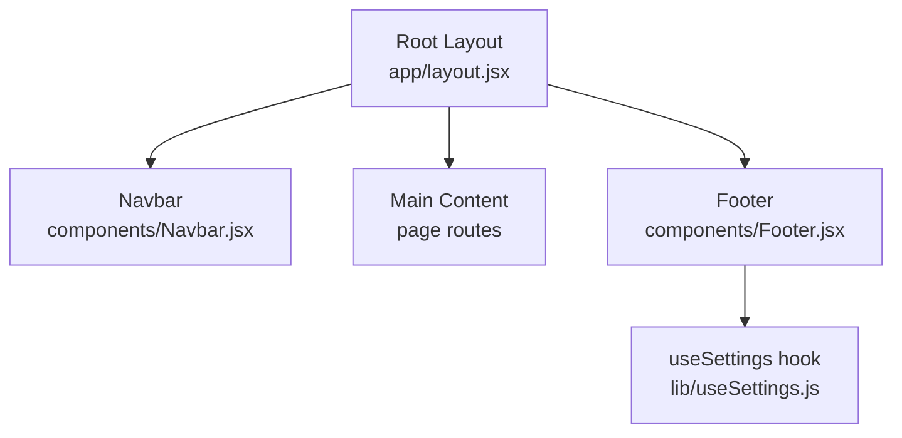
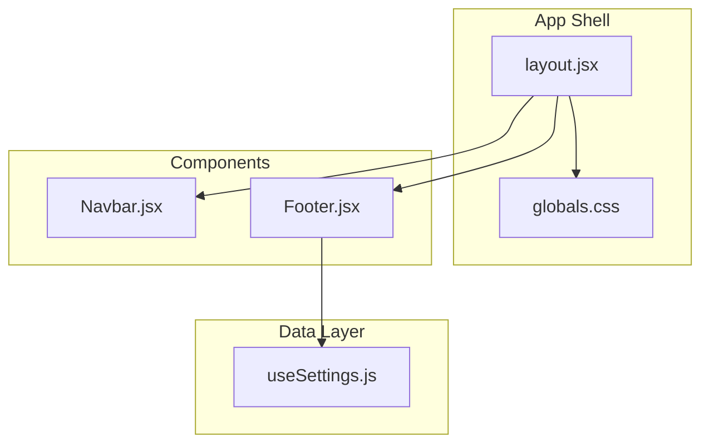
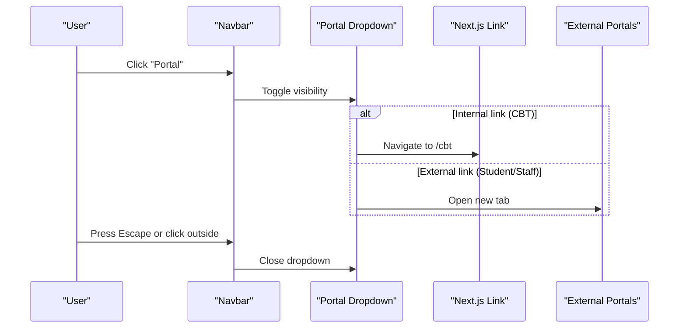
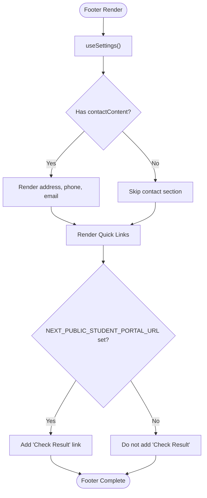
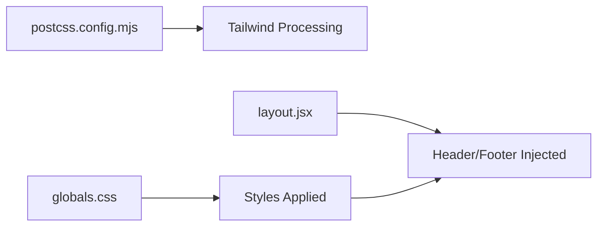
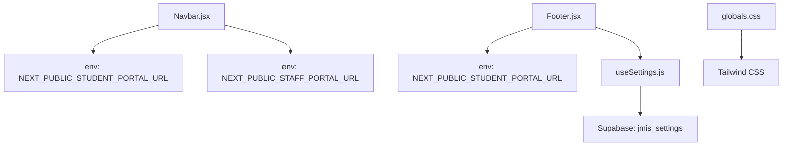

# Navigation and Layout

<cite>
**Referenced Files in This Document**
- [Navbar.jsx](file://components/Navbar.jsx)
- [Footer.jsx](file://components/Footer.jsx)
- [layout.jsx](file://app/layout.jsx)
- [globals.css](file://app/globals.css)
- [useSettings.js](file://lib/useSettings.js)
- [postcss.config.mjs](file://postcss.config.mjs)
</cite>

## Table of Contents
1. [Introduction](#introduction)
2. [Project Structure](#project-structure)
3. [Core Components](#core-components)
4. [Architecture Overview](#architecture-overview)
5. [Detailed Component Analysis](#detailed-component-analysis)
6. [Dependency Analysis](#dependency-analysis)
7. [Performance Considerations](#performance-considerations)
8. [Troubleshooting Guide](#troubleshooting-guide)
9. [Conclusion](#conclusion)
10. [Appendices](#appendices)

## Introduction
This document explains the navigation and layout system for the school website, focusing on:
- The Navbar component implementation and responsive behavior
- The Footer component functionality and data sources
- Global layout structure using Next.js App Router
- CSS architecture with Tailwind CSS and Bootstrap considerations
- How navigation links are managed and extended
- SEO and accessibility guidance for navigation structure and keyboard interactions

## Project Structure
The navigation and layout are implemented as reusable React components integrated into the root layout:
- Root layout composes Navbar, main content, and Footer
- Navbar provides sticky header, desktop navigation, mobile menu, and portal dropdown
- Footer renders quick links and contact information sourced from settings

**Diagram sources**
- [layout.jsx:13-23](file://app/layout.jsx#L13-L23)
- [Navbar.jsx:18-164](file://components/Navbar.jsx#L18-L164)
- [Footer.jsx:16-131](file://components/Footer.jsx#L16-L131)
- [useSettings.js:8-24](file://lib/useSettings.js#L8-L24)

**Section sources**
- [layout.jsx:1-24](file://app/layout.jsx#L1-L24)

## Core Components
- Navbar: Sticky glass-style header with desktop nav links, a Portal dropdown (CBT, Student, Staff), and a mobile menu with collapsible Portal submenu. Uses environment variables for external portals and Next.js Link for internal routes.
- Footer: Three-column layout with brand description, quick links, and contact details. Contact info is loaded via useSettings; includes optional “Check Result” link when configured.

Key responsibilities:
- Responsive breakpoints: hidden lg:flex for desktop nav; mobile toggle for small screens
- Accessibility: aria-haspopup, aria-expanded, semantic header/nav/main/footer elements
- Styling: Tailwind utility classes and global theme tokens defined in globals.css

**Section sources**
- [Navbar.jsx:8-14](file://components/Navbar.jsx#L8-L14)
- [Navbar.jsx:18-164](file://components/Navbar.jsx#L18-L164)
- [Footer.jsx:16-131](file://components/Footer.jsx#L16-L131)
- [globals.css:4-10](file://app/globals.css#L4-L10)

## Architecture Overview
The application uses Next.js App Router with a single root layout that injects Navbar and Footer around page content. Styles are centralized in globals.css using Tailwind’s @import and @theme directives. Some pages import Bootstrap (CBT portal), which requires explicit overrides to avoid affecting header links.

**Diagram sources**
- [layout.jsx:1-24](file://app/layout.jsx#L1-L24)
- [globals.css:1-43](file://app/globals.css#L1-L43)
- [Navbar.jsx:1-165](file://components/Navbar.jsx#L1-L165)
- [Footer.jsx:1-132](file://components/Footer.jsx#L1-L132)
- [useSettings.js:1-25](file://lib/useSettings.js#L1-L25)

## Detailed Component Analysis

### Navbar Component
Responsibilities:
- Renders a sticky header with logo and site title
- Desktop navigation links mapped from a central LINKS array
- Portal dropdown with internal (CBT) and external (Student/Staff) links
- Mobile menu with collapsible Portal submenu
- Keyboard and click-outside handling for dropdown state

Responsive behavior:
- Desktop: hidden lg:flex shows horizontal nav and Portal dropdown
- Mobile: button toggles open/close; secondary menu rendered below

Accessibility:
- Semantic <header>, <nav>, and <main> usage in layout
- aria-haspopup and aria-expanded on Portal trigger buttons
- External links use target="_blank" with rel="noopener noreferrer"

Environment-driven configuration:
- NEXT_PUBLIC_STUDENT_PORTAL_URL and NEXT_PUBLIC_STAFF_PORTAL_URL control external portal URLs with fallbacks

**Diagram sources**
- [Navbar.jsx:26-41](file://components/Navbar.jsx#L26-L41)
- [Navbar.jsx:76-118](file://components/Navbar.jsx#L76-L118)
- [Navbar.jsx:125-160](file://components/Navbar.jsx#L125-L160)

**Section sources**
- [Navbar.jsx:8-14](file://components/Navbar.jsx#L8-L14)
- [Navbar.jsx:18-164](file://components/Navbar.jsx#L18-L164)

### Footer Component
Responsibilities:
- Displays brand block, quick links, and contact information
- Loads contactContent from jmis_settings via useSettings
- Conditionally renders “Check Result” link based on environment variable
- Includes vendor credit and contact email

Data flow:
- useSettings fetches a single row from Supabase and exposes settings
- Footer reads settings.contactContent and conditionally renders address, phone, email

**Diagram sources**
- [Footer.jsx:16-131](file://components/Footer.jsx#L16-L131)
- [useSettings.js:8-24](file://lib/useSettings.js#L8-L24)

**Section sources**
- [Footer.jsx:16-131](file://components/Footer.jsx#L16-L131)
- [useSettings.js:1-25](file://lib/useSettings.js#L1-L25)

### Global Layout and CSS Architecture
Layout:
- Root layout wraps all pages with Navbar, main content, and Footer
- Metadata sets page title and description for SEO

CSS:
- Tailwind is imported via @import "tailwindcss" and configured through postcss.config.mjs
- Brand colors and fonts are defined in globals.css using @theme
- Custom utilities like .brand-gradient and section headings are provided
- Explicit header a styles override Bootstrap’s default underline behavior

**Diagram sources**
- [postcss.config.mjs:1-7](file://postcss.config.mjs#L1-L7)
- [globals.css:1-43](file://app/globals.css#L1-L43)
- [layout.jsx:1-24](file://app/layout.jsx#L1-L24)

**Section sources**
- [layout.jsx:1-24](file://app/layout.jsx#L1-L24)
- [globals.css:1-43](file://app/globals.css#L1-L43)
- [postcss.config.mjs:1-7](file://postcss.config.mjs#L1-L7)

## Dependency Analysis
- Navbar depends on:
  - Next.js Link for internal routing
  - Environment variables for external portal URLs
  - react-icons for icons
- Footer depends on:
  - useSettings hook to read contactContent
  - Environment variable for conditional “Check Result” link
- Globals CSS depends on:
  - Tailwind via PostCSS plugin
  - Overrides for header anchor styles to prevent Bootstrap interference

**Diagram sources**
- [Navbar.jsx:23-24](file://components/Navbar.jsx#L23-L24)
- [Footer.jsx:59-70](file://components/Footer.jsx#L59-L70)
- [useSettings.js:12-19](file://lib/useSettings.js#L12-L19)
- [globals.css:1-43](file://app/globals.css#L1-L43)

**Section sources**
- [Navbar.jsx:23-24](file://components/Navbar.jsx#L23-L24)
- [Footer.jsx:59-70](file://components/Footer.jsx#L59-L70)
- [useSettings.js:12-19](file://lib/useSettings.js#L12-L19)
- [globals.css:34-42](file://app/globals.css#L34-L42)

## Performance Considerations
- Use Next.js Image for optimized logo rendering and priority loading
- Avoid unnecessary re-renders by keeping dropdown state minimal and scoped
- Prefer Link for internal navigation to leverage client-side transitions
- Keep CSS overrides minimal and specific to header anchors to avoid global side effects

[No sources needed since this section provides general guidance]

## Troubleshooting Guide
Common issues and resolutions:
- Header links unexpectedly underlined:
  - Cause: Bootstrap’s global anchor styling
  - Resolution: globals.css explicitly removes text-decoration for header anchors
- Portal dropdown does not close:
  - Ensure click-outside and Escape key handlers are active
  - Verify aria-expanded reflects actual state
- External portal links not opening:
  - Confirm environment variables are set correctly
  - Validate target="_blank" and rel="noopener noreferrer" attributes

**Section sources**
- [globals.css:34-42](file://app/globals.css#L34-L42)
- [Navbar.jsx:26-41](file://components/Navbar.jsx#L26-L41)
- [Navbar.jsx:90-110](file://components/Navbar.jsx#L90-L110)

## Conclusion
The navigation and layout system combines a responsive Navbar and a data-driven Footer within a clean Next.js root layout. Tailwind CSS provides consistent styling with brand tokens, while targeted CSS overrides ensure compatibility with Bootstrap-loaded pages. Environment variables enable flexible configuration of external portals, and accessibility attributes support keyboard and screen reader users.

[No sources needed since this section summarizes without analyzing specific files]

## Appendices

### Adding New Navigation Items
Steps:
- Edit the LINKS array in Navbar to include new items
- For internal routes, use Next.js Link; for external anchors, use standard anchor tags
- If adding a new top-level item, decide whether it should be exact-match or scroll-based

Example reference:
- [LINKS array definition:8-14](file://components/Navbar.jsx#L8-L14)

**Section sources**
- [Navbar.jsx:8-14](file://components/Navbar.jsx#L8-L14)

### Customizing Header/Footer Appearance
- Update brand colors and fonts in globals.css @theme
- Adjust Tailwind utility classes in Navbar and Footer for spacing, typography, and colors
- Modify .brand-gradient or add new utility classes in globals.css for consistent branding

Example references:
- [Brand theme definitions:4-10](file://app/globals.css#L4-L10)
- [Custom gradient utility:22-24](file://app/globals.css#L22-L24)

**Section sources**
- [globals.css:4-10](file://app/globals.css#L4-L10)
- [globals.css:22-24](file://app/globals.css#L22-L24)

### Implementing Responsive Breakpoints
- Desktop navigation uses hidden lg:flex to show at large screens
- Mobile menu toggles via a button and renders below the header
- Footer grid switches from single column to three columns at md breakpoint

Example references:
- [Desktop nav visibility:62-74](file://components/Navbar.jsx#L62-L74)
- [Mobile menu container:125-160](file://components/Navbar.jsx#L125-L160)
- [Footer grid layout:22-24](file://components/Footer.jsx#L22-L24)

**Section sources**
- [Navbar.jsx:62-74](file://components/Navbar.jsx#L62-L74)
- [Navbar.jsx:125-160](file://components/Navbar.jsx#L125-L160)
- [Footer.jsx:22-24](file://components/Footer.jsx#L22-L24)

### SEO Considerations for Navigation Structure
- Use semantic elements: <header>, <nav>, <main>, <footer>
- Provide descriptive link labels and hrefs
- Ensure metadata title and description are set in root layout
- Avoid excessive nested menus; keep primary navigation flat where possible

Example references:
- [Root layout metadata:6-11](file://app/layout.jsx#L6-L11)
- [Semantic structure in layout:13-23](file://app/layout.jsx#L13-L23)

**Section sources**
- [layout.jsx:6-11](file://app/layout.jsx#L6-L11)
- [layout.jsx:13-23](file://app/layout.jsx#L13-L23)

### Accessibility Compliance for Keyboard Navigation
- Use aria-haspopup and aria-expanded on interactive triggers
- Ensure focus management and keyboard events (Escape) close dropdowns
- External links must include rel="noopener noreferrer"
- Maintain sufficient color contrast for brand colors and hover states

Example references:
- [Portal dropdown accessibility attributes:78-86](file://components/Navbar.jsx#L78-L86)
- [Keyboard and click-outside handlers:26-41](file://components/Navbar.jsx#L26-L41)
- [External link security attributes:90-110](file://components/Navbar.jsx#L90-L110)

**Section sources**
- [Navbar.jsx:26-41](file://components/Navbar.jsx#L26-L41)
- [Navbar.jsx:78-86](file://components/Navbar.jsx#L78-L86)
- [Navbar.jsx:90-110](file://components/Navbar.jsx#L90-L110)