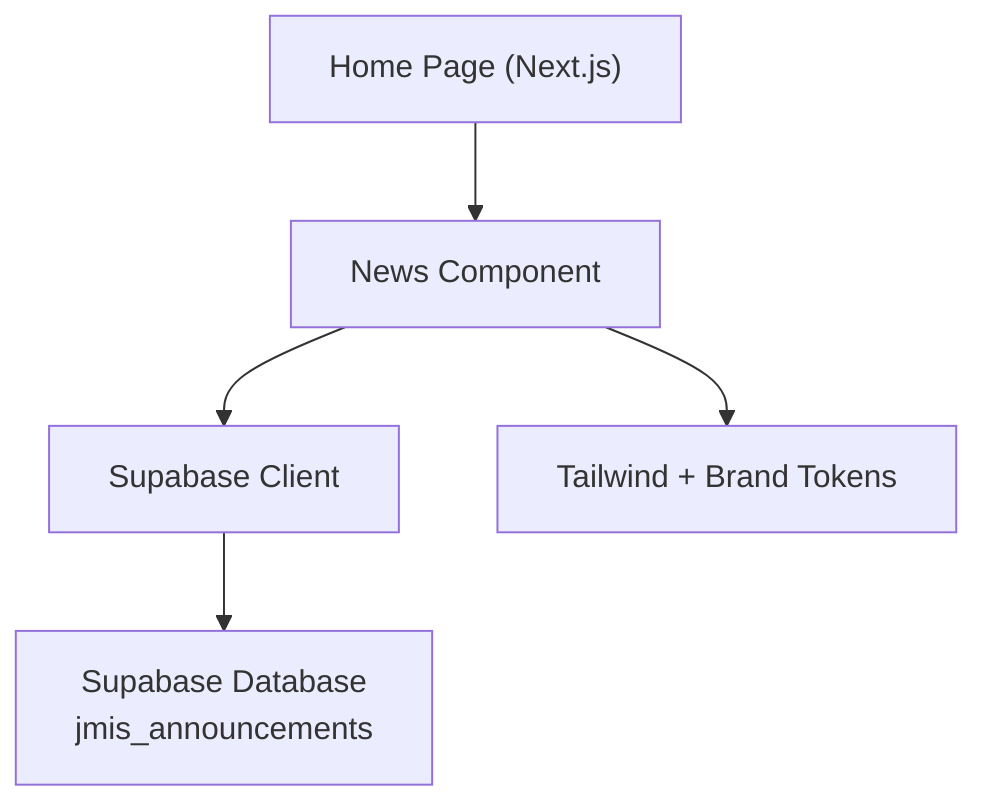
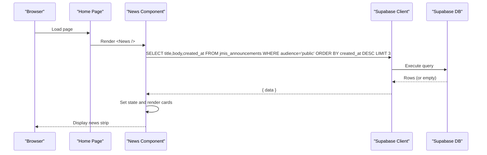
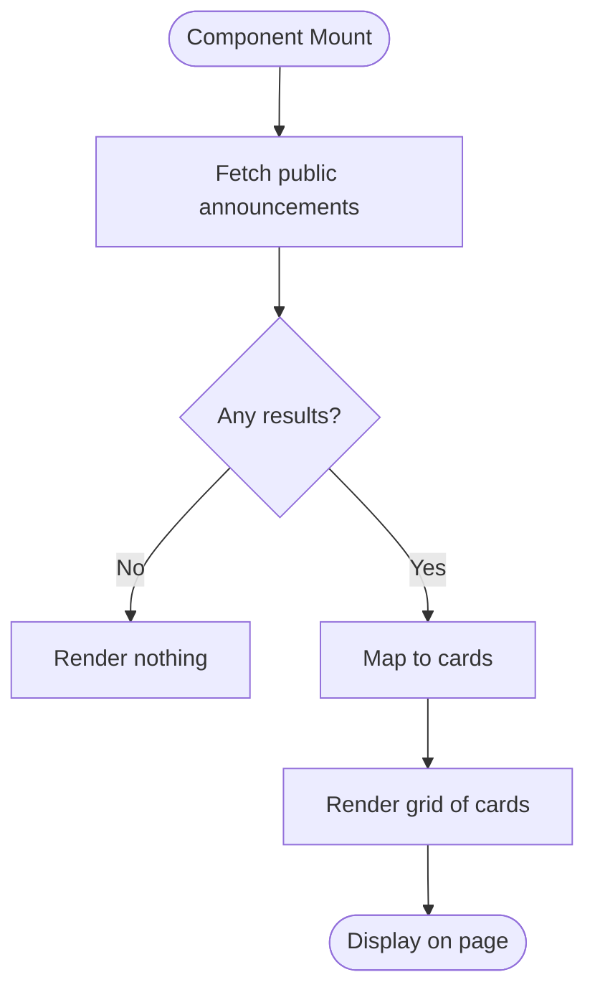
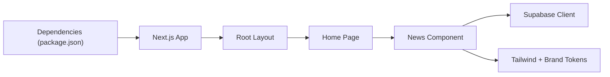

# News Section

<cite>
**Referenced Files in This Document**
- [News.jsx](file://components/News.jsx)
- [supabaseClient.js](file://lib/supabaseClient.js)
- [page.jsx](file://app/page.jsx)
- [layout.jsx](file://app/layout.jsx)
- [globals.css](file://app/globals.css)
- [package.json](file://package.json)
</cite>

## Table of Contents
1. [Introduction](#introduction)
2. [Project Structure](#project-structure)
3. [Core Components](#core-components)
4. [Architecture Overview](#architecture-overview)
5. [Detailed Component Analysis](#detailed-component-analysis)
6. [Dependency Analysis](#dependency-analysis)
7. [Performance Considerations](#performance-considerations)
8. [Troubleshooting Guide](#troubleshooting-guide)
9. [Conclusion](#conclusion)
10. [Appendices](#appendices)

## Introduction
This document explains the News section component that displays school news and announcements on the public website. It covers how article cards are rendered, how dates are shown, how data is fetched from Supabase, and how to manage content through the admin workflow. It also provides guidance for extending categorization, customizing layout, optimizing SEO, and enabling social sharing.

## Project Structure
The News section is a client-side React component integrated into the Next.js app:
- The home page includes the News component among other marketing sections.
- The News component fetches announcements from Supabase and renders them as cards with title, body, and date.
- Styling uses Tailwind CSS classes and brand tokens defined globally.

**Diagram sources**
- [page.jsx:1-27](file://app/page.jsx#L1-L27)
- [News.jsx:1-60](file://components/News.jsx#L1-L60)
- [supabaseClient.js:1-13](file://lib/supabaseClient.js#L1-L13)
- [globals.css:1-43](file://app/globals.css#L1-L43)

**Section sources**
- [page.jsx:1-27](file://app/page.jsx#L1-L27)
- [layout.jsx:1-24](file://app/layout.jsx#L1-L24)
- [globals.css:1-43](file://app/globals.css#L1-L43)

## Core Components
- News component: Fetches and renders the latest public announcements.
- Supabase client: Provides authenticated access to the database using environment variables.
- Home page: Mounts the News component within the site’s main layout.

Key responsibilities:
- Data fetching: Query the announcements table for public items, ordered by newest first, limited to three entries.
- Rendering: Display each announcement as a card with an icon, title, excerpted body, and formatted date.
- Graceful degradation: If the table or rows do not exist, the component renders nothing instead of erroring out.

**Section sources**
- [News.jsx:1-60](file://components/News.jsx#L1-L60)
- [supabaseClient.js:1-13](file://lib/supabaseClient.js#L1-L13)
- [page.jsx:1-27](file://app/page.jsx#L1-L27)

## Architecture Overview
The News section follows a simple client-side data flow:
- On mount, the component requests public announcements from Supabase.
- Results are stored in local state and mapped to UI cards.
- Styling is applied via Tailwind utility classes and brand tokens.

**Diagram sources**
- [News.jsx:13-28](file://components/News.jsx#L13-L28)
- [supabaseClient.js:4-7](file://lib/supabaseClient.js#L4-L7)

## Detailed Component Analysis

### News Component Behavior
- Data source: Reads from the jmis_announcements table, filtering by audience = 'public'.
- Fields used: title, body, created_at.
- Ordering and limit: Newest first, capped at three items.
- Rendering:
  - Each item becomes a card with an icon, heading, truncated body text, and a localized date.
  - If there are no items, the entire section is hidden.

**Diagram sources**
- [News.jsx:13-30](file://components/News.jsx#L13-L30)
- [News.jsx:40-55](file://components/News.jsx#L40-L55)

**Section sources**
- [News.jsx:1-60](file://components/News.jsx#L1-L60)

### Data Model and Schema
Based on the component’s query, the expected schema for jmis_announcements includes:
- title: string
- body: string
- created_at: timestamp
- audience: string (used to filter public items)

Notes:
- The component does not require additional fields such as category or slug; those can be added later if needed.
- If the table or columns do not exist, the fetch fails gracefully and the section remains hidden.

**Section sources**
- [News.jsx:16-21](file://components/News.jsx#L16-L21)

### Content Management Workflow
- Creation: Announcements are created in the admin dashboard or staff portal and stored in jmis_announcements.
- Visibility: Set audience to 'public' so the component includes them.
- Updates: Edit existing rows to update title, body, or date; changes reflect immediately on the next page load due to live queries.
- Deletion: Remove rows to hide them from the public view.

Operational tips:
- Keep titles concise for better card readability.
- Use clear, scannable body text; the UI truncates longer content.
- Ensure created_at is set correctly to control ordering.

**Section sources**
- [News.jsx:7-9](file://components/News.jsx#L7-L9)
- [News.jsx:16-21](file://components/News.jsx#L16-L21)

### Adding a New Announcement
Steps:
1. Create a new row in jmis_announcements with:
   - title: A short, descriptive headline
   - body: The announcement content
   - audience: "public"
   - created_at: Current timestamp (or desired publish time)
2. Save the row.
3. Refresh the homepage to see the new item appear in the top three most recent.

Validation:
- If the table or columns are missing, the component will not crash; it simply hides the section until the schema is ready.

**Section sources**
- [News.jsx:16-21](file://components/News.jsx#L16-L21)
- [News.jsx:30-30](file://components/News.jsx#L30-L30)

### Managing Categories
Current behavior:
- No explicit category field is used in the component.
- Filtering is based solely on audience = 'public'.

Recommended extension:
- Add a category column to jmis_announcements (e.g., "academics", "events", "admin").
- Update the component to:
  - Accept a category filter prop.
  - Include .eq("category", selectedCategory) in the query.
  - Provide UI controls to switch categories.

Backward compatibility:
- Existing rows without a category can default to a generic value or be excluded until migrated.

**Section sources**
- [News.jsx:16-21](file://components/News.jsx#L16-L21)

### Customizing the News Layout
- Grid and spacing: Controlled by Tailwind classes in the component. Adjust grid columns, gaps, and padding to fit your design system.
- Card styling: Modify border radius, shadows, typography, and colors via Tailwind utilities or global styles.
- Brand tokens: Colors and gradients are defined in globals.css and referenced via Tailwind theme variables.

Example customization points:
- Change the number of visible items by adjusting the limit in the query.
- Replace icons or add images per announcement by adding image fields to the schema and rendering them in the card.

**Section sources**
- [News.jsx:32-57](file://components/News.jsx#L32-L57)
- [globals.css:3-10](file://app/globals.css#L3-L10)
- [globals.css:22-32](file://app/globals.css#L22-L32)

### SEO Optimization for News Content
Recommendations:
- Per-page metadata: For dedicated news pages, use Next.js metadata to set dynamic titles and descriptions per article.
- Structured data: Implement JSON-LD for Article or NewsArticle to improve search visibility.
- Open Graph and Twitter Cards: Add meta tags for rich previews when shared on social platforms.
- Canonical URLs: Prevent duplicate indexing by setting canonical links for each article.
- Performance: Lazy-load images and minimize JavaScript to keep Core Web Vitals healthy.

Note: The current News section is a list on the home page. To maximize SEO impact, consider creating individual pages for each announcement with dedicated metadata and structured data.

[No sources needed since this section provides general guidance]

### Social Media Sharing Capabilities
Options:
- Native share API: Use navigator.share where supported to open platform-specific share dialogs.
- Prebuilt links: Generate share URLs for major platforms (e.g., Facebook, X/Twitter, LinkedIn) with encoded title, description, and URL.
- Copy link: Provide a button to copy the article URL to clipboard for easy sharing.

Implementation notes:
- Ensure each article has a stable URL for sharing.
- Include OG/Twitter meta tags on article pages to control preview appearance.
- Respect user privacy and browser capabilities when using the native share API.

[No sources needed since this section provides general guidance]

## Dependency Analysis
- Next.js App Router: The home page mounts the News component.
- React client component: The News component uses hooks for lifecycle and state.
- Supabase JS client: Connects to the configured project using environment variables.
- Tailwind CSS: Provides utility classes and brand tokens.

**Diagram sources**
- [package.json:11-22](file://package.json#L11-L22)
- [layout.jsx:1-24](file://app/layout.jsx#L1-L24)
- [page.jsx:1-27](file://app/page.jsx#L1-L27)
- [News.jsx:1-60](file://components/News.jsx#L1-L60)
- [supabaseClient.js:1-13](file://lib/supabaseClient.js#L1-L13)
- [globals.css:1-43](file://app/globals.css#L1-L43)

**Section sources**
- [package.json:11-22](file://package.json#L11-L22)
- [layout.jsx:1-24](file://app/layout.jsx#L1-L24)
- [page.jsx:1-27](file://app/page.jsx#L1-L27)
- [News.jsx:1-60](file://components/News.jsx#L1-L60)
- [supabaseClient.js:1-13](file://lib/supabaseClient.js#L1-L13)
- [globals.css:1-43](file://app/globals.css#L1-L43)

## Performance Considerations
- Limit results: The query limits to three items to reduce payload size.
- Minimal DOM: Only essential fields are selected and rendered.
- Graceful fallback: Missing tables or rows do not break the page.
- Image optimization: If images are added later, ensure lazy loading and proper sizing.

[No sources needed since this section provides general guidance]

## Troubleshooting Guide
Common issues and resolutions:
- Section not visible:
  - Verify that jmis_announcements exists and contains rows with audience = 'public'.
  - Check that created_at values are valid timestamps.
- Network errors:
  - Confirm NEXT_PUBLIC_SUPABASE_URL and NEXT_PUBLIC_SUPABASE_ANON_KEY are set correctly.
  - Validate Row Level Security policies allow anonymous reads for public announcements.
- Styling anomalies:
  - Ensure Tailwind is configured and brand tokens are present in globals.css.
- Unexpected ordering:
  - Confirm created_at is populated and sorted descending in the query.

**Section sources**
- [News.jsx:13-28](file://components/News.jsx#L13-L28)
- [supabaseClient.js:4-7](file://lib/supabaseClient.js#L4-L7)
- [globals.css:3-10](file://app/globals.css#L3-L10)

## Conclusion
The News section provides a lightweight, client-side feed of public announcements powered by Supabase. It renders up to three recent items as styled cards with dates. The implementation is resilient to missing data and easily extensible for categories, images, and richer layouts. For SEO and social sharing, create dedicated article pages with metadata and structured data, and implement share actions tailored to your audience.

[No sources needed since this section summarizes without analyzing specific files]

## Appendices

### Environment Variables
Ensure these are configured in your deployment environment:
- NEXT_PUBLIC_SUPABASE_URL
- NEXT_PUBLIC_SUPABASE_ANON_KEY

These are read by the Supabase client to connect to your project.

**Section sources**
- [supabaseClient.js:4-7](file://lib/supabaseClient.js#L4-L7)

### Quick Reference: Query Fields
- Select: title, body, created_at
- Filter: audience = 'public'
- Order: created_at descending
- Limit: 3

**Section sources**
- [News.jsx:16-21](file://components/News.jsx#L16-L21)