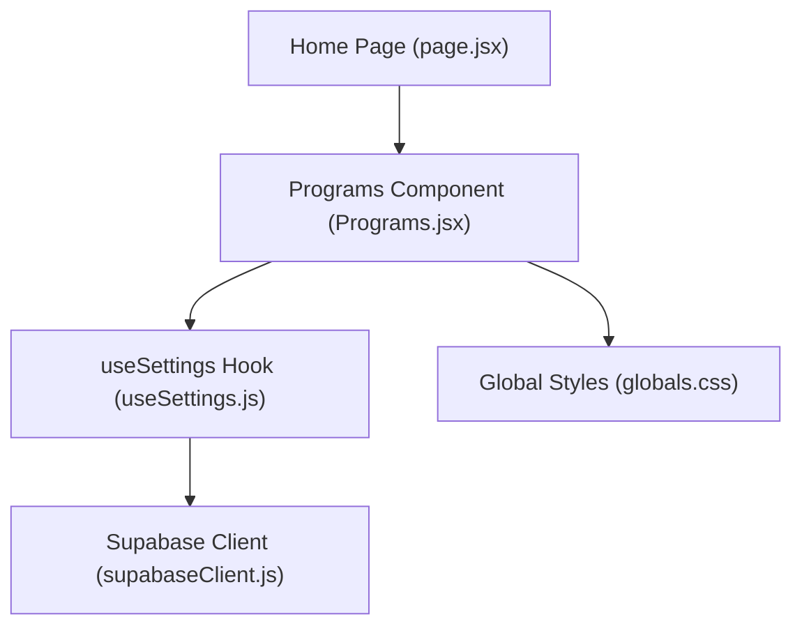
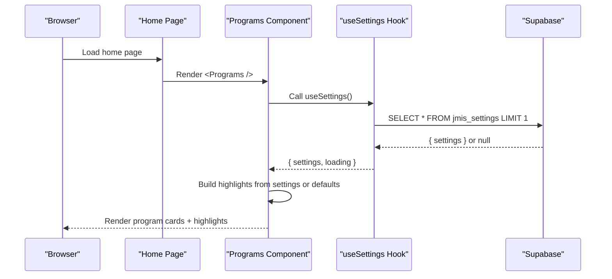
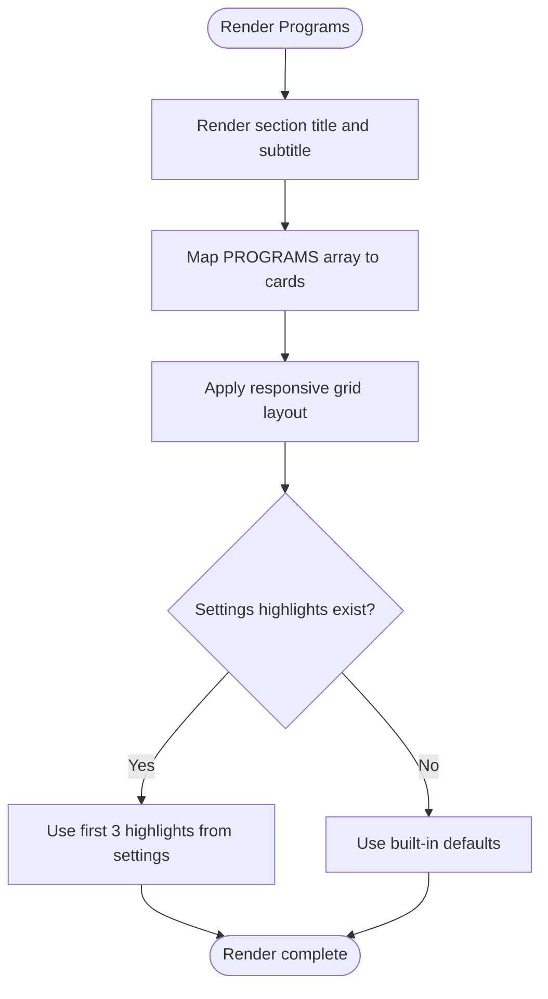
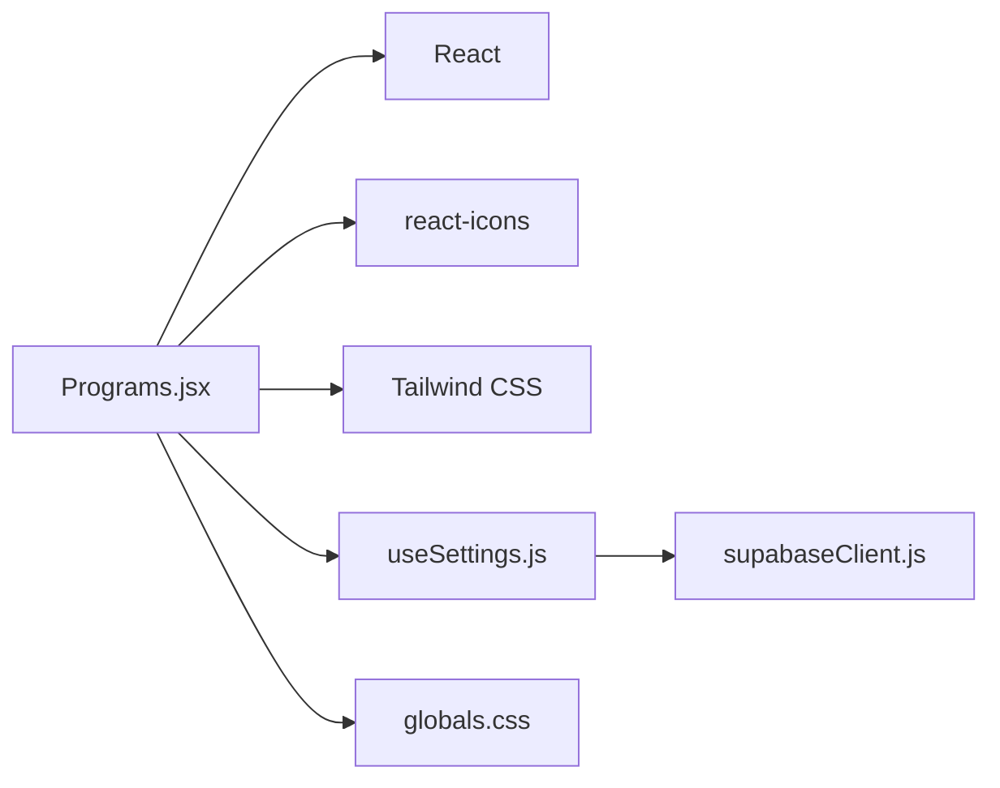

# Programs Section

<cite>
**Referenced Files in This Document**
- [Programs.jsx](file://components/Programs.jsx)
- [useSettings.js](file://lib/useSettings.js)
- [supabaseClient.js](file://lib/supabaseClient.js)
- [globals.css](file://app/globals.css)
- [page.jsx](file://app/page.jsx)
- [next.config.mjs](file://next.config.mjs)
</cite>

## Table of Contents
1. [Introduction](#introduction)
2. [Project Structure](#project-structure)
3. [Core Components](#core-components)
4. [Architecture Overview](#architecture-overview)
5. [Detailed Component Analysis](#detailed-component-analysis)
6. [Dependency Analysis](#dependency-analysis)
7. [Performance Considerations](#performance-considerations)
8. [Troubleshooting Guide](#troubleshooting-guide)
9. [Conclusion](#conclusion)
10. [Appendices](#appendices)

## Introduction
This document explains the Programs section component that displays educational programs on the school website. It covers how program cards are rendered, how content is managed via Supabase settings, and how the responsive grid layout works. It also provides guidance for adding new programs, updating details, customizing visuals, SEO considerations, and accessibility compliance.

## Project Structure
The Programs section is a client-side React component embedded in the home page. It uses Tailwind CSS for styling and reads dynamic “Why Choose Us” highlights from a shared settings hook backed by Supabase. Program cards themselves are currently defined as static data within the component.

**Diagram sources**
- [page.jsx:1-27](file://app/page.jsx#L1-L27)
- [Programs.jsx:1-89](file://components/Programs.jsx#L1-L89)
- [useSettings.js:1-25](file://lib/useSettings.js#L1-L25)
- [supabaseClient.js:1-13](file://lib/supabaseClient.js#L1-L13)
- [globals.css:1-43](file://app/globals.css#L1-L43)

**Section sources**
- [page.jsx:1-27](file://app/page.jsx#L1-L27)
- [Programs.jsx:1-89](file://components/Programs.jsx#L1-L89)
- [useSettings.js:1-25](file://lib/useSettings.js#L1-L25)
- [supabaseClient.js:1-13](file://lib/supabaseClient.js#L1-L13)
- [globals.css:1-43](file://app/globals.css#L1-L43)

## Core Components
- Programs component: Renders the section title, subtitle, program cards, and a “Why Choose Us” strip.
- useSettings hook: Fetches the single settings row from Supabase to populate dynamic highlights.
- Supabase client: Provides the configured Supabase instance using environment variables.
- Global styles: Define brand colors, gradients, and reusable section heading classes used by the component.

Key responsibilities:
- Display three program cards with icons, titles, age ranges, and feature points.
- Show up to three “Why Choose Us” highlights sourced from settings; fall back to built-in defaults when not provided.
- Maintain consistent branding and responsive layout across devices.

**Section sources**
- [Programs.jsx:15-84](file://components/Programs.jsx#L15-L84)
- [useSettings.js:8-24](file://lib/useSettings.js#L8-L24)
- [supabaseClient.js:1-13](file://lib/supabaseClient.js#L1-L13)
- [globals.css:22-32](file://app/globals.css#L22-L32)

## Architecture Overview
The Programs section composes UI from static program data and dynamic settings. The flow is:
1. Home page renders the Programs component.
2. Programs component imports the useSettings hook.
3. useSettings queries Supabase for the jmis_settings row.
4. If available, the first three highlights from settings override the default “Why Choose Us” items.
5. The component renders a responsive grid of program cards and highlights using Tailwind classes and global brand styles.

**Diagram sources**
- [page.jsx:13-24](file://app/page.jsx#L13-L24)
- [Programs.jsx:42-84](file://components/Programs.jsx#L42-L84)
- [useSettings.js:12-21](file://lib/useSettings.js#L12-L21)
- [supabaseClient.js:4-7](file://lib/supabaseClient.js#L4-L7)

## Detailed Component Analysis

### Data Model for Programs
- Program card fields:
  - icon: React icon element
  - title: String (program name)
  - ages: String (age range)
  - points: Array of strings (feature bullets)
- Highlights fields (from settings):
  - heading: String
  - content: String

Notes:
- Program cards are currently static within the component.
- Highlights are dynamic and pulled from the jmis_settings table’s aboutContent.details field.

**Section sources**
- [Programs.jsx:15-40](file://components/Programs.jsx#L15-L40)
- [Programs.jsx:42-84](file://components/Programs.jsx#L42-L84)
- [useSettings.js:12-21](file://lib/useSettings.js#L12-L21)

### Rendering Logic and Layout
- Section wrapper: Uses semantic sectioning and an id for navigation anchors.
- Grid layout: Responsive grid that switches from one column on small screens to three columns on medium+ screens.
- Card design: Each card includes an icon badge, title, age label, and bullet list of features. Hover effects and shadows enhance interactivity.
- Highlights strip: Displays up to three highlights from settings; falls back to built-in defaults if none are present.

**Diagram sources**
- [Programs.jsx:46-84](file://components/Programs.jsx#L46-L84)

**Section sources**
- [Programs.jsx:46-84](file://components/Programs.jsx#L46-L84)

### Content Management via Supabase
- The useSettings hook fetches a single row from jmis_settings.
- The Programs component accesses settings.aboutContent.details to render highlights.
- If no settings row exists, the component gracefully falls back to default highlights.

Operational implications:
- To update “Why Choose Us” highlights, edit the jmis_settings row’s aboutContent.details field through the admin dashboard.
- Ensure the field contains at least three entries for optimal display.

**Section sources**
- [useSettings.js:12-21](file://lib/useSettings.js#L12-L21)
- [Programs.jsx:42-84](file://components/Programs.jsx#L42-L84)

### Responsive Grid Implementation
- Uses Tailwind’s responsive grid utilities to create a 3-column layout on medium screens and above, stacking to a single column on smaller screens.
- Consistent spacing and alignment ensure readability and visual hierarchy.

Best practices observed:
- Semantic headings and concise labels improve accessibility.
- Clear contrast between text and background supports readability.

**Section sources**
- [Programs.jsx:54-71](file://components/Programs.jsx#L54-L71)
- [globals.css:27-32](file://app/globals.css#L27-L32)

### Adding New Programs
Since program cards are currently static:
- Add a new object to the PROGRAMS array with icon, title, ages, and points.
- Keep the structure consistent to maintain layout and styling.

Example steps:
- Open the Programs component file.
- Append a new entry to the PROGRAMS array following the existing shape.
- Save and verify the new card appears in the grid.

**Section sources**
- [Programs.jsx:15-34](file://components/Programs.jsx#L15-L34)

### Updating Program Details
- For static program cards, edit the corresponding properties in the PROGRAMS array.
- For dynamic highlights, update the jmis_settings row via the admin dashboard.

**Section sources**
- [Programs.jsx:15-34](file://components/Programs.jsx#L15-L34)
- [useSettings.js:12-21](file://lib/useSettings.js#L12-L21)

### Customizing Visual Presentation
- Brand colors and gradients are defined globally. Modify these values to re-theme the section consistently.
- Section headings and subtitles use shared classes for typography and spacing.
- Tailwind utility classes control card borders, shadows, and hover states.

Guidance:
- Adjust brand palette in the global theme configuration.
- Tweak spacing or sizes using Tailwind classes directly in the component where needed.

**Section sources**
- [globals.css:4-10](file://app/globals.css#L4-L10)
- [globals.css:22-32](file://app/globals.css#L22-L32)
- [Programs.jsx:54-84](file://components/Programs.jsx#L54-L84)

### SEO Considerations for Program Listings
- Semantic HTML: The section uses a proper heading hierarchy and a descriptive id for anchor links.
- Descriptive titles and concise descriptions aid search indexing.
- Avoid keyword stuffing; keep copy natural and informative.
- Ensure images/icons have meaningful alt text if added later.
- Maintain fast load times and mobile-friendly layouts to support SEO best practices.

[No sources needed since this section provides general guidance]

### Accessibility Compliance
- Keyboard navigation: All interactive elements should be reachable via keyboard.
- Color contrast: Ensure sufficient contrast between text and backgrounds.
- Screen readers: Use semantic tags and descriptive labels.
- Focus management: Provide visible focus indicators for interactive elements.
- Language: Keep language clear and concise for better comprehension.

[No sources needed since this section provides general guidance]

## Dependency Analysis
The Programs component depends on:
- React and React Icons for rendering UI elements.
- Tailwind CSS for styling.
- The useSettings hook for dynamic content.
- The Supabase client for fetching settings.
- Global styles for brand theming.

**Diagram sources**
- [Programs.jsx:1-12](file://components/Programs.jsx#L1-L12)
- [useSettings.js:1-4](file://lib/useSettings.js#L1-L4)
- [supabaseClient.js:1-7](file://lib/supabaseClient.js#L1-L7)
- [globals.css:1-10](file://app/globals.css#L1-L10)

**Section sources**
- [Programs.jsx:1-12](file://components/Programs.jsx#L1-L12)
- [useSettings.js:1-4](file://lib/useSettings.js#L1-L4)
- [supabaseClient.js:1-7](file://lib/supabaseClient.js#L1-L7)
- [globals.css:1-10](file://app/globals.css#L1-L10)

## Performance Considerations
- Static program data avoids unnecessary network calls for cards.
- Settings fetch occurs once per mount; consider caching strategies if frequently accessed elsewhere.
- Keep highlight arrays small to minimize rendering overhead.
- Use efficient Tailwind classes to avoid heavy custom CSS.

[No sources needed since this section provides general guidance]

## Troubleshooting Guide
Common issues and resolutions:
- No highlights displayed:
  - Verify that the jmis_settings row exists and contains aboutContent.details.
  - Check that the useSettings hook successfully retrieves data.
- Incorrect branding or layout:
  - Confirm global theme variables and Tailwind classes are applied correctly.
- Network errors:
  - Ensure environment variables for Supabase URL and anon key are set.
  - Validate remote image patterns if media is involved.

Checklist:
- Confirm Supabase environment variables are configured.
- Inspect browser console for errors during settings fetch.
- Validate that settings.aboutContent.details is structured as expected.

**Section sources**
- [useSettings.js:12-21](file://lib/useSettings.js#L12-L21)
- [supabaseClient.js:4-7](file://lib/supabaseClient.js#L4-L7)
- [next.config.mjs:4-15](file://next.config.mjs#L4-L15)

## Conclusion
The Programs section delivers a clean, branded presentation of educational programs with a responsive grid and dynamic highlights sourced from Supabase. While program cards are currently static, the architecture allows easy extension to dynamic data. Adhering to the guidelines here ensures maintainability, performance, SEO, and accessibility.

[No sources needed since this section summarizes without analyzing specific files]

## Appendices

### Environment Configuration
- Supabase URL and anon key are exposed to the client via Next.js environment variables.
- Remote image domains must be allowed in Next.js config if media is used.

**Section sources**
- [next.config.mjs:4-15](file://next.config.mjs#L4-L15)
- [supabaseClient.js:4-7](file://lib/supabaseClient.js#L4-L7)