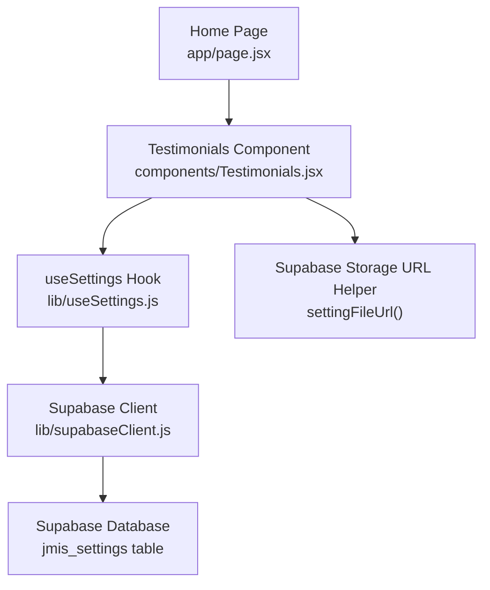
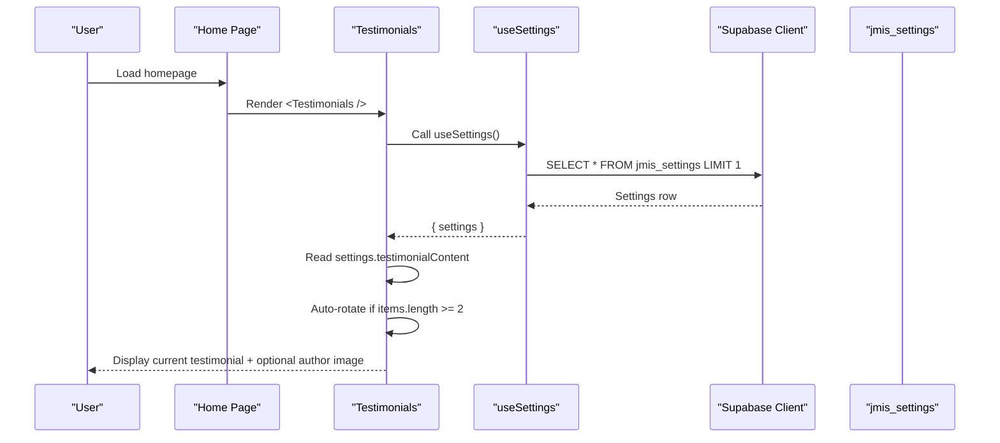
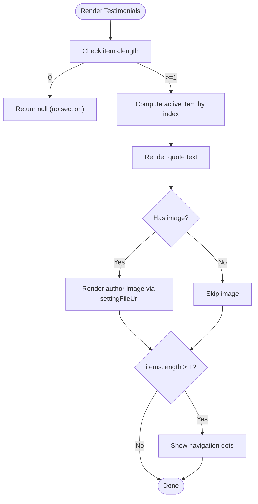
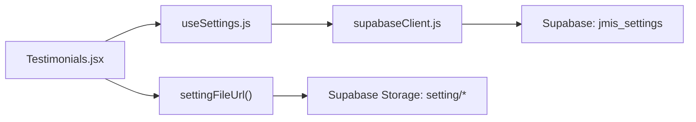
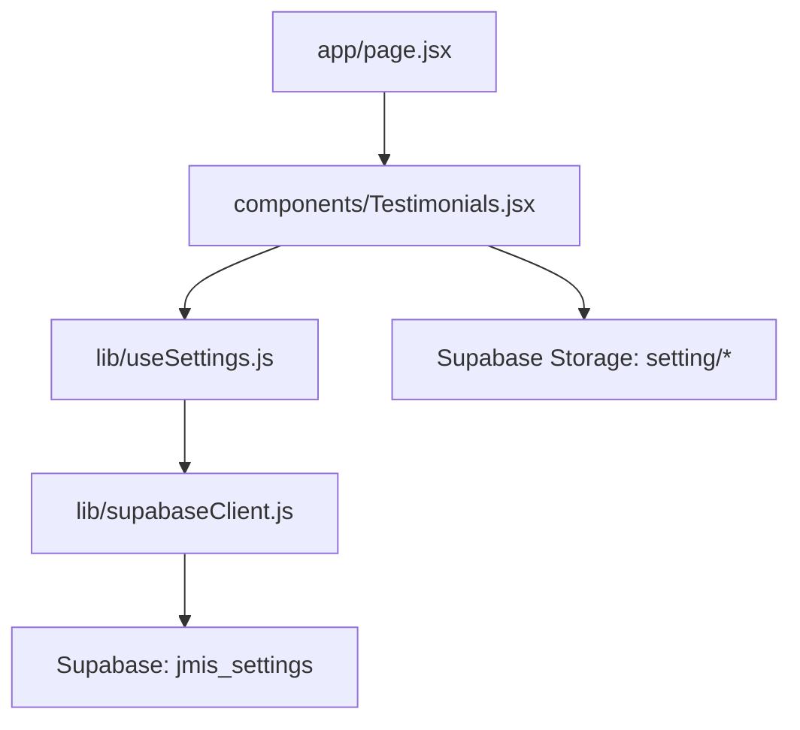

# Testimonials Section

<cite>
**Referenced Files in This Document**
- [Testimonials.jsx](file://components/Testimonials.jsx)
- [useSettings.js](file://lib/useSettings.js)
- [supabaseClient.js](file://lib/supabaseClient.js)
- [page.jsx](file://app/page.jsx)
</cite>

## Table of Contents
1. [Introduction](#introduction)
2. [Project Structure](#project-structure)
3. [Core Components](#core-components)
4. [Architecture Overview](#architecture-overview)
5. [Detailed Component Analysis](#detailed-component-analysis)
6. [Dependency Analysis](#dependency-analysis)
7. [Performance Considerations](#performance-considerations)
8. [Troubleshooting Guide](#troubleshooting-guide)
9. [Conclusion](#conclusion)
10. [Appendices](#appendices)

## Introduction
This document explains the Testimonials section component, how it displays testimonials, and how it integrates with Supabase for content management. It covers data structure, carousel behavior, author image display, accessibility features, and operational guidance for adding or updating testimonials via the admin-managed settings row.

## Project Structure
The Testimonials section is a client-side React component embedded on the public home page. It reads its content from a single settings record stored in Supabase and renders a simple rotating carousel.

**Diagram sources**
- [page.jsx:1-27](file://app/page.jsx#L1-L27)
- [Testimonials.jsx:1-57](file://components/Testimonials.jsx#L1-L57)
- [useSettings.js:1-25](file://lib/useSettings.js#L1-L25)
- [supabaseClient.js:1-13](file://lib/supabaseClient.js#L1-L13)

**Section sources**
- [page.jsx:1-27](file://app/page.jsx#L1-L27)
- [Testimonials.jsx:1-57](file://components/Testimonials.jsx#L1-L57)

## Core Components
- Testimonials component: Renders the testimonial carousel, handles auto-rotation, and displays optional author images.
- useSettings hook: Fetches the single settings row from Supabase that contains all marketing content, including testimonials.
- Supabase client: Provides the database client and a helper to build public storage URLs for images.

Key responsibilities:
- Data fetching: The hook queries the settings table once on mount.
- Rendering: The component maps the testimonialContent array to a single visible testimonial at a time.
- Rotation: A timer advances the active index automatically when there are multiple items.
- Images: Optional author images are resolved through a storage URL helper.

**Section sources**
- [Testimonials.jsx:1-57](file://components/Testimonials.jsx#L1-L57)
- [useSettings.js:1-25](file://lib/useSettings.js#L1-L25)
- [supabaseClient.js:1-13](file://lib/supabaseClient.js#L1-L13)

## Architecture Overview
The data flow is straightforward:
1. The home page includes the Testimonials component.
2. The component uses the useSettings hook to load the settings row from Supabase.
3. The component reads the testimonialContent array from the settings object.
4. If there are multiple items, a timer rotates through them; otherwise, no rotation occurs.
5. Author images (if present) are rendered using a public storage URL helper.

**Diagram sources**
- [page.jsx:1-27](file://app/page.jsx#L1-L27)
- [Testimonials.jsx:1-57](file://components/Testimonials.jsx#L1-L57)
- [useSettings.js:1-25](file://lib/useSettings.js#L1-L25)
- [supabaseClient.js:1-13](file://lib/supabaseClient.js#L1-L13)

## Detailed Component Analysis

### Testimonials Carousel Behavior
- Layout: Centered section with a heading and quote icon.
- Content: Displays one testimonial at a time from the testimonialContent array.
- Rotation: Automatically cycles every fixed interval when there are two or more items.
- Navigation: Dot indicators allow manual selection of each testimonial.
- Author image: If an item has an image field, a circular image is shown below the text.

**Diagram sources**
- [Testimonials.jsx:14-52](file://components/Testimonials.jsx#L14-L52)

**Section sources**
- [Testimonials.jsx:14-52](file://components/Testimonials.jsx#L14-L52)

### Data Structure for Testimonials
- Source: The component reads settings.testimonialContent.
- Expected shape: An array where each element contains:
  - text: string (the testimonial copy)
  - image: string (optional file name stored under the public setting folder)
- Notes:
  - No rating fields are used in this implementation.
  - No category or role fields are used; only text and optional image are rendered.

Operational implications:
- To add or update testimonials, edit the testimonialContent array in the settings row managed by the admin dashboard.
- To include an author photo, upload the image to the same storage bucket referenced by the settings pipeline and reference the file name in the image field.

**Section sources**
- [Testimonials.jsx:8-12](file://components/Testimonials.jsx#L8-L12)
- [Testimonials.jsx:33-39](file://components/Testimonials.jsx#L33-L39)

### Integration with Supabase
- Database access: The useSettings hook fetches a single row from the jmis_settings table.
- Storage access: The component uses a helper to construct public URLs for images stored under the setting folder.
- Environment: The client is initialized with environment variables for URL and anon key.

**Diagram sources**
- [Testimonials.jsx:4-5](file://components/Testimonials.jsx#L4-L5)
- [useSettings.js:3-16](file://lib/useSettings.js#L3-L16)
- [supabaseClient.js:1-13](file://lib/supabaseClient.js#L1-L13)

**Section sources**
- [useSettings.js:1-25](file://lib/useSettings.js#L1-L25)
- [supabaseClient.js:1-13](file://lib/supabaseClient.js#L1-L13)

### Accessibility Considerations
- Semantic structure: Uses a section element and a heading for context.
- Image alt text: Author images include an alt attribute for screen readers.
- Keyboard navigation: Dot indicators are buttons with descriptive aria-labels for each testimonial position.
- Focus management: Standard button focus behavior applies; ensure custom styles do not remove outlines.

Recommendations for future enhancements:
- Add aria-live region to announce changes when the carousel auto-rotates.
- Provide pause/resume controls for users who prefer manual control.
- Ensure sufficient color contrast for dot indicators and text.

**Section sources**
- [Testimonials.jsx:23-52](file://components/Testimonials.jsx#L23-L52)

### Moderation Workflow and Authenticity Verification
Current implementation:
- There is no built-in moderation or verification logic in the frontend code.
- Content is sourced directly from the settings row maintained by the admin dashboard.

Recommended workflow aligned with existing architecture:
- Admin-only editing: Restrict edits to the jmis_settings row to trusted administrators via your admin dashboard and Supabase Row Level Security policies.
- Approval step: Introduce a draft/published state in the settings payload so only approved testimonials render publicly.
- Verification: Attach a verified flag or source metadata in the settings payload and surface it in the UI when appropriate.
- Audit trail: Log changes to the settings row in your admin system for accountability.

Note: These steps extend beyond the current codebase and should be implemented in the admin dashboard and/or Supabase policies.

[No sources needed since this section provides conceptual guidance]

### Customizing Visual Presentation
- Styling: The component uses utility classes for layout, typography, and colors. Modify these classes to adjust spacing, fonts, and colors.
- Rotation speed: Adjust the interval value in the effect that advances the index.
- Indicators: Customize dot size, spacing, and active state styling.
- Images: Control image size and border style via class names on the img element.

Example customization paths:
- Change rotation interval: Update the timer interval in the effect that sets the active index.
- Adjust image appearance: Modify the image container’s width/height and border classes.
- Enhance accessibility: Add aria attributes or live regions to improve screen reader experience.

**Section sources**
- [Testimonials.jsx:14-18](file://components/Testimonials.jsx#L14-L18)
- [Testimonials.jsx:33-39](file://components/Testimonials.jsx#L33-L39)
- [Testimonials.jsx:40-52](file://components/Testimonials.jsx#L40-L52)

## Dependency Analysis
- The Testimonials component depends on:
  - useSettings hook for data retrieval
  - Supabase client for database and storage URL construction
  - React hooks for state and side effects
- The home page composes the Testimonials component among other sections.

**Diagram sources**
- [page.jsx:1-27](file://app/page.jsx#L1-L27)
- [Testimonials.jsx:1-57](file://components/Testimonials.jsx#L1-L57)
- [useSettings.js:1-25](file://lib/useSettings.js#L1-L25)
- [supabaseClient.js:1-13](file://lib/supabaseClient.js#L1-L13)

**Section sources**
- [page.jsx:1-27](file://app/page.jsx#L1-L27)
- [Testimonials.jsx:1-57](file://components/Testimonials.jsx#L1-L57)
- [useSettings.js:1-25](file://lib/useSettings.js#L1-L25)
- [supabaseClient.js:1-13](file://lib/supabaseClient.js#L1-L13)

## Performance Considerations
- Single network request: The hook fetches one settings row once on mount, minimizing overhead.
- Conditional rendering: The component returns null when there are no testimonials, avoiding unnecessary DOM work.
- Timer cleanup: The interval is cleared on unmount to prevent memory leaks.
- Image loading: Use appropriately sized images to reduce bandwidth and improve perceived performance.

Optimization opportunities:
- Debounce or throttle updates if settings change frequently.
- Preload images if many testimonials include photos.
- Consider caching strategies at the edge or CDN level for static assets.

[No sources needed since this section provides general guidance]

## Troubleshooting Guide
Common issues and resolutions:
- No testimonials displayed:
  - Verify that the settings row exists and contains a non-empty testimonialContent array.
  - Confirm the home page includes the Testimonials component.
- Images not showing:
  - Ensure the image file name matches what is stored in the settings payload.
  - Confirm the storage bucket path and public access are configured correctly.
- Carousel not rotating:
  - Rotation only activates when there are two or more items.
  - Check that the interval is not being interrupted by errors.
- Accessibility concerns:
  - Ensure dot buttons have descriptive labels and remain keyboard-focusable.
  - Consider adding aria-live announcements for automatic transitions.

**Section sources**
- [Testimonials.jsx:14-18](file://components/Testimonials.jsx#L14-L18)
- [Testimonials.jsx:20-21](file://components/Testimonials.jsx#L20-L21)
- [Testimonials.jsx:33-39](file://components/Testimonials.jsx#L33-L39)
- [useSettings.js:12-20](file://lib/useSettings.js#L12-L20)

## Conclusion
The Testimonials section is a lightweight, client-side carousel driven by a single settings record in Supabase. It supports text-only or text-plus-author-image entries, auto-rotation, and accessible navigation dots. While the current implementation does not include moderation or ratings, the architecture makes it straightforward to extend with approval workflows, additional fields, and enhanced accessibility features.

[No sources needed since this section summarizes without analyzing specific files]

## Appendices

### How to Add or Update Testimonials
- Edit the settings row in your admin dashboard to update the testimonialContent array.
- For each entry, provide:
  - text: the testimonial message
  - image: optional file name for an author photo stored under the setting folder
- Save changes; the public site will reflect updates after the next settings fetch.

**Section sources**
- [useSettings.js:12-20](file://lib/useSettings.js#L12-L20)
- [Testimonials.jsx:8-12](file://components/Testimonials.jsx#L8-L12)

### Managing Categories and Ratings
- Current state: The component does not support categories or ratings.
- Extension approach:
  - Add new fields to the settings payload (for example, category and rating).
  - Update the component to filter by category and render star ratings based on numeric values.
  - Extend the admin dashboard to manage these fields and enforce validation.

[No sources needed since this section provides conceptual guidance]

### Authenticity and Moderation Checklist
- Restrict editing rights to trusted administrators.
- Implement draft/published states before publishing to the public site.
- Add verification metadata (e.g., verified flag) and display it when appropriate.
- Maintain audit logs for changes to the settings row.

[No sources needed since this section provides conceptual guidance]