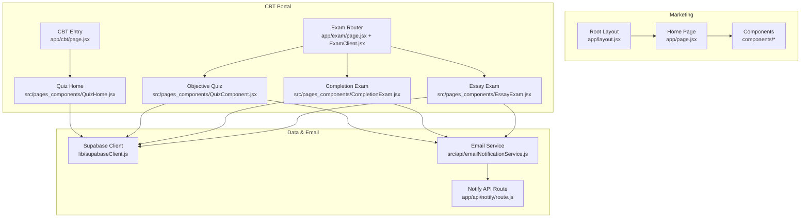
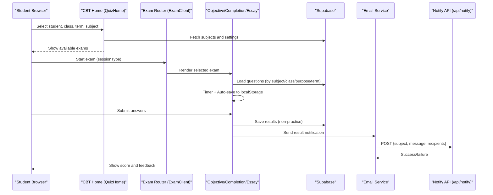
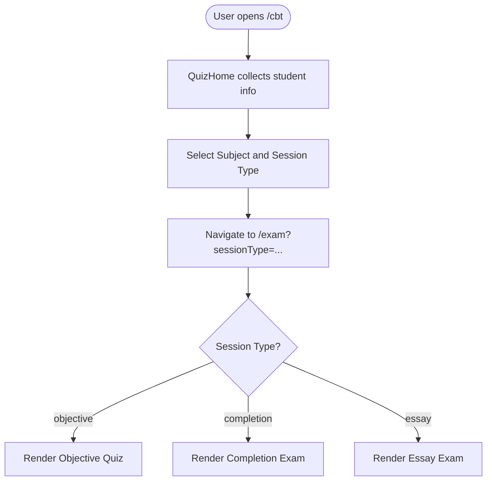
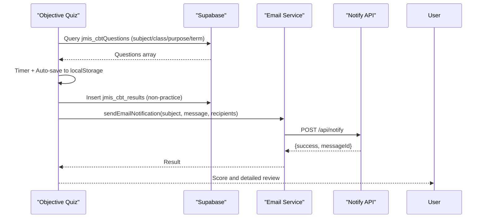
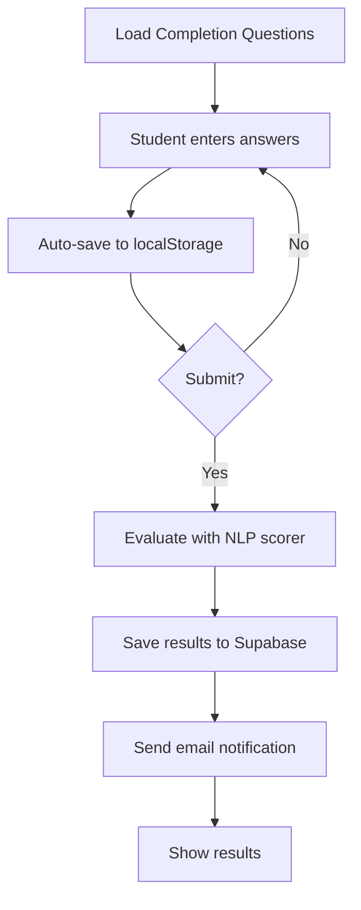
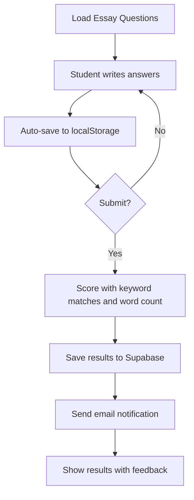
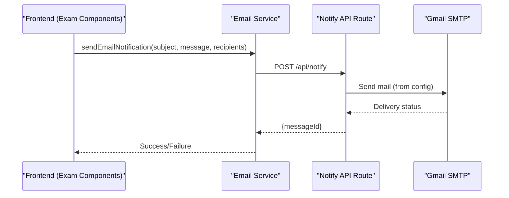
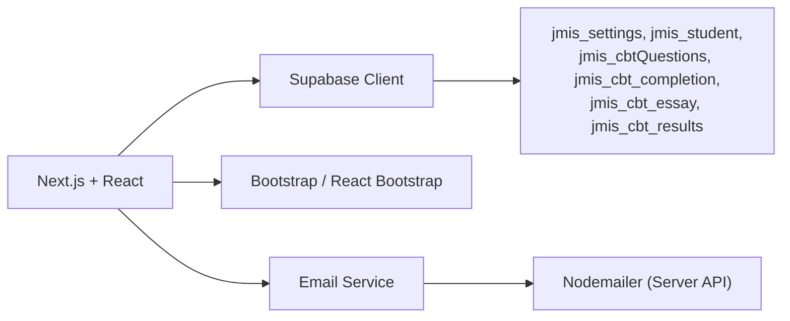

# Project Overview

<cite>
**Referenced Files in This Document**
- [README.md](file://README.md)
- [package.json](file://package.json)
- [next.config.mjs](file://next.config.mjs)
- [app/layout.jsx](file://app/layout.jsx)
- [app/page.jsx](file://app/page.jsx)
- [app/cbt/page.jsx](file://app/cbt/page.jsx)
- [app/exam/page.jsx](file://app/exam/page.jsx)
- [app/exam/ExamClient.jsx](file://app/exam/ExamClient.jsx)
- [src/pages_components/QuizHome.jsx](file://src/pages_components/QuizHome.jsx)
- [src/pages_components/QuizComponent.jsx](file://src/pages_components/QuizComponent.jsx)
- [src/pages_components/CompletionExam.jsx](file://src/pages_components/CompletionExam.jsx)
- [src/pages_components/EssayExam.jsx](file://src/pages_components/EssayExam.jsx)
- [src/api/emailNotificationService.js](file://src/api/emailNotificationService.js)
- [app/api/notify/route.js](file://app/api/notify/route.js)
- [lib/supabaseClient.js](file://lib/supabaseClient.js)
</cite>

## Table of Contents
1. Introduction
2. Project Structure
3. Core Components
4. Architecture Overview
5. Detailed Component Analysis
6. Dependency Analysis
7. Performance Considerations
8. Troubleshooting Guide
9. Conclusion

## Introduction
This project is a dual-purpose website for Jeshurun Montessori International School (JMIS). It combines:
- A marketing website that showcases programs, facilities, admissions, and news to parents, students, and school administrators.
- A computer-based testing (CBT) system that supports three exam types: objective (multiple choice), completion (fill-in-the-blank), and essay (free text).

The site uses Next.js and React on the frontend, Supabase for data and storage, Bootstrap for UI, and an email notification system powered by Nodemailer via a server-side API route. The CBT system includes auto-save, network monitoring, timed sessions, result scoring, and email notifications to school staff.

Target audiences:
- Parents and prospective families: explore programs, facilities, gallery, testimonials, and contact information.
- Students: take practice or graded exams through the CBT portal.
- Administrators: manage content via shared Supabase settings and review results stored in Supabase tables.

**Section sources**
- [README.md:1-3](file://README.md#L1-L3)
- [package.json:11-22](file://package.json#L11-L22)
- [app/layout.jsx:6-11](file://app/layout.jsx#L6-L11)

## Project Structure
The application follows a Next.js App Router layout with feature-oriented directories:
- app/: Routes for marketing pages and CBT entry points.
- components/: Reusable marketing sections (Hero, Programs, About, Facilities, Gallery, Testimonials, News, FAQ).
- src/pages_components/: CBT components for quiz home and each exam type.
- src/api/: Email notification service used by CBT flows.
- lib/: Shared Supabase client and helpers.
- public/: Static assets like logos.

**Diagram sources**
- [app/layout.jsx:13-23](file://app/layout.jsx#L13-L23)
- [app/page.jsx:13-26](file://app/page.jsx#L13-L26)
- [app/cbt/page.jsx:1-11](file://app/cbt/page.jsx#L1-L11)
- [app/exam/page.jsx:1-12](file://app/exam/page.jsx#L1-L12)
- [app/exam/ExamClient.jsx:1-46](file://app/exam/ExamClient.jsx#L1-L46)
- [src/pages_components/QuizHome.jsx:1-508](file://src/pages_components/QuizHome.jsx#L1-L508)
- [src/pages_components/QuizComponent.jsx:1-800](file://src/pages_components/QuizComponent.jsx#L1-L800)
- [src/pages_components/CompletionExam.jsx:1-472](file://src/pages_components/CompletionExam.jsx#L1-L472)
- [src/pages_components/EssayExam.jsx:1-418](file://src/pages_components/EssayExam.jsx#L1-L418)
- [lib/supabaseClient.js:1-13](file://lib/supabaseClient.js#L1-L13)
- [src/api/emailNotificationService.js:1-127](file://src/api/emailNotificationService.js#L1-L127)
- [app/api/notify/route.js:1-115](file://app/api/notify/route.js#L1-L115)

**Section sources**
- [app/layout.jsx:1-24](file://app/layout.jsx#L1-L24)
- [app/page.jsx:1-27](file://app/page.jsx#L1-L27)
- [app/cbt/page.jsx:1-11](file://app/cbt/page.jsx#L1-L11)
- [app/exam/page.jsx:1-12](file://app/exam/page.jsx#L1-L12)
- [app/exam/ExamClient.jsx:1-46](file://app/exam/ExamClient.jsx#L1-L46)

## Core Components
- Marketing pages: Root layout provides global metadata, navbar, and footer. The home page composes marketing sections that pull dynamic content from Supabase settings.
- CBT entry: The /cbt route renders the student-facing QuizHome where users select their profile, term, class, and subject, then start an exam.
- Exam router: The /exam route dynamically loads the appropriate exam component based on sessionType (objective, completion, essay).
- Objective quiz: Multiple-choice questions with timer, auto-save, network monitoring, detailed results, and email notifications.
- Completion exam: Fill-in-the-blank questions evaluated using NLP-based scoring; results saved and emailed.
- Essay exam: Free-text essays scored with keyword matching and word count thresholds; results saved and emailed.
- Email system: A client-side service calls a server-only API route to send emails via Gmail SMTP without exposing credentials to the browser.

Key features:
- Dynamic content management via Supabase tables (e.g., jmis_settings, jmis_student, jmis_cbtQuestions, jmis_cbt_completion, jmis_cbt_essay, jmis_cbt_results).
- Three exam types with tailored UIs and evaluation logic.
- Auto-save to localStorage with restore on reload.
- Timed sessions with automatic submission when time expires.
- Network quality checks and offline resilience hints.
- Email notifications to school staff after non-practice submissions.

**Section sources**
- [app/layout.jsx:6-23](file://app/layout.jsx#L6-L23)
- [app/page.jsx:11-26](file://app/page.jsx#L11-L26)
- [src/pages_components/QuizHome.jsx:151-176](file://src/pages_components/QuizHome.jsx#L151-L176)
- [app/exam/ExamClient.jsx:22-45](file://app/exam/ExamClient.jsx#L22-L45)
- [src/pages_components/QuizComponent.jsx:59-143](file://src/pages_components/QuizComponent.jsx#L59-L143)
- [src/pages_components/CompletionExam.jsx:149-204](file://src/pages_components/CompletionExam.jsx#L149-L204)
- [src/pages_components/EssayExam.jsx:134-190](file://src/pages_components/EssayExam.jsx#L134-L190)
- [src/api/emailNotificationService.js:70-121](file://src/api/emailNotificationService.js#L70-L121)
- [app/api/notify/route.js:48-114](file://app/api/notify/route.js#L48-L114)

## Architecture Overview
The system separates marketing and assessment into distinct routes while sharing Supabase as the single source of truth for content and results.

**Diagram sources**
- [src/pages_components/QuizHome.jsx:151-176](file://src/pages_components/QuizHome.jsx#L151-L176)
- [app/exam/ExamClient.jsx:22-45](file://app/exam/ExamClient.jsx#L22-L45)
- [src/pages_components/QuizComponent.jsx:59-143](file://src/pages_components/QuizComponent.jsx#L59-L143)
- [src/pages_components/CompletionExam.jsx:149-204](file://src/pages_components/CompletionExam.jsx#L149-L204)
- [src/pages_components/EssayExam.jsx:134-190](file://src/pages_components/EssayExam.jsx#L134-L190)
- [src/api/emailNotificationService.js:70-121](file://src/api/emailNotificationService.js#L70-L121)
- [app/api/notify/route.js:48-114](file://app/api/notify/route.js#L48-L114)

## Detailed Component Analysis

### Marketing Website
- Root layout sets SEO metadata and wraps pages with Navbar and Footer.
- Home page composes marketing sections that read dynamic content from Supabase settings.

Practical example:
- Update hero, programs, about, facilities, gallery, testimonials, news, and FAQ content via the admin-managed settings row in Supabase; changes reflect immediately on the marketing pages.

**Section sources**
- [app/layout.jsx:6-23](file://app/layout.jsx#L6-L23)
- [app/page.jsx:11-26](file://app/page.jsx#L11-L26)

### CBT Entry and Routing
- /cbt renders the student-facing QuizHome.
- /exam dynamically selects the correct exam component based on URL parameters.

**Diagram sources**
- [app/cbt/page.jsx:1-11](file://app/cbt/page.jsx#L1-L11)
- [src/pages_components/QuizHome.jsx:151-176](file://src/pages_components/QuizHome.jsx#L151-L176)
- [app/exam/page.jsx:1-12](file://app/exam/page.jsx#L1-L12)
- [app/exam/ExamClient.jsx:22-45](file://app/exam/ExamClient.jsx#L22-L45)

**Section sources**
- [app/cbt/page.jsx:1-11](file://app/cbt/page.jsx#L1-L11)
- [app/exam/page.jsx:1-12](file://app/exam/page.jsx#L1-L12)
- [app/exam/ExamClient.jsx:1-46](file://app/exam/ExamClient.jsx#L1-L46)

### Objective Exam (Multiple Choice)
- Loads questions from jmis_cbtQuestions filtered by subject, class, purpose, and term.
- Timer enforces duration; auto-saves progress to localStorage; monitors network quality.
- On submit, saves results to jmis_cbt_results and sends email notifications for non-practice purposes.

**Diagram sources**
- [src/pages_components/QuizComponent.jsx:59-143](file://src/pages_components/QuizComponent.jsx#L59-L143)
- [src/pages_components/QuizComponent.jsx:353-366](file://src/pages_components/QuizComponent.jsx#L353-L366)
- [src/api/emailNotificationService.js:70-121](file://src/api/emailNotificationService.js#L70-L121)
- [app/api/notify/route.js:48-114](file://app/api/notify/route.js#L48-L114)

**Section sources**
- [src/pages_components/QuizComponent.jsx:59-143](file://src/pages_components/QuizComponent.jsx#L59-L143)
- [src/pages_components/QuizComponent.jsx:353-366](file://src/pages_components/QuizComponent.jsx#L353-L366)

### Completion Exam (Fill-in-the-Blank)
- Loads questions from jmis_cbt_completion.
- Evaluates answers using NLP-based scoring utilities.
- Saves results and sends email notifications for non-practice purposes.

**Diagram sources**
- [src/pages_components/CompletionExam.jsx:45-72](file://src/pages_components/CompletionExam.jsx#L45-L72)
- [src/pages_components/CompletionExam.jsx:149-204](file://src/pages_components/CompletionExam.jsx#L149-L204)
- [src/pages_components/CompletionExam.jsx:257-309](file://src/pages_components/CompletionExam.jsx#L257-L309)

**Section sources**
- [src/pages_components/CompletionExam.jsx:45-72](file://src/pages_components/CompletionExam.jsx#L45-L72)
- [src/pages_components/CompletionExam.jsx:149-204](file://src/pages_components/CompletionExam.jsx#L149-L204)
- [src/pages_components/CompletionExam.jsx:257-309](file://src/pages_components/CompletionExam.jsx#L257-L309)

### Essay Exam (Free Text)
- Loads questions from jmis_cbt_essay.
- Scores essays using keyword matching and minimum word count thresholds.
- Saves results and sends email notifications for non-practice purposes.

**Diagram sources**
- [src/pages_components/EssayExam.jsx:43-65](file://src/pages_components/EssayExam.jsx#L43-L65)
- [src/pages_components/EssayExam.jsx:134-190](file://src/pages_components/EssayExam.jsx#L134-L190)
- [src/pages_components/EssayExam.jsx:231-282](file://src/pages_components/EssayExam.jsx#L231-L282)

**Section sources**
- [src/pages_components/EssayExam.jsx:43-65](file://src/pages_components/EssayExam.jsx#L43-L65)
- [src/pages_components/EssayExam.jsx:134-190](file://src/pages_components/EssayExam.jsx#L134-L190)
- [src/pages_components/EssayExam.jsx:231-282](file://src/pages_components/EssayExam.jsx#L231-L282)

### Email Notification System
- Client-side service composes subject and message, then calls a server-only API route to send emails via Gmail SMTP.
- Recipients are resolved from Supabase settings and can include additional configured emails.

**Diagram sources**
- [src/api/emailNotificationService.js:70-121](file://src/api/emailNotificationService.js#L70-L121)
- [app/api/notify/route.js:48-114](file://app/api/notify/route.js#L48-L114)

**Section sources**
- [src/api/emailNotificationService.js:1-127](file://src/api/emailNotificationService.js#L1-L127)
- [app/api/notify/route.js:1-115](file://app/api/notify/route.js#L1-L115)

## Dependency Analysis
Technology stack and roles:
- Next.js and React: Application framework and UI library.
- Supabase: Database, authentication (for admin), and storage for images and settings.
- Bootstrap and React Bootstrap: UI styling and components.
- Nodemailer: Server-side email delivery via Gmail SMTP.
- compromise: Used within NLP scoring utilities for text analysis.

Environment configuration:
- Supabase URL and anon key exposed to the client.
- Admin URLs and student portal URLs configured for navigation.
- Image remote patterns allow loading from Supabase storage domains.

**Diagram sources**
- [package.json:11-22](file://package.json#L11-L22)
- [next.config.mjs:4-15](file://next.config.mjs#L4-L15)
- [lib/supabaseClient.js:1-13](file://lib/supabaseClient.js#L1-L13)
- [app/api/notify/route.js:15-25](file://app/api/notify/route.js#L15-L25)

**Section sources**
- [package.json:11-22](file://package.json#L11-L22)
- [next.config.mjs:4-15](file://next.config.mjs#L4-L15)
- [lib/supabaseClient.js:1-13](file://lib/supabaseClient.js#L1-L13)

## Performance Considerations
- Use dynamic imports for exam components to reduce initial bundle size and avoid SSR issues.
- Leverage Supabase queries with filters (subject, class, purpose, term) to minimize payload sizes.
- Implement auto-save to localStorage to prevent data loss during network interruptions.
- Monitor network quality and provide user feedback for poor connectivity.
- Avoid unnecessary re-renders by memoizing expensive computations and limiting state updates.
- Cache static assets and use efficient image handling via Next.js image optimization where applicable.

[No sources needed since this section provides general guidance]

## Troubleshooting Guide
Common issues and resolutions:
- No questions found: Verify subject, class, purpose, and term filters match database entries; check console logs for query parameters and available records.
- Email not sent: Ensure Gmail credentials are set in environment variables and that recipients are configured in Supabase settings; inspect server logs for SMTP errors.
- Results not saving: Confirm Supabase permissions and table schema; check for network errors and retry logic.
- Auto-save not restoring: Check localStorage keys and ensure exam ID generation is consistent across sessions.

**Section sources**
- [src/pages_components/QuizComponent.jsx:59-143](file://src/pages_components/QuizComponent.jsx#L59-L143)
- [src/pages_components/CompletionExam.jsx:149-204](file://src/pages_components/CompletionExam.jsx#L149-L204)
- [src/pages_components/EssayExam.jsx:134-190](file://src/pages_components/EssayExam.jsx#L134-L190)
- [app/api/notify/route.js:48-114](file://app/api/notify/route.js#L48-L114)

## Conclusion
The JMIS School Website integrates a marketing presence with a robust CBT system. It delivers dynamic content management, three exam types with tailored evaluation, and reliable email notifications. Built on Next.js, React, Supabase, and Bootstrap, it balances accessibility for beginners with powerful capabilities for experienced developers. The architecture emphasizes clear separation of concerns, resilient data flows, and scalable extensibility for future enhancements.

[No sources needed since this section summarizes without analyzing specific files]