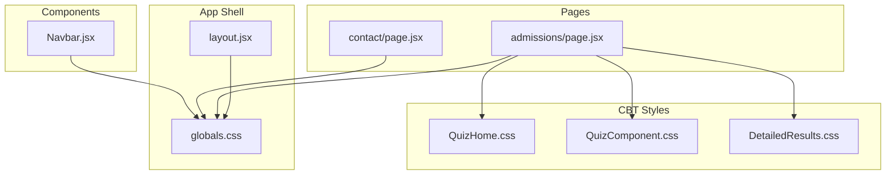
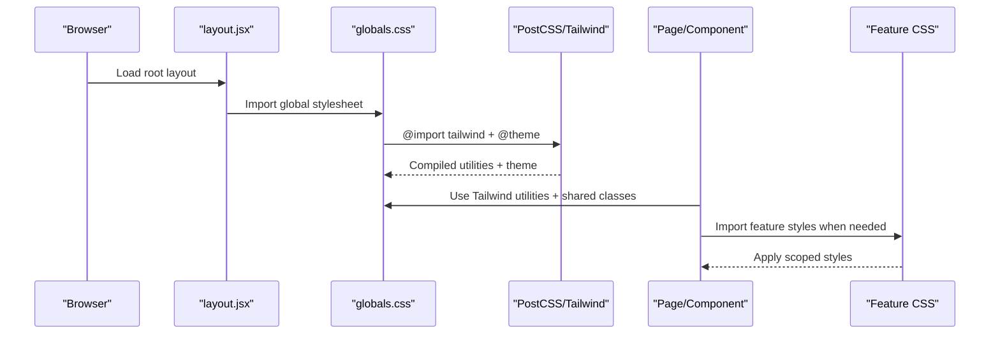
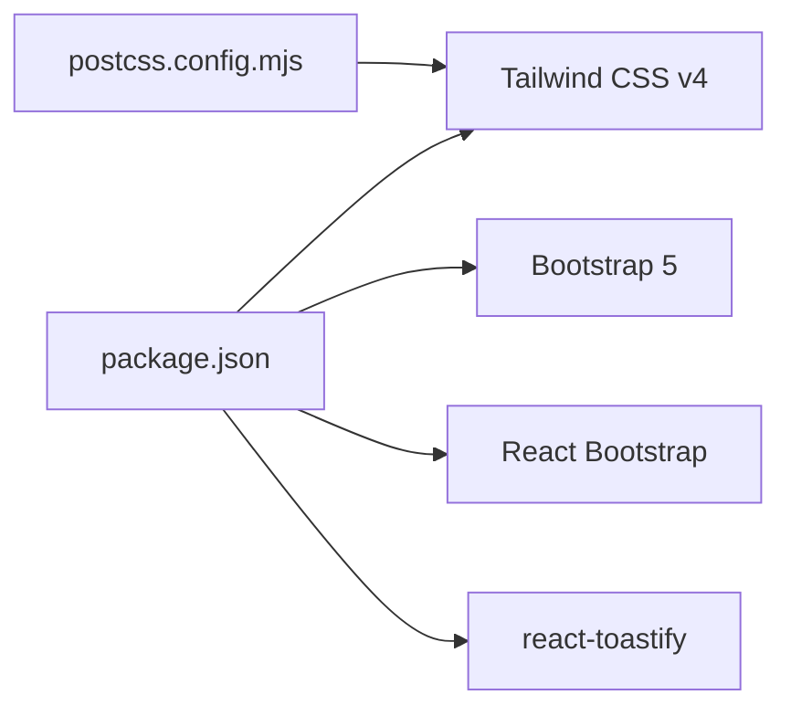

# Styling and Theming

<cite>
**Referenced Files in This Document**
- [globals.css](file://app/globals.css)
- [layout.jsx](file://app/layout.jsx)
- [Navbar.jsx](file://components/Navbar.jsx)
- [admissions/page.jsx](file://app/admissions/page.jsx)
- [contact/page.jsx](file://app/contact/page.jsx)
- [QuizComponent.css](file://src/styles/QuizComponent.css)
- [QuizHome.css](file://src/styles/QuizHome.css)
- [DetailedResults.css](file://src/styles/DetailedResults.css)
- [postcss.config.mjs](file://postcss.config.mjs)
- [package.json](file://package.json)
</cite>

## Table of Contents
1. [Introduction](#introduction)
2. [Project Structure](#project-structure)
3. [Core Components](#core-components)
4. [Architecture Overview](#architecture-overview)
5. [Detailed Component Analysis](#detailed-component-analysis)
6. [Dependency Analysis](#dependency-analysis)
7. [Performance Considerations](#performance-considerations)
8. [Troubleshooting Guide](#troubleshooting-guide)
9. [Conclusion](#conclusion)
10. [Appendices](#appendices)

## Introduction
This document explains the styling architecture that combines Tailwind CSS with Bootstrap, focusing on how styles are organized, where custom overrides live, and how responsive design and theming are implemented. It also documents color schemes, component styling conventions, and provides practical guidance for adding new styles, customizing existing components, and maintaining consistency across the application.

The project uses:
- Tailwind CSS v4 via PostCSS for utility-first styling and a centralized theme definition.
- Bootstrap 5 and React Bootstrap as dependencies, with additional scoped CSS files for CBT-related features.
- A global stylesheet that defines brand tokens, typography, shared utilities, and cross-cutting overrides.

## Project Structure
Styles are primarily defined in two places:
- Global styles and Tailwind theme configuration live in the app-level stylesheet.
- Feature-specific styles (CBT quiz UI, results modal, dark mode overrides) live under src/styles.

**Diagram sources**
- [layout.jsx:1-24](file://app/layout.jsx#L1-L24)
- [globals.css:1-43](file://app/globals.css#L1-L43)
- [Navbar.jsx:1-165](file://components/Navbar.jsx#L1-L165)
- [admissions/page.jsx:60-170](file://app/admissions/page.jsx#L60-L170)
- [contact/page.jsx:50-70](file://app/contact/page.jsx#L50-L70)
- [QuizHome.css:1-193](file://src/styles/QuizHome.css#L1-L193)
- [QuizComponent.css:1-218](file://src/styles/QuizComponent.css#L1-L218)
- [DetailedResults.css:1-185](file://src/styles/DetailedResults.css#L1-L185)

**Section sources**
- [layout.jsx:1-24](file://app/layout.jsx#L1-L24)
- [globals.css:1-43](file://app/globals.css#L1-L43)

## Core Components
- Global stylesheet: Defines Tailwind import, theme tokens, base typography, shared section utilities, and cross-cutting overrides.
- Navbar: Fully styled with Tailwind utilities; uses brand tokens and gradient classes.
- Pages: Use Tailwind utilities and shared section utilities to maintain consistent spacing, typography, and layout.
- CBT feature styles: Scoped CSS files for quiz UI, home screen, and detailed results modal, including print and dark-mode support.

Key responsibilities:
- Centralize brand tokens and shared utilities in globals.css.
- Keep page-level composition in JSX using Tailwind utilities.
- Isolate complex or legacy styles in feature-scoped CSS files.

**Section sources**
- [globals.css:1-43](file://app/globals.css#L1-L43)
- [Navbar.jsx:49-162](file://components/Navbar.jsx#L49-L162)
- [admissions/page.jsx:67-168](file://app/admissions/page.jsx#L67-L168)
- [contact/page.jsx:53-61](file://app/contact/page.jsx#L53-L61)

## Architecture Overview
The styling pipeline is:
1. Next.js loads the root layout, which imports the global stylesheet.
2. PostCSS processes Tailwind via @tailwindcss/postcss.
3. Tailwind compiles utilities and applies the theme defined in globals.css.
4. Bootstrap and React Bootstrap are available as dependencies; their styles can be imported where needed.
5. Feature-specific CSS files provide additional styling for CBT features.

**Diagram sources**
- [layout.jsx:1-4](file://app/layout.jsx#L1-L4)
- [globals.css:1-10](file://app/globals.css#L1-L10)
- [postcss.config.mjs:1-8](file://postcss.config.mjs#L1-L8)

## Detailed Component Analysis

### Global Styles and Theme Tokens
- Tailwind is imported and extended through a theme block defining brand colors and display font.
- Shared utilities include a brand gradient and reusable section heading classes.
- Cross-cutting overrides address interactions between Bootstrap’s global link styles and the site header.

Practical implications:
- Use brand tokens instead of hard-coded colors to ensure consistency.
- Prefer shared section utilities for headings and subtitles to keep rhythm consistent.
- Avoid !important unless necessary; specificity-based overrides are preferred.

**Section sources**
- [globals.css:1-43](file://app/globals.css#L1-L43)

### Navbar Styling
- The navbar is built entirely with Tailwind utilities: sticky positioning, backdrop blur, spacing, typography, and interactive states.
- Brand tokens and gradients are used for emphasis and CTAs.
- Responsive behavior is handled with Tailwind breakpoints and conditional rendering for mobile menus.

Best practices demonstrated:
- Utility-first composition keeps markup concise and predictable.
- Consistent use of brand tokens ensures visual coherence.
- Accessibility attributes (aria-expanded, aria-haspopup) are present for dropdowns.

**Section sources**
- [Navbar.jsx:49-162](file://components/Navbar.jsx#L49-L162)

### Page-Level Styling (Admissions and Contact)
- Pages compose layouts using Tailwind grids, spacing, and typography utilities.
- Shared section utilities from globals.css are reused to maintain consistent heading rhythm.
- Brand tokens and gradients are applied to icons and CTAs.

Consistency patterns:
- Reuse .section-title and .section-sub for uniform headings and descriptions.
- Use grid and gap utilities for responsive card layouts.
- Apply brand-gradient consistently for primary actions.

**Section sources**
- [admissions/page.jsx:67-168](file://app/admissions/page.jsx#L67-L168)
- [contact/page.jsx:53-61](file://app/contact/page.jsx#L53-L61)

### CBT Feature Styles
- QuizHome.css and QuizComponent.css define layout, cards, inputs, modals, and hover effects specific to the CBT experience.
- DetailedResults.css adds animations, tab styling, print rules, and responsive adjustments for result views.
- Dark mode is supported by targeting html[data-theme="dark"] selectors in QuizHome.css.

Design notes:
- Scoped class names avoid collisions with global styles.
- Print media queries ensure readable output for reports.
- Dark mode relies on an explicit data attribute on the root element.

**Section sources**
- [QuizHome.css:1-193](file://src/styles/QuizHome.css#L1-L193)
- [QuizComponent.css:1-218](file://src/styles/QuizComponent.css#L1-L218)
- [DetailedResults.css:1-185](file://src/styles/DetailedResults.css#L1-L185)

### Responsive Design Patterns
- Tailwind breakpoint prefixes (e.g., md:) are used throughout pages and components for responsive layouts.
- Feature CSS includes targeted media queries for smaller screens and print output.
- Grid and flex utilities simplify responsive arrangements without heavy custom CSS.

Guidelines:
- Prefer Tailwind utilities for common responsive changes.
- Add media queries only when component-specific behavior cannot be expressed with utilities.
- Test print output separately due to distinct rules in DetailedResults.css.

**Section sources**
- [Navbar.jsx:49-162](file://components/Navbar.jsx#L49-L162)
- [admissions/page.jsx:67-168](file://app/admissions/page.jsx#L67-L168)
- [DetailedResults.css:69-134](file://src/styles/DetailedResults.css#L69-L134)

### Theming Approach and Color Schemes
- Brand palette is centralized in the Tailwind theme block: brand, brand-light, brand-soft, gold, and a display font.
- A reusable brand-gradient utility encapsulates the green gradient used across the platform.
- Dark mode is implemented via a data-theme attribute on the root element, with overrides in feature CSS.

Recommendations:
- Extend the theme block for new semantic colors rather than introducing ad-hoc values.
- Use brand tokens and gradients consistently in components and pages.
- For dark mode, prefer attribute selectors and scoped overrides to minimize conflicts.

**Section sources**
- [globals.css:3-10](file://app/globals.css#L3-L10)
- [globals.css:22-32](file://app/globals.css#L22-L32)
- [QuizHome.css:99-193](file://src/styles/QuizHome.css#L99-L193)

### Component Styling Conventions
- Prefer Tailwind utilities for layout, spacing, typography, and state styling.
- Reserve custom CSS for complex interactions, animations, print rules, and feature-specific themes.
- Use shared utilities (.section-title, .section-sub) to maintain visual rhythm.
- Avoid !important; rely on specificity and scoping.

Examples in codebase:
- Navbar uses utilities exclusively.
- Admissions and Contact pages combine utilities with shared section classes.
- CBT features use scoped CSS for advanced behaviors.

**Section sources**
- [Navbar.jsx:49-162](file://components/Navbar.jsx#L49-L162)
- [admissions/page.jsx:67-168](file://app/admissions/page.jsx#L67-L168)
- [contact/page.jsx:53-61](file://app/contact/page.jsx#L53-L61)
- [QuizHome.css:1-98](file://src/styles/QuizHome.css#L1-L98)

## Dependency Analysis
- Tailwind CSS v4 is processed by PostCSS via @tailwindcss/postcss.
- Bootstrap 5 and React Bootstrap are installed but not globally imported in the root layout; they remain available for selective usage.
- react-toastify CSS is explicitly imported in the root layout.

**Diagram sources**
- [package.json:11-26](file://package.json#L11-L26)
- [postcss.config.mjs:1-8](file://postcss.config.mjs#L1-L8)
- [layout.jsx:1-4](file://app/layout.jsx#L1-L4)

**Section sources**
- [package.json:11-26](file://package.json#L11-L26)
- [postcss.config.mjs:1-8](file://postcss.config.mjs#L1-L8)
- [layout.jsx:1-4](file://app/layout.jsx#L1-L4)

## Performance Considerations
- Tailwind v4 generates optimized utilities; keep global styles minimal to reduce CSS size.
- Avoid excessive !important usage; it can cause reflows and maintenance overhead.
- Limit feature CSS scope to necessary components to prevent unused styles.
- Prefer utility composition over deep custom CSS trees for better tree-shaking and readability.

[No sources needed since this section provides general guidance]

## Troubleshooting Guide
Common issues and resolutions:
- Links underlined unexpectedly after client-side navigation:
  - Cause: Bootstrap’s global anchor style.
  - Resolution: Header anchors are overridden with higher specificity in globals.css.
- Dark mode text invisible in forms:
  - Cause: Default input colors conflict with dark backgrounds.
  - Resolution: QuizHome.css includes dark-mode overrides for form controls and placeholders.
- Print output missing content or colors:
  - Cause: Print styles hide interactive elements and reset colors.
  - Resolution: DetailedResults.css contains print-specific rules; verify print preview.

Actionable checks:
- Verify globals.css is imported at the root layout.
- Ensure feature CSS files are imported where their components render.
- Confirm Tailwind processing is active via postcss.config.mjs.

**Section sources**
- [globals.css:34-42](file://app/globals.css#L34-L42)
- [QuizHome.css:99-193](file://src/styles/QuizHome.css#L99-L193)
- [DetailedResults.css:69-134](file://src/styles/DetailedResults.css#L69-L134)
- [layout.jsx:1-4](file://app/layout.jsx#L1-L4)
- [postcss.config.mjs:1-8](file://postcss.config.mjs#L1-L8)

## Conclusion
The styling architecture centers on Tailwind utilities and a centralized theme, with Bootstrap available for selective use. Global styles define brand tokens and shared utilities, while feature-specific CSS handles complex interactions, print output, and dark mode. Following the conventions outlined here—utility-first composition, scoped overrides, and consistent use of brand tokens—will help maintain visual coherence and scalability across the application.

[No sources needed since this section summarizes without analyzing specific files]

## Appendices

### How to Add New Styles
- For layout and presentation:
  - Use Tailwind utilities directly in JSX.
  - If a pattern repeats, add a shared utility in globals.css within the @theme or as a small class.
- For complex interactions or feature-specific themes:
  - Create or extend a file under src/styles.
  - Scope selectors to the feature to avoid global collisions.
- For dark mode:
  - Add rules under html[data-theme="dark"] in the relevant feature CSS.

**Section sources**
- [globals.css:3-10](file://app/globals.css#L3-L10)
- [QuizHome.css:99-193](file://src/styles/QuizHome.css#L99-L193)

### How to Customize Existing Components
- Navbar:
  - Adjust Tailwind classes for colors, spacing, and states.
  - Use brand tokens for consistency.
- Pages:
  - Modify grid and spacing utilities to fit new layouts.
  - Reuse .section-title and .section-sub for headings.

**Section sources**
- [Navbar.jsx:49-162](file://components/Navbar.jsx#L49-L162)
- [admissions/page.jsx:67-168](file://app/admissions/page.jsx#L67-L168)

### Maintaining Design Consistency
- Centralize brand colors and fonts in the Tailwind theme block.
- Use shared utilities for recurring patterns.
- Avoid hard-coded colors; reference tokens.
- Keep feature CSS focused and scoped.

**Section sources**
- [globals.css:3-10](file://app/globals.css#L3-L10)
- [globals.css:22-32](file://app/globals.css#L22-L32)